# ComfyTavern 项目文档结构规划

本文档规划了 ComfyTavern 项目的文档结构，旨在系统地梳理项目信息，方便开发和维护。

## 文档结构图 (Mermaid)

```mermaid
graph TD
    A[DesignDocs] --> B(ProjectOverview.md);
    A --> C[/Frontend/];
    A --> D[/Backend/];
    A --> E[/Packages/];
    A --> F[/Development/];

    C --> C1(Overview.md);
    C --> C2(EntryPoints.md);
    C --> C3(Components.md);
    C --> C4(Composables.md);
    C --> C5(Stores.md);
    C --> C6(Services.md);
    C --> C7(Routing.md);
    C --> C8(APIIntegration.md);
    C --> C9(Utils.md);
    C --> C10(Views.md);

    D --> D1(Overview.md);
    D --> D2(EntryPoints.md);
    D --> D3(Config.md);
    D --> D4(APIEndpoints.md);
    D --> D5(Services.md);
    D --> D6(NodesSystem.md);
    D --> D7(Database.md);
    D --> D8(Middleware.md);
    D --> D9(WebSocket.md);
    D --> D10(ExecutionEngine.md);

    E --> E1(Overview.md);
    E --> E2(Types.md);
    E --> E3(Utils.md);

    F --> F1(Setup.md);
    F --> F2(Scripts.md);
    F --> F3(ContributionGuide.md);
```

## 各主要文档文件说明

*   **[`DesignDocs/整理/整理/ProjectOverview.md`](DesignDocs/整理/ProjectOverview.md:1)**: 项目的整体目标、核心特性、技术栈概览，以及 `apps`, `packages`, `docs` 等顶层目录的职责划分。

*   **`DesignDocs/整理/Frontend/` 目录**:
    *   [`Overview.md`](DesignDocs/整理/Frontend/Overview.md:1): 前端应用 (`apps/frontend-vueflow`) 的整体架构、主要技术选型 (Vue3, Vite, VueFlow, Pinia, TailwindCSS) 和 `src` 目录结构概览。
    *   [`EntryPoints.md`](DesignDocs/整理/Frontend/EntryPoints.md:1): 描述 `main.ts` 和 `App.vue` 的作用。
    *   [`Components.md`](DesignDocs/整理/Frontend/Components.md:1): 描述 `components/` 目录下各子模块（如 `common`, `graph`, `modals`, `settings`）的用途。
    *   [`Composables.md`](DesignDocs/整理/Frontend/Composables.md:1): 描述 `composables/` 目录下各功能组合（如 `canvas`, `editor`, `node`, `workflow`）的职责。
    *   [`Stores.md`](DesignDocs/整理/Frontend/Stores.md:1): 描述 `stores/` 目录下各 Pinia store 的作用。
    *   [`Services.md`](DesignDocs/整理/Frontend/Services.md:1): 描述 `services/` 目录下的前端服务。
    *   [`Routing.md`](DesignDocs/整理/Frontend/Routing.md:1): 描述 `router/` 的配置。
    *   [`APIIntegration.md`](DesignDocs/整理/Frontend/APIIntegration.md:1): 描述 `api/` 目录下的 API 客户端。
    *   [`Utils.md`](DesignDocs/整理/Frontend/Utils.md:1): 描述 `utils/` 目录下的前端工具函数。
    *   [`Views.md`](DesignDocs/整理/Frontend/Views.md:1): 描述 `views/` 目录下的页面级组件。

*   **`DesignDocs/整理/Backend/` 目录**:
    *   [`Overview.md`](DesignDocs/整理/Backend/Overview.md:1): 后端应用 (`apps/backend`) 的整体架构、技术选型 (Elysia, Bun) 和 `src` 目录结构概览。
    *   [`EntryPoints.md`](DesignDocs/整理/Backend/EntryPoints.md:1): 描述 `index.ts` (后端入口) 的作用。
    *   [`Config.md`](DesignDocs/整理/Backend/Config.md:1): 描述 `config.ts` 的作用。
    *   [`APIEndpoints.md`](DesignDocs/整理/Backend/APIEndpoints.md:1): 描述 `routes/` 目录下定义的 API 路由。
    *   [`Services.md`](DesignDocs/整理/Backend/Services.md:1): 描述 `services/` 目录下的后端服务。
    *   [`NodesSystem.md`](DesignDocs/整理/Backend/NodesSystem.md:1): 详细描述 `nodes/` 目录下的节点分类、设计和实现。
    *   [`Database.md`](DesignDocs/整理/Backend/Database.md:1): 描述 `db/schema.ts` 和数据库交互。
    *   [`Middleware.md`](DesignDocs/整理/Backend/Middleware.md:1): 描述 `middleware/` 的作用。
    *   [`WebSocket.md`](DesignDocs/整理/Backend/WebSocket.md:1): 描述 `websocket/` 的功能。
    *   [`ExecutionEngine.md`](DesignDocs/整理/Backend/ExecutionEngine.md:1): 描述 `ExecutionEngine.ts` 的核心逻辑。

*   **`DesignDocs/整理/Packages/` 目录**:
    *   [`Overview.md`](DesignDocs/整理/Packages/Overview.md:1): `packages/` 目录的整体说明。
    *   [`Types.md`](DesignDocs/整理/Packages/Types.md:1): 描述 `@comfytavern/types` 包的核心类型定义。
    *   [`Utils.md`](DesignDocs/整理/Packages/Utils.md:1): 描述 `@comfytavern/utils` 包提供的通用工具。

*   **`DesignDocs/整理/Development/` 目录**:
    *   [`Setup.md`](DesignDocs/整理/Development/Setup.md:1): 项目开发环境搭建指南。
    *   [`Scripts.md`](DesignDocs/整理/Development/Scripts.md:1): 常用脚本说明。
    *   [`ContributionGuide.md`](DesignDocs/整理/Development/ContributionGuide.md:1): 代码规范、贡献指南等。