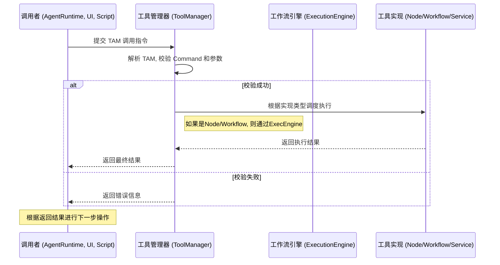

# 通用工具调用协议 (Tavern Action Manifest - TAM)

**文档状态**: `修订中`

## 1. 引言

### 1.1. 背景与目的

在 ComfyTavern 平台中，无论是复杂的自主 Agent、自动化的工作流，还是简单的用户界面，都需要一种标准化的方式来调用外部工具或执行预定义的功能。为了实现一个清晰、可靠且高效的调用机制，我们设计了 **Tavern Action Manifest (TAM)** 协议。

本协议旨在定义一个**独立且通用的工具调用指令格式**。该协议的解析器不关心指令的来源——无论是来自大型语言模型 (LLM) 驱动的 Agent、开发者编写的脚本、用户通过 UI 的直接操作，还是其他系统的二次处理。其唯一职责是准确地解析符合 TAM 规范的指令，并调度执行。

### 1.2. 设计哲学：为所有调用者打造“趁手”的工具

TAM 协议的设计，旨在提供一种对人类和 AI 都友好的、极致鲁棒的指令格式。

-   **尊重认知模式**: 协议的语法对 AI 而言应尽可能自然，接近其“母语”；对人类而言，则应清晰易读、易于手写。
-   **意图最小化 (Minimal Intent)**: 调用者只需表达“想做什么”，即最核心的意图，用最少、最直接的信息传递。
-   **封装复杂性 (Encapsulated Complexity)**: 所有繁琐的实现逻辑、格式转换、状态管理，都必须被封装在工具（或其适配器）内部。工具应该变得更“聪明”，从而让调用者可以更“专注”。
-   **支持批量操作**: 协议应支持将多步操作一次性提交，避免过多“请求-等待-响应”的循环打断连贯的思考或操作流程。

## 2. 核心协议：Tavern Action Manifest (TAM)

### 2.1. 概述

TAM 采用一种以自定义特殊标记包裹、内部使用“关键字:「始」值「末」”格式的方案。

-   **AI 原生的边界标记**: 我们选用 `<|[REQUEST_TOOL]|>` 和 `<|[END_TOOL]|>` 作为边界。这种格式类似于 LLM 训练数据中常见的特殊标记 (Special Tokens)，对 AI 而言更自然，更不容易在生成时出错。
-   **极致鲁棒的参数传递**: 我们沿用并发展了 VCP 协议中最精华的 `key:「始」value「末」` 格式。这使得在传递包含代码、多行文本、JSON、XML 等任何特殊字符的复杂参数时，**无需进行任何转义**，极大地降低了出错率。
-   **清晰的指令结构**: 通过 `command` 关键字明确指定调用的工具，并通过数字后缀（如 `command1`, `filePath1`）实现对串联任务的优雅支持。

## 3. 协议规范详解

### 3.1. 调用格式约定

#### 3.1.1. 单一工具调用格式

当任何调用者（Agent、脚本、UI）决定调用工具时，其输出应包含一个 `<|[REQUEST_TOOL]|>` 块。

```
[可选的、调用者生成的自然语言文本，解释其决策或意图。]

<|[REQUEST_TOOL]|>
command:「始」ToolID「末」
parameter_A:「始」参数值 A「末」
parameter_B:「始」参数值 B，
可以是多行。
「末」
<|[END_TOOL]|>
```

#### 3.1.2. 串联任务格式 (Chained Task Format)

当需要在一个动作中按顺序执行多个命令时，使用数字后缀。解析器应按数字顺序依次执行。

```
<|[REQUEST_TOOL]|>
# 步骤 1: 创建文件
command1:「始」FileOperator.WriteFile「末」
filePath1:「始」/logs/today.log「末」
content1:「始」任务开始...「末」

# 步骤 2: 追加日志
command2:「始」FileOperator.AppendFile「末」
filePath2:「始」/logs/today.log「末」
content2:「始」\n添加新记录。「末」
<|[END_TOOL]|>
```

### 3.2. TAM 结构详解

-   **边界标记 (Boundary Markers)**: `<|[REQUEST_TOOL]|>` 和 `<|[END_TOOL]|>`，明确界定动作指令的范围。
-   **指令关键字 (Command Keyword)**: `command` (或 `command1`, `command2`...)，其值是工具的唯一 ID。
-   **参数键值对 (Parameter Key-Value)**: `key:「始」value「末」`。
    -   `key`：参数名。解析器应对 `key` 的大小写、下划线不敏感，以提高容错性。
    -   `「始」` 和 `「末」`：是固定不变的中文引号标记，用于界定参数值的开始和结束。它们之间的所有内容，包括换行符，都属于参数值。

## 4. 工具、节点与工作流：概念澄清

在 ComfyTavern 中，工具、节点和工作流是三个既相关又独立的核心概念。清晰地理解它们的区别与联系，对于构建可扩展、可维护的系统至关重要。

-   **节点 (Node)**:
    -   **定义**: 节点是工作流的**基本构建块**。它代表一个原子的、可执行的操作单元，拥有明确的输入和输出。例如，`AddTwoNumbersNode`、`LoadImageNode`、`LlmPromptNode`。
    -   **角色**: 节点的首要职责是服务于**工作流的构建**。创作者在画布上通过连接节点来编排复杂的逻辑。

-   **工作流 (Workflow)**:
    -   **定义**: 工作流是由多个相互连接的节点组成的**有向无环图 (DAG)**。它封装了一套完整的、可执行的业务逻辑。
    -   **角色**: 工作流是实现复杂任务（如 Agent 的审议循环、图像生成流程、数据处理管道）的主要方式。

-   **工具 (Tool)**:
    -   **定义**: 工具是一个**可被外部调用的、具有明确功能定义的能力接口**。它向调用者（如 Agent、用户、脚本）暴露一个稳定的 ID 和一组参数，并返回一个可预测的结果。
    -   **角色**: 工具的核心职责是**提供可供调用的能力**。它隐藏了内部的实现细节。
    -   **与节点/工作流的关系**:
        -   一个工具**可以封装**一个单一的节点。例如，可以创建一个名为 `math.add` 的工具，其内部实现是直接执行 `AddTwoNumbersNode`。
        -   一个工具也**可以封装**一个完整的工作流。例如，可以创建一个名为 `image.generate_portrait` 的工具，其内部实现是执行一个包含多个步骤（如加载模型、设置提示词、采样、后处理）的复杂工作流。
        -   一个工具还可以**直接由后端服务实现**，不依赖于任何节点或工作流。例如，一个名为 `system.get_current_time` 的工具可能只是调用一个后端函数。

**核心区别**: **节点/工作流是“实现”，而工具是“接口”**。工具系统本身是独立的，它只关心工具的注册、发现和调用，而不关心工具背后是由节点、工作流还是原生代码实现的。这种分离使得我们可以将任何复杂的功能（无论它如何实现）都封装成一个标准化的工具，供平台各处调用。

## 5. 扩展与第三方工具集成

ComfyTavern 的强大之处在于其可扩展性。工具系统与平台的插件架构紧密集成，允许开发者和社区贡献者方便地添加第三方工具。其设计遵循 [`DesignDocs/architecture/node-package-extension-architecture.md`](DesignDocs/architecture/node-package-extension-architecture.md:1) 中定义的规范。

### 5.1. 通过插件注册新工具

开发者可以通过创建插件来为平台引入新的工具。

1.  **创建插件**: 遵循插件目录结构，创建一个新的插件包。
2.  **实现工具逻辑**:
    -   如果工具是基于新节点的，则在插件的 `nodes/` 目录下创建节点文件。
    -   如果工具是基于工作流的，则可以将工作流定义文件 (`.json`) 作为插件的一部分。
    -   如果工具是纯后端服务，则可以在插件的后端逻辑中实现。
3.  **声明工具**: 在插件的清单文件 `plugin.yaml` 中，增加一个新的 `tools` 部分来声明该插件提供的工具。

### 5.2. `plugin.yaml` 中的工具声明 (建议)

```yaml
# ... (plugin.yaml 的其他部分)

# (可选) 声明此插件提供的工具
tools:
  - id: "my-awesome-plugin:magic_node_tool" # 工具的唯一ID，强制使用 插件名:工具名 的命名空间
    displayName: "神奇节点工具"
    description: "一个封装了 MagicNode 的工具。"
    # 定义工具的参数，可以使用 JSON Schema 或类似的结构
    parameters:
      type: object
      properties:
        strength:
          type: number
          description: "魔法强度"
          defaultValue: 0.7
        target:
          type: string
          description: "目标对象"
      required: ["strength", "target"]
    # 定义工具的实现方式
    implementation:
      type: "node" # 类型可以是 'node', 'workflow', 'service'
      nodeType: "my-awesome-plugin:MagicNode" # 引用插件提供的节点类型

  - id: "my-awesome-plugin:complex_workflow_tool"
    displayName: "复杂工作流工具"
    description: "一个封装了复杂工作流的工具。"
    parameters:
      # ... 参数定义
    implementation:
      type: "workflow"
      workflowId: "workflows/my_complex_workflow.json" # 引用插件内的工作流文件

# ...
```

### 5.3. 工具的加载与执行

-   **加载**: 平台的 `PluginLoader` 在加载插件时，会解析 `plugin.yaml` 中的 `tools` 部分，并将这些工具注册到统一的 `ToolManager` 服务中。
-   **执行**: 当 `ToolManager` 收到一个 TAM 调用请求时，它会：
    1.  根据 `command` 字段中的工具 ID 查找已注册的工具。
    2.  校验传入的参数是否符合工具声明的 `parameters` schema。
    3.  根据工具的 `implementation` 定义，调度相应的执行器：
        -   `type: "node"`: 动态创建一个包含该单节点的微型工作流，并交由 `ExecutionEngine` 执行。
        -   `type: "workflow"`: 加载对应的工作流定义，并交由 `ExecutionEngine` 执行。
        -   `type: "service"`: 直接调用后端注册的相应服务函数。
    4.  将执行结果返回给调用者。

通过这套机制，第三方工具可以无缝集成到平台中，并被 Agent 或其他任何调用者使用。

## 6. 工具调用指南

本节为需要生成 TAM 指令的调用者（特别是 LLM）提供指导。

### 6.1. 能力的发现与声明

-   **对于 Agent**: Agent 可用的工具集由其 `agent_profile.json` 中的 `tool_ids_inventory` 字段静态声明。这保证了 Agent 行为的安全性和可预测性。Agent 的核心审议工作流应被设计为能够理解并选择调用这些已声明的能力。
-   **对于其他调用者**: 其他调用者（如 UI 面板、脚本）可以通过查询 `ToolManager` 提供的 API (`GET /api/tools`) 来获取当前所有已注册、可用的工具列表及其参数定义。

### 6.2. LLM Prompt 设计要点

当使用 LLM 生成 TAM 时，Prompt 的设计至关重要。

1.  **明确角色与目标**: 在系统指令中，告知 LLM 其角色和当前的高级目标。
2.  **提供可用工具清单**: 将该 LLM 可用的工具列表（ID、描述、参数）作为上下文提供。
3.  **提供动态知识 (RAG)**: 对于复杂的工具，可以结合 RAG，从知识库中检索该工具的详细用法示例、最佳实践、错误案例等，作为更丰富的上下文。
4.  **引导决策与输出**: 指示 LLM 基于提供的上下文和知识参考，决策并生成一个符合 TAM 规范的 `<|[REQUEST_TOOL]|>` 块。强调 `command` 必须是其被赋予的能力之一。

**示例 Prompt 片段**:

```
[当前任务]
用户要求修改 main.js 文件中的一行代码。

[可用工具参考]
- Tool ID: FileOperator.ApplyEdit
  - 描述: 用于精确替换文件中的一行或多行文本。
  - 参数:
    - filePath (string, required): 文件的绝对路径。
    - search_string (string, required): 要查找并替换的旧内容。
    - replace_string (string, required): 用于替换的新内容。

[你的决策]
请基于上述信息，生成一个符合 TAM 规范的工具调用指令来完成任务。

[LLM 的输出]
好的，我将使用 FileOperator.ApplyEdit 工具来修改文件。

<|[REQUEST_TOOL]|>
command:「始」FileOperator.ApplyEdit「末」
filePath:「始」/path/to/your/project/main.js「末」
search_string:「始」console.log("old message");「末」
replace_string:「始」console.log("new message");「末」
<|[END_TOOL]|>
```

## 7. 运行时架构与执行流程

本节阐述了 ComfyTavern 系统中，支撑 TAM 协议得以解析、执行和反馈的核心架构。

### 7.1. 核心组件与职责

-   **调用者 (Caller)**: 任何生成 TAM 指令的实体，如 `AgentRuntime`、UI 面板、脚本等。
-   **工具管理器 (ToolManager)**: 平台的工具注册与管理中心。负责从插件和核心服务中加载工具定义，并提供工具查询和执行的统一入口。
-   **执行引擎 (ExecutionEngine)**: 平台的通用工作流执行器。
-   **节点/工作流/服务**: 工具的具体实现。

### 7.2. 执行流程详解

1.  **生成 (Generation)**: **调用者**根据其内部逻辑（如 Agent 的审议、用户的点击）生成一段包含 TAM 块的文本或指令。
2.  **提交 (Submission)**: 调用者将此指令提交给**工具管理器 (ToolManager)** 的执行端点。
3.  **解析与校验 (Parsing & Validation)**: `ToolManager` 解析文本，提取 TAM 块，并根据其内部注册的工具清单校验 `command` 的有效性及其参数的合法性。
4.  **调度与执行 (Dispatch & Execution)**:
    -   `ToolManager` 根据工具的实现类型，将任务分发给相应的后端执行器。
    -   **节点/工作流封装的工具**: `ToolManager` 请求 `ExecutionEngine` 执行对应的节点或工作流。
    -   **服务实现的工具**: `ToolManager` 直接调用相应的后端服务函数。
5.  **反馈 (Feedback)**: 执行结果（成功或失败信息）由 `ToolManager` 返回给原始的**调用者**。调用者可以根据此反馈进行下一步操作（例如，Agent 将结果作为下一次审议的输入，形成闭环）。

### 7.3. 架构流程图



## 8. 未来展望

-   **工具权限与作用域**: 引入更精细的权限系统，控制不同调用者（如不同用户、不同 Agent）可以访问的工具集。
-   **异步工具与回调**: 支持长时间运行的异步工具，并通过 WebSockets 或回调机制返回结果。
-   **工具链的动态组合**: 探索允许 LLM 在一次调用中动态组合多个工具的输出与输入，形成临时的工具链。
-   **可视化工具市场**: 在前端提供一个可视化的“工具市场”或“能力中心”，让用户可以浏览、搜索和了解所有可用的工具。
