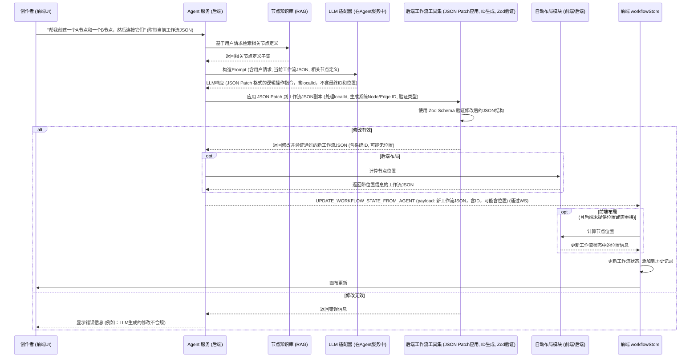

# Agent 助手（辅助创作）功能规划概要 (V3 - 基于逻辑指令与 JSON Patch)

## 1. 核心目标与 Agent v3 架构定位：

构建一个内置于 ComfyTavern 的智能助手 (以下简称“创作助手 Agent”)，它本身即为 **ComfyTavern Agent v3 架构 ([`../agent_architecture_v3_consolidated.md`](../agent_architecture_v3_consolidated.md:1)) 的一个具体应用实例**。此创作助手 Agent 能够理解创作者的自然语言指令，通过生成结构化的**逻辑操作指令**（以 JSON Patch 格式承载）来辅助其快速创建和编辑 AI 工作流。

该创作助手 Agent 的核心决策逻辑将由其专属的**核心审议工作流 (Core Deliberation Workflow)** 驱动，该工作流会利用检索增强生成 (RAG) 从节点知识库动态获取相关节点信息作为决策上下文。其设计和实现将遵循 Agent v3 架构定义的核心原则，包括 Agent 定义 (Profile)、运行时 (Runtime)、审议循环、技能调用等。

## 2. 关键能力设想：

- **自然语言理解**：利用项目中规划的 LLM 适配器架构，解析用户输入的自然语言指令。
- **相关节点知识检索 (RAG)**：Agent 根据用户意图，从节点知识库中检索并筛选出最相关的节点定义，提供给 LLM 作为上下文。
- **逻辑操作指令规划与生成**：LLM 根据用户意图、当前工作流状态和检索到的相关节点定义，规划对工作流的修改，并生成符合 JSON Patch 格式的逻辑操作指令。
- **指令应用与验证**：后端提供一套工具集，负责解析 LLM 生成的 JSON Patch 指令，安全地将其应用到工作流 JSON 的副本上，并使用项目中已有的 Zod Schema ([`packages/types/src/schemas.ts`](packages/types/src/schemas.ts)) 进行验证。
- **ID 与类型管理**：
  - **节点 ID (Node ID)**：由后端工具集在应用指令时生成。LLM 若需在同批指令中引用新创建的节点，可使用临时 `localId`。
  - **边 ID (Edge ID)**：由后端工具集在应用指令时自动生成。LLM 只需提供连接的源和目标（可使用 `localId`）。
  - **节点类型 (`type`)**：LLM 提供的节点类型必须包含正确的命名空间 (如 `core:TestWidgets`)，由后端工具集验证。
- **自动布局**：新增节点的视觉位置 (`position`) 不由 LLM 指定，由前端或后端的自动布局算法在应用指令后计算生成。
- **前端画布的响应式更新**：前端 [`workflowStore`](apps/frontend-vueflow/src/stores/workflowStore.ts) 监听来自后端的 WebSocket 消息，当接收到新的、验证通过且包含布局信息的工作流 JSON 时，更新自身状态，将其添加到历史记录，并触发画布重新渲染。
- **（远期）界面辅助**：辅助创作者进行应用面板的界面布局和元素建议。

## 3. 技术实现思路：

### a. 创作助手 Agent 的核心审议工作流 (Core Deliberation Workflow - 后端)

1.  **输入 (Input to Deliberation Loop)**：
    - 用户的自然语言指令 (作为一种主要的感知事件 `IncomingEvent`)。
    - 当前活动工作流的完整 JSON 定义 (作为 `WorldState` 的一部分或特定上下文输入)。
2.  **审议过程中的上下文构建 (Context Building within Deliberation - RAG)**：
    - 创作助手 Agent 的核心审议工作流对用户指令进行初步解析，提取关键词和功能描述。
    - 调用“知识库查询技能”或使用内置节点，从“节点知识库”（例如，基于向量的检索引擎）中检索一小部分最相关的节点定义。
    - 准备传递给核心 LLM（审议工作流中的关键节点）的上下文，包括：
      - 用户的原始请求。
      - 当前工作流的 JSON。
      - 检索到的相关节点定义列表 (名称、描述、命名空间、类型、输入、输出、参数等)。
      - 关于如何生成 JSON Patch 指令的说明或示例 (可能来自知识库或 Prompt 工程)。
3.  **LLM 推理与规划 (LLM-driven Reasoning & Planning)**：
    - 核心审议工作流通过 [`LLM 适配器架构`](DesignDocs/architecture/llm-adapter-architecture-plan.md) 将构建好的上下文和任务指令（例如：“请根据用户需求、当前工作流状态和可用节点，生成 JSON Patch 指令来修改工作流”）发送给 LLM。
4.  **决策输出：JSON Patch 指令生成 (Decision Output)**：
    - LLM 输出符合 JSON Patch (RFC 6902) 格式的逻辑操作指令数组，这构成了创作助手 Agent 的主要“行动决策”。
    - **节点添加指令 (`value` 对象)**：
      - 可包含 `localId` (LLM 生成的临时 ID，用于同批次指令内引用)。
      - 必须包含 `type` (带命名空间)。
      - 可包含 `data` (节点配置参数)。
      - **不包含**最终的 `id` 和 `position`。
    - **边添加指令 (`value` 对象)**：
      - 包含 `source` (源节点 ID 或 `sourceLocalId`) 和 `sourceHandle`。
      - 包含 `target` (目标节点 ID 或 `targetLocalId`) 和 `targetHandle`。
      - **不包含**最终的 `id`。
5.  **指令应用、ID 生成与验证 (后端工具集)**：
    - 后端工具集按顺序解析 LLM 返回的 JSON Patch 指令数组。
    - **处理节点添加**：
      - 为新节点生成系统全局唯一的 `id`。
      - 如果指令中包含 `localId`，建立 `localId` 到新生成系统 `id` 的临时映射。
      - 验证提供的节点 `type` (包括命名空间) 是否合法。
    - **处理边添加**：
      - 解析 `source/target` (或 `sourceLocalId/targetLocalId`，通过临时映射转换为系统 `id`)。
      - 为新边生成系统全局唯一的 `id`。
    - 将所有 Patch 指令应用到当前工作流 JSON 的一个安全副本上。
    - 使用 [`packages/types/src/schemas.ts`](packages/types/src/schemas.ts) 中定义的 Zod Schema 严格验证修改后 JSON 的结构和类型。
    - 如果验证失败，则向用户报告错误。
6.  **自动布局 (可选后端实现)**：
    - 如果选择后端布局，在验证通过后，运行自动布局算法为所有节点（特别是新节点）计算 `position`，并更新到工作流 JSON 中。
7.  **通知前端**：
    - 如果验证通过，将修改后的、完整的新工作流 JSON (包含所有系统生成的 ID 和计算出的布局信息) 通过 WebSocket 发送给前端。

### b. 前后端通信协议

- 定义新的 WebSocket 消息类型，例如 `UPDATE_WORKFLOW_STATE_FROM_AGENT`。
- `payload` 包含：新的、完整的工作流 JSON 定义。

### c. 前端响应与执行

- 前端 [`workflowStore`](apps/frontend-vueflow/src/stores/workflowStore.ts) 监听 `UPDATE_WORKFLOW_STATE_FROM_AGENT` 消息。
- 接收到新的工作流 JSON 后：
  - **自动布局 (推荐前端实现)**：如果工作流 JSON 中的新节点没有 `position` 信息（或选择前端强制重新布局），则在此阶段运行自动布局算法（如 Dagre, ELK.js，或 VueFlow 内置/集成功能）计算节点坐标。
  - 更新其内部状态（使用包含完整 ID 和布局信息的工作流）。
  - 将这个新的状态作为一个历史记录点添加到历史栈中。
  - 触发 VueFlow 画布的重新渲染以反映更改。

## 4. 依赖的关键项目组件：

- **节点定义接口** ([`GET /api/nodes`](/api/nodes)) 及用于 RAG 的**节点知识库**。
- **LLM 适配器架构** (如 [`DesignDocs/architecture/llm-adapter-architecture-plan.md`](DesignDocs/architecture/llm-adapter-architecture-plan.md) 所述)。
- **后端 JSON Patch 应用与验证工具集 (新增)**：负责解析指令、生成 ID、应用修改、Zod 验证。
- **自动布局算法/库**：可集成于前端 (推荐) 或后端。
- **前端 `workflowStore`**：具备通过代码控制画布和管理历史记录的能力。
- **WebSocket 通信机制**：已存在，可扩展。
- **Zod Schema 定义** ([`packages/types/src/schemas.ts`](packages/types/src/schemas.ts)): 用于验证。

## 5. 分阶段实施设想：

- **MVP**：
  - 实现基础的节点知识库和 RAG 检索（可先用简单关键词匹配）。
  - LLM 能够生成核心的 JSON Patch 操作（添加/删除节点、修改节点属性、添加/删除边），不含 ID 和位置。
  - 后端工具集能够解析 Patch、生成 Node/Edge ID、验证基本结构。
  - 前端能够接收新工作流状态，实现一个基础的自动布局算法，更新画布并记录历史。
- **后续阶段**：
  - 优化 RAG 检索效果（如引入向量数据库）。
  - 支持更复杂的 JSON Patch 操作和 LLM 逻辑规划能力。
  - 完善自动布局算法，考虑用户手动调整后的布局保持。
  - 增强错误处理和用户反馈机制。

## 6. Mermaid 图例：Agent (逻辑指令) 驱动画布更新流程

