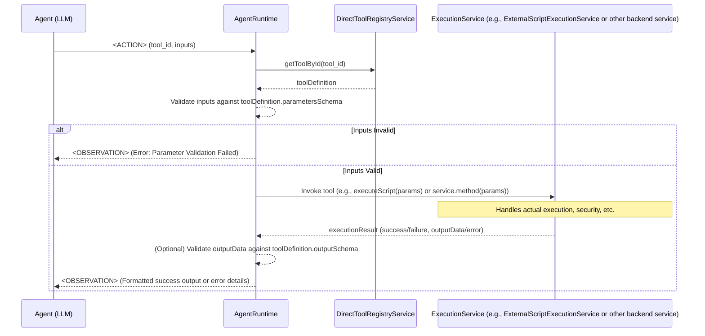

# Agent 调用直接运行类型工具设计草案

## 1. 引言与目标

### 1.1. 背景与动机

随着 ComfyTavern Agent (以下简称 Agent) 能力的不断增强，其在执行复杂任务时，往往需要与外部环境进行更深入的交互或执行特定的计算密集型/IO 密集型操作。例如，Agent 可能需要：

- 运行一段 Python 脚本来处理数据、调用特定的机器学习库。
- 执行 Node.js/Bun 脚本来与 Web API 交互或操作文件系统。
- 调用一个后台服务提供的特定业务逻辑功能。

当前 Agent 的工具调用机制主要集中在调用平台内定义的可视化节点（作为原子工具）或完整的工作流（作为技能）。为了进一步扩展 Agent 的能力，赋予其更直接、更灵活地调用后端服务和执行外部脚本的能力，我们提出设计一套“直接服务型原子工具 (Direct Service Atomic Tool)”的机制。

本设计旨在为 Agent 提供一个安全、可靠、可扩展且易于理解和调用的方式，来执行这类后台服务功能，初期将以“执行外部脚本”作为核心示例进行详细设计。

### 1.2. 设计目标

本设计方案的核心目标包括：

- **安全性 (Security)**: 确保外部脚本或服务的执行在严格受控和安全的环境中进行，防止潜在的安全风险，如路径遍历、命令注入、资源滥用等。
- **可扩展性 (Extensibility)**: 整体架构应具备良好的可扩展性，未来能够方便地集成更多类型的直接服务工具，而不仅仅是脚本执行。
- **易用性 (Usability)**:
  - **对 Agent (LLM)**: 工具的功能、参数和预期输出应有清晰、易于 LLM 理解的元数据描述，方便 LLM 准确地选择和构建调用指令。
  - **对开发者/工具贡献者**: 定义和集成新的直接服务工具的过程应尽可能简单、规范和高效。
- **明确性 (Clarity)**: 工具的元数据定义、调用协议和执行流程应清晰明确，易于理解和维护。
- **可靠性 (Reliability)**: 工具的执行应稳定可靠，并提供充分的错误处理和日志记录机制。

### 1.3. 本文档范围

本文档将详细阐述“直接服务型原子工具”的核心机制设计，并将以“执行外部脚本”（支持 Python, Node.js/Bun）功能作为主要示例贯穿整个设计说明。主要内容包括：

- 后端服务（如 `ExternalScriptExecutionService`）的职责、接口设计与关键实现逻辑。
- 直接服务工具的元数据定义规范（例如，通过 `*.tool.json` 文件）。
- 工具元数据的加载与注册机制。
- Agent 调用此类工具的完整流程，包括 `AgentRuntime` 的处理逻辑。
- 对现有 `agent_tool_invocation_protocol.md` 文档的补充建议。

**暂时不深入探讨**以下内容（将作为未来展望或关联设计）：

- 工具元数据与知识库/RAG 系统的高级集成细节（如 CAIU 转换、RAG 辅助工具选择）。
- AI 辅助的元数据生成与优化流程。

### 1.4. 关键名词解释

- **Direct Service Tool (直接服务工具)**: 指由后端服务直接提供功能、供 Agent 调用的原子工具，它不一定对应平台中的可视化节点。例如，执行外部脚本、调用特定的内部 API 等。
- **AgentRuntime**: ComfyTavern 中负责驱动 Agent 审议-行动循环、解析 Agent 输出、协调工具/技能执行的核心运行时组件。
- **`ExternalScriptExecutionService`**: 一个具体的后端服务示例，负责安全地执行外部脚本。
- **Tool Metadata (`*.tool.json`)**: 定义直接服务工具元数据的 JSON 文件，包含工具 ID、描述、参数、输出结构、处理器映射等信息。
- **`<ACTION>` Protocol**: Agent 用来输出其工具/技能调用指令的 XML 格式协议，定义在 [`DesignDocs/architecture/agent_tool_invocation_protocol.md`](DesignDocs/architecture/agent_tool_invocation_protocol.md:0)。

---

## 2. 核心组件设计

本章节将详细介绍构成“直接服务型原子工具”机制的各个核心组件，包括负责实际执行逻辑的后端服务、定义工具元数据的文件规范，以及工具的加载和注册机制。

### 2.1. `ExternalScriptExecutionService` (外部脚本执行服务)

`ExternalScriptExecutionService` 是一个具体的后端服务实现，专门负责安全、可靠地执行用户或 Agent 提供的外部脚本。它是“直接服务型原子工具”中处理脚本执行类工具的核心执行单元。

#### 2.1.1. 职责与定位

- **核心执行者**: 作为外部脚本（如 Python, Node.js/Bun）的实际执行环境。
- **安全屏障**: 实施严格的安全策略，保护宿主系统免受恶意脚本的侵害。
- **环境管理器**: 负责脚本运行所需依赖的自动安装和环境隔离。
- **标准化接口**: 为上层调用者（如 `AgentRuntime` 或其他服务）提供统一、标准的脚本执行接口。
- **独立部署单元 (可选)**: 未来可以考虑将其设计为可独立部署的微服务，以进一步隔离资源和增强系统弹性，但初期可以作为主后端应用内的一个服务模块。

#### 2.1.2. 核心功能

1.  **脚本执行**:

    - 支持执行 Python 脚本（通过 `python` 或 `uv run python`）。
    - 支持执行 Node.js 脚本（通过 `node` 或 `bun run`）。
    - 支持执行 Bun 脚本（通过 `bun run`）。
    - 通过 `child_process.spawn` (或 Bun 的等效 API) 启动子进程执行脚本。

2.  **依赖管理 (自动化)**:

    - **Python**:
      - 自动检测脚本同级目录下的 `requirements.txt` 或 `pyproject.toml` 文件。
      - 如果检测到，使用 `uv pip install -r requirements.txt` 或 `uv pip install .` (针对 `pyproject.toml`) 在隔离环境中安装依赖。
      - 考虑缓存已安装的依赖环境以提高后续执行效率。
    - **Node.js/Bun**:
      - 自动检测脚本同级目录下的 `package.json` 文件。
      - 如果检测到，使用 `bun install` 或 `npm install` 在隔离环境中安装依赖。
      - 考虑缓存 `node_modules` 目录。
    - **安全性**: 依赖安装过程也需要置于安全沙箱或受限网络环境中，防止恶意依赖包。

3.  **环境隔离**:

    - **Python**: 每个脚本（或每个具有特定依赖集的脚本组）应在独立的 Python 虚拟环境中执行（例如，由 `uv venv` 创建）。
    - **Node.js/Bun**: 脚本执行的 `cwd` (当前工作目录) 应严格限制在其自身所在的目录，`node_modules` 也应局限在该目录内。
    - 确保不同脚本的执行环境互不干扰。

4.  **安全控制**:

    - **路径白名单/基准路径**: 脚本的读取、写入（如果允许）以及执行路径必须严格限制在预先配置的安全基准目录（例如 `e:/rc20/ComfyTavern/user_scripts/`）及其子目录下。Agent 或用户指定的脚本路径必须是相对于此基准目录的相对路径，并且服务会进行规范化和校验，防止路径遍历攻击 (`../../..`)。
    - **命令注入防护**: 严禁将用户输入直接拼接到命令行字符串中。所有脚本路径和参数都应作为 `spawn` 函数的独立参数传递。
    - **执行超时**: 为每个脚本执行设置合理的超时限制，防止恶意脚本长时间占用资源。
    - **资源限制 (可选，高级)**: 未来可以考虑限制脚本执行的 CPU、内存使用量。
    - **网络访问控制 (可选，高级)**: 默认禁止脚本进行网络访问，除非显式配置允许访问特定白名单地址。
    - **文件系统访问控制**: 默认脚本只拥有对其所在目录及子目录的只读权限。写权限需要显式声明并严格控制范围。

5.  **输入/输出处理**:
    - **输入**: 通过子进程的 `stdin` 以 JSON 字符串的形式向脚本传递输入参数。脚本内部需要从标准输入读取并解析 JSON。
    - **输出**: 脚本通过 `stdout` 以 JSON 字符串的形式返回执行结果。任何非 JSON 或格式错误的输出都可能被视作执行错误。
    - **错误**: 脚本的错误信息（`stderr`）应被捕获，并用于判断执行是否成功及生成错误报告。
    - **数据大小限制**: 对输入输出的 JSON 数据大小进行限制，防止过大的数据传输导致性能问题或资源耗尽。

#### 2.1.3. 接口设计 (初步设想)

服务内部可能提供类似如下的接口方法 (以 TypeScript 为例)：

```typescript
interface ScriptExecutionParams {
  toolId: string; // 调用此服务的工具ID，用于日志和可能的特定配置
  scriptPath: string; // 相对于安全基准目录的脚本路径
  language: "python" | "nodejs" | "bun";
  inputData?: Record<string, any>; // 传递给脚本的输入数据 (JSON)
  timeoutMs?: number; // 本次执行的超时时间 (覆盖默认)
  // ... 其他可能的执行时配置，如特定的环境变量
}

interface ScriptExecutionResult {
  success: boolean;
  outputData?: Record<string, any>; // 脚本成功执行返回的 JSON 数据
  error?: {
    type: string; // 如 'TimeoutError', 'ScriptError', 'DependencyError', 'SecurityError'
    message: string;
    details?: string; // 例如 stderr 的内容
  };
  logs?: string[]; // 捕获的 stdout/stderr (用于调试，可能需要截断)
}

class ExternalScriptExecutionService {
  private scriptBaseDirectory: string;

  constructor(config: { scriptBaseDirectory: string }) {
    this.scriptBaseDirectory = config.scriptBaseDirectory;
    // 初始化安全配置，如路径白名单等
  }

  public async executeScript(params: ScriptExecutionParams): Promise<ScriptExecutionResult> {
    // 1. 安全校验：规范化并校验 scriptPath 是否在 scriptBaseDirectory 内
    // 2. 确定脚本绝对路径
    // 3. 准备执行环境：
    //    a. 根据 language 和 scriptPath 检查/创建隔离环境
    //    b. 检查/安装依赖 (requirements.txt, package.json)
    // 4. 构建执行命令和参数 (e.g., ['python', absoluteScriptPath])
    // 5. 使用 child_process.spawn 执行脚本：
    //    a. 将 params.inputData 通过 stdin 传入
    //    b. 捕获 stdout, stderr
    //    c. 设置超时
    // 6. 处理执行结果：
    //    a. 解析 stdout 为 JSON (outputData)
    //    b. 如果 stderr 有内容或退出码非0，判定为错误
    //    c. 捕获超时、依赖安装失败等错误
    // 7. 返回 ScriptExecutionResult
    return {} as ScriptExecutionResult; // 占位符
  }

  // ... 其他辅助方法，如环境管理、依赖安装等
}
```

#### 2.1.4. 错误处理与日志

- **结构化错误**: `ScriptExecutionResult` 中的 `error` 对象应提供结构化的错误信息，包括错误类型和消息，方便上层程序化处理。
- **详细日志**: 服务应记录详细的执行日志，包括：
  - 接收到的参数 (可能需要脱敏)
  - 执行的命令
  - 依赖安装过程
  - 脚本的 `stdout` 和 `stderr` (可能需要截断)
  - 执行耗时
  - 最终结果或错误信息
- 日志级别应可配置，关键错误应提升告警级别。

### 2.2. 工具元数据 (`*.tool.json`)

为了让 Agent 能够理解和正确调用直接服务工具，并且方便系统加载和管理这些工具，我们引入 `*.tool.json` 文件作为工具元数据的标准定义格式。这些文件通常与工具的实现（如脚本文件）放在一起，或集中存放在特定的工具定义目录中。

#### 2.2.1. 设计原则

- **Agent 友好 (LLM-Friendly)**: `description`, `parameters` 的描述等字段应使用自然语言，清晰、准确地描述工具的功能和使用方式，便于 LLM 理解和生成调用参数。
- **机器可读 (Machine-Readable)**: 元数据结构应规范、一致，便于程序解析、校验和处理。JSON Schema 用于参数和输出的定义，确保了这一点。
- **可扩展性 (Extensible)**: 元数据格式应允许未来添加新的字段以支持更多特性，而不会破坏向后兼容性。
- **自包含性 (Self-Contained)**: 每个 `*.tool.json` 文件应尽可能包含定义一个工具所需的所有核心信息。
- **安全性声明 (Security Declaration)**: 元数据中可以包含与安全相关的声明或要求，供执行服务参考。

#### 2.2.2. 核心字段定义

以下是 `*.tool.json` 文件中建议的核心字段及其说明：

```json
{
  "toolId": "string", // (必需) 工具的全局唯一标识符，例如 "core:execute-python-script" 或 "custom:my-data-processor"
  "displayName": "string", // (必需) 用户友好的显示名称，例如 "Execute Python Script"
  "description": "string", // (必需) 对工具功能的详细描述，供 Agent (LLM) 理解。应说明工具做什么、适合什么场景、关键输入输出是什么。
  "version": "string", // (必需) 工具的版本号，例如 "1.0.0"
  "handler": {
    // (必需) 定义工具如何被执行
    "type": "string", // (必需) 处理器类型。例如: "external-script", "service-method"
    // --- 当 type 为 "external-script" 时 ---
    "scriptPath": "string", // (条件必需) 相对于安全基准目录的脚本路径。例如 "python/data_analyzer.py"
    "language": "string", // (条件必需) 脚本语言。例如 "python", "nodejs", "bun"
    "entryPoint": "string", // (可选) 对于某些语言或框架，可能需要指定入口函数或模块内的特定导出。
    // --- 当 type 为 "service-method" 时 ---
    "serviceName": "string", // (条件必需) 后端服务的唯一标识符或类名。例如 "ExternalScriptExecutionService" 或 "ImageProcessingService"
    "methodName": "string" // (条件必需) 服务中要调用的公共方法名。例如 "executeScript" 或 "applyFilter"
  },
  "parameters": {
    // (可选) 定义工具的输入参数，使用 JSON Schema 格式
    "type": "object",
    "properties": {
      "paramName1": {
        "type": "string", // JSON Schema 支持的类型: string, number, integer, boolean, array, object
        "description": "参数1的详细描述，供 Agent 理解其含义和用途。",
        "default": "defaultValue", // (可选) 参数的默认值
        "enum": ["value1", "value2"] // (可选) 如果参数值是枚举类型
        // ... 其他 JSON Schema 关键字，如 format, pattern, minLength, maxLength, minimum, maximum, items (for array), required (for object properties)
      }
      // ...更多参数
    },
    "required": ["paramName1"] // (可选) 必需参数的列表
  },
  "output": {
    // (可选) 定义工具成功执行后返回数据的结构，使用 JSON Schema 格式
    "type": "object",
    "properties": {
      "resultField1": {
        "type": "string",
        "description": "结果字段1的描述。"
      }
      // ...更多结果字段
    },
    "required": ["resultField1"]
  },
  "securityContext": {
    // (可选) 定义工具执行所需的特定安全权限或上下文
    "fileAccess": {
      // (可选) 文件访问权限
      "allowRead": ["string"], // 允许读取的路径模式列表 (相对于脚本基准目录或特定沙箱)
      "allowWrite": ["string"] // 允许写入的路径模式列表
    },
    "networkAccess": {
      // (可选) 网络访问权限
      "allowHosts": ["string"] // 允许访问的主机名或IP地址列表 (支持通配符如 *.example.com)
    },
    "requiredCapabilities": ["string"] // (可选) 需要宿主环境提供的其他特定能力或权限声明
  },
  "examples": [
    // (可选) 提供一或多个调用示例，帮助 Agent 理解如何使用
    {
      "description": "示例1：执行一个简单的打印任务。",
      "input": {
        "paramName1": "hello world"
      },
      "expectedOutput": {
        // (可选) 预期输出，用于演示或测试
        "resultField1": "Processed: hello world"
      }
    }
  ],
  "tags": ["string"] // (可选) 用于分类、检索和组织的标签，例如 ["data-processing", "python", "experimental"]
}
```

**字段详细说明**:

- **`toolId`**: 命名约定建议使用 `namespace:tool-name` 的形式，例如 `core:*` 表示核心工具，`vendor:*` 表示特定供应商的工具，`custom:*` 表示用户自定义工具。
- **`handler.type`**:
  - `external-script`: 表示此工具通过 `ExternalScriptExecutionService`（或其他类似服务）执行一个外部脚本。`scriptPath` 和 `language` 成为必需。
  - `service-method`: 表示此工具调用后端已注册服务的某个方法。`serviceName` 和 `methodName` 成为必需。AgentRuntime 将负责查找服务实例并调用方法。
- **`parameters` 和 `output`**: 使用 JSON Schema 不仅提供了结构校验，其 `description` 字段对于 LLM 理解每个参数和输出字段的含义至关重要。
- **`securityContext`**: 这是一个声明性的部分。执行服务（如 `ExternalScriptExecutionService`）会读取这些声明，并结合自身的全局安全策略来决定实际授予的权限。例如，即使工具声明需要写入 `/tmp`，如果全局策略禁止，执行也会失败。
- **`examples.input`**: 这里的输入应符合 `parameters` 中定义的 schema。
- **`tags`**: 可以用于在工具选择阶段进行初步筛选，或在 UI 中进行分类展示。

#### 2.2.3. 示例：`execute-python-script.tool.json`

这是一个为“执行 Python 脚本”工具定义的元数据示例，该工具由 `ExternalScriptExecutionService` 处理。

```json
{
  "toolId": "core:execute-python-script",
  "displayName": "Execute Python Script",
  "description": "Executes a provided Python script securely. The script will receive input data via STDIN as a JSON string and should output its result to STDOUT as a JSON string. Dependencies can be managed via a 'requirements.txt' or 'pyproject.toml' file in the same directory as the script.",
  "version": "1.0.0",
  "handler": {
    "type": "service-method", // 或者也可以是 "external-script" 的一种泛化，但这里指向一个通用服务方法更合适
    "serviceName": "ExternalScriptExecutionService",
    "methodName": "executeScript" // 这个方法内部会处理 language: 'python'
  },
  "parameters": {
    "type": "object",
    "properties": {
      "scriptPath": {
        "type": "string",
        "description": "The path to the Python script file, relative to the user's allowed script directory. Example: 'my_scripts/data_processor.py'"
      },
      "inputData": {
        "type": "object",
        "description": "A JSON object containing data to be passed to the Python script via STDIN.",
        "additionalProperties": true // 允许任意结构的 JSON 对象
      },
      "timeoutMs": {
        "type": "integer",
        "description": "Optional. Maximum execution time for the script in milliseconds. Overrides default timeout if provided.",
        "minimum": 100
      }
    },
    "required": ["scriptPath"]
  },
  "output": {
    "type": "object",
    "properties": {
      "success": {
        "type": "boolean",
        "description": "True if the script executed successfully, false otherwise."
      },
      "outputData": {
        "type": "object",
        "description": "The JSON data returned by the script via STDOUT if execution was successful.",
        "additionalProperties": true
      },
      "error": {
        "type": "object",
        "description": "Details of the error if execution failed.",
        "properties": {
          "type": {
            "type": "string",
            "description": "Type of error (e.g., 'ScriptError', 'TimeoutError')."
          },
          "message": { "type": "string", "description": "Error message." },
          "details": { "type": "string", "description": "Additional error details, like stderr." }
        },
        "required": ["type", "message"]
      },
      "logs": {
        "type": "array",
        "items": { "type": "string" },
        "description": "Captured logs from script execution (stdout/stderr, may be truncated)."
      }
    },
    "required": ["success"]
  },
  "securityContext": {
    "fileAccess": {
      "allowRead": ["self", "./*", ".cache/**"], // "self" 指脚本自身, "./*" 指脚本同级目录及子目录, ".cache/**" 允许访问可能的缓存目录
      "allowWrite": [".cache/**"] // 通常只允许写入受控的缓存或临时目录
    },
    "networkAccess": {
      "allowHosts": [] // 默认不允许网络访问
    }
  },
  "examples": [
    {
      "description": "Execute a simple Python script that echoes input.",
      "input": {
        "scriptPath": "examples/echo.py",
        "inputData": { "message": "hello from agent" }
      },
      "expectedOutput": {
        "success": true,
        "outputData": { "received_message": "hello from agent" }
      }
    },
    {
      "description": "Execute a script that is expected to fail due to a timeout.",
      "input": {
        "scriptPath": "examples/long_running.py",
        "inputData": {},
        "timeoutMs": 100
      },
      "expectedOutput": {
        "success": false,
        "error": {
          "type": "TimeoutError",
          "message": "Script execution timed out."
        }
      }
    }
  ],
  "tags": ["core", "scripting", "python", "execution"]
}
```

**注意**: 在上面的 `execute-python-script.tool.json` 示例中，`handler.type` 设置为 `"service-method"` 并指向 `ExternalScriptExecutionService.executeScript`。这是因为 `executeScript` 方法本身会处理不同语言（包括 Python）的逻辑。Agent 只需要知道它想执行一个 Python 脚本，并提供 `scriptPath` 和 `inputData`。`ExternalScriptExecutionService` 会根据 `toolId` 或传递的参数（如果 `executeScript` 接口设计为接受 `language` 参数）来调用正确的执行路径。另一种设计是为每种语言创建一个单独的 `.tool.json`，例如 `execute-nodejs-script.tool.json`，它们都可能指向同一个 `ExternalScriptExecutionService.executeScript` 方法，但通过传递不同的隐式或显式参数来区分语言。当前示例倾向于一个更通用的脚本执行工具定义，其内部由服务处理具体语言。

或者，如果希望 Agent 更明确地指定语言，`handler` 可以设计为：

```json
// Alternative handler for a more generic script execution tool
"handler": {
  "type": "service-method",
  "serviceName": "ExternalScriptExecutionService",
  "methodName": "executeScript" // This method would then require a 'language' parameter
},
"parameters": {
  "type": "object",
  "properties": {
    "language": { // Agent explicitly specifies the language
      "type": "string",
      "description": "The language of the script to execute.",
      "enum": ["python", "nodejs", "bun"]
    },
    // ... other params like scriptPath, inputData
  },
  "required": ["language", "scriptPath"]
}
```

选择哪种方式取决于我们希望 Agent 调用时的抽象层次。当前主示例 (`core:execute-python-script`) 假设 Agent 已经知道它要执行的是 Python 脚本，因此 `language` 是隐含的。

### 2.3. 工具加载与注册机制

为了让系统中定义的直接服务工具能够被 `AgentRuntime` 等组件发现和使用，需要一套标准的加载和注册机制。这通常涉及两个主要组件：一个负责发现和解析工具定义文件的加载器，以及一个负责存储和管理这些定义的注册表服务。

#### 2.3.1. `DirectToolLoader` (直接服务工具加载器)

`DirectToolLoader` 的核心职责是扫描指定的来源（通常是文件系统目录），查找、解析并校验 `*.tool.json` 文件。

- **职责**:

  1.  **扫描来源**: 根据配置扫描一个或多个目录，查找所有符合 `*.tool.json` 命名模式的文件。未来也可以扩展到从数据库或其他来源加载。
  2.  **文件读取与解析**: 读取文件内容并将其解析为 JSON 对象。
  3.  **元数据校验**:
      - 使用预定义的 JSON Schema（或通过 Zod 等库生成的校验器）来严格校验解析出的 JSON 对象是否符合 `*.tool.json` 的规范。
      - 校验应覆盖所有必需字段、数据类型、枚举值等。
      - 对不符合规范的元数据文件，应记录详细错误并跳过加载。
  4.  **传递定义**: 将成功解析和校验的工具定义对象传递给 `DirectToolRegistryService` 进行注册。

- **配置**:

  - 需要配置扫描的目录路径列表。
  - 可能需要配置元数据校验所用的 Schema。

- **错误处理**:
  - 应能优雅处理文件读取错误、JSON 解析错误、校验失败等情况。
  - 提供清晰的日志记录，方便开发者定位问题。

#### 2.3.2. `DirectToolRegistryService` (直接服务工具注册表服务)

`DirectToolRegistryService` 作为系统中所有已加载的直接服务工具定义的中央存储库和管理器。

- **职责**:

  1.  **注册工具**: 提供方法（例如 `registerTool(toolDefinition: ToolDefinition)`) 接收来自 `DirectToolLoader` 的工具定义并将其存储起来。
  2.  **`toolId` 唯一性**: 在注册时检查 `toolId` 是否已存在，如果存在，需要有明确的冲突处理策略（例如，报错并拒绝注册、允许版本覆盖但记录警告等）。
  3.  **检索工具**: 提供方法（例如 `getToolById(toolId: string): ToolDefinition | undefined`）根据 `toolId` 快速检索工具定义。
  4.  **列出工具**: 提供方法（例如 `listTools(filter?: ToolFilter): ToolDefinition[]`）列出所有已注册的工具，可选支持基于标签、命名空间等的过滤。
  5.  **生命周期管理 (可选)**: 未来可能支持工具的动态卸载或更新。

- **数据结构**: 内部通常使用 `Map<string, ToolDefinition>` 或类似结构来存储工具定义，以 `toolId` 为键。

- **依赖注入**: 此服务应能被其他需要访问工具定义的服务（如 `AgentRuntime`）通过依赖注入的方式获取。

#### 2.3.3. 加载流程

典型的工具加载和注册流程如下：

1.  **系统初始化**: 在应用启动或相关模块初始化阶段。
2.  **实例化服务**: 创建 `DirectToolRegistryService` 的实例。
3.  **实例化加载器**: 创建 `DirectToolLoader` 的实例，并配置其扫描路径（例如，`['./core_tools', './custom_tools/direct']`）和注册服务实例。
4.  **执行加载**: 调用 `DirectToolLoader` 的加载方法（例如 `loadAndRegisterTools()`）。
5.  **扫描与解析**: Loader 遍历配置的目录，查找 `*.tool.json` 文件。
    - 对于每个找到的文件：
      - 读取文件内容。
      - 解析 JSON。
      - 使用预定义的 Schema 校验元数据。
6.  **注册**:
    - 如果文件解析和校验成功，Loader 调用 `DirectToolRegistryService.registerTool()` 方法，传入工具定义。
    - 注册服务将工具定义存储起来，并处理 `toolId` 冲突。
    - 如果解析或校验失败，Loader 记录错误并继续处理下一个文件。
7.  **完成加载**: 加载过程结束后，`DirectToolRegistryService` 中就包含了所有成功加载的直接服务工具的定义。
8.  **服务可用**: `AgentRuntime` 和其他组件现在可以通过 `DirectToolRegistryService` 来查询和使用这些工具了。

**示例代码结构 (伪代码/概念性)**:

```typescript
// ToolDefinition - 代表一个已解析和校验的 *.tool.json 内容
interface ToolDefinition {
  toolId: string;
  displayName: string;
  description: string;
  // ... 其他所有在 *.tool.json 中定义的字段
  handler: ParsedHandler; // handler 可能是解析后更结构化的对象
  parametersSchema?: ZodSchema; // Zod Schema 用于运行时参数校验
  outputSchema?: ZodSchema; // Zod Schema 用于运行时输出校验 (如果需要)
}

class DirectToolLoader {
  constructor(private registry: DirectToolRegistryService, private scanPaths: string[]) {}

  async loadAndRegisterTools(): Promise<void> {
    for (const dirPath of this.scanPaths) {
      // 伪代码：扫描 dirPath 下的 *.tool.json 文件
      const toolFiles = await FileSystem.findFiles(dirPath, "*.tool.json");
      for (const filePath of toolFiles) {
        try {
          const fileContent = await FileSystem.readFile(filePath);
          const rawDefinition = JSON.parse(fileContent);

          // 伪代码：使用 Zod 或 JSON Schema 校验 rawDefinition
          // const validatedDefinition = ToolDefinitionSchema.parse(rawDefinition);
          const toolDefinition = this.transformToInternalDefinition(rawDefinition); // 可能需要转换

          this.registry.registerTool(toolDefinition);
          console.log(`Successfully loaded tool: ${toolDefinition.toolId}`);
        } catch (error) {
          console.error(`Failed to load tool from ${filePath}:`, error);
        }
      }
    }
  }

  private transformToInternalDefinition(raw: any): ToolDefinition {
    // 将原始 JSON 对象转换为内部更结构化的 ToolDefinition
    // 例如，将 JSON Schema 字符串编译为 ZodSchema 实例
    return raw as ToolDefinition; // 简化示例
  }
}

class DirectToolRegistryService {
  private tools: Map<string, ToolDefinition> = new Map();

  registerTool(toolDefinition: ToolDefinition): void {
    if (this.tools.has(toolDefinition.toolId)) {
      // 处理冲突，例如抛出错误或覆盖并记录日志
      console.warn(`Tool ID ${toolDefinition.toolId} already exists. Overwriting.`);
    }
    this.tools.set(toolDefinition.toolId, toolDefinition);
  }

  getToolById(toolId: string): ToolDefinition | undefined {
    return this.tools.get(toolId);
  }

  listTools(): ToolDefinition[] {
    return Array.from(this.tools.values());
  }
}

// ---- 初始化和使用 ----
// const registry = new DirectToolRegistryService();
// const loader = new DirectToolLoader(registry, ['./tools/direct']);
// await loader.loadAndRegisterTools();
//
// const agentRuntime = new AgentRuntime(registry, /* ... other services */);
```

这种机制确保了工具定义的模块化、易于管理和动态扩展。开发者可以通过简单地添加或修改 `*.tool.json` 文件来增删或更新直接服务工具，而无需修改核心代码（除非是添加新的执行服务本身）。

## 3. Agent 调用流程

本章节将详细描述 Agent 从决定调用一个直接服务工具到接收执行结果的完整端到端流程。

### 3.1. Agent 决策与 `<ACTION>` 生成

1.  **工具感知与选择**:

    - Agent (LLM) 在其思考或审议 (deliberation) 阶段，根据当前任务目标、上下文信息以及可用的工具集，来决定是否需要以及调用哪个直接服务工具。
    - Agent 通过某种机制（初期可能是 `AgentRuntime` 提供的工具列表，未来可能通过集成了知识库的 RAG 系统）获取可用直接服务工具的元数据（特别是 `toolId`, `description`, `parameters`）。
    - LLM 会理解工具的 `description` 来判断其适用性，并参考 `parameters` 的描述来准备输入。

2.  **`<ACTION>` XML 生成**:

    - 一旦 Agent 决定调用某个直接服务工具，它会生成一个符合 [`agent_tool_invocation_protocol.md`](agent_tool_invocation_protocol.md:0) 中定义的 `<ACTION>` XML 结构的指令。
    - 关键字段填充：

      - `<tool_id>`: 填入目标直接服务工具的 `toolId` (例如, `"core:execute-python-script"`)。
      - `<inputs>`: 包含一个或多个 `<input>` 子元素，每个子元素的 `name` 属性对应工具元数据中 `parameters` 定义的一个参数名，其内容（通常是 CDATA 区块）是该参数的值。
        - 如果参数是复杂类型（如对象或数组），其内容应为该复杂结构的 JSON 字符串表示。
        - Agent 需要确保提供的参数名和值类型与工具元数据中定义的 `parameters` schema 相符。

    - **示例 `<ACTION>` XML**:
      ```xml
      <ACTION>
        <tool_id>core:execute-python-script</tool_id>
        <inputs>
          <input name="scriptPath"><![CDATA[user_scripts/data_analysis/analyzer.py]]></input>
          <input name="inputData"><![CDATA[{"data_url": "http://example.com/data.csv", "threshold": 0.75}]]></input>
          <input name="timeoutMs"><![CDATA[30000]]></input>
        </inputs>
      </ACTION>
      ```

### 3.2. `AgentRuntime` 解析与分发

1.  **接收与解析 `<ACTION>`**:

    - `AgentRuntime` 接收到 Agent 输出的 `<ACTION>` XML 字符串。
    - 使用 XML 解析器将其解析为结构化的数据对象。

2.  **工具定义检索**:

    - `AgentRuntime` 从 `<tool_id>` 字段提取工具 ID。
    - 调用 `DirectToolRegistryService.getToolById(toolId)` 来获取该工具的完整定义 (`ToolDefinition`)。
    - 如果工具未找到或未注册，应向 Agent 返回错误信息。

3.  **输入参数校验**:
    - `AgentRuntime` 提取 `<inputs>` 中的所有参数。
    - 根据检索到的 `ToolDefinition` 中的 `parametersSchema` (例如，预编译的 Zod schema)，对 Agent 提供的输入参数进行严格校验。
      - 校验参数名称是否存在、是否为必需参数、数据类型是否匹配、是否符合枚举或格式限制等。
      - 对于声明为 JSON 字符串的复杂类型参数，需要先解析 JSON 字符串，然后再用对应的子 schema 进行校验。
    - 如果参数校验失败，应向 Agent 返回包含详细错误信息的反馈，说明哪个参数不符合要求。

### 3.3. 工具执行

成功解析并校验参数后，`AgentRuntime` 根据工具定义中的 `handler` 信息来执行工具。

1.  **根据 `handler.type` 分发**:

    - **如果 `handler.type` 是 `"service-method"`**:

      1.  `AgentRuntime` (或委托给一个专门的 `ServiceInvoker` 组件) 需要一个服务定位机制来找到 `handler.serviceName` 指定的后端服务实例。这通常通过依赖注入容器或服务注册表实现。
      2.  获取到服务实例后，动态调用 `handler.methodName` 指定的方法。
      3.  将经过校验和转换的输入参数传递给该方法。例如，如果 `*.tool.json` 中定义的参数名与服务方法的参数名不完全一致，或需要类型转换，`AgentRuntime` 或 `ServiceInvoker` 可能需要进行适配。最简单的情况是参数名和结构直接匹配。
      4.  服务方法同步或异步执行，并返回结果。

    - **如果 `handler.type` 是 `"external-script"`** (或者 `service-method` 指向如 `ExternalScriptExecutionService.executeScript` 的通用脚本执行方法):
      1.  `AgentRuntime` 调用 `ExternalScriptExecutionService` (或其他指定的脚本执行服务) 的相应方法。
      2.  传递必要的参数，如 `scriptPath` (从 `handler.scriptPath` 或输入参数中获取)、`language` (从 `handler.language` 或输入参数中获取)、以及从 Agent `<inputs>` 中解析出的 `inputData` 等。
      3.  `ExternalScriptExecutionService` 负责处理脚本的依赖安装、环境隔离、安全执行，并通过 stdio 与脚本交换 JSON 数据。
      4.  脚本执行服务返回一个包含执行结果（成功时是 `outputData`，失败时是 `error` 对象）的结构化对象。

2.  **执行上下文与安全**:
    - 在调用任何服务或执行脚本之前，`AgentRuntime` 或被调用的服务应参考工具元数据中的 `securityContext` 声明。
    - 执行环境（特别是 `ExternalScriptExecutionService`）需要根据这些声明和自身的全局安全策略来配置实际的执行权限。

### 3.4. 结果处理与反馈给 Agent

1.  **接收原始结果**:

    - `AgentRuntime` 从被调用的服务方法或脚本执行服务接收到原始的执行结果。这通常是一个包含成功/失败状态、输出数据或错误信息的对象 (例如 `ScriptExecutionResult`)。

2.  **输出校验 (可选但推荐)**:

    - 如果工具定义中包含 `outputSchema`，`AgentRuntime` 可以使用此 schema (例如，预编译的 Zod schema) 来校验成功执行时返回的 `outputData` 是否符合预期结构。
    - 如果校验失败，可以将其视为一种工具执行错误，并向 Agent 反馈。

3.  **格式化反馈**:

    - `AgentRuntime` 将执行结果转换为 Agent (LLM) 易于理解的格式。这通常是一个文本字符串，作为 `<OBSERVATION>` 的内容返回给 Agent。
    - **成功时**:
      - 可以是一个简短的成功摘要，后跟 JSON 格式的 `outputData`。
      - 例如: `"Tool core:execute-python-script executed successfully. Output: {\"processed_items\": 10, \"report_url\": \"/reports/analyzer_123.html\"}"`
    - **失败时**:
      - 应包含清晰的错误信息，包括错误类型、错误消息，以及可能的错误来源（例如，参数校验失败、脚本执行错误、服务内部错误）。
      - 例如: `"Tool core:execute-python-script failed. Error type: ScriptError. Message: Division by zero in script. Details: Traceback (most recent call last)..."`
      - 或者: `"Tool core:execute-python-script failed. Error type: ParameterValidationError. Message: Input parameter 'timeoutMs' must be an integer."`

4.  **提供给 Agent**:
    - 格式化后的反馈作为 `<OBSERVATION>` 的内容，与 `<ACTION>` 对应的 `<tool_id>` 一起，被送回给 Agent。
    - Agent 根据这个观察结果，进行下一步的思考和行动。

### 3.5. 流程图 (Mermaid)



这个流程确保了 Agent 的工具调用请求得到正确的解析、校验、安全执行，并将结果以合适的方式反馈给 Agent，形成一个完整的闭环。

## 4. 协议补充建议 (`agent_tool_invocation_protocol.md`)

本设计引入的“直接服务型原子工具”机制，在很大程度上可以复用现有的 [`agent_tool_invocation_protocol.md`](agent_tool_invocation_protocol.md:0) 中定义的 `<ACTION>` XML 协议。然而，为了确保清晰性和未来的可维护性，有必要对该协议文档进行一些补充说明，或者至少确保 `AgentRuntime` 的实现能够正确处理这种新型工具。

### 4.1. 现有协议回顾

当前的 [`agent_tool_invocation_protocol.md`](agent_tool_invocation_protocol.md:0) 主要定义了：

- Agent 通过 `<ACTION>` XML 标签输出其决策，其中包含：
  - `<tool_id>`: 要调用的工具的唯一标识符。
  - `<inputs>`: 一个或多个 `<input name="param_name">value</input>` 元素，用于传递参数。
- 协议中提到“原子工具”通常被映射为一个平台内的“节点”，并通过一个单节点的工作流在 `ExecutionEngine` 中执行。
- 执行结果通过 `<OBSERVATION>` XML 标签反馈给 Agent。

### 4.2. 针对直接服务工具的补充说明

虽然 `<ACTION>` XML 结构本身具有足够的通用性，但对于直接服务工具，其背后的处理逻辑与节点型工具有显著差异。以下几点需要在协议文档或相关实现文档中得到体现：

1.  **工具类型的识别与分发**:

    - `AgentRuntime` 在接收到 `<tool_id>` 后，需要通过查询 `DirectToolRegistryService`（或统一的工具注册表）来获取工具的完整定义，特别是其 `handler.type`（例如 `"service-method"`, `"external-script"`）。
    - 这个 `handler.type` 是 `AgentRuntime` 进行正确执行路径分发的关键。它决定了是调用后端服务的特定方法，还是通过 `ExecutionEngine` 执行一个节点封装的工作流。
    - 建议在协议文档中明确，`<tool_id>` 不再仅仅局限于指向节点，也可以指向由特定服务处理的直接操作。

2.  **参数校验的责任方**:

    - 对于直接服务工具，其输入参数的校验（基于工具元数据中定义的 `parameters` JSON Schema）主要由 `AgentRuntime` 在分发前完成。
    - 这与节点型工具可能更多依赖节点自身在其 `execute` 方法内部进行参数校验的模式有所不同。当然，被调用的后端服务方法自身也应有防御性的参数校验。

3.  **执行上下文**:

    - 直接服务工具的执行不一定涉及 `ExecutionEngine` 或工作流上下文。它们可能直接在某个后端服务的上下文中执行。
    - 协议文档应提及这种可能性，以避免读者误认为所有工具调用都必然经过工作流执行引擎。

4.  **`handler` 元数据的重要性**:
    - 应强调 `*.tool.json` 元数据中的 `handler` 对象（包含 `type`, `serviceName`, `methodName`, `scriptPath`, `language` 等）对于 `AgentRuntime` 正确路由和执行直接服务工具至关重要。

### 4.3. 是否需要修改 `<ACTION>` 协议本身？

**初步评估：不需要。**

当前的 `<ACTION>` XML 结构（`<tool_id>` 和 `<inputs>`）对于调用直接服务工具是足够通用的。

- `<tool_id>` 可以唯一标识一个直接服务工具。
- `<inputs>` 可以承载其所需的参数。

核心的差异在于 `AgentRuntime` 如何解释这个 `tool_id` 并根据其关联的元数据（特别是 `handler` 信息）来路由执行请求，而不是协议本身需要改变。

如果未来出现更复杂的直接服务工具调用模式，例如：

- 需要传递独立于业务参数的、标准化的执行上下文信息（如用户身份令牌、特定的事务 ID）。
- 需要更细致地控制工具执行的某些方面（如安全策略覆盖、资源配置等），且这些不适合作为普通 `inputs`。

届时可以考虑在 `<ACTION>` 标签下增加新的可选子元素来承载这些额外信息。但就目前的设计而言，现有结构已能满足需求。

### 4.4. 文档更新建议

建议在 [`agent_tool_invocation_protocol.md`](agent_tool_invocation_protocol.md:0) 文档中：

1.  **增加一节或附注**: 专门说明“直接服务型原子工具”的存在及其与“节点型原子工具”在执行路径上的区别。
2.  **澄清 `<tool_id>` 的范围**: 明确 `<tool_id>` 可以指向节点，也可以指向由 `AgentRuntime` 直接分派给后端服务的操作。
3.  **强调元数据驱动**: 简要提及 `AgentRuntime` 会依赖工具的元数据（特别是 `handler` 定义）来进行正确的调用分发。
4.  **链接参考**: 可以考虑从该协议文档链接到本《Agent 调用直接运行类型工具设计草案》文档，以获取更详细的设计信息。

这样做可以保持主协议的简洁性，同时为理解不同类型工具的调用提供必要的上下文。

## 5. 安全考量总结

在设计和实现直接服务工具，特别是涉及外部脚本执行的工具时，安全性是至关重要的考量因素。本章节将总结关键的安全原则和具体措施。许多措施已在前面的章节中提及，此处进行集中强调。

### 5.1. 核心安全原则

1.  **最小权限原则 (Principle of Least Privilege)**:

    - 任何组件、服务或执行的脚本都应只被授予其完成预定功能所必需的最小权限。
    - 例如，脚本默认不应具有写文件或网络访问权限，除非显式声明并经过严格审批。

2.  **深度防御 (Defense in Depth)**:

    - 采用多层安全措施。即使某一层防护被绕过，其他层次仍能提供保护。
    - 例如，同时进行输入校验、沙箱隔离和资源限制。

3.  **输入校验与输出编码 (Input Validation and Output Encoding)**:

    - 严格校验所有外部输入（来自 Agent、用户或脚本文件本身），防止注入攻击（如命令注入、路径遍历）。
    - 对输出到日志、UI 或其他系统的数据进行适当编码，防止跨站脚本（XSS）等问题（虽然在本设计中主要关注后端服务，但此原则通用）。

4.  **安全审计与日志 (Security Auditing and Logging)**:
    - 记录所有与安全相关的事件，如工具调用、权限检查、执行成功/失败、检测到的可疑活动等。
    - 日志应包含足够的信息以供事后分析和追踪。

### 5.2. 针对外部脚本执行的特定安全措施

这些措施主要由 `ExternalScriptExecutionService` 或类似的脚本执行服务负责实施。

1.  **沙箱与环境隔离**:

    - **Python**: 使用独立的虚拟环境 (如 `uv venv`)。
    - **Node.js/Bun**: 严格控制当前工作目录 (`cwd`)，确保 `node_modules` 局限在脚本所在项目内。
    - **文件系统**: 使用 chroot jail 或容器化技术（如 Docker）提供更强的文件系统隔离，限制脚本可见和可访问的路径。
    - **进程隔离**: 每个脚本执行应在独立的进程中运行。

2.  **路径安全**:

    - **基准目录**: 所有脚本路径必须相对于一个或多个预先配置的安全基准目录。
    - **相对路径规范化**: 对用户或 Agent 提供的相对路径进行彻底的规范化和清理，去除 `.`、`..` 等，并校验最终路径是否仍在基准目录内。
    - **符号链接限制**: 警惕符号链接可能导致的沙箱逃逸，考虑禁用或严格控制符号链接的解析。

3.  **命令注入防护**:

    - **参数化执行**: 必须使用 `child_process.spawn` (或等效 API) 的参数数组形式传递脚本路径和所有参数，严禁将用户输入直接拼接到命令行字符串中。

4.  **依赖管理安全**:

    - **安全的依赖源**: 确保从受信任的、经过验证的源获取依赖包（例如，官方 PyPI, npm registry，或内部镜像）。
    - **依赖扫描**: 定期或在安装前使用工具扫描依赖项是否存在已知的安全漏洞。
    - **限制安装权限**: 依赖安装过程本身也应在受限环境中执行，例如，限制其网络访问和文件系统写入权限。
    - **版本锁定**: 鼓励使用版本锁文件（如 `requirements.txt` 指定版本, `package-lock.json`, `bun.lockb`）来确保依赖的一致性和可复现性，减少意外引入恶意版本的风险。

5.  **资源控制**:

    - **执行超时**: 为每次脚本执行强制设置合理的超时上限。
    - **CPU/内存限制 (未来增强)**: 考虑使用操作系统级别的机制（如 cgroups on Linux）或容器技术来限制脚本执行的 CPU 和内存消耗。
    - **网络访问控制**: 默认禁止脚本进行任何网络访问。如果需要，应通过 `securityContext` 声明并由执行服务配置白名单主机和端口。防火墙规则可用于强制执行。
    - **子进程数量限制**: 防止脚本创建过多的子进程。

6.  **代码审查与来源控制 (可选，取决于信任模型)**:
    - 如果系统允许用户（特别是低信任度用户）上传和执行任意脚本，应考虑引入代码审查流程或静态/动态代码分析工具来检测潜在恶意行为。
    - 限制可执行脚本的来源，例如只允许执行平台管理员预先审核和部署的脚本。

### 5.3. 针对通用直接服务工具的安全措施

这些措施适用于所有直接服务工具，包括那些不执行外部脚本而是调用后端服务方法的工具。

1.  **认证与授权 (Authentication and Authorization)**:

    - 确保调用工具的实体（Agent 或其代表的用户）已经过认证。
    - 基于该实体的身份和角色，对其是否有权调用特定工具、以及使用工具的特定参数进行授权检查。这通常在 `AgentRuntime` 或被调用的服务入口处进行。

2.  **输入参数强校验**:

    - 即使 `AgentRuntime` 已经基于 `*.tool.json` 中的 schema 对参数进行了校验，被调用的后端服务方法自身也**必须**再次对其接收到的参数进行严格校验。这是深度防御原则的体现，不应完全信任任何上游组件的校验结果。

3.  **敏感数据处理**:

    - 如果工具需要处理敏感数据（如 API 密钥、用户个人信息），必须遵循相关的安全最佳实践：
      - **传输加密**: 使用 HTTPS/TLS。
      - **存储加密**: 如果需要存储，使用强加密算法。
      - **最小化暴露**: 仅在必要时处理和传递敏感数据。
      - **脱敏处理**: 在日志或非必要展示中对敏感数据进行脱敏。

4.  **速率限制与防滥用 (Rate Limiting and Anti-Abuse)**:
    - 对工具的调用频率进行限制，防止单个用户或 Agent 过度消耗资源或发起拒绝服务 (DoS) 攻击。
    - 监控工具的调用模式，识别异常行为。

### 5.4. `securityContext` 元数据的角色

- `*.tool.json` 文件中的 `securityContext` 字段（如 `fileAccess`, `networkAccess`）是工具对其执行时所需安全权限的一种**声明或请求**。
- 它**不是一个自动授予权限的机制**。
- 实际的执行服务（如 `ExternalScriptExecutionService`）会读取这些声明，并结合其自身的全局安全策略和配置来决定最终授予脚本或服务调用的权限。
- 例如，即使一个脚本的 `securityContext` 请求写入 `/data` 目录，但如果执行服务的全局策略禁止写入该目录，或者只允许写入用户特定的子目录，那么该请求将被拒绝或调整。

### 5.5. 持续监控与更新

- **安全是一个持续的过程，而非一次性任务。**
- **定期审查**: 定期回顾和更新安全策略、访问控制规则和工具的安全配置。
- **漏洞管理**: 保持对操作系统、运行时环境（Python, Node.js）、依赖库和第三方服务的安全补丁和更新的关注，并及时应用。
- **监控与告警**: 实施对可疑活动、安全事件和系统错误的实时监控和告警机制。
- **事件响应计划**: 制定安全事件响应计划，以便在发生安全漏洞或攻击时能够快速有效地应对。

## 6. 未来展望

本设计为 Agent 调用直接服务工具奠定了坚实的基础。基于当前的设计，未来可以在多个方向上进行扩展和深化，以进一步提升系统的能力、易用性和智能化程度。

### 6.1. 与知识库/RAG 的深度集成

正如在前期讨论中多次提及的，将直接服务工具的元数据深度集成到平台的知识库体系中，并通过检索增强生成（RAG）技术赋能 Agent，是未来一个重要的发展方向。

- **工具元数据的 CAIU 转换与索引**:

  - 开发将 `*.tool.json` 元数据自动转换为知识库兼容的 CAIU (Curated Atomic Info Unit) 结构的流程。
  - CAIU 的 `content.value` 可以包含工具的 `description`、`displayName` 以及参数和输出的描述，`extensions` 存储结构化的 `toolId`, `handler`, `parametersSchema`, `outputSchema` 等，`tags` 用于分类。
  - 将这些 CAIU 向量化并索引到向量数据库中，供 RAG 系统检索。

- **Agent 通过 RAG 进行智能工具选择与参数推荐**:

  - Agent 在面对任务时，可以通过自然语言向 RAG 系统查询合适的工具。RAG 系统根据语义相似度检索相关的工具 CAIU。
  - 不仅返回工具列表，RAG 还可以根据上下文和工具的 `examples`，辅助 Agent 理解如何构建调用参数，甚至推荐参数值。
  - 这能显著提升 Agent 选择和使用工具的准确性和效率。

- **基于工具使用反馈的知识库动态更新**:
  - 收集 Agent 调用工具的成功率、常见错误、用户反馈等数据。
  - 利用这些数据反过来优化知识库中工具 CAIU 的描述、示例或相关性评分，形成一个持续学习和改进的闭环。

### 6.2. AI 辅助的元数据生成与增强

创建和维护高质量的 `*.tool.json` 元数据，特别是对 LLM 友好的 `description` 和 `examples`，可能是一项耗时的工作。

- **从代码/接口初步生成元数据**:

  - 利用 LLM 的代码理解能力，从外部脚本的注释、函数签名，或后端服务方法的接口定义（如 OpenAPI/Swagger 文档，或 TypeScript 接口）初步生成 `*.tool.json` 的草稿。
  - 例如，从 Python 脚本的 docstring 和类型提示生成 `description` 和 `parameters` schema 的雏形。

- **LLM 辅助优化元数据**:
  - 开发者提供基础的元数据后，可以利用 LLM 对 `description` 进行润色，使其更自然、更易于其他 LLM 理解。
  - LLM 也可以根据工具的功能和参数，辅助生成更多样化、更贴近实际应用场景的 `examples`。

### 6.3. 更高级的脚本执行环境

对于外部脚本执行，可以探索更高级、更安全的执行环境。

- **容器化执行 (Containerized Execution)**:

  - 使用 Docker 或类似容器技术为每个脚本执行（或每组具有相同环境的脚本）提供完全隔离的运行环境。
  - 优点：更彻底的隔离（文件系统、网络、进程空间），更精细的资源控制（CPU, 内存, IO），易于打包和分发复杂依赖。
  - 挑战：冷启动时间可能较长，资源开销相对较大。

- **Serverless 函数集成**:

  - 允许将直接服务工具（特别是无状态的、事件驱动的脚本）映射到云服务商的 Serverless 函数平台（如 AWS Lambda, Google Cloud Functions, Azure Functions）。
  - 优点：按需执行，自动伸缩，无需管理底层服务器，可能更经济高效。
  - 挑战：依赖云平台，可能存在冷启动问题，对脚本的结构和依赖有特定要求。

- **WebAssembly (WASM) 支持**:
  - 探索将部分工具逻辑（特别是计算密集型、可移植性要求高的部分）编译为 WebAssembly (WASM) 模块。
  - WASM 模块可以在一个安全的沙箱环境中高效执行，并且支持多种源语言（如 C++, Rust, Go, C#）。
  - 优点：接近原生的性能，高安全性，跨平台。
  - 挑战：生态系统仍在发展，与外部系统（如文件系统、网络）的交互相对受限。

### 6.4. 工具版本管理与依赖关系

随着工具数量和复杂度的增加，更完善的版本管理和依赖处理机制将变得重要。

- **工具版本控制**:

  - 在 `*.tool.json` 中引入更严格的版本号管理（如 SemVer）。
  - 允许 Agent 或工作流显式指定调用特定版本的工具。
  - `DirectToolRegistryService` 需要能够存储和管理同一 `toolId` 的多个版本。

- **工具间依赖**:
  - 如果一个直接服务工具的实现依赖于调用另一个直接服务工具或节点，需要有机制来声明和解析这种依赖关系。
  - 这可能涉及到在工具元数据中添加 `dependencies` 字段，并在执行前确保依赖可用。

### 6.5. 异步工具与回调机制

当前设计主要基于同步或短时异步的工具调用模式。对于需要长时间运行的工具（例如，一个需要几分钟甚至几小时才能完成的数据处理任务），阻塞等待结果是不现实的。

- **异步执行模式**:
  - Agent 发起工具调用后，执行服务立即返回一个任务 ID 或接受回执，Agent 不再阻塞等待。
  - 工具在后台异步执行。
- **回调/事件通知**:
  - 当异步工具执行完成后，通过回调 URL、WebSocket 消息、事件总线或其他机制通知 `AgentRuntime` 或原始调用者结果已就绪。
  - `AgentRuntime` 接收到结果后，再将其作为 `<OBSERVATION>` 提供给 Agent。
- **协议扩展**: 这可能需要对 Agent 的审议循环以及 `<ACTION>`/`<OBSERVATION>` 协议进行扩展，以支持这种异步交互模式（例如，引入任务状态查询工具，或新的观察类型来表示异步任务完成）。

### 6.6. 用户自定义直接服务工具的 UI 支持

为了降低开发者或高级用户创建和管理自定义直接服务工具的门槛：

- 提供一个用户界面，允许用户通过表单或引导式流程来创建和编辑 `*.tool.json` 文件。
- 集成脚本编辑器或文件上传功能，方便用户管理与工具关联的脚本文件。
- 提供工具测试和调试界面。

### 6.7. 更细致的监控与可观测性

- **集成监控指标**: 将直接服务工具的调用频率、平均执行耗时、成功/失败率、资源消耗（如果可测量）等关键指标集成到平台的整体监控和告警系统中（如 Prometheus, Grafana）。
- **分布式追踪**: 对于涉及多个服务调用（例如 Agent -> AgentRuntime -> ServiceA -> ServiceB）的工具执行链，引入分布式追踪技术（如 OpenTelemetry, Jaeger, Zipkin）可以极大地帮助诊断性能瓶颈和错误。
- **日志聚合与分析**: 将所有相关组件（AgentRuntime, ExecutionService, 脚本自身）的日志聚合到中央日志管理系统（如 ELK Stack, Loki），方便查询和分析。

这些未来展望将有助于构建一个更加强大、智能、易用和可靠的 Agent 工具生态系统。
