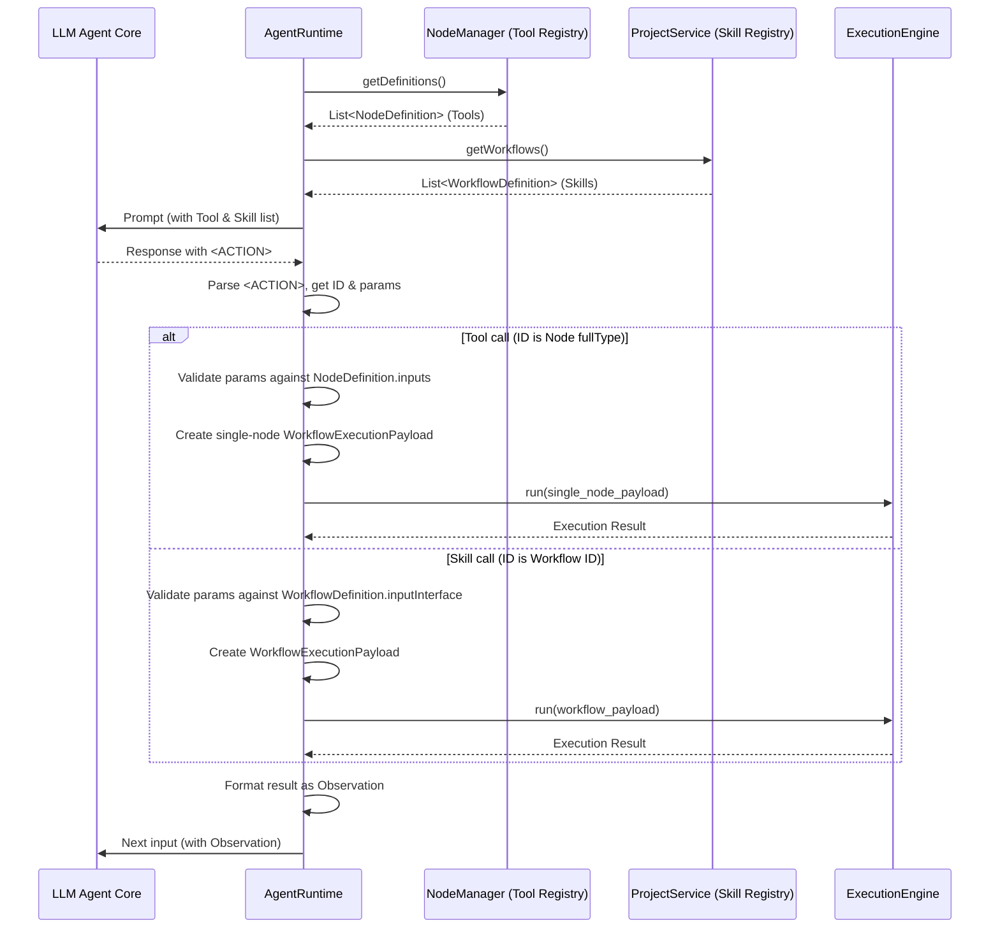

# Agent 工具调用协议 (Agent Tool Invocation Protocol)

## 1. 引言

### 1.1. 背景与目的

在 ComfyTavern Agent 架构中，Agent 的核心能力之一是能够调用外部工具 (Atomic Tools) 或执行预定义的技能工作流 (Skill Workflows) 来感知环境、执行动作或处理信息。为了使 Agent (通常由大型语言模型 LLM 驱动其核心审议逻辑) 能够清晰、可靠地表达其调用工具/技能的意图，并使平台的 `AgentRuntime` 能够准确地解析和执行这些意图，我们需要一套标准化的工具调用协议。

本协议旨在定义 Agent 输出其工具/技能调用指令的格式，以及 `AgentRuntime` 解析这些指令的规则。

### 1.2. 设计目标

本协议的设计遵循以下核心目标：

- **兼容性 (Compatibility)**: 协议应尽可能不依赖特定 LLM 的专有功能 (如某些模型特定的 Function Calling API)，以保证对多种不同 LLM 后端的广泛兼容性。
- **鲁棒性 (Robustness)**: LLM 的输出有时可能不完全符合预期。协议本身及其解析逻辑需要具备一定的容错能力，能够处理常见的生成错误，并提供清晰的错误反馈机制，以便 Agent 进行自我纠正。
- **可解释性 (Interpretability)**: Agent 的决策过程（尤其是调用工具的理由）应尽可能透明。协议应鼓励或便于 Agent 在输出工具调用指令的同时，提供其思考或解释的上下文。
- **效率与平衡 (Efficiency & Balance)**: 协议格式应在表达能力、解析效率和 LLM 生成的 Token 消耗之间取得合理平衡。过于冗余的格式会增加成本和延迟，而过于简洁的格式可能牺牲鲁棒性或表达能力。
- **易于实现 (Ease of Implementation)**: 协议的解析逻辑对于 `AgentRuntime` 来说应易于实现和维护。

## 2. 核心协议：`<ACTION>` 包裹的 XML 方案

### 2.1. 概述与设计理念

经过对多种潜在方案（包括纯文本指令、JSON 对象、特定分隔符方案如 VCP、以及不同风格的 XML 方案）的讨论和权衡，ComfyTavern 最终选择采用一种**以统一的 `<ACTION>` 标签包裹、内部使用 XML 描述具体工具/技能调用的方案**。

选择此方案的核心理由如下：

- **清晰的边界与意图分离**:
  - `<ACTION>...</ACTION>` 标签为工具调用指令提供了明确、唯一的边界，便于 `AgentRuntime` 从 LLM 可能产生的混合输出（包含自然语言解释和工具调用指令）中准确提取动作部分。
  - LLM 在 `<ACTION>` 标签之外输出的文本，可以自然地被视作其对用户或其他 Agent 的回应，或是对其决策的解释，无需额外的 `<THOUGHT>` 或 `<RESPONSE>` 标签强制约束，简化了 LLM 的输出负担。
- **XML 的结构化能力与鲁棒性**:
  - XML 是一种成熟的标记语言，拥有大量健壮的解析库。其标签闭合的特性有助于保证结构完整性。
  - 相比 JSON，XML 在处理包含特殊字符（如引号、换行符）或大段多行文本（如代码片段、diff 内容）的参数值时更为友好和自然，通常不需要复杂的转义，可以使用 `CDATA` 区块。这对于某些工具（如 `apply_diff`）的参数传递至关重要。
  - 虽然 LLM 生成 XML 也可能出现标签不闭合等错误，但其结构化的特性和标准解析器的错误处理能力，通常优于完全自定义的文本格式。
- **Token 消耗的可接受性**:
  - 虽然 XML 比 JSON 更冗余，但在 Agent 输出的整体 Token 量（通常包含解释性文本）的背景下，由 XML 标签本身带来的额外 Token 消耗占比相对较小，是可以接受的成本，特别是考虑到其换取的鲁棒性和参数表达的便利性。
- **对 LLM 的友好性**:
  - LLM 的训练数据中通常包含大量的 XML/HTML 结构，使其对生成带有层级和闭合标签的文本具备一定的能力。通过清晰的 Prompt 工程和 Few-Shot 示例，可以引导 LLM 稳定生成符合规范的 XML 指令。

本协议旨在通过这种方式，在兼容性、鲁棒性、可解释性和实现效率之间取得最佳平衡。

## 3. 协议规范详解

### 3.1. LLM 输出格式约定

LLM 在其核心审议工作流中，当需要表达工具调用意图或进行纯文本回应时，应遵循以下格式约定。

#### 3.1.1. 工具/技能调用格式

当 Agent 决定调用一个原子工具 (Tool) 或执行一个技能工作流 (Skill Workflow) 时，其输出应包含一个 `<ACTION>` 块。

```xml
[可选的、Agent 生成的自然语言文本，可以是对用户的回复，或对自己决策的解释。此部分通常出现在 <ACTION> 块之前。]

<ACTION>
    <ToolOrWorkflowID_1> <!-- 工具名或技能工作流ID作为第一个子标签名 -->
        <parameter_name_A>参数值 A</parameter_name_A>
        <parameter_name_B>参数值 B，可以是多行文本</parameter_name_B>
        <!-- 示例：用于表达列表或嵌套结构的参数 -->
        <list_parameter>
            <item>值1</item>
            <item>值2</item>
        </list_parameter>
        <complex_parameter>
            <sub_param_X>子参数 X 的值</sub_param_X>
            <sub_param_Y>子参数 Y 的值</sub_param_Y>
        </complex_parameter>
    </ToolOrWorkflowID_1>

    <!--
      可选：支持在单个 <ACTION> 块内定义多个顺序执行的工具/技能调用。
      初期实现建议先支持单个调用，即 <ACTION> 内只有一个 <ToolOrWorkflowID_n> 块。
      如果未来需要支持多个，则按顺序排列即可。
      <ToolOrWorkflowID_2>
          <parameter_name_C>参数值 C</parameter_name_C>
      </ToolOrWorkflowID_2>
    -->
</ACTION>

[可选的、Agent 生成的自然语言文本，出现在 <ACTION> 块之后。AgentRuntime 通常应忽略此部分，或仅作日志记录。Prompt 中应引导 LLM 在 </ACTION> 标签后结束其核心输出。]
```

**核心规则**:

- 工具/技能调用指令必须被包含在 `<ACTION>` 和 `</ACTION>` 标签之间。
- `<ACTION>` 块内部，每个独立的工具或技能调用由其 **ID (工具名或工作流路径/ID)** 作为 XML 标签名来表示 (例如 `<ReadWorldStateTool>`, `<workflows/skills/npc_greet_player_skill.json>`)。
- 该工具/技能所需的所有参数，都作为其 ID 标签的直接子元素。每个参数的标签名即为参数名，标签内容为参数值。
- 参数值可以是简单的文本，也可以是更复杂的 XML 结构（用于表达列表、对象等）。
- **初期版本，建议 `<ACTION>` 内部只包含一个工具/技能调用标签，以简化解析和执行逻辑。**

#### 3.1.2. 纯文本响应格式 (无 `<ACTION>` 块)

当 Agent 评估后认为当前无需调用任何工具或技能，仅需直接输出文本回应时（例如，在聊天应用中回复用户），其输出**不应包含** `<ACTION>...</ACTION>` 块。

```
[此处是 Agent 生成的完整自然语言文本回应。整个输出中没有 <ACTION> 标签。]
```

### 3.2. XML 结构详解

#### 3.2.1. `<ACTION>` 包装标签

- **作用**: 作为工具/技能调用指令的明确边界。`AgentRuntime` 通过查找此标签来定位和提取动作指令。
- **唯一性**: 在一次 LLM 的核心输出中，应至多只出现一个 `<ACTION>...</ACTION>` 块。

#### 3.2.2. 工具/技能 ID 标签 (`<ToolOrWorkflowID>`)

- **作用**: 位于 `<ACTION>` 标签内部的第一个（或唯一的，在初期实现中）子元素，其标签名直接对应 Agent Profile 中定义的原子工具 ID 或技能工作流 ID (或路径)。
- **示例**:
  - `<ReadPrivateStateTool>...</ReadPrivateStateTool>`
  - `<PublishEventTool>...</PublishEventTool>`
  - `<`workflows/skills/npc_answer_question_skill.json`>...</`workflows/skills/npc_answer_question_skill.json`>` (注意：如果工作流 ID 包含特殊字符如 `/`，在作为 XML 标签名时可能需要转义或使用替代命名约定，但这通常由平台在定义工具/技能清单时处理，LLM 只需使用清单中提供的有效标签名。)
    - **更佳实践**: 为了 XML 兼容性，技能工作流的引用 ID 最好是符合 XML 标签命名规范的字符串，例如 `skill_npc_answer_question`，而不是直接使用文件路径。平台内部再进行映射。

#### 3.2.3. 参数标签 (`<parameter_name>`)

- **作用**: 作为工具/技能 ID 标签的直接子元素，用于传递该工具/技能所需的参数。
- **命名**: 参数标签的名称应与工具/技能定义中声明的参数名完全一致。
- **值**: 标签的内容即为该参数的值。
- **结构**:
  - 简单值: `<age>25</age>`
  - 列表值:
    ```xml
    <names>
        <item>Alice</item>
        <item>Bob</item>
    </names>
    ```
  - 对象/嵌套值:
    ```xml
    <address>
        <street>123 Main St</street>
        <city>Anytown</city>
    </address>
    ```

#### 3.2.4. 对嵌套参数和特殊字符的处理 (CDATA 示例)

当参数值本身包含 XML 特殊字符（如 `<`, `>`, `&`）或者需要保持格式的多行文本（如代码片段、JSON 字符串、diff 内容）时，强烈建议使用 `<![CDATA[...]]>` 区块来包裹参数值。

```xml
<ACTION>
    <ApplyDiffTool>
        <file_path>src/main.ts</file_path>
        <diff_content>
            <![CDATA[
<<<<<<< SEARCH
:start_line:10
-------
console.log("Old version");
=======
console.log("New version with <special & characters>");
>>>>>>> REPLACE
            ]]>
        </diff_content>
    </ApplyDiffTool>
</ACTION>
```

使用 `CDATA` 可以确保参数内容被 XML 解析器视作纯字符数据，无需进行 XML 实体转义，从而保证内容的完整性和原始格式。

### 3.3. 协议解析与执行流程 (The Parsing and Execution Flow)

根据 ComfyTavern 的核心架构，LLM 输出的 `<ACTION>` 协议的解析与执行，位于工作流执行的外部，由 **Agent 实例 (Agent Instance)** 的运行时逻辑来协调，确保了职责的清晰分离。

**核心原则**:

- **`ExecutionEngine` (工作流引擎)**: 职责纯粹，仅负责执行给定的工作流 DAG 并返回其最终节点的输出。它不理解也不解析 `<ACTION>` 协议。
- **`AgentInstance` (Agent 实例)**: Agent 的运行时实体，负责驱动其完整的审议-行动循环 (deliberation-action loop)。它调用 `ExecutionEngine` 来运行工作流，并负责**解析工作流的原始输出**，协调后续的工具/技能执行。

**详细流程**:

1.  **触发审议 (Deliberation Triggered)**:

    - 场景 (`Scene`) 中的 `AgentInstance` 接收到触发信号（如事件、定时器、或其他 Agent 的行为），启动一次审议循环。

2.  **调用审议工作流 (Invoking Deliberation Workflow)**:

    - `AgentInstance` 请求 `ExecutionEngine` 执行其 `core_deliberation_workflow_id` 所指向的核心审议工作流。
    - `AgentInstance` 会将必要的上下文（如最新的 `PrivateState`, `WorldState`, 以及上一轮的 `Observations`）作为输入参数传递给工作流。

3.  **接收原始输出 (Receiving Raw Output)**:

    - `ExecutionEngine` 执行工作流。工作流的最终节点，通常是一个 LLM 调用节点，会输出包含 Agent 思考和决策的原始文本 `full_text`。
    - `ExecutionEngine` 将此 `full_text` 原封不动地返回给调用方，即 `AgentInstance`。

4.  **解析与处理 (Parsing and Processing by `AgentInstance`)**:
    `AgentInstance` 接收到 `full_text` 后，执行以下解析逻辑：

    - **提取 `<ACTION>` 块**:
      - 使用可靠的方法（如正则表达式配合 XML 解析预检查）查找并提取第一个出现的 `<ACTION>` 和 `</ACTION>` 标签之间的内容 `action_xml_content`。
      - 记录 `<ACTION>` 块之前的部分作为 `responseText` (自然语言解释)。
    - **处理分支**:
      - **IF `<ACTION>` 块被找到**:
        - **尝试解析 `action_xml_content`**: 使用标准的、健壮的 XML 解析库（如 `fast-xml-parser`）解析 `action_xml_content`。
        - **IF XML 解析成功**:
          - 从解析结构中提取 `invoked_tool_id` 和 `invoked_parameters`。
          - **校验与分发 (Validation & Dispatch)**:
            - `AgentInstance` 根据其 `Agent Profile` 中定义的工具/技能清单，校验 `invoked_tool_id` 的有效性和 `invoked_parameters` 的正确性。
            - **IF 校验通过**:
              - 如果 `responseText` 非空，`AgentInstance` 将其通过事件总线发布，供应用面板等前端订阅显示。
              - **分发执行**:
                - **原子工具 (Atomic Tool)**: `AgentInstance` 直接调用在后端服务中注册的、与 `tool_id` 对应的函数，并传入参数。
                - **技能工作流 (Skill Workflow)**: `AgentInstance` **再次请求 `ExecutionEngine`** 执行 `skill_workflow_id` 指向的工作流，并传入参数。
              - `AgentInstance` 收集执行结果（成功/失败、返回值），并将其格式化为 `Observation` 文本，用于下一次审议。
            - **ELSE (校验失败)**:
              - `AgentInstance` 构造详细的错误信息 (如 "Unknown tool ID" 或 "Invalid parameters")，并将其格式化为 `Observation` 文本，用于下一次审议，促使 Agent 自我纠正。不执行任何动作。
        - **ELSE (XML 解析失败)**:
          - `AgentInstance` 构造 "Malformed XML in ACTION block" 的错误信息，并将其格式化为 `Observation` 文本，用于下一次审议。
      - **ELSE (`<ACTION>` 块未找到)**:
        - `AgentInstance` 将 `full_text` 全部作为 `responseText` 发布，本次审议无任何工具/技能动作执行。

5.  **日志记录 (Logging)**:
    - 在整个流程中，`AgentInstance` 负责详细记录 LLM 的原始输出、解析过程、提取的指令、执行结果或错误信息，以便调试和分析。

## 4. Prompt 工程指南

为了引导 LLM 稳定、准确地生成符合本协议规范的输出，需要在核心审议工作流的 LLM 调用节点中进行精心的 Prompt 工程。

### 4.1. 如何引导 LLM 生成指定格式

- **明确指令**: 在 Prompt 的系统指令部分，清晰告知 LLM：
  - 当需要调用工具或执行技能时，必须使用 `<ACTION>...</ACTION>` 标签包裹其指令。
  - `<ACTION>` 内部必须是 XML 格式，根标签是工具/技能的 ID，子标签是参数。
  - 如果参数值包含特殊 XML 字符或多行代码/文本，应使用 `<![CDATA[...]]>`。
  - 如果不需要调用工具，则直接输出自然语言回应，不要包含 `<ACTION>` 标签。
- **强调解释**: 鼓励 LLM 在输出 `<ACTION>` 块之前，先用自然语言解释其当前的思考、评估和决定调用该工具/技能的理由。

### 4.2. 提供清晰的工具/技能清单与参数说明给 LLM

动态地将当前 Agent Profile 中定义的、可用的原子工具和技能工作流列表及其参数定义注入到 Prompt 的上下文中。格式应易于 LLM 理解。

**示例**:

```
You have access to the following tools and skills:

**Tools (direct function calls):**

*   `<ReadWorldStateTool>`: Reads a value from the shared world state.
    *   Parameters:
        *   `<path>` (string, required): The dot-separated path to the value in the world state (e.g., "environment.time.current_hour").
        *   `<default_value>` (any, optional): Value to return if path is not found.
*   `<UpdatePrivateStateTool>`: Updates a value in your private state.
    *   Parameters:
        *   `<key>` (string, required): The key in your private state to update.
        *   `<value>` (any, required): The new value for the key.
*   `<PublishEventTool>`: Publishes an event to the event bus.
    *   Parameters:
        *   `<event_type>` (string, required): The type of the event (e.g., "agent.action.completed").
        *   `<payload>` (object, optional): A JSON object string, or XML structure parsable to an object, containing event data. Use CDATA if complex.
            *   Example: `<payload><![CDATA[{"message": "Task done"}]]></payload>`

**Skills (workflow executions):**

*   `<skill_greet_player>`: Greets the player appropriately based on context.
    *   Parameters:
        *   `<player_id>` (string, required): The ID of the player to greet.
        *   `<greeting_context>` (string, optional): Additional context for the greeting (e.g., "first_encounter", "quest_reminder").
*   `<skill_generate_image_description>`: Generates a textual description for an image, possibly to be used by another image generation skill.
    *   Parameters:
        *   `<image_analysis_data>` (object, required): Data from a previous image analysis step. Use CDATA for complex JSON/XML.
        *   `<desired_style>` (string, optional): Preferred style for the description (e.g., "poetic", "technical").

When you decide to use a tool or skill, first explain your reasoning, then output the <ACTION> block with the chosen tool/skill ID as the main tag, and its parameters as child tags. If no action is needed, just provide your textual response.
```

### 4.3. Few-Shot 示例的重要性

在 Prompt 中提供几个清晰、高质量的 Few-Shot 示例，展示在不同情境下如何正确地：

- 解释思考过程。
- 生成包含 `<ACTION>` 和正确 XML 结构的工具调用。
- 传递不同类型的参数（简单值、列表、嵌套对象、CDATA）。
- 在不需要工具时仅输出自然语言。
- (可选) 如何根据上一轮的 "Observation: Error..." 反馈进行自我纠正。

这些示例对 LLM 的输出质量至关重要。

## 5. 示例

### 5.1. 简单工具调用示例

**LLM 输出**:

```
Okay, I need to check the current weather to answer the player's question.
<ACTION>
    <ReadWorldStateTool>
        <path>environment.weather.current_conditions</path>
        <default_value>unknown</default_value>
    </ReadWorldStateTool>
</ACTION>
```

**`AgentRuntime` 解析后**:

- `responseText`: "Okay, I need to check the current weather to answer the player's question." (输出给面板)
- `invoked_tool_id`: "ReadWorldStateTool"
- `invoked_parameters`: `{ path: "environment.weather.current_conditions", default_value: "unknown" }`
- (执行工具，假设返回 "sunny")
- 下一轮审议的输入将包含: `"Observation: Tool ReadWorldStateTool executed successfully. Result: sunny"`

### 5.2. 带嵌套参数的工具调用示例 (如 `read_file` 多个文件)

**LLM 输出**:

```
I need to read both the main application file and the utility functions to understand the context.
<ACTION>
    <read_file>
        <args>
            <file>
                <path>src/app.ts</path>
            </file>
            <file>
                <path>src/utils.ts</path>
            </file>
        </args>
    </read_file>
</ACTION>
```

**`AgentRuntime` 解析后**:

- `responseText`: "I need to read both the main application file and the utility functions to understand the context."
- `invoked_tool_id`: "read_file"
- `invoked_parameters`: `{ args: { file: [ { path: "src/app.ts" }, { path: "src/utils.ts" } ] } }` (XML 解析库通常会将重复标签解析为数组)

### 5.3. 使用 CDATA 处理特殊字符的参数示例

**LLM 输出**:

```
I will try to apply the following diff to update the configuration.
<ACTION>
    <ApplyProjectDiff>
        <target_file>config/settings.json</target_file>
        <diff_patch>
            <![CDATA[
--- a/config/settings.json
+++ b/config/settings.json
@@ -1,5 +1,5 @@
 {
-  "feature_enabled": false,
+  "feature_enabled": true,
   "api_key": "old_key_value"
 }
            ]]>
        </diff_patch>
    </ApplyProjectDiff>
</ACTION>
```

### 5.4. 纯文本响应示例

**LLM 输出**:

```
The weather is currently sunny and pleasant. It's a great day for an adventure!
```

**`AgentRuntime` 解析后**:

- 未找到 `<ACTION>` 块。
- `responseText`: "The weather is currently sunny and pleasant. It's a great day for an adventure!" (输出给面板)
- 无工具执行。

### 5.5. Agent 如何根据错误反馈进行自我纠正的交互示例

**轮次 1: LLM 输出 (参数错误)**

```
I'll try to get the player's name.
<ACTION>
    <GetPlayerInfo>
        <playerId>player123</playerId> <!-- 假设正确的参数名是 player_id -->
    </GetPlayerInfo>
</ACTION>
```

**轮次 1: `AgentRuntime` 处理**

- `responseText`: "I'll try to get the player's name."
- XML 解析成功，`invoked_tool_id`: "GetPlayerInfo"。
- 参数校验失败 (假设 `GetPlayerInfo` 工具需要 `player_id` 而不是 `playerId`)。
- 反馈给 LLM (轮次 2 输入): `"Observation: Error - Invalid parameters for GetPlayerInfo: Unknown parameter 'playerId', did you mean 'player_id'?"` (或者更通用的错误，如“Parameter validation failed”)

**轮次 2: LLM 输出 (修正后)**

```
My apologies, I used the wrong parameter name. Let me try again to get the player's information.
<ACTION>
    <GetPlayerInfo>
        <player_id>player123</player_id>
    </GetPlayerInfo>
</ACTION>
```

**轮次 2: `AgentRuntime` 处理**

- `responseText`: "My apologies, I used the wrong parameter name. Let me try again to get the player's information."
- XML 解析成功，参数校验通过。
- 执行 `GetPlayerInfo` 工具。

## 7. 工具与技能的定义、注册与执行

为了清晰地说明 Agent 可用工具的来源、定义方式以及执行机制，本章节将详细阐述 ComfyTavern 如何将平台内已有的“节点”和“工作流”概念，无缝地映射为 Agent 的“原子工具”和“技能”。

### 7.1. 核心概念：统一的能力抽象

我们不为 Agent 引入一套全新的、独立的工具系统，而是复用平台的核心资产。这使得架构更加简洁、一致且易于扩展。

-   **原子工具 (Atomic Tool) -> 节点 (Node)**
    -   **定义**: 一个单一、不可分割的操作。
    -   **实现**: 直接映射到 ComfyTavern 中的一个**节点**。
    -   **元数据来源**: 节点的 `NodeDefinition` (`fullType`, `displayName`, `description`, `inputs` schema 等) 即是工具的完整定义。
    -   **注册中心**: `NodeManager` 自然地成为所有原子工具的注册和管理中心。

-   **技能 (Skill) -> 工作流 (Workflow)**
    -   **定义**: 一个更复杂的、由多个步骤组成的、为完成特定目标而编排的任务。
    -   **实现**: 直接映射到一个已保存的**工作流**。
    -   **元数据来源**: 工作流的 `WorkflowDefinition` (`id`, `name`, `description`, `inputInterface` 等) 即是技能的完整定义。
    -   **注册中心**: `ProjectService` 或其他工作流管理服务，是所有技能的注册和管理中心。

### 7.2. 能力供给：向 Agent 提供工具和技能清单

在每次审议循环开始前，`AgentRuntime` 负责动态构建一个能力清单，并将其注入到 Prompt 中，供 LLM 理解和使用。

1.  **构建原子工具清单**:
    -   `AgentRuntime` 从 `NodeManager.getDefinitions()` 获取所有（或根据 Agent Profile 筛选的）可用节点。
    -   将每个 `NodeDefinition` 格式化为 LLM 易于理解的工具描述，明确其 ID (`fullType`)、功能 (`description`) 和参数 (`inputs`)。

2.  **构建技能清单**:
    -   `AgentRuntime` 从 `ProjectService` 获取所有（或根据 Agent Profile 筛选的）可用工作流。
    -   将每个 `WorkflowDefinition` 格式化为技能描述，明确其 ID (`id`)、名称 (`name`)、功能 (`description`) 和参数 (`inputInterface`)。

Prompt 中会清晰地区分这两类能力，如第 4.2 节示例所示。

### 7.3. 执行路径：统一的执行引擎入口

无论是调用简单的原子工具还是复杂的技能，最终都汇入到同一个执行器——`ExecutionEngine`。

#### 7.3.1. 路径 A: 执行技能 (调用工作流)

这是直接的路径：

1.  `AgentRuntime` 解析 `<ACTION>`，识别出其 ID 对应一个工作流。
2.  校验传入参数是否符合工作流的 `inputInterface`。
3.  构造标准的 `WorkflowExecutionPayload`。
4.  调用 `ExecutionEngine.run(payload)`。
5.  接收结果并格式化为 `Observation`。

#### 7.3.2. 路径 B: 执行原子工具 (调用节点)

为了让 `ExecutionEngine` 能够执行单个节点，我们采用**单节点工作流封装 (Single-Node Workflow Wrapping)**策略：

1.  `AgentRuntime` 解析 `<ACTION>`，识别出其 ID 对应一个节点的 `fullType`。
2.  校验传入参数是否符合该节点的 `inputs` schema。
3.  **动态封装**: `AgentRuntime`（或其委托的前端/适配层）在内存中动态创建一个临时的、只包含这一个节点的 `WorkflowExecutionPayload`。
    -   `nodes`: 数组中仅有被调用的目标节点。
    -   `edges`: 数组为空。
    -   `inputs`: 节点输入被填充为 `<ACTION>` 中的参数。
    -   `outputInterfaceMappings`: 将该节点的所有输出槽都映射到工作流的接口输出，以便捕获其结果。
4.  调用 `ExecutionEngine.run(payload)`，传入这个动态创建的单节点工作流载荷。
5.  接收结果并格式化为 `Observation`。

这种设计使得 `ExecutionEngine` 的职责保持纯粹（只执行工作流），同时优雅地实现了对单个节点作为工具的调用。

### 7.4. 方案流程图




## 8. 未来展望 (可选)

### 8.1. 支持一次 `<ACTION>` 内调用多个工具

当前协议建议初期 `<ACTION>` 内只包含一个工具/技能调用，以简化实现。未来可以扩展 `AgentRuntime` 的解析和执行逻辑，以支持 `<ACTION>` 块内按顺序定义和执行多个工具/技能调用。这将允许 Agent 在一次审议中规划一个更长的、由多个原子步骤组成的动作序列。

### 6.2. 其他可能的协议版本迭代方向

- **更细致的错误码和类型**: 为 "Observation: Error..." 提供更结构化的错误信息，方便 Agent 或调试工具进行分类处理。
- **参数类型提示的标准化**: 在 Prompt 中提供给 LLM 的工具参数类型信息（如 string, number, boolean, object, array）可以进一步标准化，以便 LLM 更准确地生成符合类型的值。
- **异步工具调用处理**: 对于执行时间可能很长的工具/技能，考虑引入异步调用模式和结果回调机制，避免阻塞 Agent 的审议循环。但这会显著增加协议和 `AgentRuntime` 的复杂性。
