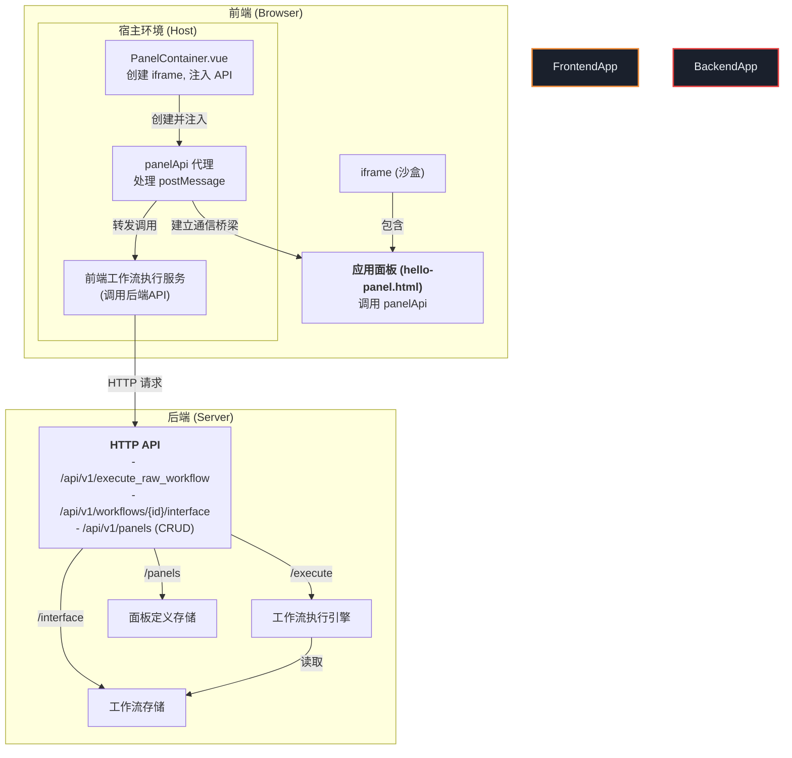
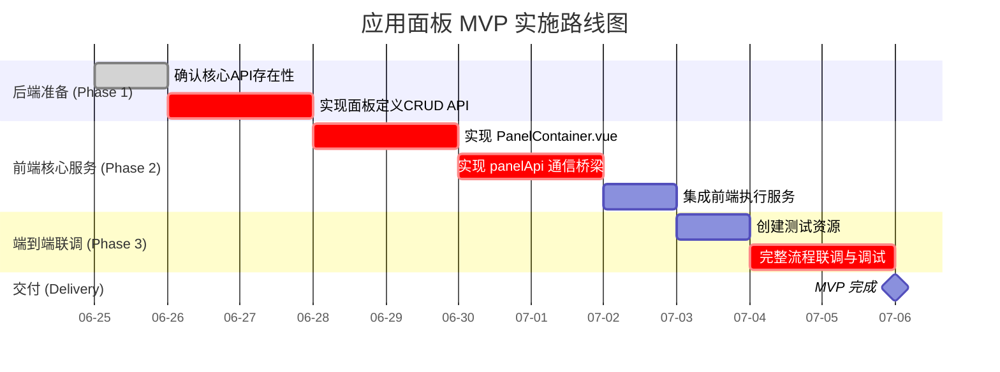

# 设计文档：应用面板 MVP 实施计划

## 1. 背景与目标

### 1.1. 问题陈述

经过复盘，我们意识到先前的 `unified-panel-agent-plan` （先已改名panel-agent-plan-archive.md）将“应用面板”与“Agent”过度耦合，导致计划复杂化且偏离了核心目标。应用面板的本质是一个独立的、可与任意工作流交互的“微应用”前端，而不应仅仅是 Agent 的UI。

### 1.2. 核心目标

本计划旨在拨乱反正，重新定义一个清晰、务实、聚焦的 **应用面板最小可行产品 (MVP) 实施路线图**。

**MVP 的核心目标是：** 证明一个独立的、沙盒化的应用面板（一个简单的 HTML 文件）能够通过标准化的前端 API (`panelApi`)，成功调用一个普通的、预定义的 ComfyTavern 工作流，并接收到其执行结果。

此 MVP 将**完全剥离**对 `AgentRuntime`, `SceneManager` 等复杂 Agent 概念的依赖，回归到面板与工作流直接交互的本质。

### 1.3. 关键架构文档

本计划严格遵循以下已确立的设计原则和规范：

*   **面板规范**: [`./面板与接口/panel-spec-and-lifecycle.md`](./面板与接口/panel-spec-and-lifecycle.md:1)
*   **面板 API**: [`./面板与接口/panel-api-specification.md`](./面板与接口/panel-api-specification.md:1)
*   **前端适配器**: [`./面板与接口/frontend-api-manager-and-integration.md`](./面板与接口/frontend-api-manager-and-integration.md:1)
*   **安全与执行**: [`./面板与接口/execution-core-and-security.md`](./面板与接口/execution-core-and-security.md:1)

---

## 2. MVP 架构图

此图展示了 MVP 阶段最核心的组件交互流程。

---

## 3. 实施路线图

---

## 4. 实施阶段详解

### 阶段 1: 后端准备

**目标**: 确保后端提供了执行工作流和管理面板定义所需的最基础的 HTTP API。

*   **任务 1.1: 确认核心执行与接口 API** (责任人: 后端团队)
    *   **描述**: 确认后端已存在或快速实现以下两个核心端点：
        1.  `POST /api/v1/execute_raw_workflow`: 接收一个完整的工作流 JSON 并执行。
        2.  `GET /api/v1/workflows/{workflowId}/interface`: 返回指定工作流的输入输出接口定义。
    *   **验收标准**: 可以通过 Postman 或 curl 成功调用这两个接口。
    *   **状态**: **需要确认**。根据现有代码结构，这些功能很可能已存在于 `executionRoutes.ts` 和 `workflowRoutes.ts` 中，需要验证其可用性。

*   **任务 1.2: 实现面板定义 (`PanelDefinition`) 的 CRUD API** (责任人: 后端团队)
    *   **描述**: 创建一套标准的 RESTful API 用于管理 `PanelDefinition` 对象。MVP 阶段至少需要 `Create` 和 `Read`。
    *   **Schema**: 使用 Zod 在 `packages/types/src/schemas.ts` 中定义 `PanelDefinitionSchema`。
    *   **API 端点**:
        *   `POST /api/v1/panels`: 创建一个新的面板定义。
        *   `GET /api/v1/panels`: 获取所有面板定义的列表。
        *   `GET /api/v1/panels/{panelId}`: 获取单个面板定义的详情。
    *   **存储**: MVP 阶段可使用简单的文件存储（如 `projects/{projectId}/panels/panel_defs.json`）或内存存储，无需立即引入数据库。
    *   **关键产出**: 后端新增 `panelRoutes.ts`，`PanelService.ts`，以及更新 `schemas.ts`。

### 阶段 2: 前端核心服务

**目标**: 搭建承载应用面板的前端容器，并建立与面板内部的安全通信机制。

*   **任务 2.1: 实现 `PanelContainer.vue` 组件** (责任人: 前端团队)
    *   **描述**: 创建一个 Vue 组件，其核心功能是渲染一个 `<iframe>`。
    *   **功能**:
        *   接收一个 `panelId`作为 prop。
        *   调用（未来的）`PanelService` (前端) 获取 `PanelDefinition`。
        *   根据 `PanelDefinition.uiEntryPoint` 设置 `<iframe>` 的 `src`。
        *   根据 `PanelDefinition.uiRuntimeConfig.sandboxAttributes` 设置 `<iframe>` 的 `sandbox` 属性。
    *   **关键产出**: `apps/frontend-vueflow/src/components/panel/PanelContainer.vue`。

*   **任务 2.2: 实现 `panelApi` 通信桥梁** (责任人: 前端团队)
    *   **描述**: 这是 MVP 的核心技术难点。在 `PanelContainer.vue` 中实现逻辑，向 `<iframe>` 安全地注入 `panelApi`，并处理双向的 `postMessage` 通信。
    *   **功能**:
        1.  创建一个 `panelApi` 代理对象，其方法（如 `executeWorkflow`）会将调用参数打包成消息。
        2.  在 `iframe.onload` 事件后，通过 `iframe.contentWindow.postMessage` 将 `panelApi` 的初始化脚本注入。
        3.  在 `PanelContainer` 中监听来自 `iframe` 的 `message` 事件，验证 `event.origin`。
        4.  解析消息，并将调用分发给前端相应的服务（如 `WorkflowExecutor`）。
        5.  将服务的返回结果通过 `postMessage` 回传给 `iframe`。
    *   **关键产出**: `PanelContainer.vue` 的增强逻辑，以及可能抽离出的 `usePanelCommunication.ts` composable。

*   **任务 2.3: 集成前端工作流执行服务** (责任人: 前端团队)
    *   **描述**: 将 `panelApi` 的 `executeWorkflow` 和 `getWorkflowInterface` 调用，实际连接到前端现有的工作流执行逻辑上。
    *   **功能**:
        *   当 `panelApi` 的 `executeWorkflow` 被调用时，最终应触发调用后端的 `POST /api/v1/execute_raw_workflow`。
        *   当 `getWorkflowInterface` 被调用时，最终应触发调用后端的 `GET /api/v1/workflows/{workflowId}/interface`。
    *   **关键产出**: `PanelContainer.vue` 或其辅助服务与现有 `workflowStore` 或 `useWorkflowExecution` 的集成代码。

### 阶段 3: 端到端联调

**目标**: 创建最简的测试资源，验证整个流程能够无误地运行。

*   **任务 3.1: 创建测试资源** (责任人: 全员)
    *   **后端**:
        1.  创建一个简单的测试工作流 (e.g., `test-panel-workflow.json`)，功能为：接收一个字符串输入，返回 "Hello, [输入]"。
        2.  使用 `POST /api/v1/panels` API 注册一个 `PanelDefinition`，其 `uiEntryPoint` 指向 `public/panels/hello-panel/index.html`，并绑定上述测试工作流。
    *   **前端**:
        1.  在 `public/panels/hello-panel/` 目录下创建一个 `index.html`。
        2.  `index.html` 中包含一个输入框、一个按钮和一个用于显示结果的 div。
        3.  其 `<script>` 标签内的逻辑：
            *   等待 `window.comfyTavern.panelApi` 可用。
            *   调用 `panelApi.getWorkflowInterface` 获取接口信息（可选，用于验证）。
            *   点击按钮时，调用 `panelApi.executeWorkflow`，传入工作流ID和输入框的值。
            *   使用 `panelApi.subscribeToExecutionEvents` 监听结果，并将返回的输出显示在 div 中。

*   **任务 3.2: 完整流程联调与调试** (责任人: 全员)
    *   **描述**: 在浏览器中加载 `PanelContainer.vue` 并传入测试 `panelId`。在面板中输入文字并点击按钮，观察结果是否能正确显示。
    *   **验收标准**: 从面板输入 "咕咕"，面板最终能显示 "Hello, 咕咕"。整个过程无控制台错误。

---

## 5. 后续展望 (Post-MVP)

在 MVP 成功的基础上，可以逐步引入更高级的功能：

*   实现 `panelApi` 的 `adapter` 模式，并构建 `ApiAdapterManager`。
*   完善面板的 CRUD 管理界面。
*   集成 Agent 相关的事件和交互。
*   开发更丰富的宿主服务 (`requestHostService`)。