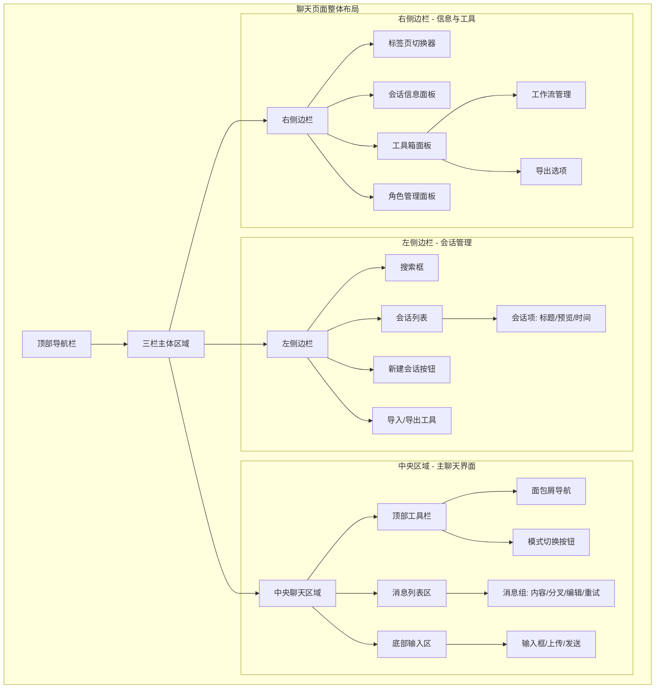
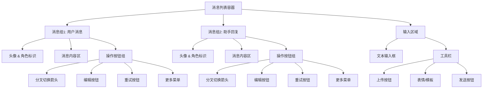
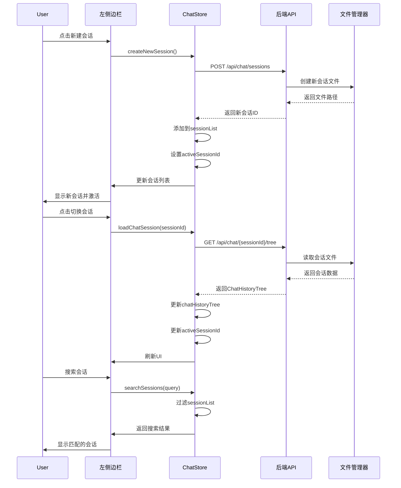
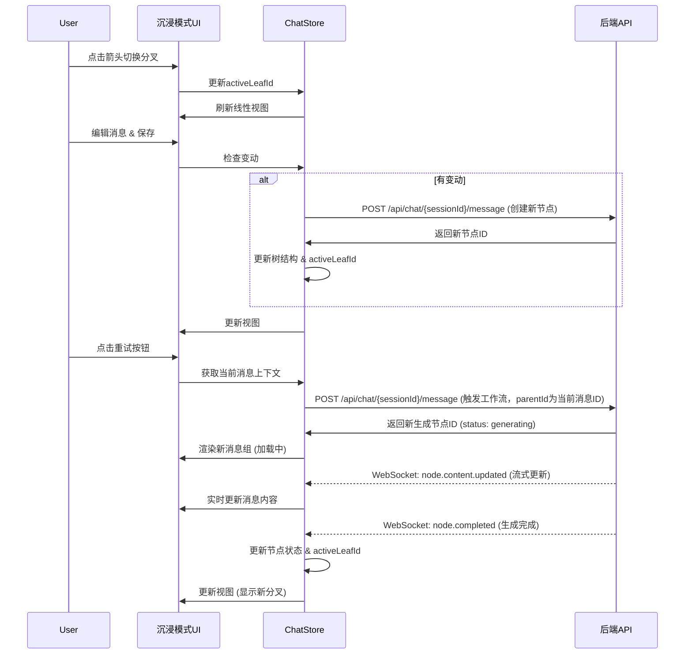
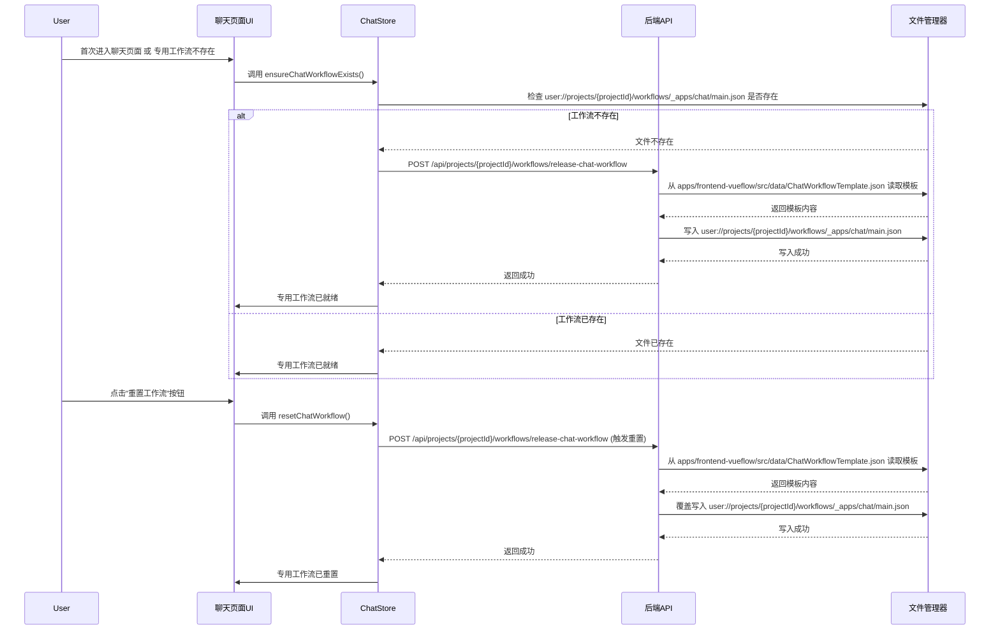

# 聊天页面设计与实现计划

## 1. 核心设计理念

本计划旨在定义 ComfyTavern 内置聊天页面的设计与实现方案，旨在提供一个先进、灵活且易于集成的聊天体验。

- **原生 Vue 组件**：聊天页将作为一个独立的 Vue 组件，直接集成到前端应用中，而非沙盒模式下的应用面板。这将解决沙盒模式下 Git 跟踪困难、模板复制机制复杂和额外通信设计等问题，提升开发效率和可维护性。
- **项目可选功能**：聊天页将作为项目的一个可选功能，默认启用。用户可以在项目配置中选择禁用此功能，以实现更纯净、更聚焦的项目体验。
- **先进的聊天体验**：将采用 [`DesignDocs/architecture/chat-history-branching-design.md`](DesignDocs/architecture/chat-history-branching-design.md:1) 中描述的聊天历史树图编辑与分支管理设计。这将提供非线性对话、上下文精确控制、多分支探索等高级功能，显著提升用户与 AI 交互的深度和效率。同时，也将兼容传统的线性对话模式。
- **专用工作流自动管理**：聊天模块将**自动管理一个专用的聊天工作流**，该工作流由聊天模块在首次使用时自动“释出”到项目特定路径。用户可以修改此工作流以自定义聊天行为，但如果修改出错或需要恢复，可以一键“重置”回初始模板状态。这避免了用户手动选择或创建工作流的复杂性，提供了“即开即用”的体验。
- **前端主导，后端执行**：前端负责聊天页面的 UI 渲染、用户交互逻辑和工作流的调用与状态监听。后端则提供通用的文件管理服务和高性能的工作流执行引擎，不包含特定的聊天业务逻辑，保持其服务角色的纯粹性。

## 2. 详细实施计划

### 2.1. 前端组件设计与实现

**目标**：创建功能完善、交互流畅的聊天页面 Vue 组件，并集成聊天历史管理、专用工作流管理和后端通信。

- **组件位置**：
  - 在 [`apps/frontend-vueflow/src/views`](apps/frontend-vueflow/src/views) 目录下创建一个新的 Vue 视图组件，例如 `ChatView.vue`，作为聊天页面的主入口。
- **UI 布局与交互**：

  - **整体布局架构**：

    - 采用三栏式布局设计：左侧边栏（会话列表）、中央主聊天区域、右侧边栏（会话信息与工具）
    - 左右侧边栏均可折叠/展开，提供更沉浸的聊天体验
    - 响应式设计：在移动端自动切换为单栏布局，通过滑动手势或按钮切换不同面板
    - 参考 [docs-site\zh\developer-docs\architecture\frontend-style-guide.md] 的样式指南

  - **左侧边栏 - 聊天会话管理**：

    - **会话列表区域**：
      - 显示当前项目下的所有聊天会话，按最后活动时间排序
      - 每个会话条目显示：
        - 会话标题（可自定义或自动生成）
        - 最后一条消息的预览文本
        - 最后活动时间戳
        - 未读/活跃状态指示器
        - 会话类型图标（普通聊天、角色扮演、任务对话等）
      - 支持搜索和筛选功能
      - 提供右键菜单：重命名、删除、导出、复制会话等操作
    - **快速操作区**：
      - "新建会话"按钮，创建新的空白会话
      - "导入会话"功能，支持从文件导入历史对话
      - 会话分组/文件夹管理（可选功能）
    - **底部状态栏**：
      - 显示会话总数、当前项目名称
      - 快速切换项目的下拉菜单（如果有多个项目）

  - **右侧边栏 - 会话信息与工具面板**：

    - **会话信息标签页**：
      - 当前会话的元数据：创建时间、消息总数、分支数量、token 使用统计
      - 会话设置：默认 LLM 配置、系统提示词、温度等参数的快速调整
      - 会话标签/分类管理
    - **角色管理标签页**（实际实现为连接到agent选择器，参考[agent_architecture_consolidated.md]）：
      - 当前会话使用的角色卡片信息
      - 角色属性编辑器
      - 角色切换功能
    - **工具箱标签页**：
      - 快速访问常用工具和功能
      - 工作流管理快捷方式：
        - "编辑工作流"按钮 - 跳转到工作流编辑器
        - "重置工作流"按钮 - 恢复到默认模板
        - "工作流模板库"入口
      - 导出选项：导出为 Markdown、JSON、PDF 等格式
      - 高级功能入口：批量操作、数据分析等
    - **知识库/上下文标签页**（未来扩展）：
      - 关联的知识库文档
      - 自定义上下文注入
      - RAG 检索结果预览

  - **沉浸模式 (Linear Chat View)**：
    - 标准的线性对话界面，基于底层树状结构，仅显示当前"主干"上**已启用**的对话内容。
    - **顶部工具栏**：
      - 左侧：侧边栏折叠/展开按钮、会话标题显示
      - 中间：面包屑导航（显示当前分支路径）
      - 右侧：视图切换按钮（沉浸模式/编辑模式）、设置按钮
    - **消息组设计**：每个聊天消息都作为一个可交互的"消息组"呈现，而非单一消息。
      - **内容显示**：显示消息的 `role` (用户、助手、系统) 和 `status` (生成中、完成、错误)，并根据状态进行视觉区分。
      - **分叉切换**：在消息组内部提供左右箭头（或类似控件），允许用户手动切换当前消息的直接子分叉。切换时，仅更新当前活跃叶节点（`activeLeafId`），并刷新线性视图以显示新路径上的启用节点，不自动触发内容生成。
      - **消息编辑**：提供编辑按钮，允许用户修改消息内容。保存时，如果内容发生变动，系统将自动创建一个新的子节点（作为新分叉）来存储修改后的内容，并将当前主干切换到这个新节点，以保持历史的非破坏性。
      - **重试按钮**：提供重试按钮。点击后，系统将基于当前消息的上下文（即从根节点到当前消息的启用路径）重新触发后端工作流生成。新生成的内容将作为当前消息的**下一个消息组**的一个新分叉（子节点）添加到树中，并自动切换到该新分叉。
      - **更多操作菜单**：复制、删除、查看原始数据、添加到收藏等
    - **底部输入区域**：
      - 多行文本输入框，支持 Markdown 格式
      - 文件上传按钮（支持拖拽上传）
      - 发送按钮和快捷键支持（Ctrl/Cmd + Enter）
      - 输入工具栏：表情、模板、历史输入等快捷插入
  - **编辑模式 (Tree/Graph Editor View)**：
    - 一个可视化的图状界面，展示完整的对话历史树状图。详细参考[chat-history-branching-design.md](chat-history-branching-design.md)。
    - 用户可以通过拖拽、点击菜单等方式，对节点和分支进行以下操作：
      - **剪枝 (Prune)**：从一个节点切断其后续所有对话，形成可操作的“分支片段”。
      - **嫁接 (Graft)**：将一个“分支片段”连接到树中的任意目标节点上。
      - **启用/禁用 (Enable/Disable)**：切换单个或多个节点的激活状态，决定它们是否被包含在最终上下文中。被禁用的节点应有明确的视觉区分（如半透明、灰色、特殊图标）。
      - **切换主干 (Switch Trunk)**：在多条并行分支中，选择其中一条作为当前对话的主线。
    - 可以考虑集成 VueFlow 或其他图表库来实现复杂的图状交互和渲染。
    - 提供返回“沉浸模式”的入口按钮。

- **状态管理 (Pinia Store)**：
  - 创建一个专门的 Pinia Store (例如 `useChatStore`) 来管理聊天历史数据，包括 `ChatHistoryTree` 和 `ChatMessageNode` 的实例。
  - Store 应包含以下核心状态：
    - `chatHistoryTree: ChatHistoryTree`：当前会话的完整聊天历史树结构。
    - `currentMode: 'immersive' | 'edit'`：聊天页面的当前显示模式。
    - `activeSessionId: string | null`：当前活跃聊天会话的 ID。
    - `sessionList: ChatSession[]`：所有聊天会话的列表，包含会话元数据。
    - `chatWorkflowPath: string`：当前聊天模块专用的工作流的逻辑路径，例如 `user://projects/{projectId}/workflows/_apps/chat/main.json`。
    - `isLoading: boolean`：指示数据是否正在加载。
    - `leftSidebarVisible: boolean`：左侧边栏是否可见。
    - `rightSidebarVisible: boolean`：右侧边栏是否可见。
    - `rightSidebarActiveTab: string`：右侧边栏当前激活的标签页。
  - Store 应提供以下核心 Actions/Getters：
    - `loadChatSession(sessionId: string)`：加载指定会话的聊天历史。
    - `createNewSession(metadata?: Partial<ChatSession>)`：创建新的聊天会话，可指定初始元数据。
    - `deleteSession(sessionId: string)`：删除指定会话。
    - `renameSession(sessionId: string, newName: string)`：重命名会话。
    - `loadSessionList()`：加载项目下所有会话列表。
    - `searchSessions(query: string)`：搜索会话。
    - `exportSession(sessionId: string, format: ExportFormat)`：导出会话。
    - `importSession(file: File)`：导入会话。
    - `ensureChatWorkflowExists()`：检查专用聊天工作流是否存在，如果不存在则调用后端 API 进行释出。
    - `resetChatWorkflow()`：调用后端 API 将专用聊天工作流恢复到模板状态。
    - `sendMessage(content: string, parentId: string | null)`：发送新消息，触发后端工作流。
    - `updateNodeState(nodeId: string, isEnabled: boolean)`：更新节点启用状态。
    - `pruneBranch(nodeId: string)`：执行剪枝操作。
    - `graftBranch(sourceNodeId: string, targetNodeId: string)`：执行嫁接操作。
    - `switchTrunk(leafNodeId: string)`：切换当前主干。
    - `getLinearContext(activeLeafId: string)`：根据当前主干和节点启用状态，构建发送给 LLM 的线性上下文。
    - `getChatNodes: ComputedRef<ChatMessageNode[]>`：获取用于渲染的聊天节点列表（根据当前模式和启用状态过滤）。
    - `toggleLeftSidebar()`：切换左侧边栏显示状态。
    - `toggleRightSidebar()`：切换右侧边栏显示状态。
    - `setRightSidebarTab(tab: string)`：设置右侧边栏激活标签。
- **后端通信**：
  - **WebSocket 集成**：
    - 通过 `useWebSocket` Composable 或直接集成 WebSocket 客户端，与后端建立实时通信。
    - 监听后端推送的 WebSocket 事件，例如：
      - `node.created(node: ChatMessageNode)`：通知一个新的占位符节点已创建，前端应立即渲染“加载中”状态。
      - `node.content.updated(patch: { id: string; contentChunk: string; })`：发送流式内容片段，前端实时更新对应节点的内容。
      - `node.completed(node: ChatMessageNode)`：通知节点已完整生成，前端更新节点状态。
      - `node.state.updated(patch: { id: string; isEnabled: boolean; })`：通知客户端一个节点的状态发生了变化，前端更新 UI。
  - **HTTP API 调用**：
    - 封装对后端 REST API 的调用，例如：
      - `GET /api/chat/{sessionId}/tree`：获取完整的聊天历史树结构。
      - `POST /api/chat/{sessionId}/message`：发送新消息，请求中需包含 `parentId`。
      - `PUT /api/chat/{sessionId}/tree/edit`：提交一个或多个结构性编辑操作（如剪枝、嫁接）。
      - `PUT /api/chat/{sessionId}/node/{nodeId}/state`：更新单个节点的状态（`isEnabled`）。
      - `PUT /api/chat/{sessionId}/active_leaf`：设置当前活动的主干叶节点。
      - `PUT /api/chat/{sessionId}/nodes/state`：实现批量更新节点状态的接口，优化高频操作。
- **工作流集成**：

  - **调用方式**：利用 [`useWorkflowInvocation()`](apps/frontend-vueflow/src/services/WorkflowInvocationService.ts:71) Composable 调用后端工作流执行引擎。当用户发送新消息或请求重试时，将调用其 `invoke` 方法。
  - **调用示例**：

    ```typescript
    import { useWorkflowInvocation } from "@/services/WorkflowInvocationService";
    import { useExecutionStore } from "@/stores/executionStore";
    import { useChatStore } from "@/stores/chatStore"; // 引入 Chat Store
    import { useDialogService } from "@/services/DialogService"; // 引入对话框服务

    const { invoke } = useWorkflowInvocation();
    const executionStore = useExecutionStore();
    const chatStore = useChatStore();
    const dialogService = useDialogService();

    async function handleSendMessage(userInput: string) {
      const projectId = "your_current_project_id"; // 需要从 projectStore 获取
      if (!projectId) {
        console.error("项目ID缺失，无法发送消息。");
        return;
      }

      // 确保专用聊天工作流已存在或被释出
      await chatStore.ensureChatWorkflowExists();

      const invocationResult = await invoke({
        mode: "saved", // 明确使用已保存的工作流
        targetId: chatStore.chatWorkflowPath, // 使用专用工作流的固定路径
        inputs: {
          chat_history: getLinearContext(chatHistoryTree.activeLeafId), // 传入构建好的聊天记录上下文
          // "llm_config": "{...}" // 可选，覆盖 LLM 配置
        },
        source: "panel", // 将自身标识为 'panel'，以复用现有逻辑
      });

      if (invocationResult) {
        const { executionId, promptId } = invocationResult;
        console.log(`工作流执行已启动，executionId: ${executionId}, promptId: ${promptId}`);
        // 开始监听执行状态和流式输出
        startListeningToWorkflowExecution(executionId);
      } else {
        console.error("工作流调用失败。");
      }
    }

    function startListeningToWorkflowExecution(executionId: string) {
      // 监听流式输出
      watch(
        () => executionStore.getAccumulatedInterfaceStreamedText(executionId, "response_stream"),
        (newText) => {
          if (newText) {
            // 将收到的流式文本实时更新到聊天界面上
            // 例如：updateMessageContent(currentNodeId, newText);
            console.log("流式输出:", newText);
          }
        },
        { immediate: true }
      );

      // 监听执行状态
      watch(
        () => executionStore.getWorkflowStatus(executionId),
        (status) => {
          console.log(`工作流 ${executionId} 状态:`, status);
          if (status === "COMPLETE" || status === "ERROR") {
            // 处理执行完成或失败的逻辑
            if (status === "COMPLETE") {
              const outputs = executionStore.getExecutionOutputs(executionId);
              console.log("工作流最终输出:", outputs);
              // 例如：displayFinalResponse(outputs.full_text);
            } else {
              const error = executionStore.getExecutionError(executionId);
              console.error("工作流执行错误:", error);
            }
          }
        },
        { immediate: true }
      );
    }
    ```

  - **配套工作流 IO 定义**：为了确保聊天页面能与后端工作流正确对接，其配套的 `workflow.json` 必须提供标准化的输入和输出接口。
    - **输入 (Inputs)**
      | 接口 ID (Key) | 显示名称 (DisplayName) | 数据类型 (DataType) | 描述 |
      | :--- | :--- | :--- | :--- |
      | `chat_history` | 聊天记录 | `OBJECT` | 从聊天界面构建的、发送给 LLM 的线性化聊天记录上下文。通常是一个包含 `role` 和 `content` 的消息对象数组。 |
      | `llm_config` | LLM 配置 | `STRING` | (可选) 一个包含 LLM 参数的 JSON 字符串，用于覆盖默认设置，例如 `'{"temperature": 0.7}'`。 |
    - **输出 (Outputs)**
      | 接口 ID (Key) | 显示名称 (DisplayName) | 数据类型 (DataType) | 是否流式 (isStream) | 描述 |
      | :--- | :--- | :--- | :--- | :--- |
      | `response_stream` | 响应流 | `STRING` | `true` | 从 LLM 返回的流式文本响应，用于在界面上逐字显示。 |
      | `full_text` | 完整文本 | `STRING` | `false` | 流结束后，累积的完整回复文本。 |
      | `usage` | Token 用量 | `OBJECT` | `false` | 本次调用的 token 使用情况统计。 |

### 2.1.8. 专用工作流管理

**目标**：聊天模块自动管理一个专用的聊天工作流，并提供重置功能。

- **专用工作流路径**：聊天模块的专用工作流将存储在 `user://projects/{projectId}/workflows/_apps/chat/main.json`。
- **UI 交互**：
  - 聊天页面顶部或侧边栏提供“编辑工作流”按钮，点击后跳转到工作流编辑器，打开 `_apps/chat/main.json` 进行编辑。
  - 提供“重置工作流”按钮，点击后触发后端 API 将 `_apps/chat/main.json` 恢复到内置模板状态。
- **自动释出**：当聊天页面首次加载或检测到专用工作流文件不存在时，前端将触发后端 API 自动将内置模板释出到 `_apps/chat/main.json`。

### 2.2. 后端 API 实现

**目标**：实现聊天历史管理和消息发送所需的后端 API 和 WebSocket 处理逻辑，并支持专用工作流的释出和重置。

- **聊天路由 (`chatRoutes.ts`)**：
  - 在 [`apps/backend/src/routes`](apps/backend/src/routes) 目录下创建 `chatRoutes.ts`。
  - 实现 [`DesignDocs/architecture/chat-history-branching-design.md`](DesignDocs/architecture/chat-history-branching-design.md:190) 中定义的 REST API 端点：
    - **会话管理接口**：
      - `GET /api/chat/sessions`：获取当前项目下所有会话列表。
      - `POST /api/chat/sessions`：创建新的聊天会话。
      - `DELETE /api/chat/sessions/{sessionId}`：删除指定会话。
      - `PUT /api/chat/sessions/{sessionId}/metadata`：更新会话元数据（如标题、标签等）。
      - `POST /api/chat/sessions/{sessionId}/export`：导出会话为指定格式。
      - `POST /api/chat/sessions/import`：从文件导入会话。
    - **会话内容接口**：
      - `GET /api/chat/{sessionId}/tree`：获取完整的聊天历史树结构。
      - `POST /api/chat/{sessionId}/message`：发送新消息，请求中需包含 `parentId`。
      - `PUT /api/chat/{sessionId}/tree/edit`：处理剪枝、嫁接等结构性编辑操作。
      - `PUT /api/chat/{sessionId}/node/{nodeId}/state`：更新单个节点的状态（`isEnabled`）。
      - `PUT /api/chat/{sessionId}/active_leaf`：设置当前活动的主干叶节点。
      - `PUT /api/chat/{sessionId}/nodes/state`：实现批量更新节点状态的接口，优化高频操作。
    - **媒体资源接口**：
      - `POST /api/chat/{sessionId}/asset`：上传媒体文件到会话。
      - `GET /api/chat/{sessionId}/assets`：获取会话的所有媒体资源列表。
- **项目与工作流支持路由 (`projectRoutes.ts`)**
  - **移除** `GET /api/projects/{projectId}/workflows?compatibleWith=chat` 接口。
  - `POST /api/projects/{projectId}/workflows/release-chat-workflow`:
    - **功能**: 将内置的聊天工作流模板释出（或重置）到项目专用路径 `user://projects/{projectId}/workflows/_apps/chat/main.json`。
    - **模板来源**: 内置模板文件位于 `apps/frontend-vueflow/src/data/ChatWorkflowTemplate.json`。
    - **实现**: 后端读取该模板文件，并使用 `FileManagerService.writeFile` 覆盖写入到目标路径。如果目标路径的父目录不存在，则自动创建。
- **WebSocket 处理**：
  - 在 [`apps/backend/src/websocket/handler.ts`](apps/backend/src/websocket/handler.ts:1) 或新建的 WebSocket 模块中，实现聊天相关的 WebSocket 事件处理逻辑。
  - 当工作流执行生成新的聊天消息节点或更新节点内容时，通过 WebSocket 向前端推送 `node.created`、`node.content.updated`、`node.completed` 等事件。
  - 当节点状态（如 `isEnabled`）发生变化时，推送 `node.state.updated` 事件。
- **数据持久化**：
  - 实现聊天历史 (`ChatHistoryTree`) 的持久化存储，通过专门的 `ChatHistoryService` 进行管理。
  - **存储路径**：聊天历史将存储为项目文件，路径结构为 `user://projects/{projectId}/chats/{sessionId}.json`。
  - **ChatHistoryService**：
    - 在 `apps/backend/src/services` 目录下创建 `ChatHistoryService.ts`。
    - 该服务将封装 `FileManagerService` 的调用，并提供高级的聊天历史管理功能。
    - **核心职责**：
      - **会话管理**：
        - **创建 (`createSession`)**：创建新的会话文件和初始化 `ChatHistoryTree` 结构。
        - **列出 (`listChatSessions`)**：列出项目下所有聊天会话文件，返回会话元数据列表。
        - **搜索 (`searchSessions`)**：根据关键词搜索会话内容和元数据。
        - **导出 (`exportSession`)**：将会话导出为不同格式（JSON、Markdown、PDF 等）。
        - **导入 (`importSession`)**：从文件导入会话，支持多种格式。
      - **内容管理**：
        - **加载 (`loadChatHistory`)**：从 `user://projects/{projectId}/chats/{sessionId}.json` 读取文件，反序列化为 `ChatHistoryTree` 对象。
        - **保存 (`saveChatHistory`)**：将 `ChatHistoryTree` 序列化为 JSON 字符串，全量覆盖写入文件。在写入前，确保 `user://projects/{projectId}/chats/` 目录存在。
        - **更新 (`updateChatHistory`)**：这是核心方法，用于执行对 `ChatHistoryTree` 的所有修改操作（添加消息、编辑、剪枝、嫁接等）。它将接收一个 `updateFn` 函数，该函数接收当前的 `ChatHistoryTree` 对象作为参数，并返回修改后的 `ChatHistoryTree` 对象。
        - **删除 (`deleteChatHistory`)**：删除对应的聊天历史文件及其关联的媒体资源。
        - **更新元数据 (`updateSessionMetadata`)**：更新会话的元数据（标题、标签、设置等）。
    - **并发控制 (乐观锁)**：
      - 在 `ChatHistoryTree` 对象中引入 `version: number` 字段。
      - `updateChatHistory` 方法内部将执行“读取-检查版本-修改-版本递增-写入”的原子性操作。
      - 如果写入时检测到版本冲突，将抛出错误，并可实现重试机制。
    - **性能优化**：
      - **内存缓存**：`ChatHistoryService` 可以维护一个 LRU 缓存，存储最近访问的 `ChatHistoryTree` 对象，减少文件 I/O。
      - **异步写入**：将 `saveChatHistory` 操作设计为异步，不阻塞 API 响应。对于流式输出，可以设置定时器或节流函数，每隔一段时间将最新的完整 `ChatHistoryTree` 异步保存到文件，并在 `node.completed` 事件触发时进行最终同步保存。
  - **媒体与文档文件存储**：
    - **存储位置**：聊天中上传的媒体文件（图片、音频、视频等）和文档文件将存储在项目的 `assets` 目录下，以确保与项目生命周期绑定。
    - **逻辑路径**：`user://projects/{projectId}/assets/chats/{sessionId}/{fileId}.{ext}`
      - `user://projects/{projectId}/assets/`: 项目的资源目录。
      - `chats/{sessionId}/`: 为每个聊天会话创建一个子目录，用于存放该会话的所有媒体文件。
      - `{fileId}.{ext}`: 文件名可以使用 UUID 或其他唯一标识符，以避免文件名冲突。
    - **上传流程**：
      - 前端提供文件上传功能，并调用一个新的后端 API 端点（例如 `POST /api/chat/{sessionId}/asset`）来上传文件。
      - 后端 `chatRoutes.ts` 接收文件，并调用 `FileManagerService.writeFile` 将文件保存到指定的逻辑路径。
    - **在聊天历史中引用**：
      - `ChatMessageNode` 的 `content` 字段将支持富文本格式（例如 Markdown），其中可以包含指向媒体文件的逻辑路径链接，例如 ``。
      - 前端在渲染聊天消息时，需要解析这些逻辑路径，并生成可访问的 URL。这可能需要一个新的后端 API 端点（例如 `GET /api/assets/{...path}`）来提供对 `user://` 路径下资源的访问。

### 2.3. 项目配置集成

**目标**：允许用户在项目级别启用或禁用聊天页功能。

- **项目配置更新**：
  - 在项目配置文件 (`project.json`) 中添加一个布尔字段，例如 `enableChatPage: boolean`，默认值为 `true`。
  - **移除** `defaultChatWorkflowId` 字段，因为专用工作流是自动管理的。
- **前端入口控制**：
  - 前端应用在加载项目时，读取 `project.json` 中的 `enableChatPage` 字段。
  - 根据此字段的值，动态显示或隐藏聊天页面的导航入口或路由。

### 2.4. 文档更新

**目标**：确保所有设计和实现细节都有清晰的文档记录。

- **撰写新的设计文档**：
  - 创建一份名为 `DesignDocs/architecture/chat-page-design-and-implementation-plan.md` 的新文档（即当前文档），详细描述上述前端组件结构、UI/UX 交互、状态管理、后端 API 集成、项目配置等所有设计和实现细节。
- **更新更新日志**：
  - 在 [`DesignDocs/Updatelog.md`](DesignDocs/Updatelog.md:1) 中记录聊天页面的开发进度，包括设计完成、前端组件开始开发、后端 API 实现等关键里程碑。

## 3. 研讨与分析

- **与现有历史记录组件的整合**：聊天页的“历史记录层”将直接使用 [`DesignDocs/architecture/chat-history-branching-design.md`](DesignDocs/architecture/chat-history-branching-design.md:1) 中定义的 `ChatHistoryTree` 和 `ChatMessageNode`。这与现有的工作流历史记录 (`HistoryEntry`) 是两个不同的概念，需要明确区分和管理。
- **UI/UX 挑战**：图状历史记录的 UI/UX 复杂性较高，需要仔细设计，确保用户能够直观地理解和操作。可以借鉴 Git 历史图、思维导图或 ComfyUI 的节点编辑器等现有工具的交互模式。
- **性能考量**：当聊天历史节点数量庞大时，前端渲染和后端查询的性能需要优化。前端可以考虑虚拟滚动、按需渲染等技术；后端需要高效的查询和持久化机制。
- **可扩展性**：设计应考虑未来可能的功能扩展，例如多模态聊天（图片、语音）、Agent 协作对话、对话摘要生成等。

## 4. UI 布局与交互流程图

### 4.1. 完整页面布局结构图



### 4.1.1. 沉浸模式消息流布局图



### 4.2. 会话管理交互流程图



### 4.3. 交互流程图 (分叉切换、编辑和重试)



### 4.4. 交互流程图 (专用工作流管理)



## 5. 代码施工调研记录

### 5.1. 项目结构分析

通过对现有代码的调研，确认了以下关键信息：

#### 5.1.1. 前端组件位置

- **ChatView.vue** 应放置在 `apps/frontend-vueflow/src/views/project` 目录下（而非直接在 `views` 目录下）

#### 5.1.2. 现有 Store 结构

- **workflowStore.ts**：管理工作流状态，包含 `availableWorkflows`、工作流加载、保存、删除等核心操作
- **projectStore.ts**：管理项目状态，包含 `currentProjectId`、`currentProjectMetadata`、`availableProjects` 等
- **executionStore.ts**：管理执行状态，包含节点状态、流式内容、接口输出等

#### 5.1.3. 工作流调用机制

- **WorkflowInvocationService.ts**：提供统一的工作流调用接口 `useWorkflowInvocation()`
  - `invoke` 方法参数：`mode` ('live' | 'saved')、`targetId`、`inputs`、`source`
  - 返回值：`{ promptId, executionId }` 或 `null`
- **工作流执行流程**：
  1. 调用 `invoke` 方法
  2. 构建输出接口映射 `outputInterfaceMappings`
  3. 发送 WebSocket `PROMPT_REQUEST` 消息
  4. 监听执行状态和流式输出

#### 5.1.4. 类型定义位置

- **history.ts**：目前只包含 `HistoryEntry` 和 `HistoryEntryDetails`，需要添加 `ChatMessageNode` 和 `ChatHistoryTree`
- **project.ts**：包含 `ProjectMetadataSchema`，需要添加 `enableChatPage` 字段

### 5.2. 需要修改的文件清单

#### 5.2.1. 类型定义修改

1. **packages/types/src/history.ts**

   - 添加 `ChatMessageNode` 接口
   - 添加 `ChatHistoryTree` 接口
   - 添加 `ChatSession` 接口（会话元数据）
   - 添加 `ExportFormat` 枚举（导出格式选项）

2. **packages/types/src/project.ts**
   - 在 `ProjectMetadataSchema` 中添加 `enableChatPage: z.boolean().optional().default(true)`

#### 5.2.2. 新建文件

1. **前端文件**：

   - `apps/frontend-vueflow/src/views/project/ChatView.vue` - 主聊天页面组件
   - `apps/frontend-vueflow/src/components/chat/ChatSidebar.vue` - 左侧会话列表组件
   - `apps/frontend-vueflow/src/components/chat/ChatInfoPanel.vue` - 右侧信息面板组件
   - `apps/frontend-vueflow/src/components/chat/ChatMessageGroup.vue` - 消息组组件
   - `apps/frontend-vueflow/src/components/chat/ChatInputArea.vue` - 输入区域组件
   - `apps/frontend-vueflow/src/components/chat/ChatSessionCard.vue` - 会话卡片组件
   - `apps/frontend-vueflow/src/stores/chatStore.ts` - 聊天状态管理
   - `apps/frontend-vueflow/src/data/ChatWorkflowTemplate.json` - 默认工作流模板

2. **后端文件**：
   - `apps/backend/src/services/ChatHistoryService.ts` - 聊天历史服务
   - `apps/backend/src/services/ChatExportService.ts` - 会话导出服务
   - `apps/backend/src/routes/chatRoutes.ts` - 聊天路由定义

#### 5.2.3. 修改的现有文件

1. **apps/backend/src/routes/projectRoutes.ts**

   - 移除 `GET /api/projects/{projectId}/workflows?compatibleWith=chat` 接口（如果存在）
   - 添加 `POST /api/projects/{projectId}/workflows/release-chat-workflow` 接口

2. **apps/backend/src/websocket/handler.ts**
   - 添加聊天相关的 WebSocket 事件处理

### 5.3. API 和服务依赖

#### 5.3.1. 前端服务依赖

- `useWebSocket`：WebSocket 通信
- `useDialogService`：对话框和通知服务
- `useApi`：封装的 HTTP 请求方法
- `useWorkflowInvocation`：工作流调用服务

#### 5.3.2. 后端服务依赖

- `FileManagerService`：文件读写操作
- `WebSocketManager`：WebSocket 连接管理
- `ConcurrencyScheduler`：并发调度

### 5.4. 数据流和状态管理

#### 5.4.1. 聊天状态流

```
用户输入 -> ChatView.vue -> useChatStore -> 后端 API/WebSocket
                                          -> 工作流执行
                                          -> 流式响应
```

#### 5.4.2. 工作流管理流

```
首次加载 -> 检查专用工作流 -> 不存在则释出模板
编辑工作流 -> 跳转到工作流编辑器
重置工作流 -> 调用后端 API 重新释出模板
```

### 5.5. 实施优先级和依赖关系

根据调研结果，建议按以下顺序实施：

1. **第一步**：更新类型定义

   - 修改 `packages/types/src/history.ts`
   - 修改 `packages/types/src/project.ts`

2. **第二步**：创建后端服务

   - 创建 `ChatHistoryService.ts`
   - 创建 `chatRoutes.ts`
   - 更新 `projectRoutes.ts`

3. **第三步**：创建前端核心

   - 创建 `ChatWorkflowTemplate.json`
   - 创建 `useChatStore`
   - 创建 `ChatView.vue` 基础结构

4. **第四步**：集成和测试
   - WebSocket 事件处理
   - 工作流调用集成
   - UI 交互完善

### 5.6. 注意事项

1. **路径处理**：所有文件路径使用 `user://` 逻辑路径，由 `FileManagerService` 处理实际路径转换
2. **并发控制**：`ChatHistoryService` 需要实现乐观锁机制，使用 `version` 字段
3. **性能优化**：考虑使用 LRU 缓存和异步写入优化文件 I/O
4. **错误处理**：使用 `DialogService` 统一处理错误提示
5. **国际化**：使用 Vue-i18n，默认语言为中文
