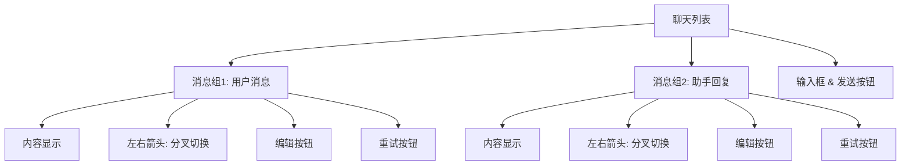

# 聊天页面设计与实现计划

## 1. 核心设计理念

本计划旨在定义 ComfyTavern 内置聊天页面的设计与实现方案，旨在提供一个先进、灵活且易于集成的聊天体验。

*   **原生 Vue 组件**：聊天页将作为一个独立的 Vue 组件，直接集成到前端应用中，而非沙盒模式下的应用面板。这将解决沙盒模式下 Git 跟踪困难、模板复制机制复杂和额外通信设计等问题，提升开发效率和可维护性。
*   **项目可选功能**：聊天页将作为项目的一个可选功能，默认启用。用户可以在项目配置中选择禁用此功能，以实现更纯净、更聚焦的项目体验。
*   **先进的聊天体验**：将采用 [`DesignDocs/architecture/chat-history-branching-design.md`](DesignDocs/architecture/chat-history-branching-design.md:1) 中描述的聊天历史树图编辑与分支管理设计。这将提供非线性对话、上下文精确控制、多分支探索等高级功能，显著提升用户与 AI 交互的深度和效率。同时，也将兼容传统的线性对话模式。
*   **前端主导，后端执行**：前端负责聊天页面的 UI 渲染、用户交互逻辑和工作流的调用与状态监听。后端则提供通用的文件管理服务和高性能的工作流执行引擎，不包含特定的聊天业务逻辑，保持其服务角色的纯粹性。

## 2. 详细实施计划

### 2.1. 前端组件设计与实现

**目标**：创建功能完善、交互流畅的聊天页面 Vue 组件，并集成聊天历史管理和后端通信。

*   **组件位置**：
    *   在 [`apps/frontend-vueflow/src/views`](apps/frontend-vueflow/src/views) 目录下创建一个新的 Vue 视图组件，例如 `ChatView.vue`，作为聊天页面的主入口。
*   **UI 布局与交互**：
    *   **沉浸模式 (Linear Chat View)**：
        *   标准的线性对话界面，基于底层树状结构，仅显示当前“主干”上**已启用**的对话内容。
        *   **消息组设计**：每个聊天消息都作为一个可交互的“消息组”呈现，而非单一消息。
            *   **内容显示**：显示消息的 `role` (用户、助手、系统) 和 `status` (生成中、完成、错误)，并根据状态进行视觉区分。
            *   **分叉切换**：在消息组内部提供左右箭头（或类似控件），允许用户手动切换当前消息的直接子分叉。切换时，仅更新当前活跃叶节点（`activeLeafId`），并刷新线性视图以显示新路径上的启用节点，不自动触发内容生成。
            *   **消息编辑**：提供编辑按钮，允许用户修改消息内容。保存时，如果内容发生变动，系统将自动创建一个新的子节点（作为新分叉）来存储修改后的内容，并将当前主干切换到这个新节点，以保持历史的非破坏性。
            *   **重试按钮**：提供重试按钮。点击后，系统将基于当前消息的上下文（即从根节点到当前消息的启用路径）重新触发后端工作流生成。新生成的内容将作为当前消息的**下一个消息组**的一个新分叉（子节点）添加到树中，并自动切换到该新分叉。
        *   提供文本输入框和发送按钮，用于用户发送消息。
        *   提供切换到“编辑模式”的入口按钮。
    *   **编辑模式 (Tree/Graph Editor View)**：
        *   一个可视化的图状界面，展示完整的对话历史树状图。
        *   用户可以通过拖拽、点击菜单等方式，对节点和分支进行以下操作：
            *   **剪枝 (Prune)**：从一个节点切断其后续所有对话，形成可操作的“分支片段”。
            *   **嫁接 (Graft)**：将一个“分支片段”连接到树中的任意目标节点上。
            *   **启用/禁用 (Enable/Disable)**：切换单个或多个节点的激活状态，决定它们是否被包含在最终上下文中。被禁用的节点应有明确的视觉区分（如半透明、灰色、特殊图标）。
            *   **切换主干 (Switch Trunk)**：在多条并行分支中，选择其中一条作为当前对话的主线。
        *   可以考虑集成 VueFlow 或其他图表库来实现复杂的图状交互和渲染。
        *   提供返回“沉浸模式”的入口按钮。
*   **状态管理 (Pinia Store)**：
    *   创建一个专门的 Pinia Store (例如 `useChatStore`) 来管理聊天历史数据，包括 `ChatHistoryTree` 和 `ChatMessageNode` 的实例。
    *   Store 应包含以下核心状态：
        *   `chatHistoryTree: ChatHistoryTree`：当前会话的完整聊天历史树结构。
        *   `currentMode: 'immersive' | 'edit'`：聊天页面的当前显示模式。
        *   `activeSessionId: string | null`：当前活跃聊天会话的 ID。
        *   `isLoading: boolean`：指示数据是否正在加载。
    *   Store 应提供以下核心 Actions/Getters：
        *   `loadChatSession(sessionId: string)`：加载指定会话的聊天历史。
        *   `sendMessage(content: string, parentId: string | null)`：发送新消息，触发后端工作流。
        *   `updateNodeState(nodeId: string, isEnabled: boolean)`：更新节点启用状态。
        *   `pruneBranch(nodeId: string)`：执行剪枝操作。
        *   `graftBranch(sourceNodeId: string, targetNodeId: string)`：执行嫁接操作。
        *   `switchTrunk(leafNodeId: string)`：切换当前主干。
        *   `getLinearContext(activeLeafId: string)`：根据当前主干和节点启用状态，构建发送给 LLM 的线性上下文。
        *   `getChatNodes: ComputedRef<ChatMessageNode[]>`：获取用于渲染的聊天节点列表（根据当前模式和启用状态过滤）。
*   **后端通信**：
    *   **WebSocket 集成**：
        *   通过 `useWebSocket` Composable 或直接集成 WebSocket 客户端，与后端建立实时通信。
        *   监听后端推送的 WebSocket 事件，例如：
            *   `node.created(node: ChatMessageNode)`：通知一个新的占位符节点已创建，前端应立即渲染“加载中”状态。
            *   `node.content.updated(patch: { id: string; contentChunk: string; })`：发送流式内容片段，前端实时更新对应节点的内容。
            *   `node.completed(node: ChatMessageNode)`：通知节点已完整生成，前端更新节点状态。
            *   `node.state.updated(patch: { id: string; isEnabled: boolean; })`：通知客户端一个节点的状态发生了变化，前端更新 UI。
    *   **HTTP API 调用**：
        *   封装对后端 REST API 的调用，例如：
            *   `GET /api/chat/{sessionId}/tree`：获取完整的聊天历史树结构。
            *   `POST /api/chat/{sessionId}/message`：发送新消息，请求中需包含 `parentId`。
            *   `PUT /api/chat/{sessionId}/tree/edit`：提交一个或多个结构性编辑操作（如剪枝、嫁接）。
            *   `PUT /api/chat/{sessionId}/node/{nodeId}/state`：更新单个节点的状态（`isEnabled`）。
            *   `PUT /api/chat/{sessionId}/active_leaf`：设置当前活动的主干叶节点。
            *   `PUT /api/chat/{sessionId}/nodes/state`：实现批量更新节点状态的接口，优化高频操作。
*   **工作流集成**：
    *   利用 `useWorkflowInvocation()` Composable 调用后端工作流执行引擎。
    *   当用户发送消息或点击重试按钮时，将用户输入作为工作流的 `user_input`，并可能包含 `llm_config` 等参数。
    *   监听 `executionStore` 中与 `executionId` 相关的状态，特别是 `getAccumulatedInterfaceStreamedText(executionId, 'response_stream')`，实时更新聊天界面上的流式输出。

### 2.2. 后端 API 实现

**目标**：实现聊天历史管理和消息发送所需的后端 API 和 WebSocket 处理逻辑。

*   **聊天路由 (`chatRoutes.ts`)**：
    *   在 [`apps/backend/src/routes`](apps/backend/src/routes) 目录下创建 `chatRoutes.ts`。
    *   实现 [`DesignDocs/architecture/chat-history-branching-design.md`](DesignDocs/architecture/chat-history-branching-design.md:190) 中定义的 REST API 端点：
        *   `GET /api/chat/{sessionId}/tree`：获取完整的聊天历史树结构。
        *   `POST /api/chat/{sessionId}/message`：**（异步触发）** 发送新消息，触发工作流执行并创建 `ChatMessageNode`。
        *   `PUT /api/chat/{sessionId}/tree/edit`：处理剪枝、嫁接等结构性编辑操作。
        *   `PUT /api/chat/{sessionId}/node/{nodeId}/state`：更新单个节点的状态（`isEnabled`）。
        *   `PUT /api/chat/{sessionId}/active_leaf`：设置当前活动的主干叶节点。
        *   `PUT /api/chat/{sessionId}/nodes/state`：实现批量更新节点状态的接口，优化高频操作。
*   **WebSocket 处理**：
    *   在 [`apps/backend/src/websocket/handler.ts`](apps/backend/src/websocket/handler.ts:1) 或新建的 WebSocket 模块中，实现聊天相关的 WebSocket 事件处理逻辑。
    *   当工作流执行生成新的聊天消息节点或更新节点内容时，通过 WebSocket 向前端推送 `node.created`、`node.content.updated`、`node.completed` 等事件。
    *   当节点状态（如 `isEnabled`）发生变化时，推送 `node.state.updated` 事件。
*   **数据持久化**：
    *   实现聊天历史 (`ChatHistoryTree`) 的持久化存储。可以考虑：
        *   与现有的 `FileManagerService` 集成，将 `ChatHistoryTree` 存储为项目文件（例如 `user://projects/{projectId}/chats/{sessionId}.json`）。
        *   或者，如果聊天历史数据量较大或需要更复杂的查询，考虑集成到数据库服务中。

### 2.3. 项目配置集成

**目标**：允许用户在项目级别启用或禁用聊天页功能。

*   **项目配置更新**：
    *   在项目配置文件 (`project.json`) 中添加一个布尔字段，例如 `enableChatPage: boolean`，默认值为 `true`。
*   **前端入口控制**：
    *   前端应用在加载项目时，读取 `project.json` 中的 `enableChatPage` 字段。
    *   根据此字段的值，动态显示或隐藏聊天页面的导航入口或路由。

### 2.4. 文档更新

**目标**：确保所有设计和实现细节都有清晰的文档记录。

*   **撰写新的设计文档**：
    *   创建一份名为 `DesignDocs/architecture/chat-page-design-and-implementation-plan.md` 的新文档（即当前文档），详细描述上述前端组件结构、UI/UX 交互、状态管理、后端 API 集成、项目配置等所有设计和实现细节。
*   **更新更新日志**：
    *   在 [`DesignDocs/Updatelog.md`](DesignDocs/Updatelog.md:1) 中记录聊天页面的开发进度，包括设计完成、前端组件开始开发、后端 API 实现等关键里程碑。

## 3. 研讨与分析

*   **与现有历史记录组件的整合**：聊天页的“历史记录层”将直接使用 [`DesignDocs/architecture/chat-history-branching-design.md`](DesignDocs/architecture/chat-history-branching-design.md:1) 中定义的 `ChatHistoryTree` 和 `ChatMessageNode`。这与现有的工作流历史记录 (`HistoryEntry`) 是两个不同的概念，需要明确区分和管理。
*   **UI/UX 挑战**：图状历史记录的 UI/UX 复杂性较高，需要仔细设计，确保用户能够直观地理解和操作。可以借鉴 Git 历史图、思维导图或 ComfyUI 的节点编辑器等现有工具的交互模式。
*   **性能考量**：当聊天历史节点数量庞大时，前端渲染和后端查询的性能需要优化。前端可以考虑虚拟滚动、按需渲染等技术；后端需要高效的查询和持久化机制。
*   **可扩展性**：设计应考虑未来可能的功能扩展，例如多模态聊天（图片、语音）、Agent 协作对话、对话摘要生成等。

## 4. UI 布局与交互流程图

### 4.1. 沉浸模式 UI 布局图



### 4.2. 交互流程图 (分叉切换、编辑和重试)

```mermaid
sequenceDiagram
participant User
participant UI as 沉浸模式UI
participant Store as ChatStore
participant Backend as 后端API
User->>UI: 点击箭头切换分叉
UI->>Store: 更新activeLeafId
Store->>UI: 刷新线性视图
User->>UI: 编辑消息 & 保存
UI->>Store: 检查变动
alt 有变动
Store->>Backend: POST /api/chat/{sessionId}/message (创建新节点)
Backend->>Store: 返回新节点ID
Store->>Store: 更新树结构 & activeLeafId
end
Store->>UI: 更新视图
User->>UI: 点击重试按钮
UI->>Store: 获取当前消息上下文
Store->>Backend: POST /api/chat/{sessionId}/message (触发工作流，parentId为当前消息ID)
Backend->>Store: 返回新生成节点ID (status: generating)
Store->>UI: 渲染新消息组 (加载中)
Backend-->>Store: WebSocket: node.content.updated (流式更新)
Store->>UI: 实时更新消息内容
Backend-->>Store: WebSocket: node.completed (生成完成)
Store->>Store: 更新节点状态 & activeLeafId
Store->>UI: 更新视图 (显示新分叉)