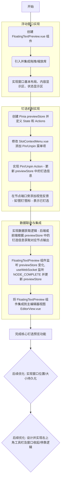

# 浮动文本预览窗口计划 (Floating Text Preview Plan)

## 1. 目标

实现一个灵活、非侵入式的节点预览和编辑器功能。用户可以明确地“钉选”某个节点的特定输出端口，并在一个可自由拖拽、调整大小的浮动窗口中持续观察该端口输出的文本内容。这种方式避免了预览内容随节点选择而频繁变化的问题，提供了更稳定、可控的预览体验。

## 2. 核心设计：钉选预览 + 浮动窗口

*   **钉选预览 (Pin Preview):** 用户通过交互（如右键菜单）指定要预览的节点输出端口。
*   **浮动窗口 (Floating Window):** 一个独立的、可拖拽、可调整大小的窗口，始终显示当前钉选端口的文本内容。

## 3. 技术选型与组件

*   **浮动窗口组件 (`FloatingTextPreview.vue`):**
    *   使用 Vue 3 构建。
    *   **拖拽/缩放:** 优先引入第三方库，例如 `vue-draggable-resizable` 或类似库，以加速开发。
    *   **内容显示:** 能够渲染纯文本，未来可扩展支持 Markdown 或代码高亮。
    *   **状态显示:** 清晰展示当前钉选的节点名称和端口信息。
    *   **交互:** 包含关闭按钮。
*   **状态管理 (`Pinia previewStore`):**
    *   使用 Pinia 创建一个专门的 Store (`previewStore`)。
    *   存储状态：
        *   `pinnedNodeId: string | null`
        *   `pinnedOutputKey: string | number | null` (端口的唯一标识符)
        *   `lastOutputValue: any | null` // 存储最后接收到的输出值
        *   `lastOutputType: 'full' | 'preview' | null` // 存储最后接收到的输出类型
        *   `isPreviewWindowVisible: boolean`
        *   `windowPosition: { x: number, y: number }` (可选，用于持久化位置)
        *   `windowSize: { width: number, height: number }` (可选，用于持久化大小)
*   **交互入口 (`SlotContextMenu.vue`):**
    *   修改节点输出端口的右键上下文菜单。
    *   添加 "钉选到预览 (Pin to Preview)" 选项。
    *   如果某端口已被钉选，则显示 "取消钉选 (Unpin from Preview)" 选项。

## 4. 实现步骤与流程

## 5. 关键逻辑点

*   **唯一钉选:** 同一时间只允许钉选一个输出端口。钉选新的端口会自动取消之前的钉选。
*   **数据更新:** 前端 `useWebSocket` 需监听统一的 `NODE_COMPLETE` 消息。当收到消息且 `nodeId` 与 `previewStore.pinnedNodeId` 匹配时，从消息的 `output` 字段提取对应 `pinnedOutputKey` 的值，并连同消息中的 `executionType` 一起更新到 `previewStore` 的 `lastOutputValue` 和 `lastOutputType`。`FloatingTextPreview` 组件监听 `previewStore` 的变化来刷新显示。
*   **区分显示 (可选):** `FloatingTextPreview` 组件可以根据 `previewStore.lastOutputType` 的值（`'full'` 或 `'preview'`）来选择性地应用不同的样式（如颜色、斜体）或添加标签，以区分显示的数值是来自完整执行还是实时预览。
*   **节点/端口删除:** 如果被钉选的节点或端口被删除，需要自动取消钉选并清空预览窗口内容。
*   **窗口可见性:** `previewStore` 需要管理窗口的可见状态，关闭按钮仅隐藏窗口，再次钉选或通过其他入口（如未来可能的工具栏按钮）可重新显示。

## 6. 后续扩展

*   **多窗口预览:** 未来可考虑支持同时钉选多个端口，打开多个预览窗口。
*   **富文本/Markdown/代码高亮:** 增强预览窗口的内容渲染能力。
*   **右上角可收起工具栏:** 实现一个统一的、可收起的工具栏（类似 Blender 视口上方工具区），用于管理预览窗口（显示/隐藏）、停靠收起的预览窗口入口，并为未来其他全局工具提供扩展空间。
*   **窗口状态持久化:** 保存窗口的位置和大小。