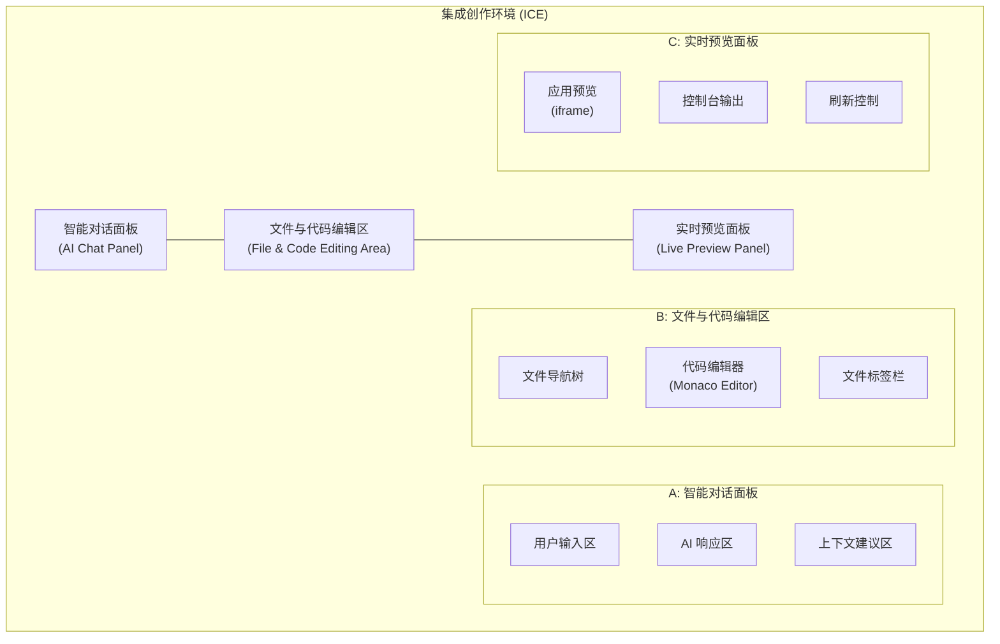
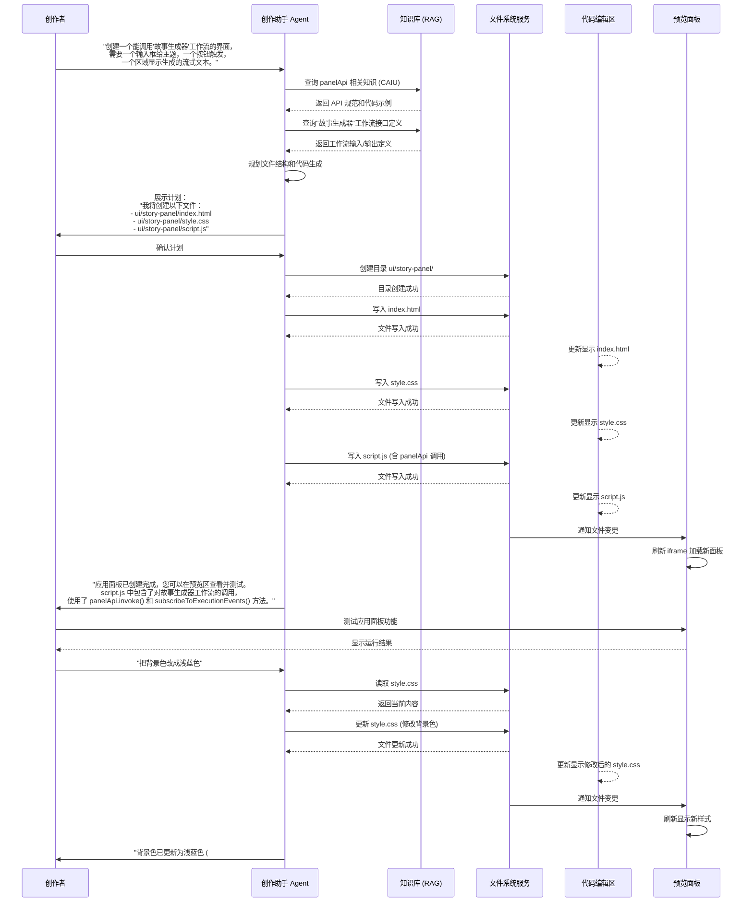
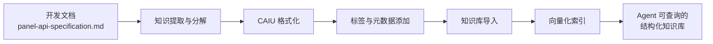
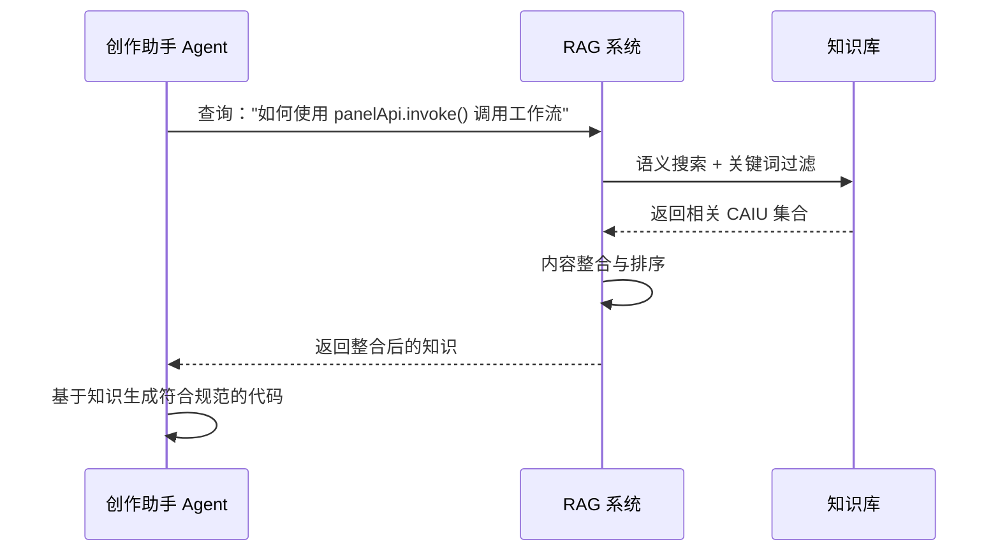

# 集成创作环境 (Integrated Creation Environment, ICE) 设计草案（BETA）

## 1. 愿景与核心目标

### 1.1 核心愿景

构建一个**集成创作环境 (Integrated Creation Environment, ICE)**，将自然语言指令、代码编辑和实时预览无缝融合，实现从创意构想到可用 AI 应用（工作流 + UI 面板）的一站式开发体验。这一环境不仅面向专业开发者，更致力于赋能那些缺乏编程背景的创作者，使他们能够通过自然语言对话轻松构建复杂的 AI 应用。

### 1.2 核心目标

- **降低创作门槛**：通过 AI 辅助，使非技术背景的创作者也能构建功能完整的应用面板。
- **提升开发效率**：将传统的"编写-保存-预览"循环缩短为近乎实时的创作体验。
- **统一开发流程**：打通工作流编排与前端界面开发的壁垒，实现从后端逻辑到前端交互的一体化开发。
- **确保技术一致性**：由 AI 生成的代码自动遵循项目的最佳实践和 API 规范，减少人为错误。
- **促进迭代优化**：通过即时预览和反馈，鼓励快速迭代和持续改进。

### 1.3 交互范式：对话驱动开发 (Chat-Driven Development)

我们提出"**对话驱动开发 (Chat-Driven Development)**"作为这一环境的核心交互范式。在这一范式下：

- 创作者通过自然语言表达需求和修改意图。
- AI 助手（创作助手 Agent）理解意图，生成或修改代码。
- 创作者通过实时预览立即看到结果，并可继续通过对话进行迭代。

这一范式借鉴了谷歌 AI Studio 等先进产品的成功经验，但更进一步地将其与 ComfyTavern 的工作流编排能力深度整合，创造出独特的全栈 AI 应用开发体验。

## 2. 架构与界面布局

### 2.1 三栏式布局

集成创作环境采用直观高效的三栏式布局，每个栏目各司其职又紧密协作：

#### A. 智能对话面板 (AI Chat Panel)

- **功能定位**：创作者与"创作助手 Agent"交互的主界面。
- **核心特性**：
  - 支持自然语言指令输入，如"创建一个聊天机器人界面"或"给工作流添加文件上传功能"。
  - 展示 Agent 的响应，包括计划说明、代码解释和操作确认。
  - 提供上下文感知的指令建议，帮助用户更有效地表达需求。
- **交互流程**：用户输入需求 → Agent 理解并规划 → 用户确认 → Agent 执行并反馈。

#### B. 文件与代码编辑区 (File & Code Editing Area)

- **功能定位**：查看和编辑项目文件的专业环境。
- **核心组件**：
  - **文件导航树**：展示项目结构，包括 `workflows/`、`ui/` 等关键目录。
  - **Monaco Editor**：提供语法高亮、自动完成、错误检查等专业编辑功能。
  - **多标签支持**：允许同时打开多个文件进行对比和编辑。
- **编辑模式**：
  - **AI 辅助模式**：文件内容随 Agent 操作自动更新，用户可查看但不直接编辑。
  - **手动编辑模式**：允许用户直接修改代码，适合精细调整或高级用户。

#### C. 实时预览面板 (Live Preview Panel)

- **功能定位**：即时展示当前编辑中的应用面板效果。
- **技术实现**：
  - 使用沙盒化的 `<iframe>` 加载并渲染 `ui/{panel_name}/index.html`。
  - 配置适当的 `sandbox` 属性，确保安全性的同时允许必要的功能。
- **刷新机制**：
  - 文件保存时自动刷新。
  - 提供手动刷新按钮，应对特殊情况。
- **交互能力**：
  - 允许用户在预览中直接与应用面板交互，测试功能。
  - 捕获并显示控制台日志和错误信息，辅助调试。

### 2.2 布局适应性

- **响应式设计**：各栏宽度可调整，适应不同屏幕尺寸和工作偏好。
- **面板折叠**：支持临时折叠/展开各栏，专注于特定任务。
- **布局预设**：提供针对不同工作流程优化的布局预设，如"编码专注模式"、"预览强调模式"等。

### 2.3 界面示意图



## 3. 核心工作流程：从需求到应用

### 3.1 端到端创建流程示例

以下是一个典型的端到端应用创建流程，展示了从用户需求表达到功能完整的应用面板生成的全过程：



### 3.2 关键交互点分析

在上述流程中，有几个关键的交互点值得特别关注：

#### 3.2.1 意图识别与知识检索

Agent 需要准确理解用户的意图是创建一个 UI 面板，并且这个面板需要与后端工作流交互。随后，它通过 RAG 系统从知识库中检索两类关键信息：
- `panelApi` 的使用方法，特别是 `invoke()` 和 `subscribeToExecutionEvents()` 的 API 规范。
- "故事生成器"工作流的接口定义，包括输入参数和输出格式。

这些信息是生成符合规范、能正确工作的代码的基础。

#### 3.2.2 文件系统操作与编辑器同步

Agent 通过文件系统服务创建必要的目录和文件。每次文件操作完成后，编辑器会自动更新显示最新内容，让用户能够实时了解 Agent 的操作结果。这种透明的工作方式增强了用户对 AI 行为的信任和理解。

#### 3.2.3 预览刷新与即时反馈

文件变更会触发预览面板的自动刷新，使用户能够立即看到修改的效果。这种即时反馈机制大大缩短了开发迭代周期，让创作过程更加流畅高效。

### 3.3 迭代优化流程

初始版本创建完成后，用户可以通过继续与 Agent 对话来迭代优化应用面板。这些迭代可以是：

- **功能性改进**：如"添加一个清除按钮"、"增加历史记录功能"等。
- **视觉调整**：如"改变按钮颜色"、"调整布局间距"等。
- **行为优化**：如"添加输入验证"、"优化加载状态显示"等。

每次迭代都遵循相似的流程：用户表达需求 → Agent 理解并规划 → 执行修改 → 即时预览 → 用户反馈，形成一个高效的开发闭环。

## 4. 创作助手 Agent：能力与知识来源

### 4.1 扩展能力

创作助手 Agent 是集成创作环境的核心智能组件，它基于 ComfyTavern Agent v3 架构 ([`../agent_architecture_v3_consolidated.md`](../agent_architecture_v3_consolidated.md:1))，但针对创作环境的特殊需求进行了能力扩展：

#### 4.1.1 意图识别与任务分类

Agent 能够精准识别并分类用户指令的意图类型：

- **工作流修改指令**：如"添加一个文本处理节点"、"连接节点 A 和节点 B"。
- **UI 开发指令**：如"创建一个聊天界面"、"添加文件上传功能"。
- **混合指令**：如"创建一个调用图像生成工作流的界面"。
- **文件管理指令**：如"创建一个新项目"、"导出当前面板"。

对于不同类型的指令，Agent 会激活相应的专业能力模块，确保生成最适合的响应和代码。

#### 4.1.2 全栈代码生成

Agent 具备生成多种类型代码的能力：

- **工作流 JSON Patch**：遵循 [`agent-assistant-plan.md`](agent-assistant-plan.md:1) 中定义的格式，用于修改工作流结构。
- **前端代码**：
  - **HTML**：符合语义化标准，具有良好的可访问性。
  - **CSS**：遵循项目样式规范，支持响应式设计。
  - **JavaScript**：正确使用 `panelApi` 与后端交互，处理异步操作和状态管理。

这些代码不仅功能正确，还会遵循项目的编码规范和最佳实践。

#### 4.1.3 文件系统工具调用

Agent 能够安全地调用后端文件系统服务，执行以下操作：

- **目录操作**：创建、列出、删除目录。
- **文件操作**：创建、读取、更新、删除文件。
- **项目配置**：更新 `project.json` 以注册新的应用面板。

所有操作都受到严格的权限控制，确保只能在指定的项目空间内执行，保障系统安全。

### 4.2 知识来源与管理

#### 4.2.1 知识库集成

创作助手 Agent 的决策和代码生成能力，很大程度上依赖于其对 ComfyTavern 系统组件（特别是 `panelApi`）的深入理解。这些知识通过结构化的知识库提供：

- **核心原则**：Agent 在运行时**绝不**直接读取 `DesignDocs/` 目录下的开发文档。其所有决策依据均来自一个**经过策划和版本管理的结构化知识库**。

- **知识条目类型**：知识库中与创作环境相关的 CAIU (Curated Atomic Info Units) 主要包括：
  - **API 规范**：`panelApi` 的方法签名、参数说明和返回值类型。
  - **代码示例**：常见场景的示例代码片段，如调用工作流、处理流式响应等。
  - **最佳实践**：编码规范、性能优化建议、安全注意事项等。
  - **错误处理模式**：常见错误的识别和处理方法。

#### 4.2.2 知识摄入流程

将开发文档（如 [`panel-api-specification.md`](面板与接口/panel-api-specification.md:1)）转化为 Agent 可用的结构化知识，需要经过以下流程：



1. **知识提取与分解**：将文档中的 API 定义、代码示例等核心内容提取出来，并分解为逻辑完整的知识单元。
2. **CAIU 格式化**：按照 [`knowledgebase-architecture.md`](knowledgebase-architecture.md:1) 中定义的 CAIU 结构，将知识单元转换为标准格式。
3. **标签与元数据添加**：为每个 CAIU 添加适当的标签（如 `api_spec`, `panel_api`, `code_example`）和元数据，便于检索。
4. **知识库导入**：将 CAIU 导入到项目的知识库中。
5. **向量化索引**：对知识内容进行向量化，建立语义索引，支持高效的相似度检索。

#### 4.2.3 运行时 RAG 查询

当 Agent 需要生成面板代码时，它会向知识库发起针对性查询：



这种基于 RAG 的知识获取机制确保了 Agent 生成的代码始终遵循最新、最准确的 API 规范，同时也使知识库的更新能够即时反映到 Agent 的行为中，无需重新训练模型。

## 5. 技术实现细节

### 5.1 后端文件服务

为支持 Agent 对项目文件的操作，需要设计一套安全的后端文件服务：

#### 5.1.1 API 端点设计

```typescript
// 文件服务 API 端点示例
interface FileSystemService {
  // 目录操作
  listDirectory(path: string): Promise<FileEntry[]>;
  createDirectory(path: string): Promise<void>;
  removeDirectory(path: string, options?: { recursive?: boolean }): Promise<void>;
  
  // 文件操作
  readFile(path: string, encoding?: string): Promise<string | ArrayBuffer>;
  writeFile(path: string, content: string | ArrayBuffer): Promise<void>;
  updateFile(path: string, content: string | ArrayBuffer): Promise<void>;
  deleteFile(path: string): Promise<void>;
  
  // 项目配置
  updateProjectConfig(updates: Partial<ProjectConfig>): Promise<void>;
}

interface FileEntry {
  name: string;
  path: string;
  type: 'file' | 'directory';
  size?: number;
  lastModified?: number;
}
```

#### 5.1.2 安全机制

- **路径验证**：所有路径操作都必须限制在项目目录内，防止目录遍历攻击。
- **权限控制**：基于用户角色和项目所有权进行操作授权。
- **内容验证**：对写入的文件内容进行安全检查，防止恶意代码注入。
- **操作日志**：记录所有文件操作，便于审计和问题排查。

### 5.2 `iframe` 沙箱与通信

应用面板在预览面板中通过 `iframe` 加载，需要精心设计沙箱配置和通信机制：

#### 5.2.1 沙箱配置

```html
<!-- 预览面板中的 iframe 配置示例 -->
<iframe
  src="ui/my-panel/index.html"
  sandbox="allow-scripts allow-forms allow-same-origin"
  allow="clipboard-read; clipboard-write"
  referrerpolicy="no-referrer"
></iframe>
```

这一配置允许面板执行脚本和处理表单，但限制了其他可能的危险操作。

#### 5.2.2 通信协议

宿主环境与 `iframe` 之间的通信基于 `window.postMessage` API，遵循以下协议：

```typescript
// 消息格式定义
interface PanelMessage {
  type: string;        // 消息类型
  id: string;          // 消息唯一ID，用于关联请求和响应
  payload: any;        // 消息内容
  timestamp: number;   // 时间戳
}

// 消息类型示例
type MessageType = 
  | 'API_REQUEST'      // 面板调用 panelApi 方法
  | 'API_RESPONSE'     // 宿主环境返回 API 调用结果
  | 'EVENT_NOTIFY'     // 宿主环境通知面板事件（如工作流执行状态变更）
  | 'LOG_MESSAGE'      // 面板发送日志信息到宿主环境
  | 'ERROR_REPORT';    // 面板报告错误到宿主环境
```

所有通信都必须严格验证消息来源，确保安全性：

```javascript
// 宿主环境接收消息示例
window.addEventListener('message', (event) => {
  // 验证消息来源
  if (event.origin !== expectedOrigin) {
    console.error('Rejected message from unauthorized origin:', event.origin);
    return;
  }
  
  // 处理消息
  const message = event.data as PanelMessage;
  handlePanelMessage(message);
});
```

### 5.3 实时同步机制

为实现文件变更、预览刷新等实时同步功能，系统采用 WebSocket 作为核心通信通道：

#### 5.3.1 WebSocket 消息类型

```typescript
// WebSocket 消息类型定义
interface WebSocketMessage {
  type: WebSocketMessageType;
  payload: any;
}

type WebSocketMessageType = 
  | 'FILE_CREATED'        // 文件创建通知
  | 'FILE_UPDATED'        // 文件更新通知
  | 'FILE_DELETED'        // 文件删除通知
  | 'DIRECTORY_CHANGED'   // 目录结构变更通知
  | 'PREVIEW_REFRESH'     // 预览刷新请求
  | 'EDITOR_FOCUS'        // 编辑器焦点变更
  | 'EXECUTION_STATUS';   // 工作流执行状态更新
```

#### 5.3.2 前端响应逻辑

```javascript
// 前端 WebSocket 处理示例
webSocket.addEventListener('message', (event) => {
  const message = JSON.parse(event.data);
  
  switch (message.type) {
    case 'FILE_UPDATED':
      // 更新编辑器显示
      updateEditorContent(message.payload.path, message.payload.content);
      // 如果是当前预览的文件，刷新预览
      if (isCurrentlyPreviewed(message.payload.path)) {
        refreshPreview();
      }
      break;
      
    case 'PREVIEW_REFRESH':
      refreshPreview();
      break;
      
    // 处理其他消息类型...
  }
});
```

这种基于 WebSocket 的实时通信机制，确保了集成创作环境中各组件的状态同步，为用户提供流畅一致的创作体验。

## 6. 结论与后续步骤

### 6.1 核心价值总结

集成创作环境 (ICE) 通过将自然语言指令、代码编辑和实时预览融为一体，彻底改变了 AI 应用的开发方式。它不仅大幅降低了创作门槛，还提升了开发效率，使 ComfyTavern 平台能够服务更广泛的创作者群体，从专业开发者到无代码背景的领域专家。

### 6.2 后续开发步骤

1. **原型验证**：构建最小可行产品 (MVP)，验证三栏式布局和基本交互流程。
2. **知识库建设**：将 `panelApi` 规范转化为结构化的 CAIU，建立初始知识库。
3. **Agent 能力开发**：基于 Agent v3 架构，实现创作助手的核心能力。
4. **文件服务 API**：开发安全的后端文件操作服务。
5. **预览沙箱**：实现安全的 `iframe` 沙箱和通信机制。
6. **实时同步**：完善基于 WebSocket 的实时状态同步。
7. **用户测试**：邀请不同技能水平的用户进行测试，收集反馈。
8. **迭代优化**：基于用户反馈持续改进体验和功能。

### 6.3 潜在挑战与解决思路

- **安全性平衡**：在提供足够功能的同时确保系统安全，可通过精细的权限控制和代码审查机制解决。
- **知识更新机制**：确保 Agent 使用的知识库与最新 API 规范保持同步，可建立自动化的知识提取和更新流程。
- **代码质量保证**：AI 生成的代码可能存在质量问题，可通过静态分析工具和运行时验证来提高质量。
- **用户体验一致性**：确保不同技能水平的用户都能获得良好体验，需要精心设计渐进式的界面和功能引导。

通过解决这些挑战，集成创作环境将成为 ComfyTavern 平台的核心差异化优势，真正实现"让每个人都能创造 AI 应用"的愿景。