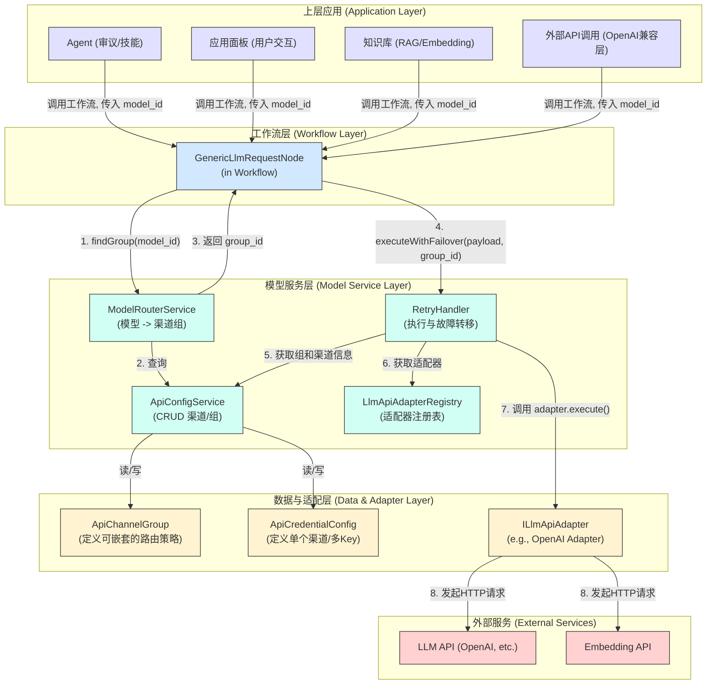

# LLM 适配器与模型服务实施方案 (V5 - 应用感知版)

## 1. 核心目标

本实施方案旨在落地 **LLM 适配器与模型管理系统 V2 架构**，并遵循 **V5 应用感知版**的实施策略。核心目标是构建一个**高可用、可路由、支持多样化模型**的 LLM 服务层，以支撑 Agent 的稳定运行、知识库的功能实现以及提供无缝的用户体验。

我们将分三个核心步骤，循序渐进地完成这个目标。

## 2. 架构图 (V5)



## 3. 实施步骤

### 第一步：数据与服务层升级 (为高可用性奠基)

**目标**: 建立故障转移和负载均衡的数据模型，直接满足 Agent 等上层应用对稳定性的核心需求。

1.  **更新数据库 Schema**:
    *   **文件**: [`apps/backend/src/db/schema.ts`](apps/backend/src/db/schema.ts:1)
    *   **操作**:
        *   **重构 `apiChannelGroups` 表以支持嵌套和高级路由**:
            ```typescript
            // 定义组成员的类型，这将存储为 JSON
            export type ChannelGroupMember = {
              id: string; // 成员的 UUID (可以是渠道 ID 或子组 ID)
              type: 'channel' | 'group'; // 成员类型
              priority: number; // 优先级，数字越大越高。用于故障转移。
              weight: number; // 权重，用于在同一优先级内进行负载均衡。
            };

            export const apiChannelGroups = sqliteTable('api_channel_groups', {
              id: text('id').primaryKey(), // UUID
              userId: text('user_id').notNull().references(() => users.uid, { onDelete: 'cascade' }),
              groupName: text('group_name').notNull(),
              description: text('description'),
              // 新的核心字段：存储一个包含路由规则的成员列表
              members: text('members', { mode: 'json' }).$type<ChannelGroupMember[]>().notNull().default('[]'),
              isImplicit: integer('is_implicit', { mode: 'boolean' }).default(false),
              createdAt: text('created_at').notNull(),
              updatedAt: text('updated_at').notNull(),
            });
            ```
        *   **修改 `apiChannels` 表**:
            *   将 `apiKey` 字段的类型从 `text('api_key').notNull()` 修改为 `text('api_key', { mode: 'json' }).notNull()`，以支持存储 `string | string[]`。
            *   添加 `keySelectionStrategy` 字段: `text('key_selection_strategy', { enum: ['round-robin', 'random'] }).default('round-robin')`。

2.  **更新共享类型**:
    *   **文件**: [`packages/types/src/schemas.ts`](packages/types/src/schemas.ts:1)
    *   **操作**:
        *   重构 `ApiChannelGroupSchema` Zod schema，以匹配新的、包含 `members` 数组的数据库表结构。
        *   修改 `ApiCredentialConfigSchema`，将 `apiKey` 字段的类型从 `z.string()` 修改为 `z.union([z.string(), z.array(z.string())])`，并添加 `keySelectionStrategy` 字段。

3.  **更新 `ApiConfigService`**:
    *   **文件**: [`apps/backend/src/services/ApiConfigService.ts`](apps/backend/src/services/ApiConfigService.ts:1)
    *   **操作**:
        *   增加对 `ApiChannelGroup` 的完整 CRUD 方法 (`getGroup`, `getAllGroups`, `saveGroup`, `deleteGroup`)。
        *   修改 `saveCredentials` 方法：
            *   当检测到传入的 `apiKey` 是一个数组时，除了保存 `ApiCredentialConfig` 本身，还要自动为其创建一个关联的、隐藏的（`isImplicit: true`）渠道组。这个组只包含这一个渠道，用于简化单渠道多 Key 的故障转移配置。

4.  **数据库迁移**:
    *   运行 `bun drizzle:generate` 创建迁移文件，并确认其正确性。

### 第二步：重构 `RetryHandler` 为 `StrategyExecutor` (打造“策略执行引擎”)

**目标**: 实现能够递归解析和执行分层路由策略的核心逻辑。

1.  **重命名并重构服务**:
    *   **文件**: `apps/backend/src/services/StrategyExecutor.ts` (原 `RetryHandler.ts`)
    *   **操作**:
        *   将 `RetryHandler` 类重命名为 `StrategyExecutor`，以更准确地反映其职责。
        *   它仍然依赖 `ApiConfigService` 和 `LlmApiAdapterRegistry`。

2.  **实现 `executeWithStrategy` 核心方法**:
    *   **方法签名**: `async executeWithStrategy(payload: LlmAdapterRequestPayload, topLevelGroupId: string): Promise<StandardResponse>`
    *   **核心逻辑 (递归)**:
        1.  创建一个内部的、可递归调用的辅助方法，如 `_executeRecursive(groupId: string)`。
        2.  **在 `_executeRecursive` 中**:
            a.  使用 `ApiConfigService` 获取当前 `groupId` 的渠道组定义及其 `members` 列表。
            b.  按 `priority` 对 `members` 进行降序分组。
            c.  **遍历优先级**: 从最高优先级开始，迭代每个优先级分组。
            d.  **在同一优先级内**:
                i.  根据 `weight` 计算总权重，并按权重随机选择一个 `member`。
                ii. **检查 `member.type`**:
                    -   **如果是 `'channel'`**:
                        - 调用一个辅助方法 `_tryExecuteChannel(channelId)`。此方法负责处理单个渠道的执行，包括多 Key 的选择和轮询。
                        - 如果 `_tryExecuteChannel` 成功，则立即向上返回成功的 `StandardResponse`，终止整个执行。
                        - 如果失败，则记录失败，并继续在当前优先级内选择下一个成员（或根据重试策略决定）。
                    -   **如果是 `'group'`**:
                        - **递归调用** `_executeRecursive(member.id)`，进入子组执行。
                        - 如果递归调用成功，则立即向上返回成功的 `StandardResponse`。
                        - 如果失败，则继续处理当前优先级的其他成员。
            e.  如果当前优先级的所有成员都尝试失败，则继续下一个较低的优先级。
        3.  如果所有优先级都已尝试完毕仍未成功，则返回最后一个遇到的可重试错误。

### 第三步：逻辑重构与解耦 (连接新组件)

**目标**: 使模型路由逻辑集中化、可复用、可扩展，满足所有上层应用对模型服务的灵活路由需求。

1.  **创建 `ModelRouterService`**:
    *   **文件**: `apps/backend/src/services/ModelRouterService.ts` (新文件)
    *   **操作**:
        *   创建一个新的 `ModelRouterService` 类。
        *   实现核心方法 `async findGroupForModel(modelId: string): Promise<string>`。
        *   **初始逻辑**:
            *   可以先实现一个简单的、基于硬编码或配置文件（未来可以是数据库）的映射，从 `modelId` 找到对应的 `channel_group_id`。
            *   如果找不到特定映射，则返回一个全局默认的渠道组 ID。

2.  **重构 `GenericLlmRequestNode`**:
    *   **文件**: [`apps/backend/src/nodes/llm/GenericLlmRequestNode.ts`](apps/backend/src/nodes/llm/GenericLlmRequestNode.ts:1)
    *   **操作**:
        *   **移除**节点内部所有关于查找渠道、调用适配器的逻辑。
        *   **简化输入**: 核心输入简化为 `model_id`、`messages`、`parameters`。
        *   **更新 `execute` 方法**:
            1.  从 `context` 中获取 `ModelRouterService` 和 `StrategyExecutor` (新的名称)。
            2.  调用 `modelRouterService.findGroupForModel(model_id)` 获取顶层的 `channelGroupId`。
            3.  构建 `payload` 对象。
            4.  调用 `strategyExecutor.executeWithStrategy(payload, channelGroupId)`。
            5.  将返回的 `StandardResponse` 作为节点输出。

## 4. 验证与测试

在完成以上步骤后，需要进行以下验证：
1.  **单元测试**: 为 `ApiConfigService`, `RetryHandler`, `ModelRouterService` 编写单元测试。
2.  **集成测试**:
    *   创建一个包含 `GenericLlmRequestNode` 的工作流。
    *   在 UI 中配置一个多 Key 的渠道，并创建一个包含此渠道的渠道组。
    *   配置路由规则，使特定模型指向该渠道组。
    *   运行工作流，验证其是否能成功调用。
    *   手动模拟 API Key 失效或 API 服务返回可重试错误，验证 `RetryHandler` 是否能成功故障转移到下一个 Key 或渠道。