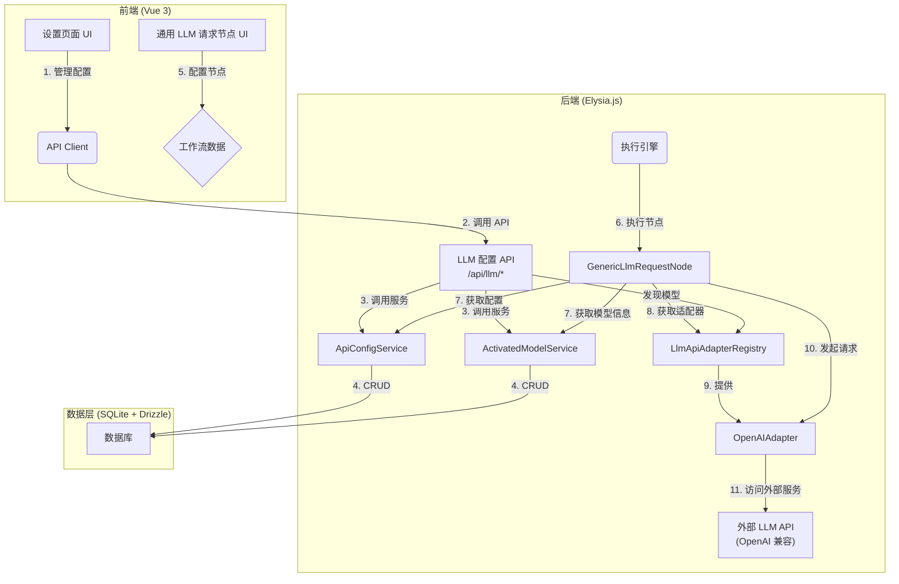

# LLM API 适配器实施方案 (MVP)

## 1. 核心目标

实现一个最小可行的 LLM 调用系统。用户能够：
1.  在设置中配置第三方 LLM 服务的 API 渠道（凭证和端点）。
2.  在设置中手动添加和管理希望在工作流中使用的模型。
3.  在工作流中使用一个新的 `通用 LLM 请求` 节点，选择已配置的模型和渠道，发起调用并获得标准化的输出。

## 2. 架构图 (MVP)

下图展示了 MVP 阶段核心组件的交互关系：



## 3. 实施步骤

#### 第 1 步：数据结构与数据库 Schema 定义

这是所有后续工作的基础。我们需要统一并最终确定核心数据结构和数据库表。

1.  **更新共享类型**:
    *   **文件**: [`packages/types/src/schemas.ts`](packages/types/src/schemas.ts:1)
    *   **操作**:
        *   正式定义 `ApiCredentialConfig` 接口，融合 `llm-adapter-architecture-plan.md` 和 `local-user-system-design.md` 的字段。
        *   正式定义 `ActivatedModelInfo` 接口。
        *   定义 `StandardResponse` 和 `CustomMessage` 接口。

2.  **定义数据库 Schema**:
    *   **文件**: [`apps/backend/src/db/schema.ts`](apps/backend/src/db/schema.ts:1)
    *   **操作**: 使用 Drizzle ORM 定义以下核心表。

    **`apiChannels` 表** (用于存储 `ApiCredentialConfig`)
    ```typescript
    // apps/backend/src/db/schema.ts
    import { sqliteTable, text, integer } from 'drizzle-orm/sqlite-core';
    import { users } from './schema'; // 确保引入 users 表

    export const apiChannels = sqliteTable('api_channels', {
      id: text('id').primaryKey(), // UUID
      userId: text('user_id').notNull().references(() => users.uid, { onDelete: 'cascade' }),
      refName: text('ref_name').notNull(), // 用户定义的引用名称
      label: text('label'), // UI 显示的标签
      providerId: text('provider_id'), // e.g., "openai", "anthropic"
      adapterType: text('adapter_type'), // e.g., "openai", "ollama"
      baseUrl: text('base_url').notNull(),
      apiKey: text('api_key').notNull(), // MVP 阶段为单个 key, 存储加密后的值或明文
      storageMode: text('storage_mode', { enum: ['plaintext', 'encrypted'] }).notNull().default('plaintext'),
      // MVP 阶段以下字段可为空
      customHeaders: text('custom_headers', { mode: 'json' }), // JSON
      modelListEndpoint: text('model_list_endpoint'),
      disabled: integer('disabled', { mode: 'boolean' }).default(false),
      createdAt: text('created_at').notNull(),
    });
    ```

    **`activatedModels` 表** (用于存储 `ActivatedModelInfo`)
    ```typescript
    // apps/backend/src/db/schema.ts
    export const activatedModels = sqliteTable('activated_models', {
      modelId: text('model_id').primaryKey(), // e.g., "gpt-4o"
      userId: text('user_id').notNull().references(() => users.uid, { onDelete: 'cascade' }),
      displayName: text('display_name').notNull(),
      capabilities: text('capabilities', { mode: 'json' }).notNull(), // string[]
      modelType: text('model_type', { enum: ['llm', 'embedding', 'unknown'] }).default('unknown'),
      // MVP 阶段以下字段可为空
      groupName: text('group_name'),
      icon: text('icon'),
      defaultChannelRef: text('default_channel_ref'), // 关联到 apiChannels.refName
      tags: text('tags', { mode: 'json' }), // string[]
      tokenizerId: text('tokenizer_id'),
    });
    ```

3.  **创建数据库迁移**:
    *   **操作**: 在 `drizzle.config.ts` 中配置好，然后运行 `bun drizzle:generate` 来创建新的数据库迁移文件。

#### 第 2 步：后端服务层实现

1.  **`ApiConfigService`**:
    *   **路径**: `apps/backend/src/services/ApiConfigService.ts`
    *   **职责**: 实现对 `apiChannels` 表的 CRUD 操作。所有方法都必须接收 `userId` 作为参数，以确保数据归属正确。它将依赖 `DatabaseService` 和（未来阶段的）`CryptoService`。

2.  **`ActivatedModelService` (新)**:
    *   **路径**: `apps/backend/src/services/ActivatedModelService.ts`
    *   **职责**:
        *   专门负责对 `activatedModels` 表的 CRUD 操作。
        *   所有方法都必须接收 `userId` 作为参数，以确保数据归属正确。
        *   **不包含**任何模型发现的业务逻辑。

3.  **`LlmApiAdapterRegistry`**:
    *   **路径**: `apps/backend/src/services/LlmApiAdapterRegistry.ts`
    *   **职责**: 一个简单的服务，用于在内存中注册和获取适配器实例。MVP 阶段，它将只注册一个 `OpenAIAdapter` 的单例。

#### 第 3 步：`OpenAIAdapter` 实现

1.  **创建接口和实现**:
    *   **接口**: `apps/backend/src/adapters/ILlmApiAdapter.ts`，定义 `request` 和 `listModels` 方法。
    *   **实现**: `apps/backend/src/adapters/OpenAIAdapter.ts`
2.  **核心逻辑**:
    *   实现 `request` 方法，逻辑不变。
    *   新增实现 `listModels(credentials)` 方法，该方法将：
        *   使用提供的 `credentials`（特别是 `base_url` 和 `api_key`）调用外部服务的模型列表端点（例如 `/v1/models`）。
        *   返回一个包含模型 ID 的原始列表。

#### 第 4 步：`GenericLlmRequestNode` 节点实现

1.  **创建节点文件**:
    *   **路径**: [`apps/backend/src/nodes/llm/GenericLlmRequestNode.ts`](apps/backend/src/nodes/llm/GenericLlmRequestNode.ts:1)
2.  **定义节点**:
    *   **输入**:
        *   `messages`: `CustomMessage[]`
        *   `parameters`: `JSON` (透传给 API)
        *   `activated_model_id`: `string` (通过下拉框选择，数据源是 `ModelRegistryService`)
        *   `channel_ref_name`: `string` (通过下拉框选择，数据源是 `ApiConfigService`)
        *   `required_capabilities`: `string[]` (MVP 阶段可选，用于简化路由)
    *   **输出**:
        *   `response`: `StandardResponse`
3.  **实现 `execute` 方法**:
    *   从执行上下文中获取 `ApiConfigService` 和 `ActivatedModelService`。
    *   根据节点输入的 `channel_ref_name` 获取渠道配置。
    *   从 `LlmApiAdapterRegistry` 获取对应的适配器实例。
    *   调用适配器的 `request` 方法。
    *   处理结果，如果失败则返回包含 `error` 的 `StandardResponse`。

#### 第 5 步：后端 API 路由

1.  **创建路由文件**:
    *   **路径**: `apps/backend/src/routes/llmConfigRoutes.ts` (新文件)
2.  **定义端点**:
    *   **API Channels**:
        *   `GET /api/llm/channels`: 获取当前用户的所有渠道。
        *   `POST /api/llm/channels`: 创建新渠道。
        *   `PUT /api/llm/channels/:id`: 更新渠道。
        *   `DELETE /api/llm/channels/:id`: 删除渠道。
    *   **Activated Models**:
        *   `GET /api/llm/models`: 获取当前用户的所有已激活模型。
        *   `POST /api/llm/models`: 添加新模型。
        *   `PUT /api/llm/models/:modelId`: 更新模型。
        *   `DELETE /api/llm/models/:modelId`: 删除模型。
        *   `POST /api/llm/channels/:channelRef/discover-models`: 从指定渠道发现模型。该端点的处理器将协调 `ApiConfigService` 和 `LlmApiAdapterRegistry` 来调用适配器的 `listModels` 方法，并将结果直接返回。
3.  **集成认证**: 确保所有路由都经过[`authMiddleware`](apps/backend/src/middleware/authMiddleware.ts:1)，以便服务层能获取到 `userId`。

#### 第 6 步：前端 UI 实现

1.  **修改设置页面**:
    *   **路径**: [`apps/frontend-vueflow/src/views/SettingsView.vue`](apps/frontend-vueflow/src/views/SettingsView.vue:1) 及其子组件。
2.  **创建 API Channel 管理界面**:
    *   添加一个新的设置区域 "API Channels"。
    *   实现一个表单用于添加/编辑渠道配置 (`ApiCredentialConfig`)。
    *   实现一个列表用于展示和删除已有的渠道。
3.  **创建模型管理界面**:
    *   添加一个新的设置区域 "Model Management"。
    *   实现一个列表展示已激活的模型 (`ActivatedModelInfo`)。
    *   提供一个“手动添加模型”的表单。
    *   实现“从渠道发现模型”的功能：用户选择一个已配置的渠道，点击按钮后，前端调用发现 API，并在模态框中展示可添加的模型列表。