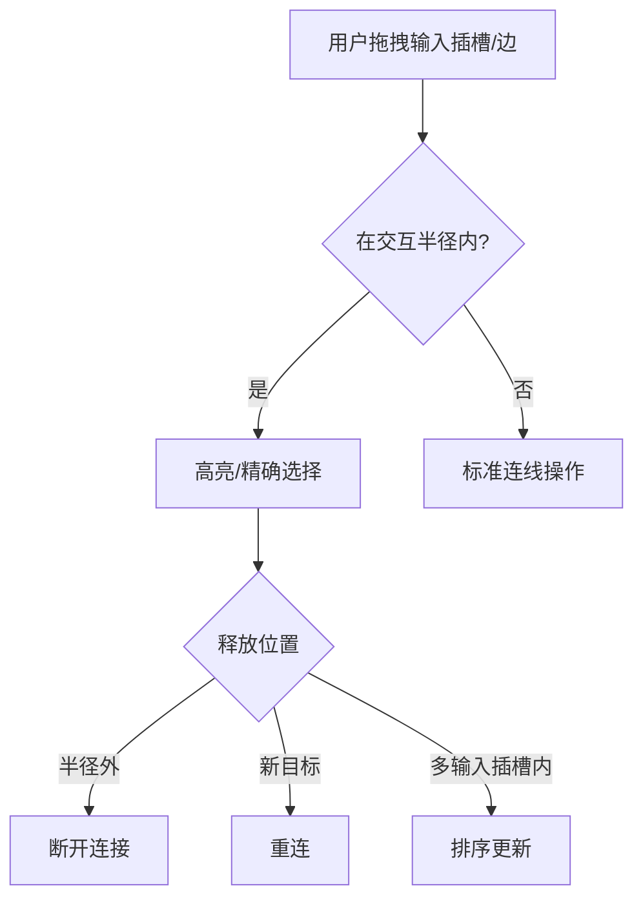

# 多输入插槽增强功能实施计划 (修订版)

## I. 引言

本计划旨在为支持多路连接的输入插槽（即 `multi: true` 的插槽）设计并实现一套增强的视觉表现和交互功能。主要目标包括：

1.  **动态高度**：插槽的视觉高度能根据连接到它的线的数量自动调整。
2.  **连线间隙**：多条线连接到同一个插槽时，它们之间能有预设的视觉间隙（例如 4px）。
3.  **连线排序**：用户可以通过画布内直接拖拽或专门的排序组件来重新排列连接到该插槽的线的顺序。
4.  **精细交互**：实现类似Blender的"预备断开"状态和精确选择机制。
5.  **持久化存储**：连线的顺序能够被保存并在加载工作流时恢复。

## II. 数据结构定义

1.  **修改点**：
    *   **`packages/types/src/node.ts`**:
        ```typescript
        export interface WorkflowStorageNode {
          // ... existing properties
          inputConnectionOrders?: Record<string, string[]>; // key: inputHandleId, value: ordered list of edgeIds
        }
        ```
    *   **前端节点数据类型**:
        ```typescript
        export interface ComfyTavernNodeData {
          // ... other properties
          inputConnectionOrders?: Record<string, string[]>;
        }
        ```

## III. 核心连接与交互逻辑

1.  **输入插槽连接行为**：
    *   禁止从已连接的输入插槽拉出新线，触发"预备断开/重连"状态
    *   输出插槽保持原有行为（支持一对多）
    *   单输入插槽直接触发断开重连

2.  **画布内直接拖拽排序与"拔出"连线交互**：
    *   **阶段1: 预备状态**：
        - 定义交互半径（基于插槽高度的胶囊区域）
        - 单连接：整体高亮
        - 多连接：区域高亮 + 鼠标Y坐标精确选择（二次高亮目标线）
    *   **阶段2: 实际操作**：
        - 拖出半径：断开连接
        - 连接到新目标：执行重连
        - 多输入插槽内移动：实时排序更新

## IV. `BaseNode.vue` 的修改

1.  **动态高度调整**：
    ```typescript
    const totalHeight = connectionCount * singleLineHeight + 
                      (connectionCount > 0 ? (connectionCount - 1) * lineGap : 0) + 
                      padding;
    ```
2.  对于 `multi: true` 的输入插槽，仍渲染单个标准 `<Handle>`

## V. 自定义 Edge 组件 (`SortedMultiTargetEdge.vue`)

1.  根据 `inputConnectionOrders` 计算每条边的垂直偏移
2.  响应排序变化实时重绘

## VI. 连线排序组件 (`MultiHandleSortControl.vue`) 

1.  作为画布内排序的辅助方式
2.  通过右键菜单或小图标触发

## VII. 工作流加载/保存逻辑

1.  确保 `inputConnectionOrders` 正确持久化

## VIII. 状态管理 (`workflowStore`)

1.  新增原子操作：
    ```typescript
    updateNodeInputConnectionOrder(
      tabId: string, 
      nodeId: string, 
      handleKey: string, 
      orderedEdgeIds: string[], 
      historyEntry: HistoryEntry
    )
    ```

## IX. 交互流程示意图



## X. 实施步骤建议

1.  数据结构定义 (II)
2.  基础连接逻辑修改 (III)
3.  自定义Edge组件 (V) 
4.  交互半径和预备状态实现
5.  画布内直接排序逻辑
6.  排序组件作为备选方案
7.  全面测试