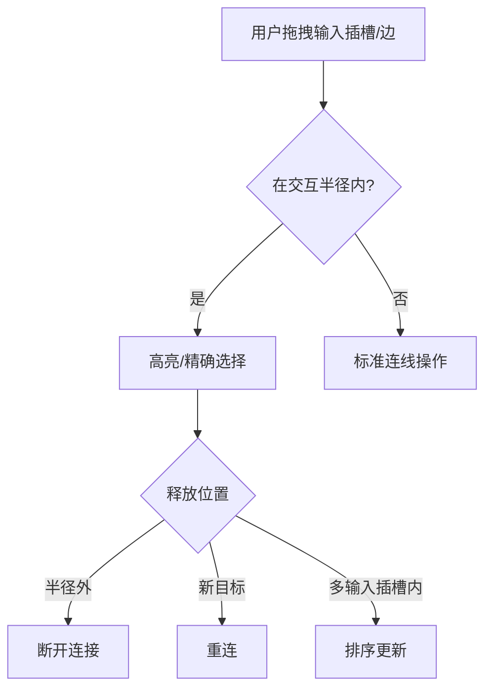

# 多输入插槽增强功能实施计划 (修订版)

## I. 引言

本计划旨在为支持多路连接的输入插槽（即 `multi: true` 的插槽）设计并实现一套增强的视觉表现和交互功能。主要目标包括：

1.  **动态高度**：插槽的视觉高度能根据连接到它的线的数量自动调整。
2.  **连线间隙**：多条线连接到同一个插槽时，它们之间能有预设的视觉间隙（例如 4px）。
3.  **连线排序**：用户可以通过画布内直接拖拽或专门的排序组件来重新排列连接到该插槽的线的顺序。
4.  **精细交互**：实现类似Blender的"预备断开"状态和精确选择机制。
5.  **持久化存储**：连线的顺序能够被保存并在加载工作流时恢复。

## II. 数据结构定义

1.  **修改点**：
    *   **`packages/types/src/node.ts`**:
        ```typescript
        export interface WorkflowStorageNode {
          // ... existing properties
          inputConnectionOrders?: Record<string, string[]>; // key: inputHandleId, value: ordered list of edgeIds
        }
        ```
    *   **前端节点数据类型**:
        ```typescript
        export interface ComfyTavernNodeData {
          // ... other properties
          inputConnectionOrders?: Record<string, string[]>;
        }
        ```

## III. 核心连接与交互逻辑

1.  **输入插槽连接行为**：
    *   禁止从已连接的输入插槽拉出新线，触发"预备断开/重连"状态
    *   输出插槽保持原有行为（支持一对多）
    *   单输入插槽直接触发断开重连

2.  **画布内直接拖拽排序与"拔出"连线交互**：
    *   **阶段1: 预备状态**：
        - 定义交互半径（基于插槽高度的胶囊区域）
        - 单连接：整体高亮
        - 多连接：区域高亮 + 鼠标Y坐标精确选择（二次高亮目标线）
    *   **阶段2: 实际操作**：
        - 拖出半径：断开连接
        - 连接到新目标：执行重连
        - 多输入插槽内移动：实时排序更新

## IV. `BaseNode.vue` 的修改

1.  **动态高度调整**：
    ```typescript
    const totalHeight = connectionCount * singleLineHeight + 
                      (connectionCount > 0 ? (connectionCount - 1) * lineGap : 0) + 
                      padding;
    ```
2.  对于 `multi: true` 的输入插槽，仍渲染单个标准 `<Handle>`。其视觉表现将通过以下方式增强。

### 2.1. 多输入插槽 Handle 组件动态样式与拉伸 (Blender 风格)

**目标**：使 `multi: true` 的输入插槽的 `<Handle>` 组件能够根据连接数量动态调整其高度，呈现为“跑道形状”（两端半圆），并且在无连接时至少保持两倍单线高度，以区别于普通单输入插槽。优先通过 JavaScript 动态设置样式，后续评估是否需要调整 CSS。

**涉及文件**：[`apps/frontend-vueflow/src/components/graph/nodes/BaseNode.vue`](apps/frontend-vueflow/src/components/graph/nodes/BaseNode.vue)

**实施步骤概述 (将在 Code 模式下执行)**：

1.  **在 `<script setup>` 中定义新常量**:
    ```typescript
    // Constants for multi-input Handle height calculation
    const handleLineHeight = 3; // px, 单条连接线在Handle上占据的视觉高度
    const handleLineGap = 2;    // px, 连接线在Handle上的视觉间隙
    const handleVerticalPadding = 4; // px, Handle自身的上下总内边距 (例如，上下各2px)
    const defaultSingleHandleHeight = 12; // px, 非multi时的基础高度，或multi无连接时的最小基准
    const minMultiHandleHeightFactor = 2; // Blender细节：无连接时Handle至少为 N 倍单线视觉高度
    const handleWidth = 12; // px, Handle的宽度，用于计算跑道形圆角
    ```

2.  **创建 `getDynamicHandleStyles` 函数**:
    此函数根据输入定义 (`InputDefinition`) 和连接数 (`connectionCount`) 计算并返回一个样式对象。
    ```typescript
    const getDynamicHandleStyles = (input: InputDefinition, connectionCount: number) => {
      const styles: Record<string, string> = {};
      if (input.multi) {
        let targetHeight: number;
        const minLinesForAppearance = Math.max(1, minMultiHandleHeightFactor);
        const minHeightForMulti = (minLinesForAppearance * handleLineHeight) +
                                Math.max(0, minLinesForAppearance - 1) * handleLineGap +
                                handleVerticalPadding;

        if (connectionCount > 0) {
          targetHeight = connectionCount * handleLineHeight +
                         Math.max(0, connectionCount - 1) * handleLineGap +
                         handleVerticalPadding;
          targetHeight = Math.max(targetHeight, minHeightForMulti);
        } else {
          targetHeight = minHeightForMulti;
        }
        
        styles.height = `${targetHeight}px`;
        styles.borderRadius = `${handleWidth / 2}px`; // 跑道形圆角
        styles.top = '0px'; // 从父容器顶部开始
        styles.transform = 'none'; // 移除默认垂直居中
        styles.width = `${handleWidth}px`; // 显式设置宽度
      } else {
        // 对于单输入Handle，返回空对象，使其沿用CSS定义的样式
        // styles.height = `${defaultSingleHandleHeight}px`;
        // styles.borderRadius = '50%';
      }
      return styles;
    };
    ```

3.  **在模板中将动态样式绑定到输入 `<Handle>`**:
    修改 `<Handle>` 组件的 `:style` 属性：
    ```html
    <Handle
      :id="String(input.key)"
      type="target"
      :position="Position.Left"
      :class="[
        styles.handle,
        styles.handleLeft,
        getHandleTypeClass(input.dataFlowType),
        isAnyType(input.dataFlowType) && styles.handleAny,
        // 考虑移除 input.multi && styles.handleMulti 如果其主要作用是设置与JS冲突的borderRadius
      ]"
      :style="getDynamicHandleStyles(input as InputDefinition, getInputConnectionCount(String(input.key)))"
    />
    ```

4.  **后续步骤 (在 Code 模式下评估与实施)**:
    *   **CSS兼容性检查**：评估 [`apps/frontend-vueflow/src/components/graph/nodes/handleStyles.module.css`](apps/frontend-vueflow/src/components/graph/nodes/handleStyles.module.css) 中 `.handle` 和 `.handleMulti` 的 `!important` 规则是否与 JS 动态样式冲突。如果冲突，需要谨慎移除或调整 CSS 中的 `!important` 规则。
    *   **Handle 父容器高度同步**：调整 `BaseNode.vue` 中 `multiInputSlotDynamicStyle` 计算属性的逻辑（该属性控制 Handle 父级 `div` 的高度），确保其计算结果能正确包裹动态调整高度后的 Handle 组件。可能需要使其也使用新的 Handle 相关常量。

## V. 自定义 Edge 组件 (`SortedMultiTargetEdge.vue`)

1.  根据 `inputConnectionOrders` 计算每条边的垂直偏移
2.  响应排序变化实时重绘

## VI. 连线排序组件 (`MultiHandleSortControl.vue`) 

1.  作为画布内排序的辅助方式
2.  通过右键菜单或小图标触发

## VII. 工作流加载/保存逻辑

1.  确保 `inputConnectionOrders` 正确持久化

## VIII. 状态管理 (`workflowStore`)

1.  新增原子操作：
    ```typescript
    updateNodeInputConnectionOrder(
      tabId: string, 
      nodeId: string, 
      handleKey: string, 
      orderedEdgeIds: string[], 
      historyEntry: HistoryEntry
    )
    ```

## IX. 交互流程示意图



## X. 实施步骤建议

1.  数据结构定义 (II)
2.  基础连接逻辑修改 (III)
3.  自定义Edge组件 (V) 
4.  交互半径和预备状态实现
5.  画布内直接排序逻辑
6.  排序组件作为备选方案
7.  全面测试
## XI. 详细调查结果与现状分析

本章节总结了为实施多输入插槽增强功能而对现有代码库进行的调查结果。

### 1. 数据结构定义 (对应计划 II)

*   **`packages/types/src/node.ts`** ([`packages/types/src/node.ts`](packages/types/src/node.ts:16)):
    *   文件已找到。
    *   `WorkflowStorageNode` 接口定义在第 298 行。
    *   **现状**：该接口目前不包含 `inputConnectionOrders` 属性。
    *   **计划修改**：在此接口中添加 `inputConnectionOrders?: Record<string, string[]>;`。

*   **前端节点数据类型 (`ComfyTavernNodeData`)**:
    *   **现状**：此类型指的是 VueFlow 节点对象 (`VueFlowNode`) 中 `data` 属性的类型，与 `@comfytavern/types` 中的 `NodeDefinition` 接口（[`packages/types/src/node.ts`](packages/types/src/node.ts:88)）高度相关。前端运行时节点（例如 [`apps/frontend-vueflow/src/components/graph/nodes/BaseNode.vue`](apps/frontend-vueflow/src/components/graph/nodes/BaseNode.vue) 中的 `props.data`）的 `data` 对象目前不包含 `inputConnectionOrders`。
    *   **计划修改**：确保前端运行时节点的 `data` 对象能够存储和访问 `inputConnectionOrders` 属性。这通常意味着当从 `WorkflowStorageNode` 加载数据时，`inputConnectionOrders` 会被填充到这个 `data` 对象中。

### 2. `BaseNode.vue` 的修改 (对应计划 IV)

*   文件: [`apps/frontend-vueflow/src/components/graph/nodes/BaseNode.vue`](apps/frontend-vueflow/src/components/graph/nodes/BaseNode.vue)
    *   文件已找到。
    *   **动态高度调整**:
        *   **现状**：目前 `BaseNode.vue` 的高度主要由其内容或外部样式控制，没有发现基于连接数量的动态高度计算逻辑。
        *   **计划修改**：需要根据计划中的公式新增实现。
    *   **Handle 渲染**:
        *   **现状**：对于 `multi: true` 的输入插槽，`BaseNode.vue` (模板约第 813 行起) 已按预期渲染单个标准 `<Handle>`，并通过 `input.multi && styles.handleMulti` 应用特定样式。此部分符合计划。

### 3. 自定义 Edge 组件 (`SortedMultiTargetEdge.vue`) (对应计划 V)

*   **现状**：通过 `list_files` 检查，在 `apps/frontend-vueflow/src/components/graph/edges/` 目录下未找到此文件。
*   **计划修改**：需要创建 `SortedMultiTargetEdge.vue` 组件。

### 4. 连线排序组件 (`MultiHandleSortControl.vue`) (对应计划 VI)

*   **现状**：通过 `list_files` 检查，在 `apps/frontend-vueflow/src/components/graph/controls/` 目录下未找到此文件。
*   **计划修改**：需要创建 `MultiHandleSortControl.vue` 组件。

### 5. 工作流加载/保存逻辑 (对应计划 VII)

*   关键文件: [`apps/frontend-vueflow/src/utils/workflowTransformer.ts`](apps/frontend-vueflow/src/utils/workflowTransformer.ts)
    *   `transformVueFlowToCoreWorkflow` 函数 (用于保存，第 38 行):
        *   **现状**：目前没有提取或保存 `inputConnectionOrders` 的逻辑。
        *   **计划修改**：需要添加逻辑以从前端节点 `data` 中读取 `inputConnectionOrders` 并将其存入 `WorkflowStorageNode`。
    *   `transformWorkflowToVueFlow` 函数 (用于加载，第 276 行):
        *   **现状**：目前没有从加载的 `WorkflowStorageNode` 中读取 `inputConnectionOrders` 并将其设置到前端节点 `data` 对象上的逻辑。
        *   **计划修改**：需要添加逻辑以从 `WorkflowStorageNode` 中读取 `inputConnectionOrders` (如果存在) 并将其设置到前端 VueFlow 节点的 `data` 对象中。

### 6. 状态管理 (`workflowStore`) (对应计划 VIII)

*   相关文件: [`apps/frontend-vueflow/src/stores/workflowStore.ts`](apps/frontend-vueflow/src/stores/workflowStore.ts)
    *   文件已找到。
    *   **原子操作 `updateNodeInputConnectionOrder`**:
        *   **现状**：计划中提到的此函数目前不存在。
        *   **计划修改**：需要在 `workflowStore.ts` 或其协调的 Composable (如 `useWorkflowInteractionCoordinator.ts`) 中添加此函数。

## XII. 详细实施计划 (修订版 - 集成历史记录模式)

**目标**：根据 [`DesignDocs/architecture/multi-input-slot-enhancement-plan.md`](DesignDocs/architecture/multi-input-slot-enhancement-plan.md) 的要求，并遵循 [`DesignDocs/architecture/history-recording-pattern.md`](DesignDocs/architecture/history-recording-pattern.md) 中定义的模式，实现对多路连接输入插槽的视觉和交互增强。

**核心步骤与涉及文件/模块：**

### 第一阶段：数据结构与基础准备

1.  **修改共享类型定义**
    *   **文件**：[`packages/types/src/node.ts`](packages/types/src/node.ts)
    *   **任务**：在 `WorkflowStorageNode` 接口中添加 `inputConnectionOrders?: Record<string, string[]>;`

2.  **更新数据转换逻辑**
    *   **文件**：[`apps/frontend-vueflow/src/utils/workflowTransformer.ts`](apps/frontend-vueflow/src/utils/workflowTransformer.ts)
    *   **任务 (加载时 - `transformWorkflowToVueFlow`)**: 读取 `storageNode.inputConnectionOrders` 并设置到 `VueFlowNode` 的 `data` 对象中。
    *   **任务 (保存时 - `transformVueFlowToCoreWorkflow`)**: 从 `vueNode.data.inputConnectionOrders` 读取连接顺序并存入 `WorkflowStorageNode`。

### 第二阶段：核心视觉与交互实现 (前端)

3.  **实现节点动态高度**
    *   **文件**：[`apps/frontend-vueflow/src/components/graph/nodes/BaseNode.vue`](apps/frontend-vueflow/src/components/graph/nodes/BaseNode.vue)
    *   **任务**: 实现基于连接数的动态高度计算和应用。

4.  **创建自定义 Edge 组件 (`SortedMultiTargetEdge.vue`)**
    *   **路径**：`apps/frontend-vueflow/src/components/graph/edges/SortedMultiTargetEdge.vue` (新建)
    *   **任务**: 根据目标节点的 `data.inputConnectionOrders` 计算边的垂直偏移并渲染。

5.  **更新状态管理以支持连接顺序 (遵循历史记录模式)**
    *   **主要文件**：[`apps/frontend-vueflow/src/composables/workflow/useWorkflowInteractionCoordinator.ts`](apps/frontend-vueflow/src/composables/workflow/useWorkflowInteractionCoordinator.ts)
    *   **辅助文件**：[`apps/frontend-vueflow/src/stores/workflowStore.ts`](apps/frontend-vueflow/src/stores/workflowStore.ts) (用于导出协调器函数)
    *   **任务**:
        *   在 `useWorkflowInteractionCoordinator.ts` 中创建新的 `async` 函数 `updateNodeInputConnectionOrderAndRecord` (或类似名称，强调记录历史)：
            ```typescript
            async function updateNodeInputConnectionOrderAndRecord(
              internalId: string,
              nodeId: string,
              handleKey: string, // 输入插槽的 key
              orderedEdgeIds: string[], // 排序后的 Edge ID 列表
              entry: HistoryEntry // 接收一个已创建的 HistoryEntry 对象
            ) {
              // 1. 获取当前快照 (workflowManager.getCurrentSnapshot)
              const currentSnapshot = workflowManager.getCurrentSnapshot(internalId);
              if (!currentSnapshot) { /* 错误处理 */ return; }

              // 2. 创建下一个状态的深拷贝 (klona(currentSnapshot))
              const nextSnapshot = klona(currentSnapshot);

              // 3. 修改 nextSnapshot:
              //    找到 nextSnapshot.elements 中的目标节点
              //    更新其 data.inputConnectionOrders[handleKey] = orderedEdgeIds;
              const nodeIndex = nextSnapshot.elements.findIndex((el) => el.id === nodeId && !("source" in el));
              if (nodeIndex === -1) { /* 错误处理 */ return; }
              const targetNode = nextSnapshot.elements[nodeIndex] as VueFlowNode; // Type assertion
              if (!targetNode.data) { targetNode.data = {}; } // Ensure data object exists
              if (!targetNode.data.inputConnectionOrders) { targetNode.data.inputConnectionOrders = {};}
              targetNode.data.inputConnectionOrders[handleKey] = orderedEdgeIds;

              // 4. 应用状态更新 (await workflowManager.setElements(internalId, nextSnapshot.elements))
              await workflowManager.setElements(internalId, nextSnapshot.elements);

              // 5. 记录历史 (historyManager.recordSnapshot(internalId, entry, nextSnapshot))
              historyManager.recordSnapshot(internalId, entry, nextSnapshot);
            }
            ```
        *   在 `useWorkflowInteractionCoordinator.ts` 的返回对象中导出此函数。
        *   在 `workflowStore.ts` 中导入并重新导出此协调器函数。

### 第三阶段：高级交互与辅助功能 (调用新的协调器函数)

6.  **实现画布内拖拽排序与"拔出"连线交互**
    *   **文件**：可能涉及修改 [`apps/frontend-vueflow/src/composables/canvas/useCanvasConnections.ts`](apps/frontend-vueflow/src/composables/canvas/useCanvasConnections.ts), [`apps/frontend-vueflow/src/composables/workflow/useWorkflowInteractionCoordinator.ts`](apps/frontend-vueflow/src/composables/workflow/useWorkflowInteractionCoordinator.ts) (或其调用者), 以及 `BaseNode.vue` 中的事件处理。
    *   **任务 (阶段1: 预备状态)**: (与之前计划相同)
    *   **任务 (阶段2: 实际操作)**:
        *   **拖出交互半径 / 释放到新的兼容目标上**: (与之前计划相同，确保相关操作也遵循历史记录模式，例如断开/连接边时)
        *   **在同一多输入插槽内上下移动并释放**:
            *   根据释放位置确定新的 `orderedEdgeIds`。
            *   **创建 `HistoryEntry` 对象**: 使用 `@comfytavern/utils` 中的 `createHistoryEntry` 函数，提供操作类型 (`'update'` 或 `'reorder'`)、对象类型 (`'nodeInputConnectionOrder'`)、摘要和详细信息（如 `nodeId`, `handleKey`, `previousOrder`, `newOrder`）。
            *   **调用协调器函数**: 调用在第5步中创建的 `workflowStore.updateNodeInputConnectionOrderAndRecord(...)`，传递所有必要参数，包括创建的 `HistoryEntry`。
            *   触发 `SortedMultiTargetEdge.vue` 组件重绘 (这应由状态更新自动触发)。

7.  **创建连线排序组件 (`MultiHandleSortControl.vue`)** (可选辅助)
    *   **路径**：`apps/frontend-vueflow/src/components/graph/controls/MultiHandleSortControl.vue` (新建)
    *   **任务**:
        *   提供UI进行排序。
        *   排序操作完成后，**创建 `HistoryEntry` 对象**，然后**调用 `workflowStore.updateNodeInputConnectionOrderAndRecord(...)`** 更新状态并记录历史。

### 第四阶段：测试与收尾

8.  **全面测试**
    *   功能测试：动态高度、连线间隙、拖拽排序、辅助组件排序、精细交互。
    *   持久化测试：保存和加载工作流后，连接顺序是否正确恢复。
    *   边界条件测试：无连接、单连接、多连接、大量连接。
    *   **重点测试**：撤销/重做功能是否能正确处理连接顺序的更改，以及所有相关的状态更新。
    *   兼容性测试：确保不影响现有节点和边的行为。

**Mermaid 图示 (修订版，突出历史记录流程):**

```mermaid
graph TD
    A[开始: 用户交互导致顺序更改] --> B(创建 HistoryEntry);
    B --> C(调用协调器: updateNodeInputConnectionOrderAndRecord);
    C --> D{协调器内部};
    D -- 1. 获取当前快照 --> E[currentSnapshot];
    E -- 2. 深拷贝并修改 --> F[nextSnapshot (含新的inputConnectionOrders)];
    F -- 3. 应用状态更新 (manager.setElements) --> G[UI/核心状态已更新];
    G -- 4. 记录历史 (historyManager.recordSnapshot with nextSnapshot) --> H[历史记录已更新];
    H --> I(数据结构: inputConnectionOrders 已在运行时更新);
    I --> J(视觉更新: SortedMultiTargetEdge.vue 重绘);
    I --> K(持久化: workflowTransformer.ts 处理保存/加载);
    J --> L[节点动态高度调整];
    K --> L;
    L --> M[完成: 功能实现];