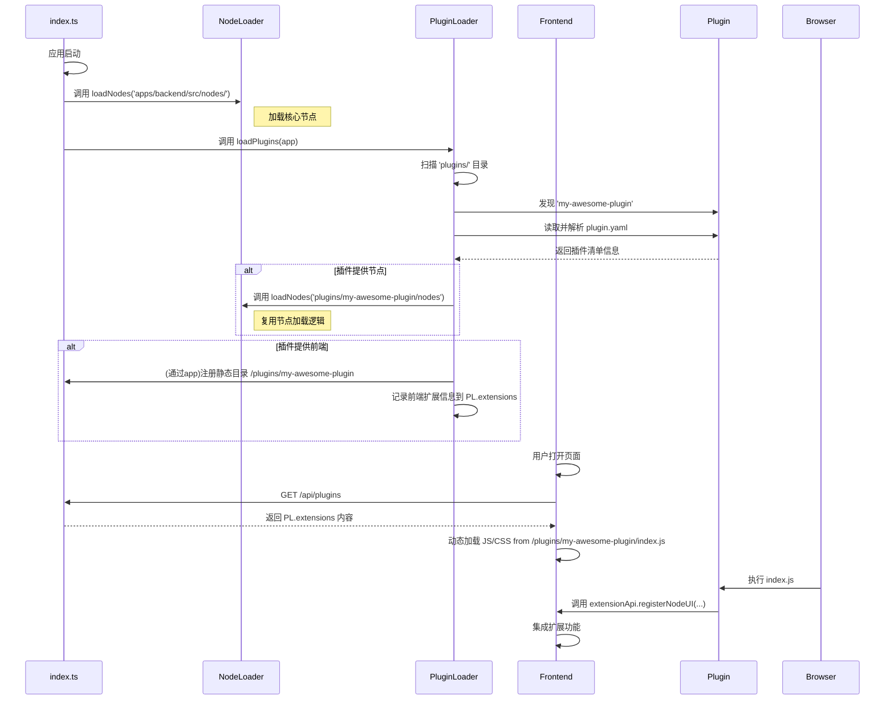

# 插件与扩展架构设计草案 (Plugin & Extension Architecture Draft)

## 1. 目标与原则

借鉴 ComfyUI 成熟的扩展模型，并结合我们现有的系统架构，我们设计一套清晰、解耦的插件系统。此系统的核心目标是分离“节点定义”与“功能扩展”，允许社区开发者以安全、规范的方式，为 ComfyTavern 添加从纯前端界面到后端节点的各类功能。

**设计原则:**

- **清晰解耦**: 明确区分核心节点 (`apps/backend/src/nodes/`) 与社区插件 (`plugins/`)。插件的管理和加载由独立的 `PluginLoader` 服务负责，`NodeLoader` 负责其单一职责：从指定路径加载节点。
- **结构化**: 插件必须拥有 `plugin.yaml` 清单文件，作为其身份和能力的唯一声明，该格式对开发者友好且支持注释。
- **兼容性**: 方案与现有系统无缝集成。`PluginLoader` 将复用 `NodeLoader` 来加载插件中的节点，而不是重复造轮子。
- **安全性**: 前端扩展代码在受控环境中运行，并通过权限模型约束其行为。
- **易用性**: 开发者只需遵循简单的目录结构和 YAML 清单规范，即可创建功能强大的插件。
- **“近 PR”体验**: 提供非侵入式的“近 PR”体验，将社区创造力引导至规范化的扩展路径上。

## 2. 插件化目录结构

我们将重构现有的 `plugins/` 目录，使其与 `apps/backend/src/nodes/` 目录一起，各自承担更明确的职责。

```
ComfyTavern/
├── apps/
│   └── backend/
│       └── src/
│           └── nodes/      # 存放核心内置节点
│               └── ...
└── plugins/                # (重构) 存放所有第三方或非核心插件
    ├── my-awesome-plugin/  # 一个功能丰富的插件
    │   ├── nodes/          # (可选) 此插件提供的后端节点
    │   │   └── AwesomeNode.ts
    │   ├── web/            # (可选) 此插件的前端资源
    │   │   ├── index.js
    │   │   └── style.css
    │   └── plugin.yaml     # (必需) 插件清单文件
    │
    └── my-theme-only/      # 一个纯前端主题插件
        ├── web/
        │   └── theme.css
        └── plugin.yaml
```

- **`apps/backend/src/nodes/`**: 仅用于存放项目自带的核心节点。
- **`plugins/`**: 所有第三方扩展、非核心功能模块的家。一个插件可以只包含前端 (`web/`)，或只包含后端节点 (`nodes/`)，或两者兼备。

## 3. 插件清单 (`plugin.yaml`)

每个插件目录中**必须包含**一个 `plugin.yaml` 文件，它使用对人类更友好的 YAML 格式，并支持注释。

```yaml
# 插件的唯一标识符，应使用 kebab-case 命名法
name: my-awesome-plugin
# 显示给用户的名称
displayName: 我的超棒插件
version: 1.0.0
description: 这个插件能极大地提升生产力，并添加了一个神奇的节点。

# (可选) 声明此插件提供的后端节点
nodes:
  # 节点定义的入口文件或目录，相对于此 YAML 文件的位置
  entry: ./nodes

# (可选) 声明此插件提供的前端资源
frontend:
  # 开发模式下的入口，用于 Vite 集成
  dev:
    entry: web/index.ts
  # 构建（生产）模式下的产物
  build:
    # 构建后的 JS 入口
    entry: dist/index.js
    # 构建后的 CSS 文件
    styles:
      - dist/style.css

# (可选) 声明插件需要的权限。插件必须明确声明其所需，以便用户审查。
permissions:
  # 申请使用哪些钩子
  hooks:
    - "backend:nodemanager:before-register" # 例如：在节点注册前修改其定义
    - "frontend:workflow:before-execute" # 例如：在执行前修改输入
    - "frontend:node:execution:finish" # 例如：监听节点完成事件以更新UI
  # 申请包裹或注入哪些 UI 组件
  front:
    # 包裹核心组件
   wrap:
     - "front:BaseNode" # 包裹基础节点组件，通过检查 props.type 实现对特定节点的定制
     - "front:Sidebar"
   # 注入到 UI 插座
   inject:
     - "node:header:right" # 例如：在节点头部加个快速操作图标
    # 替换核心组件 (高风险)
    override: []
  # 申请替换哪些核心服务 (最高风险)
  services:
    override:
      - "workflowManager"
```

## 4. 后端改造方案

### 4.1. 创建 `PluginLoader` 服务

我们将创建一个新的服务 `apps/backend/src/services/PluginLoader.ts`，它将作为插件系统的核心。`NodeLoader` 将保持不变，继续作为通用的节点加载工具。

- **`PluginLoader` 的职责**:

  - 发现所有插件。
  - 解析插件的 `plugin.yaml` 清单。
  - 协调前端资源的静态服务注册。
  - 调用 `NodeLoader` 来加载插件中定义的节点。

- **`PluginLoader.ts` 核心实现**:

  ```typescript
  // apps/backend/src/services/PluginLoader.ts
  import { Elysia } from 'elysia';
  import { staticPlugin } from '@elysiajs/static';
  import yaml from 'js-yaml';
  import { NodeLoader } from './NodeLoader';
  // ... 其他导入 ...

  export class PluginLoader {
    public static extensions: ExtensionInfo[] = [];

    public static async loadPlugins(app: Elysia): Promise<void> {
      const pluginsDir = path.join(getProjectRootDir(), 'plugins');
      // ... 扫描 pluginsDir ...
      for (const pluginName of pluginDirs) {
        const pluginPath = path.join(pluginsDir, pluginName);
        const manifestPath = path.join(pluginPath, 'plugin.yaml');

        try {
          const manifestContent = await fs.readFile(manifestPath, 'utf-8');
          const manifest = yaml.load(manifestContent) as PluginManifest;

          // 1. 处理前端资源
          if (manifest.frontend) {
            const webPath = path.join(pluginPath, 'web');
            const publicPath = `/plugins/${manifest.name}`;
            app.use(staticPlugin({ assets: webPath, prefix: publicPath }));

            // 构造并存储 ExtensionInfo
            this.extensions.push({ ... });
          }

          // 2. 处理后端节点 (复用 NodeLoader)
          if (manifest.nodes) {
            const nodesPath = path.join(pluginPath, manifest.nodes.entry);
            await NodeLoader.loadNodes(nodesPath);
          }
        } catch (error) {
          console.error(`Failed to load plugin ${pluginName}:`, error);
        }
      }
    }
  }
  ```

### 4.2. 修改应用启动流程 (`index.ts`)

在 `apps/backend/src/index.ts` 中，我们需要在加载完核心节点后，调用 `PluginLoader`。

```typescript
// apps/backend/src/index.ts

// ... (导入 PluginLoader)

// 1. 加载内置节点
// 注意：这里的 "nodes" 是相对于 index.ts 的路径，它位于 apps/backend/src/
const builtInNodesPath = join(__dirname, "nodes");
await NodeLoader.loadNodes(builtInNodesPath);

// 2. 加载自定义节点路径 (从 config.json 读取)
// ... (现有逻辑保持不变)

// 3. 加载插件
console.log(`[ComfyTavern Backend] Loading plugins...`);
await PluginLoader.loadPlugins(app); // 将 app 实例传入

// ... (后续启动流程)
```

### 4.3. API 端点

创建一个新的路由文件 `apps/backend/src/routes/pluginRoutes.ts`，并由 `index.ts` 挂载。

- **Endpoint**: `GET /api/plugins`
- **处理函数**: 直接返回 `PluginLoader.extensions` 的内容。
- **响应体**: 一个 `ExtensionInfo` 对象数组，例如：
  ```json
  [
    {
      "name": "my-awesome-plugin",
      "displayName": "我的超棒插件",
      "version": "1.0.0",
      "description": "...",
      "frontend": {
        "entryUrl": "/plugins/my-awesome-plugin/index.js",
        "styleUrls": ["/plugins/my-awesome-plugin/style.css"]
      }
    }
  ]
  ```

## 5. 前端改造方案

### 5.1. 插件加载器 (`PluginLoader`)

在应用初始化阶段（例如 `apps/frontend-vueflow/src/main.ts`），添加 `PluginLoader` 服务。

- **流程**:
  1. 调用 `GET /api/plugins` 获取已启用插件的列表。
  2. 遍历列表，动态创建 `<script>` 和 `<link>` 标签，加载其前端资源。

### 5.2. 前端扩展 API

提供全局 API `window.ComfyTavern.extensionApi`，供扩展 JS 使用 (与之前方案一致)。

```typescript
interface ExtensionApi {
  registerNodeUI(nodeType: string, component: VueComponent): void;
  addMenuItem(targetMenu: string, item: MenuItem): void;
  on(event: string, callback: Function): void;
  // ...
}
```

### 5.3. 开发模式与生产模式

为了提供一流的开发者体验 (DX)，我们必须明确区分并支持两种运行模式。

#### 开发模式 (Development Mode)

**目标**: 实现插件前端代码的热模块替换 (HMR)，让开发者像开发核心功能一样无缝开发插件。

**方案**:

1.  **统一 Vite 服务**: 主前端应用 (`apps/frontend-vueflow`) 的 Vite 开发服务器将成为所有插件开发的**唯一入口**。
2.  **动态入口注入**:
    - 主应用的 `vite.config.ts` 将被修改，增加一个逻辑：在服务器启动时，扫描 `plugins/` 目录下所有插件的 `plugin.yaml` 文件。
    - 如果一个插件声明了 `frontend.dev.entry` (例如 `web/index.ts`)，Vite 会将这个入口动态地添加到 `build.rollupOptions.input` 数组中。
    - 这样，Vite 的 HMR 引擎就能自动监听插件源文件的变化，并实时更新浏览器中的应用。
3.  **前端加载逻辑**:
    - 在开发模式下，前端的 `PluginLoader` 不会去加载构建产物 URL (`/plugins/.../dist/index.js`)。
    - 相反，它会通过特殊的 Vite 客户端 API 或约定的模块路径 (`/@fs/path/to/plugins/my-awesome-plugin/web/index.ts`) 来加载插件的源入口文件，从而接入 HMR。

**优势**:

- **无缝体验**: 插件开发者只需运行主项目的 `dev` 命令，即可开始开发，无需额外配置。
- **完全 HMR**: 对插件 `.vue`, `.ts`, `.css` 文件的任何修改都会立即反映在浏览器中。
- **无跨域问题**: 所有资源都由同一个 Vite 服务器提供。
- **共享依赖**: 插件可以轻松地从主应用 `import` 共享的库（Vue, Pinia, etc.），减小打包体积。

#### 生产模式 (Production Mode)

**目标**: 在生产环境中，加载构建和优化后的静态资源。

**方案**:

1.  **插件自构建**:
    - 每个需要前端资源的插件，其 `package.json` 中应包含一个 `build` 脚本。
    - 该脚本负责使用 Vite 或其他工具，将其 `web/` 目录下的源码构建到 `dist/` 目录中。
2.  **后端静态服务**:
    - 后端的 `PluginLoader` 逻辑保持不变，它会为每个插件的**构建产物目录**（例如 `dist/`）注册一个静态文件服务，映射到 `/plugins/{pluginName}`。
3.  **前端加载逻辑**:
    - 在生产模式下，前端 `PluginLoader` 的行为也保持不变，它会请求 `/api/plugins`，然后加载返回的 `entryUrl` 和 `styleUrls`，这些 URL 指向构建后的静态资源。

### 5.4. 插件清单 (`plugin.yaml`) 演进

为了支持不同复杂度的前端插件，`frontend` 部分需要支持两种模式：`vite` (用于需要构建的复杂应用) 和 `vanilla` (用于无需构建的简单脚本和样式)。

```yaml
# ...
frontend:
  # (可选) 声明插件类型，默认为 'vite'
  # 'vite': 需要开发/构建流程，适用于 Vue/React 组件等。
  # 'vanilla': 纯 JS/CSS，无需构建，直接加载源文件。
  type: vite

  # --- 当 type 为 'vite' 时 ---
  # 开发模式配置
  dev:
    # Vite 开发服务器需要监听的入口文件 (源文件)
    entry: web/index.ts
  # 生产模式配置
  build:
    # 构建后的 JS 入口文件
    entry: dist/index.js
    # 需要加载的额外样式文件列表 (构建后)
    styles:
      - dist/style.css
    # 静态资源目录，相对于 plugin.yaml
    # 后端将伺服此目录到 /plugins/{pluginName}
    outputDir: dist

# --- 或者，对于简单的插件 ---
frontend:
  type: vanilla
  # JS 入口文件 (源文件)
  entry: web/main.js
  # 样式文件列表 (源文件)
  styles:
    - web/theme.css
  # 静态资源根目录，后端将伺服此目录
  # 如果不提供，默认为 'web'
  rootDir: web
```

### 5.5. 对后端 `PluginLoader` 的影响

`PluginLoader` 在解析 `plugin.yaml` 时需要根据 `frontend.type` 进行差异化处理：

- **如果 `type` 是 `vite` (或未指定)**:
  - `app.use(staticPlugin({ ... }))` 的 `assets` 路径应读取 `frontend.build.outputDir`。
  - 返回给前端的 `ExtensionInfo` 中的 `entryUrl` 和 `styleUrls` 应基于 `frontend.build` 下的路径来构造。
- **如果 `type` 是 `vanilla`**:
  - `app.use(staticPlugin({ ... }))` 的 `assets` 路径应读取 `frontend.rootDir` (若未提供，则默认为 `web`)。
  - 返回给前端的 `ExtensionInfo` 中的 `entryUrl` 和 `styleUrls` 应直接基于 `frontend.entry` 和 `frontend.styles` 的路径来构造。

## 6. 工作流程图 (Mermaid)



## 7. 下一步

- [ ] **审批**: 确认此插件架构设计方案。
- [ ] **实现**:
  - [ ] 后端: 创建 `PluginLoader.ts`，在 `index.ts` 中调用它，并添加 `/api/plugins` 端点。
  - [ ] 前端: 实现 `PluginLoader` 和 `extensionApi`。
- [ ] **文档**: 撰写新的插件开发指南。

## 8. 实现'近 PR' 效果的分层 API 策略

为了实现“在不 PR 的情况下进行规范化改造”的目标，我们将 `extensionApi` 从设计哲学上进行升维。它不应仅仅是功能的“调用者”，更应该是核心应用的“手术刀”和“嫁接器”。我们将这套 API 按能力强度和侵入性，划分为三个层次，以覆盖绝大多数 PR 场景。

### 8.1. 第一层：安全“添加” (The Additive Layer)

此层级对应“我希望这里能多个东西”的需求，是最基础、最安全的一层，用于无风险地扩充应用能力。

- **核心能力**: 在预留的“插槽”（Plugin Outlets）中添加新内容。
- **API 示例**:
  - `api.ui.addMenuItem(...)`: 在主菜单、右键菜单等位置添加新选项。
  - `api.ui.addPanel(...)`: 在侧边栏或底部添加一个全新的面板。
  - `api.nodes.registerUI(...)`: 为特定节点类型注册一个自定义的 Vue 组件作为其界面。
  - `api.router.addRoute(...)`: 添加一个全新的页面/视图，拥有自己的 URL。
  - `api.ui.registerOutletComponent(outletName: string, component: VueComponent)`: **(推荐)** 向指定的“插件插座”注册一个组件。核心 UI 的关键位置（如节点头部、设置页面底部）会放置命名的 `<PluginOutlet name="..."/>` 组件，插件可直接向其注入 UI，这比覆盖组件更灵活、侵入性更低。

### 8.2. 第二层：受控“修改” (The Interceptive Layer)

此层级对应“我希望这个过程能有所不同”的需求，允许插件“拦截”和“包装”核心行为与数据。

- **核心能力**: 在不替换核心代码的情况下，通过钩子和装饰器模式，修改其行为。
- **API 示例**:
  - `api.hooks.on(hookName: string, callback: Function)`: 强大的钩子系统，类似 WordPress。我们可以在 `workflow:before-execute` 时修改输入，在 `node:render:after` 时添加额外信息，在 `settings:save:before` 时进行验证等。钩子应遍布应用关键流程。
  - `api.ui.wrapComponent(componentId: string, wrapper: (original: VueComponent) => VueComponent)`: **(关键)** “装饰器模式”的体现。它不直接替换，而是给插件一个“原始组件”的定义，让插件返回一个“包装后”的新组件。这比直接替换要灵活和安全得多。

### 8.3. 第三层：完全“替换” (The Override Layer)

此层级是最后的“杀手锏”，对应“我认为这个核心部分可以做得更好”的颠覆性需求。

- **核心能力**: 完全用自己的实现替换掉核心的某个模块（组件或服务）。
- **API 示例**:
  - `api.ui.overrideComponent(componentId: string, newComponent: VueComponent)`: 直接将核心的画布组件、侧边栏等替换为插件自己的实现。
  - `api.services.override(serviceName: string, newService: object)`: **(终极武器)** 替换掉核心服务，如 `workflowManager`。这意味着插件可以重写整个后端执行逻辑。

这些分层机制能覆盖绝大多数 PR 场景，而无需修改核心代码。对于极少数无法覆盖的深度修改，仍需 PR，但这大大降低了门槛。

### 8.4. 安全与权限模型

要提供如此强大的能力而不导致混乱，必须配上同样强大的安全与权限“缰绳”。

1.  **权限声明 (`plugin.yaml`)**:

    - 插件必须在自己的 `plugin.yaml` 清单文件中，像申请应用权限一样，明确声明它需要使用哪个级别的能力（见第 3 节示例）。
    - 用户（尤其是管理员）在安装或启用插件时，可以清楚地看到这个插件申请了哪些高风险权限（如 `override`），并决定是否授权。

2.  **代理模式 (Proxy Pattern) 与 API 守卫**:

    - 当插件通过 `api.services.get('someService')` 请求核心服务时，永远不返回原始对象，而是返回一个 `Proxy` 对象。
    - **默认只读**: `getService` 默认返回只读代理，防止插件意外修改核心服务状态。
    - **API 守卫**: 代理可以阻止插件调用内部私有方法（如 `_internalReset`），只暴露稳定的公共 API。

3.  **沙箱化 (Sandboxing)**:

    - **君子协定 (当前)**: 当前方案信任插件代码是善意的。
    - **未来增强**: 对于安全性要求极高的场景，可考虑将插件的前端代码运行在 **Web Worker** 或 **沙箱化 `iframe`** 中。与主应用的通信通过 `postMessage` 进行，这是 Web 环境下实现第三方代码安全隔离的黄金标准。

4.  **生命周期与监控**:
    - **配置与开关**: 用户可以一键禁用行为异常的插件（见第 9 节），这是最后的保险丝。
    - **性能监控**: 监控扩展性能，如果某个扩展导致问题，能动态禁用。

### 8.5. 核心注入点 (Injection Points) 与钩子 (Hooks) 详解

为了将分层 API 策略具体化，我们必须定义一套稳定、清晰、可预测的核心注入点与钩子。这是连接插件与主应用的桥梁。

#### 8.5.1. UI 注入机制

UI 注入主要通过两种方式实现：**包裹 (Wrapping)** 和 **插座 (Outlets)**。

- **包裹 (Wrapping)**: 使用 `api.ui.wrapComponent(componentId, wrapper)`。它允许插件用自己的逻辑“包裹”一个核心组件，非常适合在现有组件前后添加功能或修改 props。
- **插座 (Outlets)**: 使用 `api.ui.registerOutletComponent(outletName, component)`。核心应用在关键位置预留了命名的 `<PluginOutlet>` 组件，插件可以直接向这些“插座”中添加独立的 UI 单元。

**核心组件 ID (可用于 `wrap`)**:

为了与节点的 `core` 命名空间区分，所有核心 UI 组件的 ID 都使用 `front:` 前缀。

| ID                    | 组件/区域        | 描述                                                                                                                                                                                               |
| --------------------- | ---------------- | -------------------------------------------------------------------------------------------------------------------------------------------------------------------------------------------------- |
| `front:BaseNode`      | **基础节点组件** | 包裹所有节点的基础渲染组件 (`BaseNode.vue`)。插件的包裹组件会接收到节点的 `props`，因此可以通过检查 `props.type` (如 `'core:Text'`) 来实现对特定类型节点的逻辑定制。这是实现节点级 UI 扩展的核心。 |
| `front:GraphEditor`   | 主画布编辑器     | 包裹整个画布区域，可用于添加全局覆盖、监听画布事件等。                                                                                                                                             |
| `front:Sidebar`       | 侧边栏           | 包裹整个侧边栏，可用于添加全局状态或工具。                                                                                                                                                         |
| `front:SettingsPanel` | 设置面板         | 包裹整个设置面板，可用于添加顶层警告或说明。                                                                                                                                                       |
| `front:MainMenu`      | 主菜单           | 包裹主菜单组件，可在菜单渲染前后添加逻辑。                                                                                                                                                         |

**核心 UI 插座名称 (可用于 `registerOutletComponent`)**:

| 插座名称                                 | 位置             | 描述                                                                                                         |
| ---------------------------------------- | ---------------- | ------------------------------------------------------------------------------------------------------------ |
| `node:header:right`                      | 节点标题栏右侧   | 在节点标题上添加自定义图标、按钮或状态指示器。(`BaseNode.vue` 中 `custom-node-header` 内)                    |
| `node:body:before`                       | 节点主体内容之前 | 在节点控件区域前插入自定义 UI。(`BaseNode.vue` 中 `custom-node-body` 内，所有 `inputs` 之前)                 |
| `node:body:after`                        | 节点主体内容之后 | 在节点控件区域后插入自定义 UI，如预览、图表等。(`BaseNode.vue` 中 `custom-node-body` 内，所有 `inputs` 之后) |
| `sidebar:top`                            | 侧边栏顶部       | 在侧边栏顶部添加全局工具或信息面板。                                                                         |
| `sidebar:bottom`                         | 侧边栏底部       | 在侧边栏底部添加版权信息、状态监控等。                                                                       |
| `settings:section:before[${sectionKey}]` | 特定设置分区之前 | 在某个设置分区的开始处添加说明或组件。                                                                       |
| `settings:section:after[${sectionKey}]`  | 特定设置分区之后 | 在某个设置分区的末尾处添加补充信息或操作。                                                                   |

#### 8.5.2. 流程钩子 (Process Hooks)

钩子是插件介入应用核心逻辑、响应事件、修改数据的关键。为了清晰，钩子名称应包含 `frontend:` 或 `backend:` 前缀。

**后端钩子 (Backend Hooks)**:

| 钩子名称                              | 触发时机                           | 回调参数 `(context)` & 是否可修改                |
| ------------------------------------- | ---------------------------------- | ------------------------------------------------ |
| `backend:nodeloader:before-load`      | `NodeLoader` 加载一个目录之前      | `{ dirPath }`                                    |
| `backend:nodemanager:before-register` | `NodeManager` 注册一个节点定义之前 | `{ definition, filePath }` (可修改 `definition`) |
| `backend:execution:before-run`        | 整个工作流执行开始前               | `{ workflow, inputs }` (可修改)                  |
| `backend:node:before-execute`         | 单个节点执行前                     | `{ nodeId, inputs }` (可修改)                    |

**前端钩子 (Frontend Hooks)**:

| 钩子名称                           | 触发时机                                     | 回调参数 `(context)` & 是否可修改 |
| ---------------------------------- | -------------------------------------------- | --------------------------------- |
| `frontend:app:before-init`         | 主应用 `createApp` 之后，挂载 (`mount`) 之前 | `{ app }`                         |
| `frontend:app:after-init`          | 主应用挂载后                                 | `{ app }`                         |
| `frontend:workflow:before-load`    | 从数据加载工作流到 VueFlow 之前              | `{ data }` (可修改)               |
| `frontend:workflow:after-load`     | 工作流加载到 VueFlow 之后                    | `{ workflow }`                    |
| `frontend:workflow:before-execute` | 点击“执行”按钮，后端请求发送前               | `{ executionPayload }` (可修改)   |
| `frontend:node:before-add`         | 节点被添加到画布前                           | `{ nodeData }` (可修改)           |
| `frontend:node:after-add`          | 节点被添加到画布后                           | `{ node }`                        |
| `frontend:node:execution:finish`   | 后端通知单个节点执行完毕                     | `{ nodeId, outputs }`             |

#### 8.5.3. `plugin.yaml` 权限声明演进

基于以上定义，插件的权限声明将变得更加具体和清晰。

```yaml
# (举例)
permissions:
  # 申请使用哪些钩子
  hooks:
    - "backend:nodemanager:before-register" # 在节点注册前修改其定义
    - "frontend:workflow:before-execute" # 修改执行前的数据
    - "frontend:node:execution:finish" # 监听节点完成事件
  # 申请包裹或注入哪些 UI 组件
  front:
    # 包裹核心组件
    wrap:
      - "front:BaseNode" # 包裹基础节点组件，实现对特定节点的UI定制
      - "front:Sidebar"
    # 注入到 UI 插座
    inject:
      - "node:header:right" # 在节点头部加个图标
    # 替换核心组件 (高风险)
    override: []
  # 申请替换哪些核心服务 (最高风险)
  services:
    override:
      - "workflowManager"
```

## 9. 扩展配置与开关系统

为了提供灵活控制，我们引入配置系统，该系统将无缝集成到现有的数据驱动设置页面中。

### 9.1. 清单中的配置声明

插件的 `plugin.yaml` 可以添加 `configOptions` 数组。**此数组的结构必须严格遵守 `SettingItemConfig` 接口** ([`apps/frontend-vueflow/src/types/settings.ts`](apps/frontend-vueflow/src/types/settings.ts:1))。

```yaml
name: my-awesome-plugin
displayName: 我的超棒插件
# ...
configOptions:
  - key: "extensions.my-awesome-plugin.enableFeatureX"
    type: "boolean"
    label: "启用功能 X"
    description: "是否激活实验性功能 X。"
    defaultValue: true
    categoryKey: "features"
    category: "功能开关"
  - key: "extensions.my-awesome-plugin.maxItems"
    type: "number"
    label: "最大项目数"
    defaultValue: 10
    min: 1
    max: 50
    step: 1
    categoryKey: "limits"
    category: "限制"
```

**关键约定**:

- **`key`**: 必须遵循 `extensions.{pluginName}.{optionId}` 的格式，以确保全局唯一性并避免冲突。`{pluginName}` 应与 `plugin.yaml` 中的 `name` 字段一致。
- **其他字段**: `type`, `label`, `defaultValue`, `categoryKey` 等均与 `SettingItemConfig` 定义一致。

### 9.2. 前端集成方案：入口 + 模态框

为了保持主设置页面的整洁，我们将采用“入口列表 + 独立配置模态框”的二级结构，并与现有 UI 服务深度集成。

1.  **创建“扩展”主分区**:

    - 在 `SettingsLayout.vue` 中，动态创建一个名为 "扩展" (`extensions`) 的 `SettingsSection`。
    - 这个分区的 `dataConfig` 将被构造成一个 `SettingItemConfig` 数组，每个元素代表一个插件的入口。

2.  **渲染扩展入口**:

    - `SettingsPanel` 会遍历这个 `dataConfig` 数组。
    - 对每一个插件，我们生成一个类型为 `action-button` 的 `SettingItemConfig`，并将其添加到 `dataConfig` 中。
    - `SettingItemRow` 会自动渲染出插件的名称、描述以及一个“配置”按钮。

3.  **打开配置模态框**:

    - 点击“配置”按钮会触发 `onClick` 事件。
    - 该事件将调用一个模态框服务。**推荐方案**：扩展 `uiStore`，增加一个通用的 `openComponentAsModal(component, props)` 方法，它能接收任何组件和其 props，并将其渲染在一个基础模态框 `BaseModal.vue` 中。这比 `DialogService` 更灵活，因为它不局限于简单的“确认/取消”模式，能更好地承载复杂组件。

4.  **配置模态框**:
    - 创建一个 `ExtensionConfigPanel.vue` 组件，它接收 `configOptions` 作为 prop。
    - 在其内部，它会使用我们熟悉的 `<SettingsPanel :config="props.configOptions" />` 来渲染具体的配置表单。
    - 这样，我们依然**完全复用**了 `SettingsPanel`, `SettingGroup`, `SettingItemRow`, `SettingControl` 等所有数据驱动的 UI 组件。

**示例 `onClick` 实现**:

```javascript
// 在 SettingsLayout.vue 中为每个插件动态生成这个 SettingItemConfig
{
  key: `ext-entry-${extension.name}`,
  type: 'action-button',
  label: extension.displayName,
  description: extension.description,
  buttonText: '配置',
  onClick: () => {
    // 调用一个能打开 BaseModal 并动态渲染组件的 uiStore action
    // 这个 action 会更新 uiStore 的状态，由一个全局的 BaseModal 监听并渲染
    uiStore.openModalWithContent({ // 假设我们创建或使用了这样一个 action
      component: defineAsyncComponent(() => import('@/components/settings/ExtensionConfigPanel.vue')),
      props: {
        configOptions: extension.configOptions
      },
      modalProps: {
        title: `${extension.displayName} - 配置`,
        width: 'max-w-2xl', // 自定义模态框宽度
        height: '80vh'
      }
    });
  }
}
```

这个 `openModalWithContent` action 会更新 `uiStore` 的状态，而一个全局的 `<BaseModal>` 组件会监听这些状态，并将 `ExtensionConfigPanel` 作为其 `_contentDefinition` 的一部分来渲染。这套机制完全复用了现有的、强大的 `BaseModal.vue` 组件。

3.  **状态管理集成**:
    - 所有扩展的配置值都将由现有的 `settingsStore` 管理。
    - **持久化**: `settingsStore` 将被改造，不再使用 `localStorage`，而是通过后端 API (`GET /api/profile/settings`, `POST /api/profile/settings`) 从数据库中加载和保存设置。这确保了所有配置（包括核心和扩展的）都能在用户账户下跨设备同步。
    - `SettingControl` 的行为保持不变，它依然通过 `settingsStore` 读写数据，底层的持久化逻辑对它来说是透明的。

### 9.3. API 扩展

`extensionApi` 提供的方法将直接代理到 `settingsStore`，并自动处理 key 的前缀。

```typescript
// 在 ExtensionApiService 内部实现
interface ExtensionApi {
  // ...
  // pluginName 会由 API 服务在内部自动获取
  getConfig(optionId: string): any;
  onConfigChange(optionId: string, callback: (newValue: any) => void): void;
}

// 示例实现:
class ExtensionApiService {
  private pluginName: string;
  constructor(pluginName: string) { this.pluginName = pluginName; }

  getConfig(optionId: string) {
    const key = `extensions.${this.pluginName}.${optionId}`;
    // 从 plugin.yaml 中找到对应的 config，获取 defaultValue
    const defaultValue = ...;
    return useSettingsStore().getSetting(key, defaultValue);
  }

  onConfigChange(optionId: string, callback: (newValue: any) => void) {
    const key = `extensions.${this.pluginName}.${optionId}`;
    watch(() => useSettingsStore().settings[key], callback);
  }
}
```

### 9.4. 后端支持

- 后端在 `/api/plugins` 响应中，需要完整地返回每个插件的 `configOptions` 数组。前端将利用这些元数据来动态构建设置界面。
- `PluginLoader` 负责在扫描时收集所有插件信息（包括 `web` 目录路径和 `configOptions`）。
- 主 `index.ts` 文件在启动时，调用 `PluginLoader.loadPlugins(app)` 来完成所有插件的加载和静态目录注册。

### 9.5. 前端启动流程

- 在 `main.ts` 中，`PluginLoader` 的初始化和执行应在 `app.use(router)` 之后，`app.mount('#app')` 之前。

## 10. 多用户模式支持

结合现有的 `local-user-system-design.md`，我们为多用户模式设计以下具体的插件管理和配置策略。

### 10.1. 插件的安装、发现与启用状态

1.  **安装与发现 (系统级)**:

    - 插件的安装（即代码文件放置在 `plugins/` 目录）是物理层面的，由系统管理员完成。
    - `PluginLoader` 在后端启动时会**发现**所有物理存在的插件包。

2.  **启用状态 (全局配置)**:
    - 一个插件被发现后，不代表它对用户可用。它的“启用/禁用”状态是一个**全局配置**。
    - 这个状态将存储在数据库的一个新表 `system_settings` 中（例如，`key: 'extensions.my-awesome-plugin.enabled'`, `value: 'true'`)。
    - **只有管理员** (`isAdmin: true`) 才能修改插件的全局启用状态。

### 10.2. 配置的存储与权限

1.  **全局配置 (`scope: 'global'`)**:

    - 在 `plugin.yaml` 的 `configOptions` 中，可以添加 `scope: 'global'` 字段（替代 `global: true`，语义更清晰）。
    - 这些配置项的值也存储在 `system_settings` 表中。
    - 只有管理员能通过专门的管理界面修改这些值。

2.  **个人配置 (`scope: 'user'`, 默认)**:
    - 这些配置项的值存储在 `user_settings` 表中（或类似的用户数据结构中），与 `users.uid` 关联。
    - 任何用户都可以修改自己的个人配置，前提是该插件已被管理员全局启用。

### 10.3. 后端 API 扩展

1.  **`/api/plugins` (GET)**:

    - 此 API 的响应需要扩展，增加一个 `isEnabled` 字段，告诉前端该插件是否已被管理员全局启用。
    - 前端 `PluginLoader` 将只加载 `isEnabled: true` 的插件的 JS/CSS。

2.  **管理员 API (`/api/admin/plugins`)**:

    - **`GET /`**: 获取所有**已发现**的插件列表及其当前的全局启用状态。
    - **`POST /toggle`**: 切换一个插件的全局启用/禁用状态。请求体：`{ name: 'my-awesome-plugin', enabled: boolean }`。

3.  **设置 API**:
    - **`GET /api/profile/settings`**: 返回当前用户的**个人设置**。
    - **`GET /api/system/settings`**: 返回所有**全局设置**（包括插件的全局配置）。前端会在加载时同时请求这两个接口，然后合并成完整的配置状态。
    - **`POST /api/profile/settings`**: 普通用户用此接口更新自己的**个人设置**。
    - **`POST /api/admin/settings`**: 管理员用此接口更新**全局设置**。

### 10.4. 前端 UI 流程

- **普通用户**:
  - 在“扩展”设置区，只看到**已启用**插件的个人配置入口。
- **管理员**:
  - 拥有一个额外的“插件管理”设置分区。
  - 在此分区，可以看到所有**已发现**的插件列表，并可以通过开关来全局启用/禁用它们。
  - 可以在此分区或“扩展”分区的特定区域修改插件的**全局配置**。

## 11. 附录 A：模块化布局与 UI 插座 (Outlet) 规划

为了支撑一个健壮的插件生态，主应用的前端布局也应进行相应的模块化重构，并在关键位置预留“插座”（Plugin Outlets），允许插件无缝地注入 UI 元素。

### 11.1. 编辑器视图模块化概念

`EditorView.vue` 作为核心界面，其布局可以被概念性地划分为以下几个主要区域。插件系统将围绕这些区域提供注入点。

```mermaid
graph TD
    subgraph EditorView (整个编辑器视图)
        A[Header / Toolbar]
        subgraph MainContent
            direction LR
            B[Sidebar]
            C[Canvas Container]
        end
        D[Status Bar]
    end

    A --> MainContent
    MainContent --> D
```

- **Header / Toolbar**: 顶部的操作区域，用于放置全局操作按钮、菜单等。
- **Sidebar**: 左侧的侧边栏，用于展示节点列表、设置等。
- **Canvas Container**: 中心画布区域，是节点编辑的主要场所。
- **Status Bar**: 底部状态栏，用于显示应用状态、通知、缩放控件等。

### 11.2. UI 插座 (Plugin Outlet) 完整列表

`PluginOutlet` 是一个特殊的 Vue 组件，它允许插件将自己的组件渲染到预定义的位置。插件通过 `api.ui.registerOutletComponent(outletName, component)` 来使用它们。

#### 全局布局插座 (`ProjectLayout.vue`)

| 插座名称                    | 位置                   | 描述                                             |
| --------------------------- | ---------------------- | ------------------------------------------------ |
| `layout:header:before-tabs` | 顶部导航栏，标签页之前 | 在项目“总览”、“编辑器”等主标签页前添加全局元素。 |
| `layout:header:after-tabs`  | 顶部导航栏，标签页之后 | 在主标签页后添加全局元素。                       |
| `layout:header:right`       | 顶部导航栏最右侧       | 用于添加全局图标或按钮，如“帮助”、“通知中心”等。 |

#### 编辑器布局插座 (`EditorView.vue`)

| 插座名称                 | 位置                 | 描述                                                       |
| ------------------------ | -------------------- | ---------------------------------------------------------- |
| `editor:toolbar:left`    | 编辑器顶部工具栏左侧 | 添加与工作流相关的操作按钮，如“导入/导出”。                |
| `editor:toolbar:center`  | 编辑器顶部工具栏中间 | 添加模式切换或核心操作按钮。                               |
| `editor:toolbar:right`   | 编辑器顶部工具栏右侧 | 添加“执行”、“分享”等主要动作按钮。                         |
| `editor:canvas:overlay`  | 画布容器的覆盖层     | 在画布之上渲染自定义内容，如水印、网格、辅助线或全局提示。 |
| `editor:statusbar:left`  | 底部状态栏左侧       | 显示自定义状态信息，如“连接状态”、“插件消息”。             |
| `editor:statusbar:right` | 底部状态栏右侧       | 添加功能性控件，如“性能监视器”、“主题切换”。               |

#### 侧边栏插座 (`SidebarManager.vue`)

| 插座名称                           | 位置                   | 描述                                           |
| ---------------------------------- | ---------------------- | ---------------------------------------------- |
| `sidebar:header`                   | 侧边栏顶部，标签页之上 | 添加全局搜索框或常用工具。                     |
| `sidebar:panel:header[${panelId}]` | 特定面板内部，内容之前 | 在节点列表或设置面板的顶部添加警告或快捷操作。 |
| `sidebar:panel:footer[${panelId}]` | 特定面板内部，内容之后 | 在特定面板底部添加补充信息或按钮。             |

#### 节点插座 (`BaseNode.vue`)

这部分已在 `8.5.1` 节中定义，此处仅作重申。

| 插座名称            | 位置             | 描述                                            |
| ------------------- | ---------------- | ----------------------------------------------- |
| `node:header:right` | 节点标题栏右侧   | 在节点标题上添加自定义图标、按钮或状态指示器。  |
| `node:body:before`  | 节点主体内容之前 | 在节点控件区域前插入自定义 UI。                 |
| `node:body:after`   | 节点主体内容之后 | 在节点控件区域后插入自定义 UI，如预览、图表等。 |
