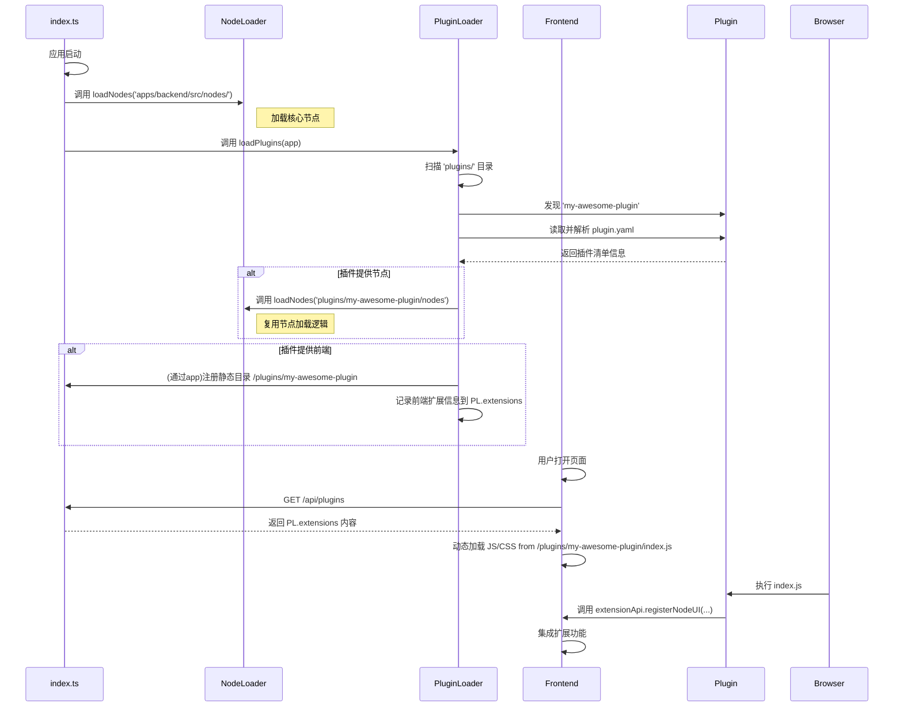

# 插件与扩展架构实施计划 (Plugin & Extension Architecture Implementation Plan)

**文档状态**: `已批准，待实施`

## 1. 目标与原则

借鉴 ComfyUI 成熟的扩展模型，并结合我们现有的系统架构，我们设计一套清晰、解耦的插件系统。此系统的核心目标是分离“节点定义”与“功能扩展”，允许社区开发者以安全、规范的方式，为 ComfyTavern 添加从纯前端界面到后端节点的各类功能。

**设计原则:**

- **清晰解耦**: 明确区分核心节点 (`apps/backend/src/nodes/`) 与社区插件 (`plugins/`)。插件的管理和加载由独立的 `PluginLoader` 服务负责，`NodeLoader` 负责其单一职责：从指定路径加载节点。
- **结构化**: 插件必须拥有 `plugin.yaml` 清单文件，作为其身份和能力的唯一声明。我们选用 YAML 格式，因为它对开发者友好且支持注释。
- **兼容性**: 方案与现有系统无缝集成。`PluginLoader` 将复用 `NodeLoader` 来加载插件中的节点，而不是重复造轮子。
- **安全性**: 前端扩展代码在受控环境中运行，并通过权限模型约束其行为。
- **易用性**: 开发者只需遵循简单的目录结构和 YAML 清单规范，即可创建功能强大的插件。
- **“近 PR”体验**: 提供非侵入式的“近 PR”体验，将社区创造力引导至规范化的扩展路径上。

## 2. 插件化目录结构

我们将重构现有的 `plugins/` 目录，使其与 `apps/backend/src/nodes/` 目录一起，各自承担更明确的职责。

```
ComfyTavern/
├── apps/
│   └── backend/
│       └── src/
│           └── nodes/      # 存放核心内置节点
│               └── ...
└── plugins/                # (重构) 存放所有第三方或非核心插件
    ├── my-awesome-plugin/  # 一个功能丰富的插件
    │   ├── nodes/          # (可选) 此插件提供的后端节点
    │   │   └── AwesomeNode.ts
    │   ├── web/            # (可选) 此插件的前端资源
    │   │   ├── index.js
    │   │   └── style.css
    │   └── plugin.yaml     # (必需) 插件清单文件
    │
    └── my-theme-only/      # 一个纯前端主题插件
        ├── web/
        │   └── theme.css
        └── plugin.yaml
```

- **`apps/backend/src/nodes/`**: 仅用于存放项目自带的核心节点。
- **`plugins/`**: 所有第三方扩展、非核心功能模块的家。一个插件可以只包含前端 (`web/`)，或只包含后端节点 (`nodes/`)，或两者兼备。

## 3. 插件清单 (`plugin.yaml`)

每个插件目录中**必须包含**一个 `plugin.yaml` 文件，它选用对人类更友好的 YAML 格式，并支持注释。

```yaml
# 插件的唯一标识符，应使用 kebab-case 命名法
name: my-awesome-plugin
# 显示给用户的名称
displayName: 我的超棒插件
version: 1.0.0
description: 这个插件能极大地提升生产力，并添加了一个神奇的节点。

# (可选) 声明此插件提供的后端节点
nodes:
  # 节点定义的入口文件或目录，相对于此 YAML 文件的位置
  entry: ./nodes

# (可选) 声明此插件提供的工具
# 注意：工具的具体接口（参数、实现）在独立的 *.tool.json 文件中定义，
# plugin.yaml 只负责声明工具所在的目录，以便 ToolManager 发现它们。
tools:
  # 工具定义文件所在的目录
  entry: ./tools

# (可选) 声明此插件提供的前端资源
frontend:
  # 开发模式下的入口，用于 Vite 集成
  dev:
    entry: web/index.ts
  # 构建（生产）模式下的产物
  build:
    # 构建后的 JS 入口
    entry: dist/index.js
    # 构建后的 CSS 文件
    styles:
      - dist/style.css

# (可选) 声明插件需要的权限。插件必须明确声明其所需权限，以便用户审查。
permissions:
  # 申请使用哪些钩子 (详见附录 B)
  hooks:
    - "hook:client:auth:login"                # 用户登录后执行操作
    - "hook:client:settings:before-save"      # 保存设置前进行验证
    - "hook:client:workflow:before-execute"   # 执行前修改输入
    - "hook:server:nodemanager:before-register" # 在节点注册前修改其定义

  # 申请包裹或注入哪些 UI 组件 (详见附录 A)
  ui:
    # 包裹核心组件
    wrap:
      - "ui:BaseNode"           # 包裹基础节点，通过检查 props.type 实现对特定节点的 UI 定制
      - "ui:NodeInputControl"   # 包裹所有输入控件，添加统一功能
      - "ui:ContextMenu"        # 包裹上下文菜单，添加全局菜单项
      - "ui:SidebarManager"     # 包裹编辑器侧边栏
      - "ui:HomeSidebar"        # 包裹主页侧边栏
    # 注入 UI 到指定插座
    inject:
      - "node:header:right"     # 在节点头部添加快速操作图标
      - "sidebar:icon-bar:tabs:after" # 在侧边栏添加新的功能面板入口
      - "modal:footer"          # 在通用模态框底部添加自定义按钮
    # 替换核心组件 (高风险)
    override: []

  # 申请替换哪些核心服务 (最高风险)
  services:
    override:
      - "workflowManager"
```

## 4. 后端改造方案

### 4.1. 类型定义 (`packages/types/src/plugin.ts`)

**行动项**: 在 `code` 模式下，创建以下文件。

- **文件路径**: `packages/types/src/plugin.ts`
- **文件内容**:
  ```typescript
  /**
   * @fileoverview 定义插件系统的核心类型，如插件清单 (Manifest) 和扩展信息 (ExtensionInfo)。
   */
  
  // 暂时使用 any，后续应从 './settings' 导入 SettingItemConfig
  type SettingItemConfig = any;
  
  /**
   * 定义了 `plugin.yaml` 清单文件的结构。
   */
  export interface PluginManifest {
    name: string;
    displayName: string;
    version: string;
    description?: string;
    nodes?: {
      entry: string;
    };
    frontend?: {
      type?: 'vite' | 'vanilla';
      dev?: {
        entry: string;
      };
      build?: {
        entry: string;
        styles?: string[];
        outputDir: string;
      };
      vanilla?: {
        entry: string;
        styles?: string[];
        rootDir?: string;
      }
    };
    configOptions?: SettingItemConfig[];
  }
  
  /**
   * 定义了通过 API 向前端暴露的插件信息结构。
   */
  export interface ExtensionInfo {
    name: string;
    displayName: string;
    version: string;
    description?: string;
    frontend?: {
      entryUrl: string;
      styleUrls: string[];
    };
    configOptions?: SettingItemConfig[];
  }
  ```
- **后续行动**: 修改 `packages/types/src/index.ts`，添加 `export * from './plugin';`。

### 4.2. 创建 `PluginLoader` 服务

**行动项**: 在 `code` 模式下，创建 `apps/backend/src/services/PluginLoader.ts`。

- **`PluginLoader.ts` 完整实现**:

  ```typescript
  // apps/backend/src/services/PluginLoader.ts
  import { Elysia } from 'elysia';
  import { staticPlugin } from '@elysiajs/static';
  import yaml from 'js-yaml';
  import { promises as fs } from 'node:fs';
  import path from 'node:path';
  import { getProjectRootDir } from '../utils/fileUtils';
  import { NodeLoader } from './NodeLoader';
  import type { PluginManifest, ExtensionInfo } from '@comfytavern/types'; // +++ 从公共包导入类型

  export class PluginLoader {
    public static extensions: ExtensionInfo[] = [];

    public static async loadPlugins(app: Elysia): Promise<void> {
      const pluginsDir = path.join(getProjectRootDir(), 'plugins');
      try {
        const pluginDirs = await fs.readdir(pluginsDir, { withFileTypes: true });

        for (const dirent of pluginDirs) {
          if (!dirent.isDirectory()) continue;

          const pluginName = dirent.name;
          const pluginPath = path.join(pluginsDir, pluginName);
          const manifestPath = path.join(pluginPath, 'plugin.yaml');

          try {
            const manifestContent = await fs.readFile(manifestPath, 'utf-8');
            const manifest = yaml.load(manifestContent) as PluginManifest;

            // 1. 处理前端资源
            const extensionInfo: ExtensionInfo = {
              name: manifest.name,
              displayName: manifest.displayName,
              version: manifest.version,
              description: manifest.description,
              configOptions: manifest.configOptions,
            };

            if (manifest.frontend) {
              const publicPath = `/plugins/${manifest.name}`;
              let assetPath: string;
              let entryFile: string;
              let styleFiles: string[] = [];

              if (manifest.frontend.type === 'vanilla' && manifest.frontend.vanilla) {
                assetPath = path.join(pluginPath, manifest.frontend.vanilla.rootDir || 'web');
                entryFile = manifest.frontend.vanilla.entry;
                styleFiles = manifest.frontend.vanilla.styles || [];
              } else if (manifest.frontend.build) { // 默认为 vite 类型
                assetPath = path.join(pluginPath, manifest.frontend.build.outputDir);
                entryFile = manifest.frontend.build.entry;
                styleFiles = manifest.frontend.build.styles || [];
              } else {
                 console.warn(`[PluginLoader] Plugin '${pluginName}' has a frontend section but is missing 'build' or 'vanilla' configuration. Skipping frontend part.`);
                 continue;
              }

              app.use(staticPlugin({ assets: assetPath, prefix: publicPath, alwaysStatic: true }));
              
              extensionInfo.frontend = {
                entryUrl: `${publicPath}/${entryFile.replace(/^\.\//, '')}`,
                styleUrls: styleFiles.map(s => `${publicPath}/${s.replace(/^\.\//, '')}`),
              };
            }
            
            this.extensions.push(extensionInfo);

            // 2. 处理后端节点 (复用 NodeLoader)
            if (manifest.nodes) {
              const nodesPath = path.join(pluginPath, manifest.nodes.entry);
              await NodeLoader.loadNodes(nodesPath);
            }

            // 3. 处理工具 (由 ToolManager 负责加载)
            if (manifest.tools) {
              const toolsPath = path.join(pluginPath, manifest.tools.entry);
              // 假设存在一个 ToolManager 来处理工具的加载
              // await ToolManager.loadToolsFromPath(toolsPath);
              console.log(`[PluginLoader] Found tools for '${manifest.displayName}' at: ${toolsPath}. ToolManager should handle loading.`);
            }
            console.log(`[PluginLoader] Successfully loaded plugin: ${manifest.displayName} (v${manifest.version})`);

          } catch (error) {
            console.error(`[PluginLoader] Failed to load plugin '${pluginName}':`, error);
          }
        }
      } catch (error: any) {
        if (error.code === 'ENOENT') {
          console.log('[PluginLoader] "plugins" directory not found. Skipping plugin loading.');
        } else {
          console.error('[PluginLoader] Error reading plugins directory:', error);
        }
      }
    }
  }
  ```

### 4.3. 修改应用启动流程 (`index.ts`)

**行动项**: 在 `code` 模式下，修改 `apps/backend/src/index.ts`。

在加载完核心和自定义节点后，调用 `PluginLoader`。

```typescript
// apps/backend/src/index.ts

// ... (导入)
import { NodeLoader } from './services/NodeLoader';
import { PluginLoader } from './services/PluginLoader'; // +++ 导入 PluginLoader
import { nodeManager } from './services/NodeManager';
// ...

// 1. 加载内置节点
const builtInNodesPath = join(__dirname, "nodes");
console.log(`[ComfyTavern Backend] Loading built-in nodes from: ${builtInNodesPath}`);
await NodeLoader.loadNodes(builtInNodesPath);

// 2. 加载自定义节点路径 (从 config.json 读取)
// 注意：此为兼容旧版自定义节点目录的逻辑，未来可能会被插件系统取代。
if (CUSTOM_NODE_PATHS && CUSTOM_NODE_PATHS.length > 0) {
  // ... (原有逻辑保持不变)
}

// 3. 加载插件
console.log(`[ComfyTavern Backend] Loading plugins...`);
await PluginLoader.loadPlugins(app); // +++ 将 app 实例传入

// 在所有节点和插件加载完成后，统一打印注册节点列表
// ... (原有打印逻辑保持不变)
```

### 4.4. API 端点

**行动项**: 在 `code` 模式下，创建 `apps/backend/src/routes/pluginRoutes.ts` 并挂载。

- **`pluginRoutes.ts` 完整实现**:

  ```typescript
  // apps/backend/src/routes/pluginRoutes.ts
  import { Elysia } from 'elysia';
  import { PluginLoader } from '../services/PluginLoader';

  export const pluginRoutes = (app: Elysia) =>
    app.group('/api/plugins', (group) =>
      group.get('/', () => {
        // 直接返回已加载并格式化好的插件信息
        return PluginLoader.extensions;
      })
    );
  ```
- **在 `index.ts` 中挂载**:
  ```typescript
  // apps/backend/src/index.ts
  // ...
  import { pluginRoutes } from './routes/pluginRoutes';
  // ...
  const app = new Elysia();
  // ...
  app.use(pluginRoutes); // +++ 挂载路由
  // ...
  ```

## 5. 前端改造方案

### 5.1. 插件加载器 (`PluginLoader`)

在 `apps/frontend-vueflow/src/services/` 目录下创建 `PluginLoaderService.ts`。

- **`PluginLoaderService.ts` 实现**:
  ```typescript
  // apps/frontend-vueflow/src/services/PluginLoaderService.ts
  import { api } from '@/utils/api';

  interface ExtensionInfo {
    name: string;
    displayName: string;
    version: string;
    description?: string;
    frontend?: {
      entryUrl: string;
      styleUrls: string[];
    };
  }

  export async function loadPlugins() {
    try {
      const extensions = await api.get<ExtensionInfo[]>('/api/plugins');
      
      for (const ext of extensions.data) {
        if (ext.frontend) {
          // 加载 CSS
          ext.frontend.styleUrls.forEach(url => {
            const link = document.createElement('link');
            link.rel = 'stylesheet';
            link.href = url;
            document.head.appendChild(link);
          });

          // 加载 JS
          const script = document.createElement('script');
          script.type = 'module';
          script.src = ext.frontend.entryUrl;
          document.body.appendChild(script);
          
          console.log(`[PluginLoader] Loaded plugin: ${ext.displayName}`);
        }
      }
    } catch (error) {
      console.error('[PluginLoader] Failed to load plugins:', error);
    }
  }
  ```
- **在 `main.ts` 中调用**:
  ```typescript
  // apps/frontend-vueflow/src/main.ts
  import { createApp } from 'vue';
  import { loadPlugins } from './services/PluginLoaderService';
  // ...
  
  async function initializeApp() {
    const app = createApp(App);
    // ... (其他 app.use)
    
    // 在挂载应用前加载插件
    await loadPlugins();
    
    app.mount('#app');
  }
  
  initializeApp();
  ```

### 5.2. 前端扩展 API

在 `apps/frontend-vueflow/src/` 的某个合适位置（如 `services` 或新目录 `api`）定义和暴露全局 API。

```typescript
// apps/frontend-vueflow/src/services/ExtensionApiService.ts

// 这是一个简化的示例，实际实现会更复杂，涉及权限检查等
class ExtensionApi {
  registerNodeUI(nodeType: string, component: any) {
    console.log(`Extension wants to register UI for ${nodeType}`);
    // ... 实现注册逻辑，例如通过一个 store
  }
  // ... 其他 API 方法
}

// 在应用初始化时，将 API 实例暴露到 window 对象
function initializeExtensionApi() {
  if (!window.ComfyTavern) {
    window.ComfyTavern = {};
  }
  window.ComfyTavern.extensionApi = new ExtensionApi();
}

// 在 main.ts 中调用 initializeExtensionApi()
```

### 5.3. 开发模式与生产模式

#### 开发模式 (Development Mode)

**方案**: 修改 `apps/frontend-vueflow/vite.config.ts` 以支持插件 HMR。

```typescript
// apps/frontend-vueflow/vite.config.ts
import { defineConfig } from 'vite';
import vue from '@vitejs/plugin-vue';
import path from 'path';
import fs from 'fs';
import yaml from 'js-yaml';

// 动态扫描插件并返回它们的开发入口
function getPluginDevEntries() {
  const entries = {};
  const pluginsDir = path.resolve(__dirname, '../../plugins');
  if (!fs.existsSync(pluginsDir)) return entries;

  const pluginDirs = fs.readdirSync(pluginsDir);
  for (const dir of pluginDirs) {
    const manifestPath = path.join(pluginsDir, dir, 'plugin.yaml');
    if (fs.existsSync(manifestPath)) {
      const manifest = yaml.load(fs.readFileSync(manifestPath, 'utf8'));
      if (manifest.frontend?.dev?.entry) {
        // 重要：这里的 key 需要一个特殊的格式，但为了简单起见，我们先用插件名
        // 实际应用中可能需要更复杂的处理来避免冲突
        entries[manifest.name] = path.resolve(pluginsDir, dir, manifest.frontend.dev.entry);
      }
    }
  }
  return entries;
}

export default defineConfig({
  // ...
  build: {
    rollupOptions: {
      input: {
        main: path.resolve(__dirname, 'index.html'),
        ...getPluginDevEntries(),
      },
    },
  },
});
```
**注意**: 前端在开发模式下加载插件的逻辑需要调整，不能再通过 `loadPlugins` 加载构建产物，而是直接 `import` 由 Vite 处理的入口。这部分逻辑较为复杂，需要进一步设计。

#### 生产模式 (Production Mode)

生产模式的行为与 5.1 节描述的一致，加载由后端伺服的、插件自构建的静态资源。

### 5.4. 插件清单 (`plugin.yaml`) 演进

为了支持不同复杂度的前端插件，`frontend` 部分需要支持两种模式：`vite` (用于需要构建的复杂应用) 和 `vanilla` (用于无需构建的简单脚本和样式)。

```yaml
# ...
frontend:
  # (可选) 声明插件类型，默认为 'vite'
  # 'vite': 需要开发/构建流程，适用于 Vue/React 组件等。
  # 'vanilla': 纯 JS/CSS，无需构建，直接加载源文件。
  type: vite

  # --- 当 type 为 'vite' 时 ---
  # 开发模式配置
  dev:
    # Vite 开发服务器需要监听的入口文件 (源文件)
    entry: web/index.ts
  # 生产模式配置
  build:
    # 构建后的 JS 入口文件
    entry: dist/index.js
    # 需要加载的额外样式文件列表 (构建后)
    styles:
      - dist/style.css
    # 静态资源目录，相对于 plugin.yaml
    # 后端将伺服此目录到 /plugins/{pluginName}
    outputDir: dist

# --- 或者，对于简单的插件 ---
frontend:
  type: vanilla
  # JS 入口文件 (源文件)
  entry: web/main.js
  # 样式文件列表 (源文件)
  styles:
    - web/theme.css
  # 静态资源根目录，后端将伺服此目录
  # 如果不提供，默认为 'web'
  rootDir: web
```

### 5.5. 对后端 `PluginLoader` 的影响

`PluginLoader` 在解析 `plugin.yaml` 时需要根据 `frontend.type` 进行差异化处理，这已在 4.1 节的 `PluginLoader.ts` 完整实现中体现。

## 6. 工作流程图 (Mermaid)



## 8. 实现'近 PR' 效果的分层 API 策略

为了实现“在不 PR 的情况下进行规范化改造”的目标，我们将 `extensionApi` 从设计哲学上进行升维。它不应仅仅是功能的“调用者”，更应该是核心应用的“手术刀”和“嫁接器”。我们将这套 API 按能力强度和侵入性，划分为三个层次，以覆盖绝大多数 PR 场景。

### 8.1. 第一层：安全“添加” (The Additive Layer)

此层级对应“我希望这里能多个东西”的需求，是最基础、最安全的一层，用于无风险地扩充应用能力。

- **核心能力**: 在预留的“插槽”（Plugin Outlets）中添加新内容。
- **API 示例**:
  - `api.ui.addMenuItem(...)`: 在主菜单、右键菜单等位置添加新选项。
  - `api.ui.addPanel(...)`: 在侧边栏或底部添加一个全新的面板。
  - `api.nodes.registerUI(...)`: 为特定节点类型注册一个自定义的 Vue 组件作为其界面。
  - `api.router.addRoute(...)`: 添加一个全新的页面/视图，拥有自己的 URL。
  - `api.ui.registerOutletComponent(outletName: string, component: VueComponent)`: **(推荐)** 向指定的“插件插座”注册一个组件。核心 UI 的关键位置（如节点头部、设置页面底部）会放置命名的 `<PluginOutlet name="..."/>` 组件，插件可直接向其注入 UI，这比覆盖组件更灵活、侵入性更低。

### 8.2. 第二层：受控“修改” (The Interceptive Layer)

此层级对应“我希望这个过程能有所不同”的需求，允许插件“拦截”和“包装”核心行为与数据。

- **核心能力**: 在不替换核心代码的情况下，通过钩子和装饰器模式，修改其行为。
- **API 示例**:
  - `api.hooks.on(hookName: string, callback: Function)`: 强大的钩子系统，类似 WordPress。我们可以在 `workflow:before-execute` 时修改输入，在 `node:render:after` 时添加额外信息，在 `settings:save:before` 时进行验证等。钩子应遍布应用关键流程。
  - `api.ui.wrapComponent(componentId: string, wrapper: (original: VueComponent) => VueComponent)`: **(关键)** “装饰器模式”的体现。它并非直接替换，而是向插件提供“原始组件”的定义，并允许插件返回一个“包装后”的新组件。这比直接替换要灵活和安全得多。

### 8.3. 第三层：完全“替换” (The Override Layer)

此层级是最后的“杀手锏”，对应“我认为这个核心部分可以做得更好”的颠覆性需求。

- **核心能力**: 完全用自己的实现替换掉核心的某个模块（组件或服务）。
- **API 示例**:
  - `api.ui.overrideComponent(componentId: string, newComponent: VueComponent)`: 直接将核心的画布组件、侧边栏等替换为插件自己的实现。
  - `api.services.override(serviceName: string, newService: object)`: **(终极武器)** 替换掉核心服务，如 `workflowManager`。这意味着插件可以重写整个后端执行逻辑。

这些分层机制能覆盖绝大多数 PR 场景，而无需修改核心代码。对于极少数无法覆盖的深度修改，仍需 PR，但这大大降低了门槛。

### 8.4. 安全与权限模型

要提供如此强大的能力而不导致混乱，必须配上同样强大的安全与权限“缰绳”。

1.  **权限声明 (`plugin.yaml`)**:

    - 插件必须在自己的 `plugin.yaml` 清单文件中，像申请应用权限一样，明确声明它需要使用哪个级别的能力（见第 3 节示例）。
    - 用户（尤其是管理员）在安装或启用插件时，可以清楚地看到这个插件申请了哪些高风险权限（如 `override`），并决定是否授权。

2.  **代理模式 (Proxy Pattern) 与 API 守卫**:

    - 当插件通过 `api.services.get('someService')` 请求核心服务时，永远不返回原始对象，而是返回一个 `Proxy` 对象。
    - **默认只读**: `getService` 默认返回只读代理，防止插件意外修改核心服务状态。
    - **API 守卫**: 代理可以阻止插件调用内部私有方法（如 `_internalReset`），只暴露稳定的公共 API。

3.  **沙箱化 (Sandboxing)**:

    - **君子协定 (现阶段)**: 当前方案信任插件代码是善意的。
    - **未来增强**: 对于安全性要求极高的场景，可考虑将插件的前端代码运行在 **Web Worker** 或 **沙箱化 `iframe`** 中。与主应用的通信通过 `postMessage` 进行，这是 Web 环境下实现第三方代码安全隔离的黄金标准。

4.  **生命周期与监控**:
    - **配置与开关**: 用户可以一键禁用行为异常的插件（见第 9 节），这是最后的保险丝。
    - **性能监控**: 监控扩展性能，如果某个扩展导致问题，能动态禁用。


## 9. 扩展配置与开关系统

为了提供灵活控制，我们引入配置系统，该系统将无缝集成到现有的数据驱动设置页面中。

### 9.1. 清单中的配置声明

插件的 `plugin.yaml` 可以添加 `configOptions` 数组。**此数组的结构必须严格遵守 `SettingItemConfig` 接口** ([`apps/frontend-vueflow/src/types/settings.ts`](apps/frontend-vueflow/src/types/settings.ts:1))。

```yaml
name: my-awesome-plugin
displayName: 我的超棒插件
# ...
configOptions:
  - key: "extensions.my-awesome-plugin.enableFeatureX"
    type: "boolean"
    label: "启用功能 X"
    description: "是否激活实验性功能 X。"
    defaultValue: true
    categoryKey: "features"
    category: "功能开关"
  - key: "extensions.my-awesome-plugin.maxItems"
    type: "number"
    label: "最大项目数"
    defaultValue: 10
    min: 1
    max: 50
    step: 1
    categoryKey: "limits"
    category: "限制"
```

**关键约定**:

- **`key`**: 必须遵循 `extensions.{pluginName}.{optionId}` 的格式，以确保全局唯一性并避免冲突。`{pluginName}` 应与 `plugin.yaml` 中的 `name` 字段一致。
- **其他字段**: `type`, `label`, `defaultValue`, `categoryKey` 等均与 `SettingItemConfig` 定义一致。

### 9.2. 前端集成方案：入口 + 模态框

为了保持主设置页面的整洁，我们将采用“入口列表 + 独立配置模态框”的二级结构，并与现有 UI 服务深度集成。

1.  **创建“扩展”主分区**:

    - 在 `SettingsLayout.vue` 中，动态创建一个名为 "扩展" (`extensions`) 的 `SettingsSection`。
    - 这个分区的 `dataConfig` 将被构造成一个 `SettingItemConfig` 数组，每个元素代表一个插件的入口。

2.  **渲染扩展入口**:

    - `SettingsPanel` 会遍历这个 `dataConfig` 数组。
    - 对每一个插件，我们生成一个类型为 `action-button` 的 `SettingItemConfig`，并将其添加到 `dataConfig` 中。
    - `SettingItemRow` 会自动渲染出插件的名称、描述以及一个“配置”按钮。

3.  **打开配置模态框**:

    - 点击“配置”按钮会触发 `onClick` 事件。
    - 该事件将调用一个模态框服务。**推荐方案**：扩展 `uiStore`，增加一个通用的 `openComponentAsModal(component, props)` 方法，它能接收任何组件和其 props，并将其渲染在一个基础模态框 `BaseModal.vue` 中。这比 `DialogService` 更灵活，因为它不局限于简单的“确认/取消”模式，能更好地承载复杂组件。

4.  **配置模态框**:
    - 创建一个 `ExtensionConfigPanel.vue` 组件，它接收 `configOptions` 作为 prop。
    - 在其内部，它会使用我们熟悉的 `<SettingsPanel :config="props.configOptions" />` 来渲染具体的配置表单。
    - 这样，我们依然**完全复用**了 `SettingsPanel`, `SettingGroup`, `SettingItemRow`, `SettingControl` 等所有数据驱动的 UI 组件。

**示例 `onClick` 实现**:

```javascript
// 在 SettingsLayout.vue 中为每个插件动态生成这个 SettingItemConfig
{
  key: `ext-entry-${extension.name}`,
  type: 'action-button',
  label: extension.displayName,
  description: extension.description,
  buttonText: '配置',
  onClick: () => {
    // 调用一个能打开 BaseModal 并动态渲染组件的 uiStore action
    // 这个 action 会更新 uiStore 的状态，由一个全局的 BaseModal 监听并渲染
    uiStore.openModalWithContent({ // 假设我们创建或使用了这样一个 action
      component: defineAsyncComponent(() => import('@/components/settings/ExtensionConfigPanel.vue')),
      props: {
        configOptions: extension.configOptions
      },
      modalProps: {
        title: `${extension.displayName} - 配置`,
        width: 'max-w-2xl', // 自定义模态框宽度
        height: '80vh'
      }
    });
  }
}
```

这个 `openModalWithContent` action 会更新 `uiStore` 的状态，而一个全局的 `DialogContainer.vue` 组件会监听这些状态，在其内部渲染 `<BaseModal>`，并将 `ExtensionConfigPanel` (即 `PluginDetailModal`) 作为 `#content` 插槽的内容传递进去。这套机制完全复用了现有强大的 `BaseModal.vue` 组件和全局 `uiStore` 状态管理。

3.  **状态管理集成**:
    - 所有扩展的配置值都将由现有的 `settingsStore` 管理。
    - **持久化**: `settingsStore` 将被改造，不再使用 `localStorage`，而是通过后端 API (`GET /api/profile/settings`, `POST /api/profile/settings`) 从数据库中加载和保存设置。这确保了所有配置（包括核心和扩展的）都能在用户账户下跨设备同步。
    - `SettingControl` 的行为保持不变，它依然通过 `settingsStore` 读写数据，底层的持久化逻辑对它来说是透明的。

### 9.3. API 扩展

`extensionApi` 提供的方法将直接代理到 `settingsStore`，并自动处理 key 的前缀。

```typescript
// 在 ExtensionApiService 内部实现
interface ExtensionApi {
  // ...
  // pluginName 会由 API 服务在内部自动获取
  getConfig(optionId: string): any;
  onConfigChange(optionId: string, callback: (newValue: any) => void): void;
}

// 示例实现:
class ExtensionApiService {
  private pluginName: string;
  constructor(pluginName: string) { this.pluginName = pluginName; }

  getConfig(optionId: string) {
    const key = `extensions.${this.pluginName}.${optionId}`;
    // 从 plugin.yaml 中找到对应的 config，获取 defaultValue
    const defaultValue = ...;
    return useSettingsStore().getSetting(key, defaultValue);
  }

  onConfigChange(optionId: string, callback: (newValue: any) => void) {
    const key = `extensions.${this.pluginName}.${optionId}`;
    watch(() => useSettingsStore().settings[key], callback);
  }
}
```

### 9.4. 后端支持

- 后端在 `/api/plugins` 响应中，需要完整地返回每个插件的 `configOptions` 数组。前端将利用这些元数据来动态构建设置界面。
- `PluginLoader` 负责在扫描时收集所有插件信息（包括 `web` 目录路径和 `configOptions`）。
- 主 `index.ts` 文件在启动时，调用 `PluginLoader.loadPlugins(app)` 来完成所有插件的加载和静态目录注册。

### 9.5. 前端启动流程

- 在 `main.ts` 中，`PluginLoader` 的初始化和执行应在 `app.use(router)` 之后，`app.mount('#app')` 之前。

## 10. 多用户模式支持

结合现有的 `local-user-system-design.md`，我们为多用户模式设计以下具体的插件管理和配置策略。

### 10.1. 插件的安装、发现与启用状态

1.  **安装与发现 (系统级)**:

    - 插件的安装（即代码文件放置在 `plugins/` 目录）是物理层面的，由系统管理员完成。
    - `PluginLoader` 在后端启动时会**发现**所有物理存在的插件包。

2.  **启用状态 (全局配置)**:
    - 一个插件被发现后，不代表它对用户可用。它的“启用/禁用”状态是一个**全局配置**。
    - 这个状态将存储在数据库的一个新表 `system_settings` 中（例如，`key: 'extensions.my-awesome-plugin.enabled'`, `value: 'true'`)。
    - **只有管理员** (`isAdmin: true`) 才能修改插件的全局启用状态。

### 10.2. 配置的存储与权限

1.  **全局配置 (`scope: 'global'`)**:

    - 在 `plugin.yaml` 的 `configOptions` 中，可以添加 `scope: 'global'` 字段（替代 `global: true`，语义更清晰）。
    - 这些配置项的值也存储在 `system_settings` 表中。
    - 只有管理员能通过专门的管理界面修改这些值。

2.  **个人配置 (`scope: 'user'`, 默认)**:
    - 这些配置项的值存储在 `user_settings` 表中（或类似的用户数据结构中），与 `users.uid` 关联。
    - 任何用户都可以修改自己的个人配置，前提是该插件已被管理员全局启用。

### 10.3. 后端 API 扩展

1.  **`/api/plugins` (GET)**:

    - 此 API 的响应需要扩展，增加一个 `isEnabled` 字段，告诉前端该插件是否已被管理员全局启用。
    - 前端 `PluginLoader` 将只加载 `isEnabled: true` 的插件的 JS/CSS。

2.  **管理员 API (`/api/admin/plugins`)**:

    - **`GET /`**: 获取所有**已发现**的插件列表及其当前的全局启用状态。
    - **`POST /toggle`**: 切换一个插件的全局启用/禁用状态。请求体：`{ name: 'my-awesome-plugin', enabled: boolean }`。

3.  **设置 API**:
    - **`GET /api/profile/settings`**: 返回当前用户的**个人设置**。
    - **`GET /api/system/settings`**: 返回所有**全局设置**（包括插件的全局配置）。前端会在加载时同时请求这两个接口，然后合并成完整的配置状态。
    - **`POST /api/profile/settings`**: 普通用户用此接口更新自己的**个人设置**。
    - **`POST /api/admin/settings`**: 管理员用此接口更新**全局设置**。

### 10.4. 前端 UI 流程

- **普通用户**:
  - 在“扩展”设置区，只看到**已启用**插件的个人配置入口。
- **管理员**:
  - 拥有一个额外的“插件管理”设置分区。
  - 在此分区，可以看到所有**已发现**的插件列表，并可以通过开关来全局启用/禁用它们。
  - 可以在此分区或“扩展”分区的特定区域修改插件的**全局配置**。

## 11. 附录 A: UI 注入点详解 (UI Injection Points)

为了支撑一个健壮的插件生态，我们必须定义一套稳定、清晰、可预测的核心 UI 注入点。这是连接插件与主应用的桥梁，也是本附录的核心内容。

### 11.1. 设计原则：包裹、插座与钩子的选择

为了帮助开发者做出正确的技术选型，我们提供以下指导原则：

- **使用插座 (Outlet) 当你想要“添加”**:
  - **场景**: 在一个预设的、非侵入性的位置添加一个**全新的、独立的 UI 单元**。
  - **例子**: 在节点头部添加一个状态图标 (`node:header:right`)，或在侧边栏添加一个全新的功能面板 (`sidebar:icon-bar:tabs:after`)。
  - **优势**: 完全解耦，风险最低，插件之间不会相互影响。

- **使用包裹 (Wrapping) 当你想要“修改”或“增强”**:
  - **场景**: 修改一个**已有的核心组件**的行为或外观，例如在其前后添加元素、修改传入的 props 或监听其内部事件。
  - **例子**: 为所有节点添加一个自定义边框 (`ui:BaseNode`)，或在设置面板顶部添加一个全局警告 (`ui:SettingsPanel`)。
  - **优势**: 功能强大，能实现深度定制。但存在风险，多个插件包裹同一个组件时可能产生冲突。

- **使用钩子 (Hook) 当你想要“响应”或“拦截”**:
  - **场景**: 响应一个**业务逻辑事件**或**拦截一个数据流**，通常不直接涉及 UI 渲染。
  - **例子**: 在工作流执行前验证或修改输入数据 (`hook:client:workflow:before-execute`)，或在用户登录后执行特定操作 (`hook:client:auth:login`)。
  - **优势**: 深入业务逻辑，实现功能自动化和流程改造。

### 11.2. UI 包裹 (Wrapping)

使用 `api.ui.wrapComponent(componentId, wrapper)`。它允许插件用自己的逻辑“包裹”一个核心组件。

#### 核心组件 ID 列表 (可用于 `wrapComponent`)

为了与节点的 `core` 命名空间区分，所有核心 UI 组件的 ID 都使用 `ui:` 前缀。

| ID | 组件/区域 | 描述与用途 |
| --- | --- | --- |
| `ui:BaseNode` | **基础节点组件** | 包裹所有节点的基础渲染组件 (`BaseNode.vue`)。插件可以通过检查 `props.type` 来实现对特定类型节点的 UI 定制。**这是实现节点级 UI 扩展的核心。** |
| `ui:NodeInputControl` | **节点输入控件** | **（新）** 包裹由 `getInputComponent` 动态解析出的具体输入控件（如 `InputNumber`, `InputText`）。这允许插件统一修改所有输入控件的行为，例如添加统一的“重置”按钮。 |
| `ui:GraphEditor` | 主画布编辑器 | 包裹整个画布区域，可用于添加全局覆盖、监听画布事件等。 |
| `ui:ContextMenu` | **上下文菜单** | **（新）** 包裹整个上下文菜单（右键菜单）组件。允许插件添加全局菜单项、分隔线，或根据上下文动态修改现有菜单项。 |
| `ui:SidebarManager` | 编辑器侧边栏管理器 | 包裹整个编辑器侧边栏 (`SidebarManager.vue`)。 |
| `ui:HomeSidebar` | 主页侧边栏 | 包裹主页的侧边栏 (`views/home/SideBar.vue`)。 |
| `ui:StatusBar` | 编辑器状态栏 | 包裹底部的状态栏 (`StatusBar.vue`)。 |
| `ui:RightPreviewPanel` | 右侧预览面板 | 包裹右侧的浮动预览面板 (`RightPreviewPanel.vue`)。 |
| `ui:SettingsPanel` | 设置面板 | 包裹整个设置面板，可用于添加顶层警告或说明。 |
| `ui:MainMenu` | 主菜单 | 包裹主菜单组件，可在菜单渲染前后添加逻辑。 |

### 11.3. UI 插座 (Plugin Outlets)

使用 `api.ui.registerOutletComponent(outletName, component)`。核心应用在关键位置预留了命名的 `<PluginOutlet>` 组件，插件可以直接向这些“插座”中添加独立的 UI 单元。

#### 全局布局插座 (`ProjectLayout.vue`)

| 插座名称 | 位置 | 描述 |
| --- | --- | --- |
| `layout:header:before-tabs` | 顶部导航栏，标签页之前 | 在项目“总览”、“编辑器”等主标签页前添加全局元素。 |
| `layout:header:after-tabs` | 顶部导航栏，标签页之后 | 在主标签页后添加全局元素。 |
| `layout:header:right` | 顶部导航栏最右侧 | 用于添加全局图标或按钮，如“帮助”、“通知中心”等。 |

#### 编辑器布局插座 (`EditorView.vue`)

**注意**: `editor:toolbar:*` 系列插座的实现，依赖于在 `EditorView.vue` 中创建一个明确的 `<Toolbar>` 组件来承载这些插座。

| 插座名称 | 位置 | 描述 |
| --- | --- | --- |
| `editor:toolbar:left` | 编辑器顶部工具栏左侧 | 添加与工作流相关的操作按钮，如“导入/导出”。 |
| `editor:toolbar:center` | 编辑器顶部工具栏中间 | 添加模式切换或核心操作按钮。 |
| `editor:toolbar:right` | 编辑器顶部工具栏右侧 | 添加“执行”、“分享”等主要动作按钮。 |
| `editor:canvas:overlay` | 画布容器的覆盖层 | 在画布之上渲染自定义内容，如水印、网格、辅助线或全局提示。 |
| `editor:statusbar:left` | 底部状态栏左侧 | 显示自定义状态信息，如“连接状态”、“插件消息”。 |
| `editor:statusbar:right` | 底部状态栏右侧 | 添加功能性控件，如“性能监视器”、“主题切换”。 |

#### 侧边栏插座 (`SidebarManager.vue`)

`SidebarManager.vue` 采用两段式布局：一个固定的垂直图标栏和一个动态滑出的内容面板。因此，插座主要围绕图标栏和动态加载的面板内容进行设计。

| 插座名称 | 位置 | 描述 |
| --- | --- | --- |
| `sidebar:icon-bar:tabs:before` | 图标栏，核心标签页按钮组之前 | 在“节点”、“工作流”等核心标签页的上方添加插件自己的图标按钮，用于打开自定义侧边栏面板。 |
| `sidebar:icon-bar:tabs:after` | 图标栏，核心标签页按钮组之后 | 在核心标签页的下方添加插件自己的图标按钮。 |
| `sidebar:icon-bar:bottom:before` | 图标栏，底部控制按钮（主题、设置）之前 | 在底部控制区域的上方添加自定义图标按钮。 |
| `sidebar:panel:header[{panelId}]` | 特定面板内部，内容之前 | 在节点列表 (`nodes`) 或工作流列表 (`workflows`) 等面板的顶部添加警告或快捷操作。 |
| `sidebar:panel:footer[{panelId}]` | 特定面板内部，内容之后 | 在特定面板底部添加补充信息或按钮。 |

**注**: 方括号 `[]` 中的 `panelId` 是一个占位符，实际的钩子名称会包含具体的面板 ID，例如 `sidebar:panel:header[nodes]`。

#### 主页侧边栏插座 (`views/home/SideBar.vue`)

| 插座名称 | 位置 | 描述 |
| --- | --- | --- |
| `home:sidebar:header` | 侧边栏顶部，Logo 之后 | 添加全局导航或信息展示，如“最新动态”。 |
| `home:sidebar:nav:before` | 主导航项之前 | 在“项目”、“模板”等核心导航项上方添加自定义导航入口。 |
| `home:sidebar:nav:after` | 主导航项之后 | 在核心导航项下方添加自定义导航入口，如“插件市场”。 |
| `home:sidebar:footer` | 侧边栏底部，用户区域上方 | 添加全局工具或状态显示，如“帮助与反馈”。 |

#### 节点插座 (`BaseNode.vue`)

| 插座名称 | 位置 | 描述 |
| --- | --- | --- |
| `node:header:right` | 节点标题栏右侧 | 在节点标题上添加自定义图标、按钮或状态指示器。 |
| `node:body:before` | 节点主体内容之前 | 在节点控件区域前插入自定义 UI。 |
| `node:body:after` | 节点主体内容之后 | 在节点控件区域后插入自定义 UI，如预览、图表等。 |
| `node:input:actions` | 节点输入项右侧 | **高级**: 这不是一个标准的 `<PluginOutlet>`。相反，它代表了通过节点定义中的 `actions` 数组，向 `NodeInputActionsBar.vue` 组件动态注入自定义按钮的能力。 |

#### 模态框插座 (`BaseModal.vue`)

| 插座名称 | 位置 | 描述 |
| --- | --- | --- |
| `modal:header` | **（新）** 模态框头部 | 在模态框标题区域添加额外的元素或替换整个标题。 |
| `modal:footer` | **（新）** 模态框底部 | 在模态框默认的“确认/取消”按钮区域添加新的按钮，或构建完全自定义的底部操作栏。 |

#### 设置页面插座 (`SettingsLayout.vue` 或类似组件)

| 插座名称 | 位置 | 描述 |
| --- | --- | --- |
| `settings:section:before[${sectionKey}]` | 特定设置分区之前 | 在某个设置分区的开始处添加说明或组件。 |
| `settings:section:after[${sectionKey}]` | 特定设置分区之后 | 在某个设置分区的末尾处添加补充信息或操作。 |

#### 右侧预览面板插座 (`RightPreviewPanel.vue`)

| 插座名称 | 位置 | 描述 |
| --- | --- | --- |
| `preview:panel:header` | 面板头部，标题后 | 在面板标题和模式切换按钮之间添加额外的控制或信息。 |
| `preview:panel:content:before` | 内容区域顶部 | 在预览内容（无论是单一预览还是组总览）的上方添加自定义组件。 |
| `preview:panel:content:after` | 内容区域底部 | 在预览内容的下方添加自定义组件，例如操作按钮或统计信息。 |

## 12. 附录 B: 流程钩子详解 (Process Hooks)

流程钩子是插件深入应用业务逻辑、响应关键事件的核心机制。它们允许插件在不修改核心代码的情况下，对数据和流程进行拦截、验证和增强。

### 12.1. 钩子 API

- **监听钩子**: `api.hooks.on(hookName, callback)`
- **触发钩子 (内部使用)**: `hookService.trigger(hookName, ...args)`

所有钩子都支持异步 `callback`，并可以通过返回 `false` 或抛出错误来中止后续操作（如果钩子设计支持中止）。

### 12.2. 客户端钩子列表 (`hook:client:*`)

这些钩子在前端（浏览器环境）触发。

#### 认证与用户状态 (`authStore.ts`)

| 钩子名称 | 触发时机 | 参数 | 用途与示例 |
| --- | --- | --- | --- |
| `hook:client:auth:login` | 用户成功登录，获取到 `userContext` 之后。 | `(userContext)` | 执行登录后的初始化操作，如加载特定于用户的插件数据。 |
| `hook:client:auth:logout` | 用户成功登出之前。 | `()` | 执行登出前的清理工作，如清除插件在 `localStorage` 中的缓存。 |

#### 设置持久化 (`settingsStore.ts`)

| 钩子名称 | 触发时机 | 参数 | 用途与示例 |
| --- | --- | --- | --- |
| `hook:client:settings:before-save` | `saveSettings` 被调用，即将向后端发送设置数据之前。 | `(settingsObject)` | 验证或动态修改即将保存的设置。插件可以返回一个新的设置对象来替换原始的。 |
| `hook:client:settings:after-load` | 从后端成功获取并应用设置之后。 | `(settingsObject)` | 根据加载的设置初始化插件的某些状态。 |

#### 面板生命周期 (`PanelContainer.vue`)

| 钩子名称 | 触发时机 | 参数 | 用途与示例 |
| --- | --- | --- | --- |
| `hook:client:panel:before-load` | 面板的 `iframe` 即将被挂载到 DOM 中之前。 | `(panelDefinition)` | 准备加载面板所需的前置条件。 |
| `hook:client:panel:after-load` | 面板 `iframe` 的 `load` 事件触发，内容加载完成之后。 | `(panelDefinition, iframeWindow)` | 与面板 `iframe` 内部进行交互，例如通过 `postMessage` 发送初始化数据。 |
| `hook:client:panel:before-unmount` | 面板容器组件即将被卸载之前。 | `(panelDefinition)` | 清理与面板相关的资源，如事件监听器。 |

#### 工作流执行

| 钩子名称 | 触发时机 | 参数 | 用途与示例 |
| --- | --- | --- | --- |
| `hook:client:workflow:before-execute` | 用户点击“执行”按钮，在工作流数据发送到后端之前。 | `(workflowPayload)` | 在客户端对工作流进行最后的验证或修改。例如，一个“Linter”插件可以在执行前检查是否存在未连接的节点并发出警告。 |

#### 节点执行

| 钩子名称 | 触发时机 | 参数 | 用途与示例 |
| --- | --- | --- | --- |
| `hook:client:node:execution:start` | 某个节点开始执行（收到后端 WebSocket 消息）。 | `(nodeId)` | 在 UI 上高亮正在执行的节点。 |
| `hook:client:node:execution:finish` | 某个节点执行完成（收到后端 WebSocket 消息）。 | `(nodeId, outputData)` | 根据节点的输出更新自定义 UI 或触发其他逻辑。 |

### 12.3. 服务端钩子列表 (`hook:server:*`)

这些钩子在后端（Bun 环境）触发，允许对核心服务进行更深度的扩展。

| 钩子名称 | 触发时机 | 参数 | 用途与示例 |
| --- | --- | --- | --- |
| `hook:server:nodemanager:before-register` | `NodeManager` 即将注册一个节点定义之前。 | `(nodeDefinition)` | 在节点被正式注册前，动态修改其定义。例如，为一个节点的所有输入自动添加一个 `description`。 |
| `hook:server:workflow:before-execute` | 后端接收到执行请求，在创建执行队列之前。 | `(workflowPayload, userContext)` | 进行服务端的权限检查或数据验证。 |
| `hook:server:db:before-save` | 任何数据即将被写入数据库之前。 | `(tableName, data)` | 实现自定义的数据审计日志。 |
## 12. 依赖管理与追踪架构

为了确保项目的可移植性、实现可靠的环境检查（例如，提示用户缺少了哪些插件），并为未来的资产市场打下基础，我们必须建立一套健壮且统一的依赖管理与追踪机制。此架构的核心原则是“**注册即声明**”，确保任何资产（无论是节点还是面板）对其所使用的插件资源的依赖关系都是明确且可追踪的。

### 12.1. 统一依赖引用格式

所有对插件资源的引用，无论是静态配置还是动态 API 调用，都必须遵循 `plugin-id:resource-name` 的统一格式。`plugin-id` 通常是插件清单 `plugin.yaml` 中定义的 `name`。

- **节点类型**: `my-awesome-plugin:AddNode`
- **面板主题**: `my-theme-plugin:cyberpunk`
- **面板 API 能力**: `my-component-plugin:ModelViewer`

### 12.2. 节点依赖管理：命名空间即依赖

节点的依赖管理与现有的命名空间机制无缝集成。

- **唯一事实来源**: 节点的 `type` 字段（格式为 `namespace:type`）是其依赖关系的唯一和最终事实来源。`namespace` 部分直接对应其来源插件的 ID。
- **加载时注入**: `NodeLoader` 在加载插件节点时，会强制将插件的 ID 设置为这些节点的 `namespace`，并可以在内存中的 `NodeDefinition` 对象上附加更详细的 `source` 信息（如插件版本）。
- **可移植性**: 由于 `type` 字段自包含了来源信息，节点的复制、粘贴和分享天然具有可移植性。

### 12.3. 面板依赖管理：Panel API 插槽化架构

对于面板这类非节点资产，其依赖关系更为动态。我们通过将其 API 改造为一个“插槽式”注册系统来解决此问题。

- **`PanelApiManager` 与能力插槽**:

  - 系统提供一个全局的 `PanelApiManager` 服务，它定义了一系列可供插件扩展的“**能力插槽**”，例如 `components`, `services`, `themes` 等。
  - 插件在初始化时，必须将其希望提供给面板的能力，**连同其来源信息（插件 ID、版本等）**，一起注册到 `PanelApiManager` 的指定插槽中。
  - **示例**: `panelApiManager.register('component', { id: 'my-plugin:ModelViewer', source: { pluginId: 'my-plugin', ... }, component: ... });`

- **`Panel API Host` 的代理角色**:
  - 面板沙盒的接口 (`Panel API Host`) 作为 `PanelApiManager` 的代理。
  - 当面板调用 `panelApi.getComponent('my-plugin:ModelViewer')` 时，`Panel API Host` 会向 `PanelApiManager` 查询对应的注册项。
  - 因为注册项中已绑定了 `source` 信息，`Panel API Host` 可以**确定性地、无歧义地**识别出该能力的依赖来源是 `my-plugin`。

### 12.4. 依赖的持久化与开发者体验

- **自动依赖持久化**:

  - 当面板在运行时，通过 `Panel API` 首次使用来自某个插件（如 `my-plugin`）的能力时，`Panel API Host` 会确定性地追踪到此依赖。
  - 系统会立即自动将这个新的依赖 ID (`my-plugin`) 更新到该面板的配置中。这通常通过一个后台 API 调用完成，该调用会读取对应的 `panel.json` 文件，将新的依赖项添加到 `meta.requiredPlugins` 数组中，然后保存文件。
  - 对开发者而言，这个过程是透明的。他们只需专注于功能实现，依赖列表会自动保持最新。

- **静态声明作为最终事实**:

  - `panel.json` 文件中 `meta.requiredPlugins` 数组是该面板依赖关系的**最终事实来源 (source of truth)**。它由系统自动维护，保证了面板资产的完整性和可移植性。

- **降级与辅助工具 (容错机制)**:
  - 在自动持久化失败（如文件写入错误）或依赖关系出现不一致（如开发者手动误删）的罕见情况下，开发者辅助工具将作为降级方案启动。
  - 系统可以在开发者工具中提供可靠的警告（例如：“检测到对 'my-plugin' 的运行时依赖，但它不存在于 `panel.json` 的声明中，自动添加失败。请检查文件权限或手动同步。”），并提供“一键同步/修复”工具来修正这些差异。

### 12.5. 项目级依赖聚合

当加载一个项目时，系统会通过以下方式构建完整的依赖列表，用于环境检查：

1.  **扫描工作流**: 遍历所有工作流中的所有节点，解析其 `type` 字段的 `namespace` 部分。
2.  **扫描面板配置**: 遍历所有面板的 `panel.json` 文件，解析其 `meta.requiredPlugins` 数组以及配置中其他遵循 `plugin-id:resource-name` 格式的依赖项。
3.  **聚合去重**: 将所有收集到的 `plugin-id` 聚合去重，形成项目最终的依赖清单。

## 13. 附录 B: 命名空间实施蓝图

为确保本文档中定义的命名空间方案（`core:`, `ui:`, `hook:*`）能够顺利实施，本节将概述在未来开发中需要进行适配的核心代码区域。这为未来的具体实施提供了清晰的指引。

### 13.1. 核心适配点

#### 1. 前端节点类型注册

- **位置**: `apps/frontend-vueflow/src/views/project/EditorView.vue`
- **关注点**: `nodeTypes` 计算属性。
- **适配说明**: 当前，纯前端的 `FrameNode` 被硬编码注册为 `ui:frame`。根据新方案，所有核心内置资产（无论前后端）都应归属于 `core:` 命名空间。因此，在实施时，需要将其注册类型从 `'ui:frame'` 变更为 `'core:frame'`，以保证命名的一致性。

  ```typescript
  // 实施时的目标状态
  const nodeTypes = computed(() => {
    const types: Record<string, any> = {
      default: markRaw(BaseNode),
      'core:frame': markRaw(FrameNode), // 将 'ui:frame' 调整为 'core:frame'
      // ... a
    };
    // ...
  });
  ```

#### 2. 插件 API 定义与实现

- **位置**: 未来的前端 `ExtensionApiService` 和后端 `PluginManager` 等服务中。
- **关注点**: 所有与插件交互的 API 方法。
- **适配说明**: 在设计和实现插件系统的 API 时，必须严格遵循本文档定义的命名约定：
    - **UI 操作**: 所有用于包裹（wrap）或注入（inject）核心 UI 组件的 API，其目标组件 ID 必须使用 `ui:` 前缀 (例如 `api.ui.wrapComponent('ui:BaseNode', ...)`).
    - **钩子系统**: 所有事件钩子的名称必须使用 `hook:` 前缀，并用 `client` 或 `server` 指明其运行环境 (例如 `api.hooks.on('hook:client:workflow:before-execute', ...)`).

此蓝图明确了为实现统一命名空间所需关注的关键区域，确保了在未来开发过程中，相关改动能够有据可依，从而保证架构的自洽与演进的平稳。


## 实施进度

本节对项目当前的实施状态进行评估，重点关注设计文档中定义的各项功能，特别是高级扩展机制（如钩子和 UI 插座）的落地情况。

### 实施进度详细评估

#### 1. 核心框架 (P0 & P1) - ✅ 已基本完成

插件系统的基础骨架，包括后端加载、API 暴露、前端消费和动态加载，已经搭建完毕。

*   **后端 (`PluginLoader`, 路由, 启动集成)**: **已完成**。核心服务和 API 均已就位。
*   **前端 (`PluginLoaderService`, `main.ts` 集成)**: **已完成**。前端具备了加载插件资源的能力。
*   **基础 API (`ExtensionApiService`)**: **已完成**。插件与主应用通信的桥梁 (`window.ComfyTavern.extensionApi`) 已经建立。
*   **测试插件**: **已完成**。存在 `hello-world-plugin` 用于基础验证。

*   **动态插件管理 (热重载)**:
    *   **状态**: 🟡 **部分完成**
    *   **评估**: 系统已具备动态启用/禁用插件的基础能力。后端 `PluginLoader` 可以动态加载/卸载插件节点，并通过 WebSocket 通知前端。前端 `PluginLoaderService` 和 `pluginStore` 可以响应这些通知，动态添加/移除插件的 JS 和 CSS 资源。
    *   **当前局限性**: 此热重载机制目前仅覆盖**节点定义**和**静态前端资源**。对于通过钩子（Hooks）、UI 包裹（Wrapping）或插座（Outlets）等高级方式注入的逻辑，系统**尚未实现**相应的动态注销和清理机制。因此，禁用一个深度集成的复杂插件可能会导致其部分逻辑残留，直至下一次完整页面刷新。这是后续需要解决的核心问题。

#### 2. 高级扩展机制 (P2) - 📝 待开始

此部分是实现“近 PR”体验的核心，其完成度是衡量插件架构成熟度的关键。

*   **前端钩子系统 (Hook System)**:
    *   **状态**: 📝 **待开始**
    *   **评估**: `ExtensionApiService` 已经存在，但专门用于管理和触发钩子 (`api.hooks.on(...)`) 的 `HookService` 或类似机制尚未建立。同时，核心应用（如工作流、节点）中也还没有在关键位置（如 `workflow:before-execute`）植入触发这些钩子的代码。

*   **前端 UI 插座系统 (Outlet System)**:
    *   **状态**: 📝 **待开始**
    *   **评估**: 尚未创建 `<PluginOutlet>` Vue 组件，也未在 `ExtensionApiService` 中实现 `registerOutletComponent` 的逻辑。因此，在核心 UI 中（如 `BaseNode.vue`、`EditorView.vue`）也还没有部署这些插座。

*   **前端 UI 包裹系统 (Wrapping System)**:
    *   **状态**: 📝 **待开始**
    *   **评估**: 这是最具挑战性的部分，相关的 `api.ui.wrapComponent` 机制尚未开始设计或实现。

*   **扩展配置系统**:
    *   **状态**: 📝 **待开始**
    *   **评估**: `plugin.yaml` 中已规划 `configOptions`，但前端设置页面中用于展示和管理这些配置的“扩展”分区、`ExtensionConfigPanel.vue` 组件以及 `uiStore` 的模态框服务等都还未实现。

#### 3. 开发者体验与文档 (P2 & P3) - 🟡 部分完成

*   **Vite HMR 集成**:
    *   **状态**: 🟡 **进行中**
    *   **评估**: `vite.config.ts` 已为插件资源路径设置了代理，这是关键的第一步。但更完善的、能实现插件代码热更新的动态入口注入方案仍在进行中。

*   **插件开发指南**:
    *   **状态**: 📝 **待开始**
    *   **评估**: 文档工作，尚未开始。

#### 总结

当前状态是：**插件系统的“高速公路”已经铺好（核心加载与通信），但“立交桥”和“出口匝道”（钩子、插座、包裹等高级扩展点）尚未开始建设。**

接下来的开发重点应完全转向**阶段二 (P1)** 和**阶段三 (P2)** 的实施计划，即：
1.  **实现钩子、插座、包裹三大核心扩展机制。**
2.  **将这些扩展点全面部署到应用的关键位置。**
3.  **构建插件的配置管理界面。**
