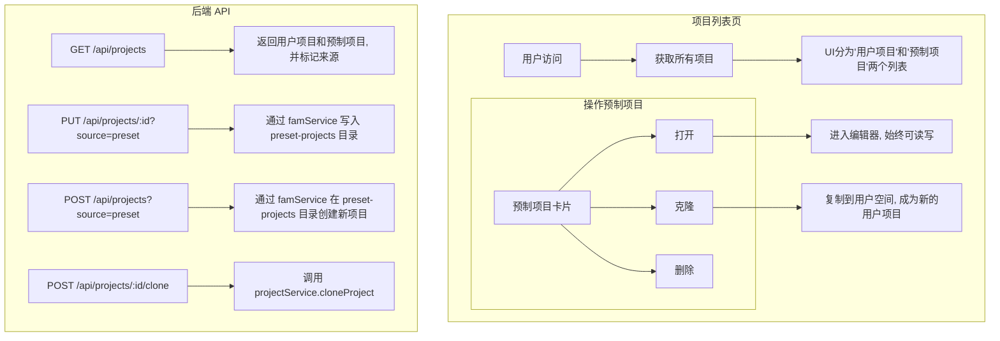

# 预制项目 (Preset Projects) 功能架构设计 (最终版)

## 1. 核心理念

根据最终讨论，方案回归本质：**预制项目是与用户项目并列的、可直接读写的项目集合。**

应用层**不实现任何权限或只读逻辑**。项目的版本控制和协作权限完全由 Git 管理。任何能够运行此应用的用户都可以在其本地副本中修改预制项目，能否推送到主仓库则由 Git 权限决定。

## 2. 交互流程



## 3. 技术实施方案 (基于 FileManagerService)

### 3.1. 核心依赖：统一文件管理服务 (`FileManagerService`)

所有项目文件的操作**必须**通过后端的 `FileManagerService` (`famService`) 进行。该服务通过逻辑路径协议（如 `user://`, `shared://`）抽象了物理文件系统。为了支持预制项目，我们将引入一个新的逻辑协议：`preset://`。

### 3.2. 第一步：扩展 `FileManagerService` 以识别 `preset://` 协议

**目标**: 让 `famService` 能够理解 `preset://` 协议并将其正确解析到物理目录 `preset-projects/`。

1.  **修改 `apps/backend/src/utils/fileUtils.ts`**:

    - 添加一个新的导出函数 `getPresetProjectsDir()`，用于获取预制项目根目录的物理路径。

    ```typescript
    // 在 fileUtils.ts 中添加
    export function getPresetProjectsDir(): string {
      return path.join(getProjectRootDir(), "preset-projects");
    }
    ```

2.  **修改 `apps/backend/src/services/FileManagerService.ts`**:

    - 首先，导入新建的 `getPresetProjectsDir` 函数。
    - 然后，在 `FileManagerService` 类的构造函数中初始化一个新的私有属性 `this.presetProjectsDir`。
    - 最后，在 `resolvePath` 方法的 `switch (scheme)` 语句中，添加一个新的 `case` 来处理 `preset` 协议。

    ```typescript
    // 伪代码示例，展示在 FileManagerService.ts 中的修改点
    import { getPresetProjectsDir } from "@/utils/fileUtils";

    export class FileManagerService {
      private presetProjectsDir: string;

      constructor(/*...现有参数...*/) {
        // 现有初始化代码
        this.presetProjectsDir = getPresetProjectsDir();
      }

      public resolvePath(logicalPath: string, userId: string | null): string {
        const url = new URL(logicalPath);
        const scheme = url.protocol.slice(0, -1);
        let basePhysicalPath: string;

        switch (scheme) {
          case "user":
            if (!userId) throw new Error("User ID is required for user:// scheme");
            basePhysicalPath = this.getUserDataDir(userId);
            break;
          case "preset": // 新增的分支
            basePhysicalPath = this.presetProjectsDir;
            break;
          case "shared":
            basePhysicalPath = this.getSharedDataDir();
            break;
          case "system":
            basePhysicalPath = getProjectRootDir();
            break;
          default:
            throw new Error(`Unsupported scheme: ${scheme}`);
        }

        const decodedPathname = decodeURIComponent(url.pathname);
        const physicalPath = path.join(basePhysicalPath, decodedPathname);
        return this.normalizePath(physicalPath);
      }
    }
    ```

### 3.3. 第二步：重构 `projectService` 以处理多源项目

**目标**: 让 `projectService` 的业务逻辑能够根据来源（用户或预制）操作不同的逻辑路径。

1.  **修改 `apps/backend/src/services/projectService.ts`**:
    - **统一函数签名**: 修改大部分项目相关函数（如 `getProjectMetadata`, `updateProjectMetadata`, `createProject`, `getWorkflow` 等）的签名，增加一个 `source: 'user' | 'preset'` 参数。
    - **动态构建逻辑路径**: 在这些函数内部，根据 `source` 参数动态构建传递给 `famService` 的逻辑路径。
      - 示例: `const baseLogicalPath = `${source}://projects/${projectId}/`;`
    - **区分 `userId`**: 在调用 `famService` 时，只有当 `source === 'user'` 时才传递 `userId`，对于 `preset` 源则传递 `null`。
    - **修改 `listProjects`**:
      - 使其能够根据 `source` 参数列出 `user://projects/` 或 `preset://projects/` 目录下的项目。
    - **新增 `cloneProject` 方法**:
      - 创建一个新函数 `cloneProject(userId: string, sourceProjectId: string)`。
      - 此函数内部调用 `famService.copy()`，将预制项目从 `preset://projects/${sourceProjectId}` 复制到 `user://projects/${newProjectId}`。需要处理命名冲突，例如在复制的项目名后添加 " (copy)"。

### 3.4. 第三步：调整 `projectRoutes` 以暴露新功能

**目标**: 更新 API 端点以匹配 `projectService` 的新功能。

1.  **修改 `apps/backend/src/routes/projectRoutes.ts`**:
    - **`GET /api/projects`**:
      - 修改处理器，使其并行调用 `projectService.listProjects('user', userId)` 和 `projectService.listProjects('preset', null)`。
      - 将两个结果合并，并为每个项目附加 `source` 字段后返回给前端。
    - **所有接收 `:projectId` 的路由** (GET, PUT, DELETE, POST):
      - 从请求中解析出可选的查询参数 `source` (`'user'` 或 `'preset'`)。
      - 将 `source` 参数传递给对应的 `projectService` 函数。
    - **新增克隆路由**:
      - 添加一个新的路由 `POST /api/projects/:projectId/clone`。
      - 该路由的处理器将调用 `projectService.cloneProject(userId, projectId)`。

## 4. 前端适配方案

### 4.1. 状态管理 (`projectStore.ts`)

- 修改 `projects` 状态，使其能存储包含 `source` 字段的项目对象。
- 修改 `fetchProjects`, `loadProject`, `saveProject`, `createProject`, `deleteProject` 等所有与项目相关的 actions，使其能够处理和传递 `source` 参数给 API。
- 新增 `cloneProject(projectId: string)` action，调用 `POST /api/projects/:projectId/clone` API。

### 4.2. 项目列表视图 (`ProjectListView.vue`)

- 通过计算属性将项目列表按 `source` 字段拆分，分别渲染到“我的项目”和“预制项目”两个区域或标签页。
- “预制项目”区域上方可以有一个“创建新预制项目”的按钮（或者此功能仅限特定用户，由 Git 权限控制）。
- 预制项目卡片上应有“打开”、“克隆”按钮，“删除”按钮可能需要权限提示。
- 用户项目卡片上应有“打开”、“删除”按钮。
- “克隆”按钮触发 `projectStore.cloneProject` action。

### 4.3. 编辑器视图 (`EditorView.vue`)

- 路由跳转到编辑器时，需携带 `source` 参数，如 `/project/:id?source=preset`。
- 编辑器加载和保存项目时，都将 `source` 参数传递给 store 的 actions。
- 编辑器**始终处于可读写状态**，不进行任何只读限制。
