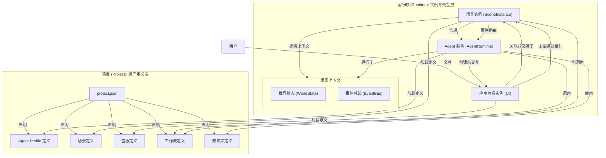

# ComfyTavern 统一架构总览 (v2)

## 1. 引言

本文档旨在提供 ComfyTavern 平台核心架构的顶层视图，并澄清各个关键概念——项目 (Project)、场景 (Scene)、智能体 (Agent)、应用面板 (Panel)、工作流 (Workflow) 与知识库 (KB)——之间的关系。它是在整合了多份早期设计文档后，形成的统一架构蓝图，为所有开发者提供一致的指导原则。

## 2. 核心设计哲学

- **分层与解耦**: 严格区分静态的“资产定义层”（项目）和动态的“运行时实例层”（场景）。
- **场景作为核心**: 场景 (Scene) 是 Agent 运行的“舞台”和生命周期管理者，是连接后端逻辑与前端交互的核心枢纽。
- **Agent 的自主性**: Agent 是运行在场景中的、以目标为驱动的自主实体。
- **事件驱动的交互**: Agent、场景和应用面板之间的主要通信方式是异步的、解耦的事件。
- **用户数据中心化**: 所有用户产生的数据和项目都严格隔离并存储在用户各自的操作系统主目录中，确保隐私和可移植性。
- **逻辑路径抽象**: 应用通过统一的 URI 方案访问文件，屏蔽底层物理存储细节。

## 3. 核心概念关系图



## 4. 统一文件与资产管理 (FAM)

### 4.1. 逻辑路径方案

系统采用 URI 风格的逻辑路径来访问所有资源，屏蔽物理存储细节。

- **用户空间 (`user://`)**: 特定于单个用户的数据。

  - **用户项目**: `user://projects/{projectId}/`
    - 工作流: `user://projects/{projectId}/workflows/{workflowId}.json`
    - 项目输出: `user://projects/{projectId}/outputs/{...filePath}`
    - 项目资产: `user://projects/{projectId}/assets/{...filePath}`
    - 项目元数据: `user://projects/{projectId}/project.json`
  - **用户个人库**: `user://library/`
    - 个人模板/脚本: `user://library/templates/{templateName}.json`
    - 个人知识库: `user://library/knowledgebases/{userKbId}/{...filePath}`

- **共享空间 (`shared://`)**: 所有用户均可访问的只读资源，包含可复用的库和模板。

  - **应用共享库 (`shared://library/`)**: 用于存放部署后生成的共享资源，**此目录应被版本控制忽略**。
    - 全局知识库: `shared://library/knowledgebases/{sharedKbId}/{...filePath}`
  - **应用模板 (`shared://templates/`)**: 用于存放随应用分发的内置模板，**此目录应纳入版本控制**。
    - 全局工作流模板: `shared://templates/workflows/{workflowTemplateId}.json`
    - 面板模板: `shared://templates/panels/{panelTemplateId}/`

- **系统空间 (`system://`)**: 应用自身的非用户文件。
  - **公共静态资源**: `system://public/{...filePath}`
  - **应用数据**: `system://data/{...filePath}`
  - **日志文件**: `system://logs/{...filePath}`

### 4.2. 物理存储结构

**核心原则：所有用户相关的数据默认存储在操作系统的用户主目录下的 `ComfyTavern/userData` 目录中。** 例如，在 Windows 上是 `C:\Users\<YourUser>\ComfyTavern\userData`，在 Linux/macOS 上是 `~/ComfyTavern/userData`。这为 AI 代理和开发者提供了明确、一致的路径预期。

```
<应用根目录>/ (e.g., a portable installation of ComfyTavern)
├── data/                 (映射到 system://data/)
├── logs/                 (映射到 system://logs/)
├── public/               (映射到 system://public/)
├── library/              (映射到 shared://library/)
│   ├── workflows/
│   └── knowledgebases/
│       └── {sharedKbId1}/
├── templates/            (映射到 shared://templates/)
│   ├── workflows/
│   │   └── {example-workflow-template}/
│   └── panels/
│       └── {example-chat-panel}/
└── ...

<操作系统用户主目录>/ComfyTavern/
└── userData/             (用户数据根目录, 映射到 user://)
    ├── {userId1}/
    │   ├── projects/
    │   │   └── {projectId1_1}/
    │   │       ├── project.json
    │   │       ├── workflows/
    │   │       ├── outputs/
    │   │       └── assets/
    │   ├── library/
    │   │   └── knowledgebases/
    │   │       └── {userKbId1_1}/
    │   └── .recycle_bin/
    └── {userId2}/
        └── ...
```

## 5. 项目 (Project): 顶层容器与资产库

项目是组织和管理构建一个完整 AI 应用所需的所有**静态资产**的顶层容器。

### 5.1. 项目目录结构 (建议)

```
/YourProjectName/                  # 项目根目录 (位于 userData/{userId}/projects/ 下)
├── project.json                   # 项目元数据与核心资产声明文件
│
├── agent_profiles/                # 存放 Agent Profile 定义文件 (.json)
│   └── npc_herbalist_profile.json
│
├── workflows/                     # 存放工作流定义文件 (.json)
│   ├── core_deliberation/
│   ├── skills/
│   └── scene_logic/
│
├── knowledgebases/                # 存放项目本地知识库
│   └── world_lore_kb/
│
├── scenes/                        # 存放场景/剧本定义文件 (.json)
│   └── market_square_scene.json
│
├── ui/                            # 存放应用面板的定义和 UI 资产
│   ├── my_chat_panel/
│   │   ├── panel.json
│   │   └── index.html
│   └── image_gen_panel.json
│
└── assets/                        # 存放项目直接使用的媒体资源
└── outputs/                       # 存放项目运行时输出文件
```

### 5.2. `project.json` Schema

`project.json` 是项目的核心清单文件，声明了项目包含的所有关键资产。

```json
{
  "id": "uuid",
  "name": "My Awesome RPG Project",
  "description": "An example project.",
  "version": "1.0.0",
  "schemaVersion": "2.2",
  "createdAt": "iso_timestamp",
  "updatedAt": "iso_timestamp",

  "agent_profiles": [
    {
      "id": "comfytavern_npc_herbalist_v1.2",
      "path": "agent_profiles/npc_herbalist_profile.json",
      "name": "Elara the Herbalist - Profile"
    }
  ],

  "knowledgeBaseReferences": [
    {
      "source_id": "local_kb_world_lore_main",
      "name": "Main World Lore KB",
      "path": "knowledgebases/world_lore_kb"
    },
    {
      "source_id": "global_kb_common_fantasy_tropes_v1",
      "name": "Common Fantasy Tropes (Global)"
    }
  ],

  "panels": [
    {
      "id": "panel_chat_default_v1",
      "path": "ui/my_chat_panel/panel.json",
      "name": "默认聊天面板"
    }
  ],

  "default_scene_id": "market_square_scene"
}
```

## 6. 应用面板 (Panel): 场景的交互界面

应用面板本质上是一个灵活的视图容器，在其中加载和运行一个功能丰富的、沙盒化的微型 Web 应用。

### 6.1. 应用面板定义 (`PanelDefinition`)

`PanelDefinition` 对象是描述和配置应用面板的核心数据结构，通常是一个 `.json` 文件。

- **`panelId`**: `string` (唯一标识符)
- **`displayName`**: `string` (UI 显示名称)
- **`description`**: `string` (可选, 功能描述)
- **`version`**: `string` (版本号)
- **`author`**: `string` (可选, 作者)
- **`uiEntryPoint`**: `string` (指向面板微应用的主入口 HTML 文件, e.g., `./my-game/index.html`)
- **`uiRuntimeConfig`**: `object` (可选)
  - `sandboxAttributes`: `string[]` (可选, 为 `<iframe>` 配置 `sandbox` 属性, e.g., `["allow-scripts", "allow-modals"]`)
  - `featurePermissions`: `string[]` (可选, 明确声明面板需要的浏览器特性, e.g., `["webgl", "gamepad"]`)
- **`workflowBindings`**: `PanelWorkflowBinding[]` (定义此面板可绑定的工作流)
- **`resourceBundle`**: `object` (可选, 指向面板静态资源包的 URL)
- **`iconUrl`**: `string` (可选, 面板图标)
- **`source`**: `'user' | 'shared'` (可选, **由后端动态填充**。表明面板来源是用户项目还是共享模板)

### 6.2. 面板微应用核心职责

- **技术栈**: 创作者可使用任何现代 Web 技术，包括框架 (Vue, React) 和 **WebAssembly (WASM)**。
- **运行环境**: 在 `<iframe>` 中沙盒化运行，通过 `window.comfyTavernPanelApi` 与宿主通信。
- **核心职责**:
  1.  初始化自身应用逻辑和 UI。
  2.  通过 `comfyTavernPanelApi` 与宿主通信：
      - 获取工作流接口 (`getWorkflowInterface`)。
      - 执行工作流 (`executeWorkflow`)。
      - 订阅执行事件 (`subscribeToExecutionEvents`)。
      - 响应 Agent 交互请求 (`onInteractionRequest`)。
      - 获取宿主信息 (如主题 `getCurrentTheme`)。
      - 请求宿主服务 (如调整尺寸 `requestResize`, 触发通知 `showNotification`)。
  3.  管理自身状态并响应用户交互。

### 6.3. 面板生命周期

- **发现与安装**: 平台自动从用户项目的 `ui` 目录和应用级的共享 `templates/panels` 目录中发现面板。未来可能支持从 URL 或市场安装。
- **加载与实例化**: 用户打开面板时，平台创建 `<iframe>` 实例并加载其 `uiEntryPoint`。
- **版本控制与更新**: 平台支持面板的版本管理。
- **卸载**: 从平台移除面板及其资源。
- **权限管理**: 平台根据面板声明和用户授权来控制其对敏感 API 的访问。

## 7. 其他核心概念

- **场景 (Scene)**: **运行时舞台与 Agent 宿主**。负责实例化并管理其内部所有 Agent 的生命周期，并提供隔离的运行时上下文（世界状态、事件总线）。

- **智能体 (Agent)**: **场景中的自主行动者**。在场景中运行，通过其核心审议工作流进行感知、思考、决策，并调用技能（工作流）或工具来执行行动。

- **工作流 (Workflow)**: **可复用的能力单元**。封装具体的、无状态的执行逻辑，可被 Agent、场景或面板调用。(已实现功能)

- **知识库 (KB)**: **共享的知识中心**。为 Agent 和工作流提供结构化的长期记忆和背景知识。

- **交互模板 (Interaction Template)**: 作为项目或功能创建的预设配置和资源集合，帮助用户快速搭建应用原型。它们通常位于共享的 `templates` 目录下，例如，一个“聊天面板模板”可以被用户直接使用或复制到自己的项目中进行定制。

## 8. 关键交互流程

- **面板与 Agent 的交互**: **间接的、通过场景介导的**。面板通过向场景发布事件来影响 Agent；Agent 通过生成“交互请求”来请求面板 UI 响应。

- **同构的工作流准备**: 所有核心的工作流准备逻辑（如图转换、节点组展开）都被封装在前后端共享的通用包中，以确保行为一致性。
