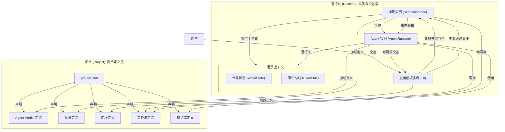

# ComfyTavern 统一架构总览 (v1)

## 1. 引言

本文档旨在提供 ComfyTavern 平台核心架构的顶层视图，并澄清各个关键概念——项目 (Project)、场景 (Scene)、智能体 (Agent)、应用面板 (Panel)、工作流 (Workflow) 与知识库 (KB)——之间的关系。它是在整合了多份早期设计文档（特别是关于 Agent、场景和面板接口的文档）后，形成的统一架构蓝图。

本文档的目标是作为所有开发者理解平台架构的起点，并为后续详细设计文档的修订和新功能的开发提供一致的指导原则。

## 2. 核心设计哲学

*   **分层与解耦**: 严格区分静态的“资产定义层”（项目）和动态的“运行时实例层”（场景）。
*   **场景作为核心**: 场景 (Scene) 是 Agent 运行的“舞台”和生命周期管理者，是连接后端逻辑与前端交互的核心枢纽。
*   **Agent 的自主性**: Agent 是运行在场景中的、以目标为驱动的自主实体，其核心思考逻辑由一个可配置的“审议工作流”承载。
*   **事件驱动的交互**: Agent、场景和应用面板之间的主要通信方式是异步的、解耦的事件。
*   **同构工具包**: 关键的、无副作用的逻辑（如工作流准备工具）应被封装在前后端共享的通用包中，以确保行为一致性。

## 3. 核心概念关系图

## 4. 概念详解与职责划分

1.  **项目 (Project)**: **顶层容器与资产库**。
    *   **职责**: 定义和管理构建一个完整 AI 应用所需的所有**静态资产**，包括 Agent Profile、场景、工作流、面板和知识库的定义。
    *   **关键产物**: `project.json` 文件，作为所有资产的清单。
    *   **参考文档**: [`project-architecture.md`](./project-architecture.md:1)

2.  **场景 (Scene)**: **运行时舞台与 Agent 宿主**。
    *   **职责**:
        *   根据场景定义，实例化并管理其内部所有 Agent 的生命周期。
        *   为 Agent 提供隔离的运行时上下文（世界状态、事件总线）。
        *   作为可选的宏观流程编排器，与 Agent 自主行为协同工作。
    *   **参考文档**: [`scene-architecture.md`](./scene-architecture.md:1)

3.  **智能体 (Agent)**: **场景中的自主行动者**。
    *   **职责**: 在场景中运行，通过其核心审议工作流进行感知、思考、决策，并调用技能（工作流）或工具来执行行动，以达成目标。
    *   **参考文档**: [`agent_architecture_v3_consolidated.md`](./agent_architecture_v3_consolidated.md:1)

4.  **应用面板 (Panel)**: **场景的交互界面 (UI)**。
    *   **职责**:
        *   **主要交互**: 通过向场景的事件总线发布事件来影响场景或 Agent。
        *   **状态呈现**: 订阅场景事件，将 Agent 的行为和世界状态的变化可视化给用户。
        *   **响应请求**: 响应由 Agent 发起的交互式执行流请求（如弹窗确认）。
        *   **次要交互**: 可直接调用独立的、工具性的工作流（此过程可由 `ApiAdapterManager` 辅助）。 **(注：`ApiAdapterManager` 是一个计划中的概念，目前尚未在代码中完全实现)**
    *   **参考文档**: [`面板与接口/panel-spec-and-lifecycle.md`](./面板与接口/panel-spec-and-lifecycle.md:1), [`面板与接口/frontend-api-manager-and-integration.md`](./面板与接口/frontend-api-manager-and-integration.md:1)

5.  **工作流 (Workflow)**: **可复用的能力单元**。
    *   **职责**: 封装具体的、无状态的执行逻辑。
    *   **调用方**: 可被 Agent (作为技能)、场景 (作为编排步骤) 或面板 (作为工具) 调用。

6.  **知识库 (KB)**: **共享的知识中心**。
    *   **职责**: 为 Agent 和工作流提供结构化的长期记忆和背景知识。
    *   **参考文档**: [`knowledgebase-architecture.md`](./knowledgebase-architecture.md:1)

## 5. 关键交互流程澄清

### 5.1. 面板与 Agent 的交互

面板与 Agent 的交互是**间接的、通过场景介导的**。

*   **面板 -> Agent**: 用户在面板操作 -> 面板发布事件到场景事件总线 -> Agent 订阅并响应事件。
*   **Agent -> 面板**: Agent 需要用户输入 -> Agent 调用“面板交互工具” -> 后端触发交互式执行流 -> 前端服务监听到请求 -> 在面板上弹出相应 UI -> 用户输入 -> 结果返回给 Agent。

### 5.2. Agent 调用工作流

Agent 调用其技能工作流是**内部行为**。

*   `AgentRuntime` 在后端根据审议结果，直接准备工作流所需的原生输入，并请求 `ExecutionEngine` 执行。
*   此过程**不经过** `ApiAdapterManager`，因为 `ApiAdapterManager` 是用于适配**外部** API 调用的“翻译层”。

### 5.3. 同构的工作流准备

*   **原则**: 为了确保行为一致性并遵循“同构工具包”的设计哲学，所有核心的工作流准备逻辑（例如，将可视化图形转换为可执行格式、展开节点组等）都被封装在共享包 `@comfytavern/workflow-utils` 中。
*   **实现**: 无论是前端（在执行前进行预览或转换）还是后端（为 Agent 或场景准备执行），都调用此共享包中的工具函数。这保证了不同环境下的工作流处理逻辑是完全一致的。

## 6. 后续步骤

基于此统一架构，后续工作应围绕以下几点展开：

1.  **修订现有文档**: 根据本总览的指导，逐一修订 `scene-architecture.md`, `project-architecture.md` 以及 `面板与接口` 目录下的相关文档，确保所有细节与统一架构保持一致。
2.  **驱动开发**: 所有新功能的开发都应遵循此统一架构进行设计和实现。