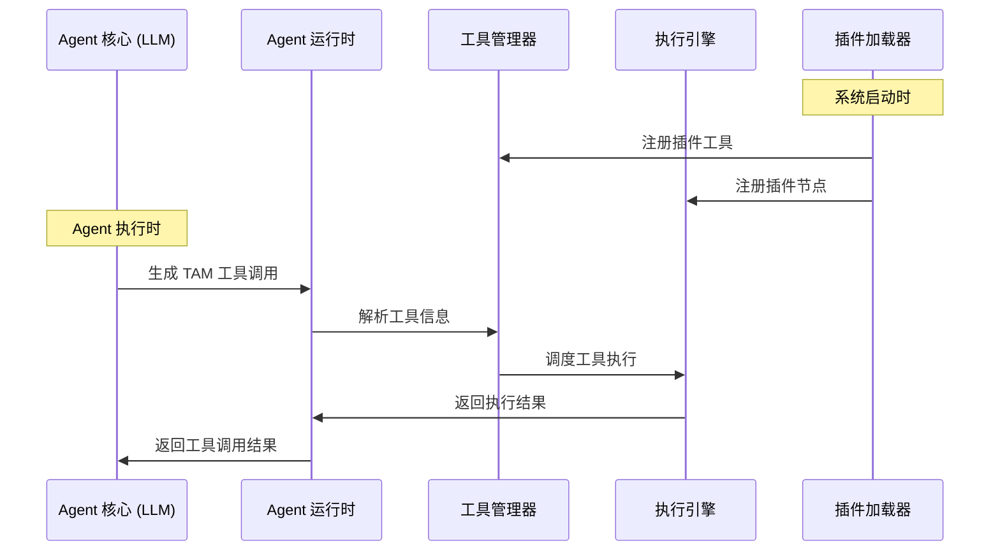
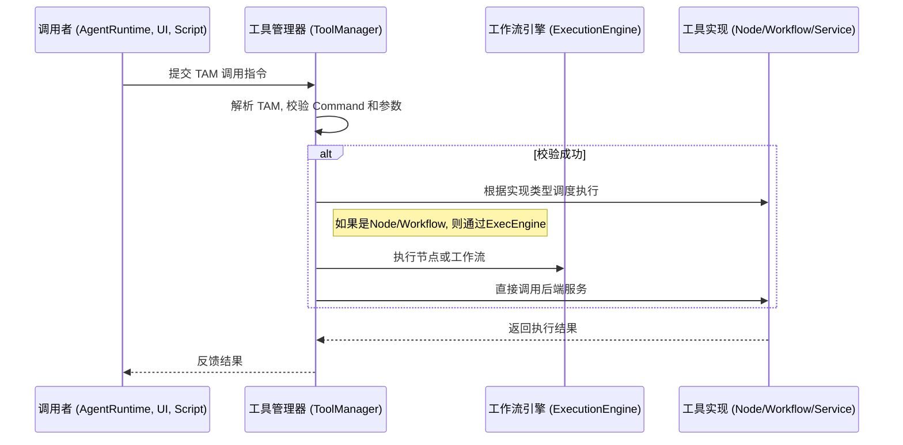

# ComfyTavern Agent 工具系统统一架构

**文档版本**: 2.0  
**状态**: 修订中

## 1. 引言与设计哲学

### 1.1. 文档目的

本文档详细阐述 ComfyTavern 平台中 Agent 工具系统的统一架构及其实现模式。该架构旨在建立一个强大、解耦、可扩展且对开发者友好的生态系统，允许任何功能（无论是预定义的脚本、后端服务、复杂的工作流，还是由 AI Agent 动态生成的即时代码）都能被标准化地封装为"工具"，并能被可靠地发现和调用。

### 1.2. 设计哲学：致敬 VCP 理念

**我们的设计哲学深受 VCP (变量与命令协议) 革命性理念的启发。** VCP 将 AI 的角色从被动的"工具"提升为平等的"创造者伙伴"，这一思想贯穿我们设计的始终。我们采纳此哲学，旨在构建一个能让 AI Agent 与人类创作者无缝协作、共同进化的宇宙。

本架构的核心原则包括：

- **关注点分离 (Separation of Concerns)**: 严格区分插件注册、工具定义与实现代码的职责
- **接口与实现分离**: 调用者只面向标准化接口，`ToolManager` 负责路由到正确实现
- **单一事实来源 (Single Source of Truth)**: Agent 的工具"说明书"从工具定义中自动生成
- **统一调用协议**: 所有程序化调用都通过标准的 **Tavern Action Manifest (TAM)** 协议完成
- **执行路径隔离**: 节点/工作流执行与直接服务/脚本执行在完全隔离的环境中进行

### 1.3. 双路径统一设计

该架构整合了两种主要的工具实现路径，它们在 Agent 调用层面完全统一：

1. **工作流封装工具** - 将现有工作流动态封装为 Agent 可调用的工具
2. **插件化工具** - 通过插件系统提供的标准化工具

这两种路径通过统一的 TAM 协议和 `ToolManager` 实现无缝集成，为 Agent 提供一致的调用体验。

## 2. 架构组件概览

### 2.1. 核心组件

- **插件 (`plugins/`)**: 功能扩展的基本单元，以独立目录形式存在
- **`plugin.yaml`**: 插件清单，声明元数据并提供资产发现入口
- **`*.tool.json`**: 工具定义文件，包含接口、实现和配置信息
- **`ToolManager`**: 核心后端服务，负责工具注册、发现、执行和调度
- **执行器**: 
  - `ExecutionEngine` (工作流引擎): 执行基于节点图的逻辑
  - `ExternalScriptExecutionService`: 在隔离环境中执行外部脚本

### 2.2. 实现与接口分离原则

工具的核心设计哲学是**实现与接口的分离**：

- **接口 (Interface)**: 由工具元数据定义，包括 `toolId`、`displayName`、`description` 和参数 (`parameters`)
- **实现 (Implementation)**: 工具内部的具体执行逻辑

调用者只关心工具的接口，而 `ToolManager` 负责根据工具定义将调用请求路由到正确的实现路径。

## 3. 双模式设计：创作者与 Agent 的差异化支持

### 3.1. 创作者模式：透明可控的节点编排

对于人类创作者，节点和工作流是首选的工具实现方式：

- **优势**: 过程透明、逻辑可追溯、易于调试和调整
- **适用场景**: 复杂的多步骤推理链、上下文处理、业务流程编排
- **实现方式**: 通过 `*.tool.json` 将单节点或完整工作流注册为工具

### 3.2. Agent 模式：动态灵活的脚本生成

对于 AI Agent，直接生成代码脚本比编排节点图更为直接高效：

- **优势**: 动态创造能力、即时执行、极大的灵活性
- **核心工具**: `CodeInterpreter:execute`，接受 `language` 和 `code` 参数
- **执行流程**: Agent 生成代码 → TAM 调用 → `ExternalScriptExecutionService` 执行

## 4. 工具实现模式详解

### 4.1. 路径一：基于工作流的实现

这是最主要、最通用的工具实现方式，所有图形化逻辑编排都通过此路径执行。

#### 4.1.1. 完整工作流封装模式

当功能需要多个节点协作完成时，将整个工作流暴露为工具：

**工作原理**:
1. **定义工作流**: 在画布上编排完整工作流，保存为 `.json` 文件
2. **暴露接口**: 通过 `GroupInput` 和 `GroupOutput` 节点定义对外接口
3. **工具声明**: 在工具定义中设置 `implementation.type: "workflow"`
4. **参数映射**: 工具参数与工作流 `GroupInput` 节点输入对应
5. **执行**: `ToolManager` 加载工作流，注入参数，交由 `ExecutionEngine` 执行

**适用场景**:
- 复杂的多步业务流程（图像生成、报告分析等）
- 需要多个节点协作的功能逻辑

#### 4.1.2. 单节点自动包装模式（零配置特性）

这是最能体现平台自动化能力的特性，允许将单个节点直接暴露为工具：

**工作原理**:
1. **自动参数推断**: `ToolManager` 读取节点的输入插槽定义，自动转换为工具参数
   - 插槽的 `name` → 参数的 `name`
   - 插槽的 `type` 和 `config` → 参数类型和行为
   - 插槽的 `description` → 参数描述
2. **动态包装**: 执行时将单节点包装成"微型工作流"
3. **统一执行**: 通过 `ExecutionEngine` 执行，与完整工作流路径一致

**关键优势**:
- **零配置**: 无需手动声明 `parameters`
- **单一事实来源**: 节点定义即工具接口，自动同步
- **统一执行模型**: 底层执行与标准工作流完全一致

**适用场景**:
- 原子的、独立的功能单元
- 快速将现有节点暴露为工具

### 4.2. 路径二：直接服务调用

对于不适合用节点图表示的逻辑，直接暴露后端服务方法为工具：

**工作原理**:
1. **实现后端服务**: 编写服务类及方法（如 `FileManagerService.deleteFile()`）
2. **工具声明**: 设置 `implementation.type: "service"`
3. **参数定义**: 必须手动定义完整的 `parameters`（无法自动推断）
4. **执行**: `ToolManager` 直接调用服务方法，不经过 `ExecutionEngine`

**适用场景**:
- 与外部系统交互（文件系统、数据库、网络API）
- 需要特殊安全上下文或权限的逻辑
- Agent 自主编写的临时脚本执行

### 4.3. 路径三：外部脚本执行（Agent 专用）

专为 AI Agent 设计的动态脚本执行能力：

**核心机制**:
- 平台提供 `CodeInterpreter:execute` 工具
- Agent 在审议工作流中生成代码并调用此工具
- `ExternalScriptExecutionService` 在安全沙箱中执行代码
- 支持多种语言（Python、Node.js 等）

### 4.4. 路径四：工作流封装为 Agent 工具

这是将现有工作流动态封装为 Agent 工具的专门机制：

#### 4.4.1. 统一的工具声明

所有 Agent 可用的工具，无论其内部实现是原生服务还是工作流，都应在 `agent_profile.json` 的 `tool_ids_inventory` 数组中统一声明。我们不引入新的配置字段。

#### 4.4.2. 基于命名空间的工具来源识别

为了让 `AgentRuntime` 能够区分不同来源的工具，我们引入命名空间前缀约定：

- **工作流工具 (Workflow-based Tools)**: 其工具 ID 必须遵循 `workflow:<workflow_id>` 的格式。`<workflow_id>` 是工作流定义文件的唯一标识符（例如，文件名去除扩展名）。
  - **示例**: `"workflow:summarize_text"`
- **原生/服务工具 (Native/Service Tools)**: 其工具 ID 可以使用其他前缀，如 `system:` 或 `kb:`，来表示由平台核心服务提供的能力。
  - **示例**: `"system:get_current_time"`, `"kb:Query"`

`AgentRuntime` 在加载 Agent Profile 并解析 `tool_ids_inventory` 时，会根据此前缀来决定如何加载工具的定义和执行逻辑。

**`agent_profile.json` 示例:**
```json
{
  "tool_ids_inventory": [
    "system:get_current_time",
    "kb:Query",
    "workflow:summarize_text",
    "workflow:generate_image_from_prompt"
  ]
}
```

#### 4.4.3. 从工作流到工具 Schema 的动态生成

当 `AgentRuntime` 遇到一个以 `workflow:` 为前缀的工具 ID 时，它会执行以下操作来动态生成该工具的 JSON Schema（用于提供给 LLM）：

1. **定位工作流**: 根据工具 ID (`workflow:<workflow_id>`)，加载对应 `<workflow_id>` 的工作流定义文件。
2. **解析接口**: 读取工作流的 `interfaceInputs` 和 `interfaceOutputs`。
3. **生成 Schema**: 遵循以下映射规则：

   - **工具名称 (`name`)**: 直接使用完整的工具 ID，例如 `workflow:summarize_text`。
   - **工具描述 (`description`)**: 使用工作流元数据中的 `description` 字段。为了给 LLM 提供更佳的指导，强烈建议为用作工具的工作流编写清晰、明确的描述。
   - **输入参数 (`parameters`)**:
     - **`type`**: 固定为 `object`。
     - **`properties`**: 遍历工作流的 `interfaceInputs` 对象，每个 `key` 对应一个 `property`。
       - **参数名称**: `interfaceInputs` 的 `key`。
       - **参数描述 (`description`)**: 使用 `interfaceInputs` 中对应条目的 `description`。
       - **参数类型 (`type`)**: 根据 `dataFlowType` 映射 (`STRING` -> `string`, `INTEGER` -> `integer`, `FLOAT` -> `number`, `BOOLEAN` -> `boolean`, `OBJECT` -> `object`, `ARRAY` -> `array`)。
       - **枚举值 (`enum`)**: 如果输入配置了 `suggestions` 且 `matchCategories` 包含 `ComboOption`，则其 `value` 列表可转换为参数的 `enum` 数组。
     - **`required`**: 一个数组，包含所有在 `interfaceInputs` 中标记为 `required: true` 的参数名称。

**示例：工作流 `summarize_text.json` 的接口定义:**
```json
{
  "description": "对提供的长文本进行摘要。当需要理解大量文本的核心内容时使用。",
  "interfaceInputs": {
    "text_to_summarize": {
      "description": "需要进行摘要处理的原始长文本内容。",
      "dataFlowType": "STRING",
      "required": true
    },
    "summary_length": {
      "description": "期望的摘要长度。",
      "dataFlowType": "STRING",
      "required": false,
      "matchCategories": ["ComboOption"],
      "config": {
        "default": "中等",
        "suggestions": [{ "value": "简短" }, { "value": "中等" }, { "value": "详细" }]
      }
    }
  },
  "interfaceOutputs": {
    "summary_result": {
      "description": "生成的摘要文本。",
      "dataFlowType": "STRING"
    }
  }
}
```

**为 `workflow:summarize_text` 动态生成的工具 Schema:**
```json
{
  "name": "workflow:summarize_text",
  "description": "对提供的长文本进行摘要。当需要理解大量文本的核心内容时使用。",
  "parameters": {
    "type": "object",
    "properties": {
      "text_to_summarize": {
        "type": "string",
        "description": "需要进行摘要处理的原始长文本内容。"
      },
      "summary_length": {
        "type": "string",
        "description": "期望的摘要长度。",
        "enum": ["简短", "中等", "详细"]
      }
    },
    "required": ["text_to_summarize"]
  }
}
```

#### 4.4.4. 执行流程

当 Agent 决定调用一个由工作流封装的工具时，其执行流程如下：

1. **Agent 决策**: Agent 的核心审议逻辑（LLM）输出一个工具调用请求，包含 `toolName` (e.g., `"workflow:summarize_text"`) 和 `arguments`。
2. **Runtime 拦截与分发**: `AgentRuntime` 接收到该请求。它检查 `toolName` 的前缀。
3. **工作流调用准备**:
   - `AgentRuntime` 确认前缀为 `workflow:`。
   - 它根据 `toolName` 找到对应的 `workflow_id` (`summarize_text`) 并加载其定义。
   - 它构造一个 `WorkflowExecutionPayload`，将工具调用的 `arguments` 对象映射到工作流的输入值。
4. **提交执行引擎**: `AgentRuntime` 将准备好的 `WorkflowExecutionPayload` 提交给 `ExecutionEngine` 执行。
5. **结果返回**:
   - `ExecutionEngine` 执行工作流并返回结果。
   - `AgentRuntime` 从执行结果中提取 `interfaceOutputs` 的值。
   - `AgentRuntime` 将 `interfaceOutputs` 的值（通常是一个对象，或在只有一个输出时直接取该值）作为工具调用的结果，返回给 Agent 的核心审议逻辑。

## 5. Tavern Action Manifest (TAM) 协议详解

### 5.1. 协议概述

TAM 采用一种以自定义特殊标记包裹、内部使用"关键字:「始」值「末」"格式的方案。

- **AI 原生的边界标记**: 我们选用 `<|[REQUEST_TOOL]|>` 和 `<|[END_TOOL]|>` 作为边界。这种格式类似于 LLM 训练数据中常见的特殊标记 (Special Tokens)，对 AI 而言更自然，更不容易在生成时出错。
- **极致鲁棒的参数传递**: 我们沿用并发展了 VCP 协议中最精华的 `key:「始」value「末」` 格式。这使得在传递包含代码、多行文本、JSON、XML 等任何特殊字符的复杂参数时，**无需进行任何转义**，极大地降低了出错率。
- **清晰的指令结构**: 通过 `command` 关键字明确指定调用的工具，并通过数字后缀（如 `command1`, `filePath1`）实现对串联任务的优雅支持。

### 5.2. 调用格式约定

#### 5.2.1. 单一工具调用格式

当任何调用者（Agent、脚本、UI）决定调用工具时，其输出应包含一个 `<|[REQUEST_TOOL]|>` 块。

```
[可选的、调用者生成的自然语言文本，解释其决策或意图。]

<|[REQUEST_TOOL]|>
command:「始」ToolID「末」
parameter_A:「始」参数值 A「末」
parameter_B:「始」参数值 B，
可以是多行。
「末」
<|[END_TOOL]|>
```

#### 5.2.2. 串联任务格式 (Chained Task Format)

当需要在一个动作中按顺序执行多个命令时，使用数字后缀。解析器应按数字顺序依次执行。

```
<|[REQUEST_TOOL]|>
# 步骤 1: 创建文件
command1:「始」FileOperator.WriteFile「末」
filePath1:「始」/logs/today.log「末」
content1:「始」任务开始...「末」

# 步骤 2: 追加日志
command2:「始」FileOperator.AppendFile「末」
filePath2:「始」/logs/today.log「末」
content2:「始」\n添加新记录。「末」
<|[END_TOOL]|>
```

### 5.3. TAM 结构详解

- **边界标记 (Boundary Markers)**: `<|[REQUEST_TOOL]|>` 和 `<|[END_TOOL]|>`，明确界定动作指令的范围。
- **指令关键字 (Command Keyword)**: `command` (或 `command1`, `command2`...)，其值是工具的唯一 ID。
- **参数键值对 (Parameter Key-Value)**: `key:「始」value「末」`。
  - `key`：参数名。解析器应对 `key` 的大小写、下划线不敏感，以提高容错性。
  - `「始」` 和 `「末」`：是固定不变的中文引号标记，用于界定参数值的开始和结束。它们之间的所有内容，包括换行符，都属于参数值。

## 6. 插件系统架构详解

### 6.1. 插件化目录结构

我们将重构现有的 `plugins/` 目录，使其与 `apps/backend/src/nodes/` 目录一起，各自承担更明确的职责。

```
ComfyTavern/
├── apps/
│   └── backend/
│       └── src/
│           └── nodes/      # 存放核心内置节点
│               └── ...
└── plugins/                # (重构) 存放所有第三方或非核心插件
    ├── my-awesome-plugin/  # 一个功能丰富的插件
    │   ├── nodes/          # (可选) 此插件提供的后端节点
    │   │   └── AwesomeNode.ts
    │   ├── tools/          # (可选) 此插件提供的工具定义
    │   │   └── awesome.tool.json
    │   ├── web/            # (可选) 此插件的前端资源
    │   │   ├── index.js
    │   │   └── style.css
    │   └── plugin.yaml     # (必需) 插件清单文件
    │
    └── my-theme-only/      # 一个纯前端主题插件
        ├── web/
        │   └── theme.css
        └── plugin.yaml
```

- **`apps/backend/src/nodes/`**: 仅用于存放项目自带的核心节点。
- **`plugins/`**: 所有第三方扩展、非核心功能模块的家。一个插件可以只包含前端 (`web/`)，或只包含后端节点 (`nodes/`)，或两者兼备。

### 6.2. 插件清单 (`plugin.yaml`)

每个插件目录中**必须包含**一个 `plugin.yaml` 文件，它选用对人类更友好的 YAML 格式，并支持注释。

```yaml
# 插件的唯一标识符，应使用 kebab-case 命名法
name: my-awesome-plugin
# 显示给用户的名称
displayName: 我的超棒插件
version: 1.0.0
description: 这个插件能极大地提升生产力，并添加了一个神奇的节点。

# (可选) 声明此插件提供的后端节点
nodes:
  # 节点定义的入口文件或目录，相对于此 YAML 文件的位置
  entry: ./nodes

# (可选) 声明此插件提供的工具
# 注意：工具的具体接口（参数、实现）在独立的 *.tool.json 文件中定义，
# plugin.yaml 只负责声明工具所在的目录，以便 ToolManager 发现它们。
tools:
  # 工具定义文件所在的目录
  entry: ./tools

# (可选) 声明此插件提供的前端资源
frontend:
  # 开发模式下的入口，用于 Vite 集成
  dev:
    entry: web/index.ts
  # 构建（生产）模式下的产物
  build:
    # 构建后的 JS 入口
    entry: dist/index.js
    # 构建后的 CSS 文件
    styles:
      - dist/style.css

# (可选) 声明插件需要的权限。插件必须明确声明其所需权限，以便用户审查。
permissions:
  # 申请使用哪些钩子
  hooks:
    - "hook:client:auth:login"                # 用户登录后执行操作
    - "hook:client:settings:before-save"      # 保存设置前进行验证
    - "hook:client:workflow:before-execute"   # 执行前修改输入
    - "hook:server:nodemanager:before-register" # 在节点注册前修改其定义

  # 申请包裹或注入哪些 UI 组件
  ui:
    # 包裹核心组件
    wrap:
      - "ui:BaseNode"           # 包裹基础节点，通过检查 props.type 实现对特定节点的 UI 定制
      - "ui:NodeInputControl"   # 包裹所有输入控件，添加统一功能
      - "ui:ContextMenu"        # 包裹上下文菜单，添加全局菜单项
      - "ui:SidebarManager"     # 包裹编辑器侧边栏
      - "ui:HomeSidebar"        # 包裹主页侧边栏
    # 注入 UI 到指定插座
    inject:
      - "node:header:right"     # 在节点头部添加快速操作图标
      - "sidebar:icon-bar:tabs:after" # 在侧边栏添加新的功能面板入口
      - "modal:footer"          # 在通用模态框底部添加自定义按钮
    # 替换核心组件 (高风险)
    override: []

  # 申请替换哪些核心服务 (最高风险)
  services:
    override:
      - "workflowManager"
```

### 6.3. 工具定义文件 (`*.tool.json`)

在插件的 `tools/` 目录下，可以包含一个或多个 `*.tool.json` 文件，每个文件定义一个工具。

**示例: `tools/bilibili.tool.json`**
```json
{
  "id": "BilibiliFetch:getSubtitle",
  "displayName": "获取 Bilibili 视频字幕",
  "description": "输入 Bilibili 视频 URL 或 BV 号，获取字幕内容",
  "implementation": {
    "type": "script",
    "command": "python scripts/BilibiliFetch.py",
    "protocol": "stdio",
    "timeout": 30000
  },
  "parameters": {
    "type": "object",
    "properties": {
      "url": {
        "type": "string",
        "description": "Bilibili 视频的完整 URL 或 BV 号"
      }
    },
    "required": ["url"]
  },
  "configSchema": [
    {
      "key": "bilibiliCookie",
      "type": "string",
      "label": "Bilibili Cookie",
      "description": "用于访问 Bilibili API 的用户 Cookie"
    }
  ]
}
```

## 7. 端到端工作流程

### 7.1. 插件加载与工具注册

1. **平台启动**: 后端应用启动
2. **插件发现**: `PluginLoader` 扫描 `plugins/` 目录下的 `plugin.yaml` 文件
3. **资产分发**: 将工具目录路径告知 `ToolManager`
4. **工具注册**: `ToolManager` 加载所有 `*.tool.json`，存入全局注册表

### 7.2. Agent 工具发现机制

这是确保 Agent 可靠使用工具的关键创新：

1. **动态引用**: Agent 审议工作流的 Prompt 包含 `{{{system:available_tools}}}` 标记
2. **上下文生成**: `ToolManager` 根据 Agent 的 `tool_ids_inventory` 生成专属工具文档
3. **Prompt 注入**: 自动生成的工具说明书注入到 Prompt 中

### 7.3. TAM 解析与执行

**核心特色：思考与行动的解耦**

1. **审议输出**: Agent 工作流输出包含 TAM 格式的行动指令
2. **出口管道检测**: `ExecutionEngine` 的出口管道检测 `<|[REQUEST_TOOL]|>...<|[END_TOOL]|>` 标记
3. **工具调度**: 解析 TAM 指令，根据 `implementation.type` 分发到相应执行器
4. **结果返回**: 执行结果通过回调/事件返回给 Agent

### 7.4. 架构流程图



### 8. 结论

通过上述架构设计，我们实现了插件与工具的统一管理，确保了系统的可扩展性和灵活性。未来的开发将围绕这一架构进行，持续优化和扩展功能，以满足不断变化的需求。

## 8. 实现模式总结

| 实现路径 | 封装模式 | 核心思想 | 参数定义 | 适用场景 | 目标用户 |
|:---|:---|:---|:---|:---|:---|
| **基于工作流** | 完整工作流 | 多节点协作的复杂逻辑 | 手动定义 | 复杂业务流程 | 创作者 |
| | **单节点自动包装** | 零配置的节点暴露 | **自动推断** | 原子功能单元 | 创作者 |
| **直接服务调用** | 后端服务方法 | 系统级功能直接调用 | 手动定义 | 平台功能、外部API | 开发者 |
| **外部脚本执行** | 动态代码生成 | Agent 即时创造能力 | 标准化接口 | 临时任务、动态逻辑 | **AI Agent** |

## 9. 工具、节点与工作流：概念澄清

在 ComfyTavern 中，工具、节点和工作流是三个既相关又独立的核心概念。清晰地理解它们的区别与联系，对于构建可扩展、可维护的系统至关重要。

- **节点 (Node)**:
  - **定义**: 节点是工作流的**基本构建块**。它代表一个原子的、可执行的操作单元，拥有明确的输入和输出。例如，`AddTwoNumbersNode`、`LoadImageNode`、`LlmPromptNode`。
  - **角色**: 节点的首要职责是服务于**工作流的构建**。创作者在画布上通过连接节点来编排复杂的逻辑。

- **工作流 (Workflow)**:
  - **定义**: 工作流是由多个相互连接的节点组成的**有向无环图 (DAG)**。它封装了一套完整的、可执行的业务逻辑。
  - **角色**: 工作流是实现复杂任务（如 Agent 的审议循环、图像生成流程、数据处理管道）的主要方式。

- **工具 (Tool)**:
  - **定义**: 工具是一个**可被外部调用的、具有明确功能定义的能力接口**。它向调用者（如 Agent、用户、脚本）暴露一个稳定的 ID 和一组参数，并返回一个可预测的结果。
  - **角色**: 工具的核心职责是**提供可供调用的能力**。它隐藏了内部的实现细节。
  - **与节点/工作流的关系**:
    - 一个工具**可以封装**一个单一的节点。例如，可以创建一个名为 `math.add` 的工具，其内部实现是直接执行 `AddTwoNumbersNode`。
    - 一个工具也**可以封装**一个完整的工作流。例如，可以创建一个名为 `image.generate_portrait` 的工具，其内部实现是执行一个包含多个步骤（如加载模型、设置提示词、采样、后处理）的复杂工作流。
    - 一个工具还可以**直接由后端服务实现**，不依赖于任何节点或工作流。例如，一个名为 `system.get_current_time` 的工具可能只是调用一个后端函数。

**核心区别**: **节点/工作流是"实现"，而工具是"接口"**。工具系统本身是独立的，它只关心工具的注册、发现和调用，而不关心工具背后是由节点、工作流还是原生代码实现的。这种分离使得我们可以将任何复杂的功能（无论它如何实现）都封装成一个标准化的工具，供平台各处调用。

## 10. 扩展与第三方工具集成

ComfyTavern 的强大之处在于其可扩展性。工具系统与平台的插件架构紧密集成，允许开发者和社区贡献者方便地添加第三方工具。

### 10.1. 通过插件注册新工具

开发者可以通过创建插件来为平台引入新的工具。

1. **创建插件**: 遵循插件目录结构，创建一个新的插件包。
2. **实现工具逻辑**:
   - 如果工具是基于新节点的，则在插件的 `nodes/` 目录下创建节点文件。
   - 如果工具是基于工作流的，则可以将工作流定义文件 (`.json`) 作为插件的一部分。
   - 如果工具是纯后端服务，则可以在插件的后端逻辑中实现。
3. **声明工具**: 在插件的清单文件 `plugin.yaml` 中，增加一个新的 `tools` 部分来声明该插件提供的工具。

### 10.2. 工具声明的分离原则

为了保持 `plugin.yaml` 的职责单一（仅用于插件级注册），工具的具体定义被分离到专门的工具声明文件中。

#### 10.2.1. `plugin.yaml` 中的角色

在 `plugin.yaml` 中，我们只声明工具定义文件所在的目录。

```yaml
# ... (plugin.yaml 的其他部分)

# (可选) 声明此插件提供的工具
# plugin.yaml 只负责声明工具所在的目录，以便 ToolManager 发现它们。
tools:
  # 工具定义文件所在的目录，相对于 plugin.yaml
  entry: ./tools
```

#### 10.2.2. 工具声明文件 (`*.tool.json`)

在上述 `entry` 指向的目录（例如 `tools/`）下，可以包含一个或多个 `*.tool.json` 文件，每个文件定义一个工具。

**示例: `tools/my-script-tool.tool.json`**
```json
{
  "id": "my-awesome-plugin:my_script_tool",
  "displayName": "我的脚本工具",
  "description": "一个封装了外部脚本的工具。",
  "parameters": {
    "type": "object",
    "properties": {
      "url": {
        "type": "string",
        "description": "要处理的目标URL"
      }
    },
    "required": ["url"]
  },
  "implementation": {
    "type": "script",
    "command": "bun run scripts/my-script.ts"
  }
}
```

这种分离确保了工具的定义可以独立于插件的元数据进行管理和扩展。

### 10.3. 工具的加载与执行

- **加载**: 平台的 `PluginLoader` 在加载插件时，会解析 `plugin.yaml`。如果发现 `tools` 部分，它会将指定的工具目录路径 (`entry`) 告知 `ToolManager`。`ToolManager` 随后会扫描该路径下的所有 `*.tool.json` 文件，解析并注册这些工具。
- **执行**: 当 `ToolManager` 收到一个 TAM 调用请求时，它会：
  1. 根据 `command` 字段中的工具 ID 查找已注册的工具。
  2. 校验传入的参数是否符合工具声明文件中的 `parameters` schema。
  3. 根据工具的 `implementation` 定义，调度相应的执行器（例如，脚本执行器、服务调用器）。
  4. 将执行结果返回给调用者。

通过这套机制，第三方工具可以无缝集成到平台中，并被 Agent 或其他任何调用者使用。

## 11. 工具调用指南

本节为需要生成 TAM 指令的调用者（特别是 LLM）提供指导。

### 11.1. 能力的发现与声明

- **对于 Agent**: Agent 可用的工具集由其 `agent_profile.json` 中的 `tool_ids_inventory` 字段静态声明。这保证了 Agent 行为的安全性和可预测性。Agent 的核心审议工作流应被设计为能够理解并选择调用这些已声明的能力。
- **对于其他调用者**: 其他调用者（如 UI 面板、脚本）可以通过查询 `ToolManager` 提供的 API (`GET /api/tools`) 来获取当前所有已注册、可用的工具列表及其参数定义。

### 11.2. LLM Prompt 设计要点

当使用 LLM 生成 TAM 时，Prompt 的设计至关重要。

1. **明确角色与目标**: 在系统指令中，告知 LLM 其角色和当前的高级目标。
2. **提供可用工具清单**: 将该 LLM 可用的工具列表（ID、描述、参数）作为上下文提供。
3. **提供动态知识 (RAG)**: 对于复杂的工具，可以结合 RAG，从知识库中检索该工具的详细用法示例、最佳实践、错误案例等，作为更丰富的上下文。
4. **引导决策与输出**: 指示 LLM 基于提供的上下文和知识参考，决策并生成一个符合 TAM 规范的 `<|[REQUEST_TOOL]|>` 块。强调 `command` 必须是其被赋予的能力之一。

**示例 Prompt 片段**:

```
[当前任务]
用户要求修改 main.js 文件中的一行代码。

[可用工具参考]
- Tool ID: FileOperator.ApplyEdit
  - 描述: 用于精确替换文件中的一行或多行文本。
  - 参数:
    - filePath (string, required): 文件的绝对路径。
    - search_string (string, required): 要查找并替换的旧内容。
    - replace_string (string, required): 用于替换的新内容。

[你的决策]
请基于上述信息，生成一个符合 TAM 规范的工具调用指令来完成任务。

[LLM 的输出]
好的，我将使用 FileOperator.ApplyEdit 工具来修改文件。

<|[REQUEST_TOOL]|>
command:「始」FileOperator.ApplyEdit「末」
filePath:「始」/path/to/your/project/main.js「末」
search_string:「始」console.log("old message");「末」
replace_string:「始」console.log("new message");「末」
<|[END_TOOL]|>
```

## 12. 运行时架构与执行流程

本节阐述了 ComfyTavern 系统中，支撑 TAM 协议得以解析、执行和反馈的核心架构。

### 12.1. 核心组件与职责

- **调用者 (Caller)**: 任何生成 TAM 指令的实体，如 `AgentRuntime`、UI 面板、脚本等。
- **工具管理器 (ToolManager)**: 平台的工具注册与管理中心。负责从插件和核心服务中加载工具定义，并提供工具查询和执行的统一入口。
- **执行引擎 (ExecutionEngine)**: 平台的通用工作流执行器。
- **节点/工作流/服务**: 工具的具体实现。

### 12.2. 执行流程详解

1. **生成 (Generation)**: **调用者**根据其内部逻辑（如 Agent 的审议、用户的点击）生成一段包含 TAM 块的文本或指令。
2. **提交 (Submission)**: 调用者将此指令提交给**工具管理器 (ToolManager)** 的执行端点。
3. **解析与校验 (Parsing & Validation)**: `ToolManager` 解析文本，提取 TAM 块，并根据其内部注册的工具清单校验 `command` 的有效性及其参数的合法性。
4. **调度与执行 (Dispatch & Execution)**:
   - `ToolManager` 根据工具的实现类型，将任务分发给相应的后端执行器。
   - **节点/工作流封装的工具**: `ToolManager` 请求 `ExecutionEngine` 执行对应的节点或工作流。
   - **服务实现的工具**: `ToolManager` 直接调用相应的后端服务函数。
5. **反馈 (Feedback)**: 执行结果（成功或失败信息）由 `ToolManager` 返回给原始的**调用者**。调用者可以根据此反馈进行下一步操作（例如，Agent 将结果作为下一次审议的输入，形成闭环）。

### 12.3. 架构流程图



### 12.4. 性能与扩展性考虑

在设计 ComfyTavern 的运行时架构时，性能和扩展性是两个关键考量。以下是一些优化策略：

- **异步执行**: 通过异步处理工具调用，减少等待时间，提高系统响应速度。
- **缓存机制**: 对于频繁调用的工具，可以实现结果缓存，减少重复计算。
- **负载均衡**: 在高并发场景下，使用负载均衡策略分配请求，确保系统稳定性。

## 13. 安全性与权限管理

在 ComfyTavern 中，安全性是至关重要的。以下是一些安全性措施：

- **权限控制**: 通过角色和权限管理，确保只有授权用户可以调用特定工具。
- **输入验证**: 对所有输入参数进行严格验证，防止注入攻击和数据泄露。
- **审计日志**: 记录所有工具调用的日志，以便后续审计和问题追踪。

## 14. 结论与未来展望

ComfyTavern 的统一插件与工具架构为开发者提供了灵活、可扩展的解决方案。通过清晰的概念划分和强大的工具管理系统，用户可以轻松集成和使用各种功能。未来，我们将继续优化系统性能，扩展工具库，并增强安全性，以满足不断变化的需求。

## 15. 插件系统详细实施方案

### 15.1. 后端实施

#### 15.1.1. 类型定义 (`packages/types/src/plugin.ts`)

```typescript
/**
 * @fileoverview 定义插件系统的核心类型，如插件清单 (Manifest) 和扩展信息 (ExtensionInfo)。
 */

// 暂时使用 any，后续应从 './settings' 导入 SettingItemConfig
type SettingItemConfig = any;

/**
 * 定义了 `plugin.yaml` 清单文件的结构。
 */
export interface PluginManifest {
  name: string;
  displayName: string;
  version: string;
  description?: string;
  nodes?: {
    entry: string;
  };
  tools?: {
    entry: string;
  };
  frontend?: {
    type?: 'vite' | 'vanilla';
    dev?: {
      entry: string;
    };
    build?: {
      entry: string;
      styles?: string[];
      outputDir: string;
    };
    vanilla?: {
      entry: string;
      styles?: string[];
      rootDir?: string;
    }
  };
  configOptions?: SettingItemConfig[];
  permissions?: {
    hooks?: string[];
    ui?: {
      wrap?: string[];
      inject?: string[];
      override?: string[];
    };
    services?: {
      override?: string[];
    };
  };
}

/**
 * 定义了通过 API 向前端暴露的插件信息结构。
 */
export interface ExtensionInfo {
  name: string;
  displayName: string;
  version: string;
  description?: string;
  frontend?: {
    entryUrl: string;
    styleUrls: string[];
  };
  configOptions?: SettingItemConfig[];
}
```

#### 15.1.2. `PluginLoader` 服务实现

```typescript
// apps/backend/src/services/PluginLoader.ts
import { Elysia } from 'elysia';
import { staticPlugin } from '@elysiajs/static';
import yaml from 'js-yaml';
import { promises as fs } from 'node:fs';
import path from 'node:path';
import { getProjectRootDir } from '../utils/fileUtils';
import { NodeLoader } from './NodeLoader';
import type { PluginManifest, ExtensionInfo } from '@comfytavern/types';

export class PluginLoader {
  public static extensions: ExtensionInfo[] = [];

  public static async loadPlugins(app: Elysia): Promise<void> {
    const pluginsDir = path.join(getProjectRootDir(), 'plugins');
    try {
      const pluginDirs = await fs.readdir(pluginsDir, { withFileTypes: true });

      for (const dirent of pluginDirs) {
        if (!dirent.isDirectory()) continue;

        const pluginName = dirent.name;
        const pluginPath = path.join(pluginsDir, pluginName);
        const manifestPath = path.join(pluginPath, 'plugin.yaml');

        try {
          const manifestContent = await fs.readFile(manifestPath, 'utf-8');
          const manifest = yaml.load(manifestContent) as PluginManifest;

          // 1. 处理前端资源
          const extensionInfo: ExtensionInfo = {
            name: manifest.name,
            displayName: manifest.displayName,
            version: manifest.version,
            description: manifest.description,
            configOptions: manifest.configOptions,
          };

          if (manifest.frontend) {
            const publicPath = `/plugins/${manifest.name}`;
            let assetPath: string;
            let entryFile: string;
            let styleFiles: string[] = [];

            if (manifest.frontend.type === 'vanilla' && manifest.frontend.vanilla) {
              assetPath = path.join(pluginPath, manifest.frontend.vanilla.rootDir || 'web');
              entryFile = manifest.frontend.vanilla.entry;
              styleFiles = manifest.frontend.vanilla.styles || [];
            } else if (manifest.frontend.build) { // 默认为 vite 类型
              assetPath = path.join(pluginPath, manifest.frontend.build.outputDir);
              entryFile = manifest.frontend.build.entry;
              styleFiles = manifest.frontend.build.styles || [];
            } else {
               console.warn(`[PluginLoader] Plugin '${pluginName}' has a frontend section but is missing 'build' or 'vanilla' configuration. Skipping frontend part.`);
               continue;
            }

            app.use(staticPlugin({ assets: assetPath, prefix: publicPath, alwaysStatic: true }));
            
            extensionInfo.frontend = {
              entryUrl: `${publicPath}/${entryFile.replace(/^\.\//, '')}`,
              styleUrls: styleFiles.map(s => `${publicPath}/${s.replace(/^\.\//, '')}`),
            };
          }
          
          this.extensions.push(extensionInfo);

          // 2. 处理后端节点 (复用 NodeLoader)
          if (manifest.nodes) {
            const nodesPath = path.join(pluginPath, manifest.nodes.entry);
            await NodeLoader.loadNodes(nodesPath);
          }

          // 3. 处理工具 (由 ToolManager 负责加载)
          if (manifest.tools) {
            const toolsPath = path.join(pluginPath, manifest.tools.entry);
            // 假设存在一个 ToolManager 来处理工具的加载
            // await ToolManager.loadToolsFromPath(toolsPath);
            console.log(`[PluginLoader] Found tools for '${manifest.displayName}' at: ${toolsPath}. ToolManager should handle loading.`);
          }
          console.log(`[PluginLoader] Successfully loaded plugin: ${manifest.displayName} (v${manifest.version})`);

        } catch (error) {
          console.error(`[PluginLoader] Failed to load plugin '${pluginName}':`, error);
        }
      }
    } catch (error: any) {
      if (error.code === 'ENOENT') {
        console.log('[PluginLoader] "plugins" directory not found. Skipping plugin loading.');
      } else {
        console.error('[PluginLoader] Error reading plugins directory:', error);
      }
    }
  }
}
```

#### 15.1.3. API 端点实现

```typescript
// apps/backend/src/routes/pluginRoutes.ts
import { Elysia } from 'elysia';
import { PluginLoader } from '../services/PluginLoader';

export const pluginRoutes = (app: Elysia) =>
  app.group('/api/plugins', (group) =>
    group.get('/', () => {
      // 直接返回已加载并格式化好的插件信息
      return PluginLoader.extensions;
    })
  );
```

### 15.2. 前端实施

#### 15.2.1. 插件加载器服务

```typescript
// apps/frontend-vueflow/src/services/PluginLoaderService.ts
import { api } from '@/utils/api';

interface ExtensionInfo {
  name: string;
  displayName: string;
  version: string;
  description?: string;
  frontend?: {
    entryUrl: string;
    styleUrls: string[];
  };
}

export async function loadPlugins() {
  try {
    const extensions = await api.get<ExtensionInfo[]>('/plugins');
    
    for (const ext of extensions.data) {
      if (ext.frontend) {
        // 加载 CSS
        ext.frontend.styleUrls.forEach(url => {
          const link = document.createElement('link');
          link.rel = 'stylesheet';
          link.href = url;
          document.head.appendChild(link);
        });

        // 加载 JS
        const script = document.createElement('script');
        script.type = 'module';
        script.src = ext.frontend.entryUrl;
        document.body.appendChild(script);
        
        console.log(`[PluginLoader] Loaded plugin: ${ext.displayName}`);
      }
    }
  } catch (error) {
    console.error('[PluginLoader] Failed to load plugins:', error);
  }
}
```

#### 15.2.2. 前端扩展 API

```typescript
// apps/frontend-vueflow/src/services/ExtensionApiService.ts

// 这是一个简化的示例，实际实现会更复杂，涉及权限检查等
class ExtensionApi {
  registerNodeUI(nodeType: string, component: any) {
    console.log(`Extension wants to register UI for ${nodeType}`);
    // ... 实现注册逻辑，例如通过一个 store
  }
  
  // 钩子系统
  hooks = {
    on: (hookName: string, callback: Function) => {
      console.log(`Extension registered hook: ${hookName}`);
      // ... 实现钩子注册逻辑
    }
  };
  
  // UI 系统
  ui = {
    wrapComponent: (componentId: string, wrapper: Function) => {
      console.log(`Extension wants to wrap component: ${componentId}`);
      // ... 实现组件包裹逻辑
    },
    
    registerOutletComponent: (outletName: string, component: any) => {
      console.log(`Extension registered outlet component: ${outletName}`);
      // ... 实现插座组件注册逻辑
    }
  };
  
  // 配置系统
  getConfig(optionId: string): any {
    // ... 从 settingsStore 获取配置
  }
  
  onConfigChange(optionId: string, callback: (newValue: any) => void): void {
    // ... 监听配置变化
  }
}

// 在应用初始化时，将 API 实例暴露到 window 对象
function initializeExtensionApi() {
  if (!window.ComfyTavern) {
    window.ComfyTavern = {};
  }
  window.ComfyTavern.extensionApi = new ExtensionApi();
}

export { initializeExtensionApi };
```

### 15.3. 开发模式与生产模式

#### 15.3.1. Vite 配置支持

```typescript
// apps/frontend-vueflow/vite.config.ts
import { defineConfig } from 'vite';
import vue from '@vitejs/plugin-vue';
import path from 'path';
import fs from 'fs';
import yaml from 'js-yaml';

// 动态扫描插件并返回它们的开发入口
function getPluginDevEntries() {
  const entries = {};
  const pluginsDir = path.resolve(__dirname, '../../plugins');
  if (!fs.existsSync(pluginsDir)) return entries;

  const pluginDirs = fs.readdirSync(pluginsDir);
  for (const dir of pluginDirs) {
    const manifestPath = path.join(pluginsDir, dir, 'plugin.yaml');
    if (fs.existsSync(manifestPath)) {
      const manifest = yaml.load(fs.readFileSync(manifestPath, 'utf8'));
      if (manifest.frontend?.dev?.entry) {
        entries[manifest.name] = path.resolve(pluginsDir, dir, manifest.frontend.dev.entry);
      }
    }
  }
  return entries;
}

export default defineConfig({
  // ...
  build: {
    rollupOptions: {
      input: {
        main: path.resolve(__dirname, 'index.html'),
        ...getPluginDevEntries(),
      },
    },
  },
});
```

## 16. 案例研究：BilibiliFetch 插件

### 16.1. 目录结构
```
/plugins/bilibili-fetcher/
├── scripts/BilibiliFetch.py
├── tools/bilibili.tool.json
└── plugin.yaml
```

### 16.2. 关键文件示例

**plugin.yaml**:
```yaml
name: bilibili-fetcher
displayName: Bilibili 内容获取器
version: 0.1.0
description: 根据 Bilibili 视频 URL 获取其字幕内容
tools:
  entry: ./tools
```

**bilibili.tool.json**:
```json
{
  "id": "BilibiliFetch:getSubtitle",
  "displayName": "获取 Bilibili 视频字幕",
  "description": "输入 Bilibili 视频 URL 或 BV 号，获取字幕内容",
  "implementation": {
    "type": "script",
    "command": "python scripts/BilibiliFetch.py",
    "protocol": "stdio",
    "timeout": 30000
  },
  "parameters": {
    "type": "object",
    "properties": {
      "url": {
        "type": "string",
        "description": "Bilibili 视频的完整 URL 或 BV 号"
      }
    },
    "required": ["url"]
  },
  "configSchema": [
    {
      "key": "bilibiliCookie",
      "type": "string",
      "label": "Bilibili Cookie",
      "description": "用于访问 Bilibili API 的用户 Cookie"
    }
  ]
}
```

## 17. 配置管理系统

### 17.1. 清单中的配置声明

插件的 `plugin.yaml` 可以添加 `configOptions` 数组。此数组的结构必须严格遵守 `SettingItemConfig` 接口。

```yaml
name: my-awesome-plugin
displayName: 我的超棒插件
configOptions:
  - key: "extensions.my-awesome-plugin.enableFeatureX"
    type: "boolean"
    label: "启用功能 X"
    description: "是否激活实验性功能 X。"
    defaultValue: true
    categoryKey: "features"
    category: "功能开关"
  - key: "extensions.my-awesome-plugin.maxItems"
    type: "number"
    label: "最大项目数"
    defaultValue: 10
    min: 1
    max: 50
    step: 1
    categoryKey: "limits"
    category: "限制"
```

**关键约定**:

- **`key`**: 必须遵循 `extensions.{pluginName}.{optionId}` 的格式，以确保全局唯一性并避免冲突。
- **其他字段**: `type`, `label`, `defaultValue`, `categoryKey` 等均与 `SettingItemConfig` 定义一致。

### 17.2. 前端集成方案

采用"入口列表 + 独立配置模态框"的二级结构：

1. **创建"扩展"主分区**: 在 `SettingsLayout.vue` 中，动态创建一个名为 "扩展" (`extensions`) 的 `SettingsSection`。
2. **渲染扩展入口**: 对每一个插件，生成一个类型为 `action```yaml
  - key: "extensions.my-awesome-plugin.enableFeatureY"
    type: "boolean"
    label: "启用功能 Y"
    description: "是否激活实验性功能 Y。"
    defaultValue: false
    categoryKey: "features"
    category: "功能开关"
  - key: "extensions.my-awesome-plugin.timeout"
    type: "number"
    label: "请求超时"
    defaultValue: 5000
    min: 1000
    max: 30000
    step: 1000
    categoryKey: "performance"
    category: "性能设置"
```

### 17.3. 配置管理 API

```typescript
// apps/backend/src/routes/configRoutes.ts
import { Elysia } from 'elysia';
import { getConfigOptions } from '../services/ConfigService';

export const configRoutes = (app: Elysia) =>
  app.group('/api/config', (group) =>
    group.get('/', async () => {
      const configOptions = await getConfigOptions();
      return configOptions;
    })
  );
```

### 18. 插件示例：MyAwesomePlugin

#### 18.1. 目录结构
```
/plugins/my-awesome-plugin/
├── src/MyAwesomePlugin.ts
├── plugin.yaml
└── tools/my-awesome.tool.json
```

#### 18.2. 关键文件示例

**plugin.yaml**:
```yaml
name: my-awesome-plugin
displayName: 我的超棒插件
version: 1.0.0
description: 提供一些超棒的功能
configOptions:
  - key: "extensions.my-awesome-plugin.enableFeatureX"
    type: "boolean"
    label: "启用功能 X"
    description: "是否激活实验性功能 X。"
    defaultValue: true
```

**my-awesome.tool.json**:
```json
{
  "id": "MyAwesomePlugin:doSomething",
  "displayName": "执行某个操作",
  "description": "执行一些超棒的操作",
  "implementation": {
    "type": "script",
    "command": "node src/MyAwesomePlugin.ts",
    "protocol": "stdio",
    "timeout": 15000
  },
  "parameters": {
    "type": "object",
    "properties": {
      "input": {
        "type": "string",
        "description": "输入数据"
      }
    },
    "required": ["input"]
  }
}
```

### 19. 结论与未来工作

在本次文档中，我们详细探讨了 ComfyTavern 的插件系统架构及其实现细节。未来的工作将集中在以下几个方面：

1. **优化插件加载性能**: 通过懒加载和缓存机制提升插件的加载速度。
2. **增强配置管理功能**: 提供更灵活的配置选项和用户界面。
3. **扩展插件生态**: 鼓励社区开发更多插件，丰富 ComfyTavern 的功能。

--- End data ---

## 20. 高级扩展机制：实现"近 PR"效果的分层 API 策略

为了实现"在不 PR 的情况下进行规范化改造"的目标，我们将 `extensionApi` 从设计哲学上进行升维。它不应仅仅是功能的"调用者"，更应该是核心应用的"手术刀"和"嫁接器"。我们将这套 API 按能力强度和侵入性，划分为三个层次，以覆盖绝大多数 PR 场景。

### 20.1. 第一层：安全"添加" (The Additive Layer)

此层级对应"我希望这里能多个东西"的需求，是最基础、最安全的一层，用于无风险地扩充应用能力。

- **核心能力**: 在预留的"插槽"（Plugin Outlets）中添加新内容。
- **API 示例**:
  - `api.ui.addMenuItem(...)`: 在主菜单、右键菜单等位置添加新选项。
  - `api.ui.addPanel(...)`: 在侧边栏或底部添加一个全新的面板。
  - `api.nodes.registerUI(...)`: 为特定节点类型注册一个自定义的 Vue 组件作为其界面。
  - `api.router.addRoute(...)`: 添加一个全新的页面/视图，拥有自己的 URL。
  - `api.ui.registerOutletComponent(outletName: string, component: VueComponent)`: 向指定的"插件插座"注册一个组件。核心 UI 的关键位置（如节点头部、设置页面底部）会放置命名的 `<PluginOutlet name="..."/>` 组件，插件可直接向其注入 UI，这比覆盖组件更灵活、侵入性更低。

### 20.2. 第二层：受控"修改" (The Interceptive Layer)

此层级对应"我希望这个过程能有所不同"的需求，允许插件"拦截"和"包装"核心行为与数据。

- **核心能力**: 在不替换核心代码的情况下，通过钩子和装饰器模式，修改其行为。
- **API 示例**:
  - `api.hooks.on(hookName: string, callback: Function)`: 强大的钩子系统，类似 WordPress。我们可以在 `workflow:before-execute` 时修改输入，在 `node:render:after` 时添加额外信息，在 `settings:save:before` 时进行验证等。钩子应遍布应用关键流程。
  - `api.ui.wrapComponent(componentId: string, wrapper: (original: VueComponent) => VueComponent)`: "装饰器模式"的体现。它并非直接替换，而是向插件提供"原始组件"的定义，并允许插件返回一个"包装后"的新组件。这比直接替换要灵活和安全得多。

### 20.3. 第三层：完全"替换" (The Override Layer)

此层级是最后的"杀手锏"，对应"我认为这个核心部分可以做得更好"的颠覆性需求。

- **核心能力**: 完全用自己的实现替换掉核心的某个模块（组件或服务）。
- **API 示例**:
  - `api.ui.overrideComponent(componentId: string, newComponent: VueComponent)`: 直接将核心的画布组件、侧边栏等替换为插件自己的实现。
  - `api.services.override(serviceName: string, newService: object)`: 替换掉核心服务，如 `workflowManager`。这意味着插件可以重写整个后端执行逻辑。

### 20.4. 安全与权限模型

要提供如此强大的能力而不导致混乱，必须配上同样强大的安全与权限"缰绳"。

1. **权限声明 (`plugin.yaml`)**:
   - 插件必须在自己的 `plugin.yaml` 清单文件中，像申请应用权限一样，明确声明它需要使用哪个级别的能力。
   - 用户（尤其是管理员）在安装或启用插件时，可以清楚地看到这个插件申请了哪些高风险权限（如 `override`），并决定是否授权。

2. **代理模式 (Proxy Pattern) 与 API 守卫**:
   - 当插件通过 `api.services.get('someService')` 请求核心服务时，永远不返回原始对象，而是返回一个 `Proxy` 对象。
   - **默认只读**: `getService` 默认返回只读代理，防止插件意外修改核心服务状态。
   - **API 守卫**: 代理可以阻止插件调用内部私有方法（如 `_internalReset`），只暴露稳定的公共 API。

3. **沙箱化 (Sandboxing)**:
   - **君子协定 (现阶段)**: 当前方案信任插件代码是善意的。
   - **未来增强**: 对于安全性要求极高的场景，可考虑将插件的前端代码运行在 **Web Worker** 或 **沙箱化 `iframe`** 中。与主应用的通信通过 `postMessage` 进行，这是 Web 环境下实现第三方代码安全隔离的黄金标准。

## 21. UI 注入点详解 (UI Injection Points)

为了支撑一个健壮的插件生态，我们必须定义一套稳定、清晰、可预测的核心 UI 注入点。

### 21.1. 设计原则：包裹、插座与钩子的选择

- **使用插座 (Outlet) 当你想要"添加"**:
  - **场景**: 在一个预设的、非侵入性的位置添加一个全新的、独立的 UI 单元。
  - **例子**: 在节点头部添加一个状态图标 (`node:header:right`)，或在侧边栏添加一个全新的功能面板 (`sidebar:icon-bar:tabs:after`)。
  - **优势**: 完全解耦，风险最低，插件之间不会相互影响。

- **使用包裹 (Wrapping) 当你想要"修改"或"增强"**:
  - **场景**: 修改一个已有的核心组件的行为或外观，例如在其前后添加元素、修改传入的 props 或监听其内部事件。
  - **例子**: 为所有节点添加一个自定义边框 (`ui:BaseNode`)，或在设置面板顶部添加一个全局警告 (`ui:SettingsPanel`)。
  - **优势**: 功能强大，能实现深度定制。但存在风险，多个插件包裹同一个组件时可能产生冲突。

- **使用钩子 (Hook) 当你想要"响应"或"拦截"**:
  - **场景**: 响应一个业务逻辑事件或拦截一个数据流，通常不直接涉及 UI 渲染。
  - **例子**: 在工作流执行前验证或修改输入数据 (`hook:client:workflow:before-execute`)，或在用户登录后执行特定操作 (`hook:client:auth:login`)。
  - **优势**: 深入业务逻辑，实现功能自动化和流程改造。

### 21.2. UI 包裹 (Wrapping)

使用 `api.ui.wrapComponent(componentId, wrapper)`。它允许插件用自己的逻辑"包裹"一个核心组件。

#### 核心组件 ID 列表 (可用于 `wrapComponent`)

为了与节点的 `core` 命名空间区分，所有核心 UI 组件的 ID 都使用 `ui:` 前缀。

| ID | 组件/区域 | 描述与用途 |
| --- | --- | --- |
| `ui:BaseNode` | **基础节点组件** | 包裹所有节点的基础渲染组件 (`BaseNode.vue`)。插件可以通过检查 `props.type` 来实现对特定类型节点的 UI 定制。**这是实现节点级 UI 扩展的核心。** |
| `ui:NodeInputControl` | **节点输入控件** | 包裹由 `getInputComponent` 动态解析出的具体输入控件（如 `InputNumber`, `InputText`）。这允许插件统一修改所有输入控件的行为，例如添加统一的"重置"按钮。 |
| `ui:GraphEditor` | 主画布编辑器 | 包裹整个画布区域，可用于添加全局覆盖、监听画布事件等。 |
| `ui:ContextMenu` | **上下文菜单** | 包裹整个上下文菜单（右键菜单）组件。允许插件添加全局菜单项、分隔线，或根据上下文动态修改现有菜单项。 |
| `ui:SidebarManager` | 编辑器侧边栏管理器 | 包裹整个编辑器侧边栏 (`SidebarManager.vue`)。 |
| `ui:HomeSidebar` | 主页侧边栏 | 包裹主页的侧边栏 (`views/home/SideBar.vue`)。 |
| `ui:StatusBar` | 编辑器状态栏 | 包裹底部的状态栏 (`StatusBar.vue`)。 |
| `ui:RightPreviewPanel` | 右侧预览面板 | 包裹右侧的浮动预览面板 (`RightPreviewPanel.vue`)。 |
| `ui:SettingsPanel` | 设置面板 | 包裹整个设置面板，可用于添加顶层警告或说明。 |
| `ui:MainMenu` | 主菜单 | 包裹主菜单组件，可在菜单渲染前后添加逻辑。 |

### 21.3. UI 插座 (Plugin Outlets)

使用 `api.ui.registerOutletComponent(outletName, component)`。核心应用在关键位置预留了命名的 `<PluginOutlet>` 组件，插件可以直接向这些"插座"中添加独立的 UI 单元。

#### 全局布局插座 (`ProjectLayout.vue`)

| 插座名称 | 位置 | 描述 |
| --- | --- | --- |
| `layout:header:before-tabs` | 顶部导航栏，标签页之前 | 在项目"总览"、"编辑器"等主标签页前添加全局元素。 |
| `layout:header:after-tabs` | 顶部导航栏，标签页之后 | 在主标签页后添加全局元素。 |
| `layout:header:right` | 顶部导航栏最右侧 | 用于添加全局图标或按钮，如"帮助"、"通知中心"等。 |

#### 编辑器布局插座 (`EditorView.vue`)

| 插座名称 | 位置 | 描述 |
| --- | --- | --- |
| `editor:toolbar:left` | 编辑器顶部工具栏左侧 | 添加与工作流相关的操作按钮，如"导入/导出"。 |
| `editor:toolbar:center` | 编辑器顶部工具栏中间 | 添加模式切换或核心操作按钮。 |
| `editor:toolbar:right` | 编辑器顶部工具栏右侧 | 添加"执行"、"分享"等主要动作按钮。 |
| `editor:canvas:overlay` | 画布容器的覆盖层 | 在画布之上渲染自定义内容，如水印、网格、辅助线或全局提示。 |
| `editor:statusbar:left` | 底部状态栏左侧 | 显示自定义状态信息，如"连接状态"、"插件消息"。 |
| `editor:statusbar:right` | 底部状态栏右侧 | 添加功能性控件，如"性能监视器"、"主题切换"。 |

#### 侧边栏插座 (`SidebarManager.vue`)

| 插座名称 | 位置 | 描述 |
| --- | --- | --- |
| `sidebar:icon-bar:tabs:before` | 图标栏，核心标签页按钮组之前 | 在"节点"、"工作流"等核心标签页的上方添加插件自己的图标按钮，用于打开自定义侧边栏面板。 |
| `sidebar:icon-bar:tabs:after` | 图标栏，核心标签页按钮组之后 | 在核心标签页的下方添加插件自己的图标按钮。 |
| `sidebar:icon-bar:bottom:before` | 图标栏，底部控制按钮（主题、设置）之前 | 在底部控制区域的上方添加自定义图标按钮。 |
| `sidebar:panel:header[{panelId}]` | 特定面板内部，内容之前 | 在节点列表 (`nodes`) 或工作流列表 (`workflows`) 等面板的顶部添加警告或快捷操作。 |
| `sidebar:panel:footer[{panelId}]` | 特定面板内部，内容之后 | 在特定面板底部添加补充信息或按钮。 |

#### 节点插座 (`BaseNode.vue`)

| | 插座名称 | 位置 | 描述 |
| --- | --- | --- |
| `node:header:left` | 节点头部左侧 | 在节点的左侧添加自定义图标或信息。 |
| `node:header:right` | 节点头部右侧 | 在节点的右侧添加状态指示器或操作按钮。 |
| `node:footer` | 节点底部 | 在节点底部添加额外的操作或信息展示。 |

### 21.4. 钩子 (Hooks)

使用 `api.hooks.on(hookName, callback)`。钩子允许插件在特定事件发生时插入自定义逻辑。

#### 钩子列表

| 钩子名称 | 描述 |
| --- | --- |
| `workflow:before-execute` | 在工作流执行前触发，允许修改输入数据。 |
| `node:render:after` | 在节点渲染后触发，允许添加额外信息或修改节点外观。 |
| `settings:save:before` | 在保存设置前触发，允许进行验证或修改。 |
| `auth:login` | 用户登录后触发，允许执行特定操作，如记录日志或更新状态。 |

## 22. 未来工作方向

随着插件生态的不断发展，我们将继续扩展 API 的能力，增强安全性和稳定性，确保开发者能够在一个安全、灵活的环境中构建和集成插件。我们将定期收集用户反馈，优化文档和示例代码，以帮助开发者更好地理解和使用这些高级扩展机制。