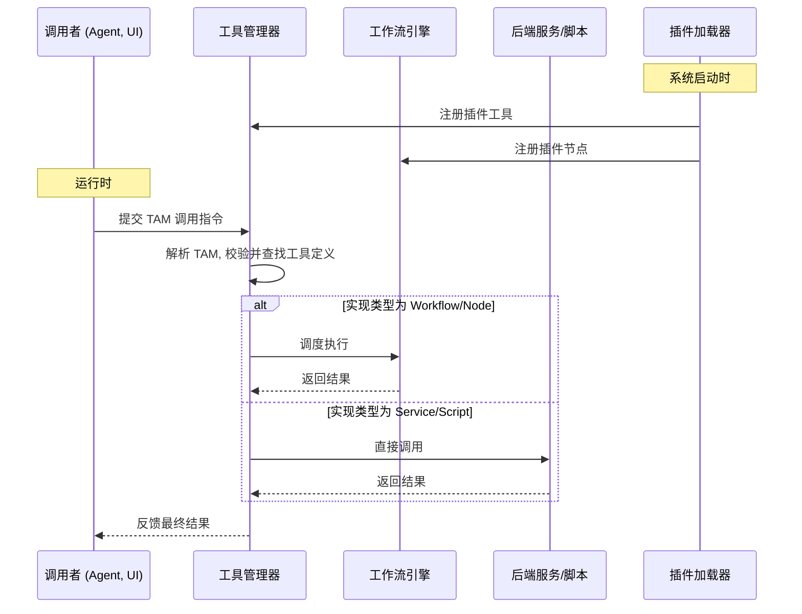

# ComfyTavern 统一插件与工具架构

**文档版本**: 3.0  
**状态**: 去重版

## 1. 引言

### 1.1. 文档目的

本文档详细阐述了 ComfyTavern 平台中 Agent 与工具系统的统一架构及其实现模式。该架构旨在建立一个强大、解耦、可扩展且对开发者友好的生态系统，允许任何功能——无论是预定义的脚本、后端服务、复杂的工作流，还是由 AI Agent 动态生成的即时代码——都能被标准化地封装为“工具”，并能被可靠地发现和调用。

### 1.2. 设计哲学：致敬 VCP 理念

我们的设计哲学深受 VCP (变量与命令协议) 革命性理念的启发。VCP 将 AI 的角色从被动的“工具”提升为平等的“创造者伙伴”，这一思想贯穿我们设计的始终。我们采纳此哲学，旨在构建一个能让 AI Agent 与人类创作者无缝协作、共同进化的宇宙。

### 1.3. 核心原则

本架构遵循以下核心原则：

- **关注点分离 (Separation of Concerns)**: 严格区分插件注册、工具定义与实现代码的职责。
- **接口与实现分离**: 调用者只面向标准化接口，`ToolManager` 负责路由到正确实现。
- **单一事实来源 (Single Source of Truth)**: Agent 的工具“说明书”从工具定义中自动生成。
- **统一调用协议**: 所有程序化调用都通过标准的 **Tavern Action Manifest (TAM)** 协议完成。
- **执行路径隔离**: 节点/工作流执行与直接服务/脚本执行在完全隔离的环境中进行。

## 2. 核心概念澄清：工具、节点与工作流

在 ComfyTavern 中，工具、节点和工作流是三个既相关又独立的核心概念。清晰地理解它们的区别与联系，对于构建可扩展、可维护的系统至关重要。

- **节点 (Node)**:

  - **定义**: 节点是工作流的**基本构建块**。它代表一个原子的、可执行的操作单元，拥有明确的输入和输出。例如，`AddTwoNumbersNode`、`LoadImageNode`、`LlmPromptNode`。
  - **角色**: 节点的首要职责是服务于**工作流的构建**。创作者在画布上通过连接节点来编排复杂的逻辑。

- **工作流 (Workflow)**:

  - **定义**: 工作流是由多个相互连接的节点组成的**有向无环图 (DAG)**。它封装了一套完整的、可执行的业务逻辑。
  - **角色**: 工作流是实现复杂任务（如 Agent 的审议循环、图像生成流程、数据处理管道）的主要方式。

- **工具 (Tool)**:
  - **定义**: 工具是一个**可被外部调用的、具有明确功能定义的能力接口**。它向调用者（如 Agent、用户、脚本）暴露一个稳定的 ID 和一组参数，并返回一个可预测的结果。
  - **角色**: 工具的核心职责是**提供可供调用的能力**。它隐藏了内部的实现细节。
  - **核心区别**: **节点/工作流是“实现”，而工具是“接口”**。工具系统本身是独立的，它只关心工具的注册、发现和调用，而不关心工具背后是由节点、工作流还是原生代码实现的。这种分离使得我们可以将任何复杂的功能都封装成一个标准化的工具，供平台各处调用。

## 3. 统一架构概览

### 3.1. 核心组件

- **插件 (`plugins/`)**: 功能扩展的基本单元，以独立目录形式存在。
- **`plugin.yaml`**: 插件清单，声明元数据并提供资产发现入口。
- **`*.tool.json`**: 工具定义文件，包含接口、实现和配置信息。
- **`ToolManager`**: 核心后端服务，负责工具注册、发现、执行和调度。
- **执行器 (Executors)**:
  - `ExecutionEngine` (工作流引擎): 执行基于节点图的逻辑。
  - `ExternalScriptExecutionService`: 在隔离环境中执行外部脚本。

### 3.2. 双路径统一设计

该架构整合了两种主要的工具实现路径，它们在 Agent 调用层面完全统一：

1.  **工作流封装工具** - 将现有工作流动态封装为 Agent 可调用的工具。
2.  **插件化工具** - 通过插件系统提供的标准化工具。

这两种路径通过统一的 TAM 协议和 `ToolManager` 实现无缝集成，为 Agent 提供一致的调用体验。

## 4. 工具实现模式

ComfyTavern 支持多种工具实现模式，以适应从简单原子操作到复杂业务流程的各种需求。这些模式在调用层是统一的，但在实现层各有侧重。

### 4.1. 模式一：基于工作流的实现

这是最主要、最通用的工具实现方式，所有图形化逻辑编排都通过此路径执行。

#### 4.1.1. 完整工作流封装模式

当功能需要多个节点协作完成时，将整个工作流暴露为工具。

- **工作原理**:
  1.  **定义工作流**: 在画布上编排完整工作流，通过 `GroupInput` 和 `GroupOutput` 节点定义对外接口。
  2.  **工具声明**: 在工具定义中设置 `implementation.type: "workflow"`。
  3.  **执行**: `ToolManager` 加载工作流，注入参数，交由 `ExecutionEngine` 执行。
- **适用场景**: 复杂的多步业务流程（图像生成、报告分析等）。

#### 4.1.2. 单节点自动包装模式（零配置特性）

此模式允许将单个节点直接暴露为工具，极大提升了效率。

- **工作原理**:
  1.  **自动参数推断**: `ToolManager` 读取节点的输入插槽定义，自动转换为工具参数。
  2.  **动态包装**: 执行时将单节点包装成“微型工作流”。
  3.  **统一执行**: 通过 `ExecutionEngine` 执行。
- **关键优势**: 零配置、单一事实来源（节点定义即工具接口）、统一执行模型。
- **适用场景**: 原子的、独立的功能单元；快速将现有节点暴露为工具。

### 4.2. 模式二：直接服务调用

对于不适合用节点图表示的逻辑，可直接将后端服务方法暴露为工具。

- **工作原理**:
  1.  **实现后端服务**: 编写服务类及方法（如 `FileManagerService.deleteFile()`）。
  2.  **工具声明**: 设置 `implementation.type: "service"`，并手动定义完整的 `parameters`。
  3.  **执行**: `ToolManager` 直接调用服务方法，不经过 `ExecutionEngine`。
- **适用场景**: 与外部系统交互（文件系统、数据库、网络 API）；需要特殊安全上下文的逻辑。

### 4.3. 模式三：外部脚本执行（Agent 专用）

专为 AI Agent 设计的动态脚本执行能力，赋予其即时创造和执行代码的能力。

- **核心机制**:
  - 平台提供一个核心工具，如 `CodeInterpreter:execute`。
  - Agent 在审议工作流中生成代码并调用此工具。
  - `ExternalScriptExecutionService` 在安全沙箱中执行代码，支持 Python、Node.js 等多种语言。
- **适用场景**: 动态创造能力、即时执行、处理临时或高度灵活的任务。

### 4.4. 模式四：工作流动态封装为 Agent 工具

这是将现有工作流动态封装为 Agent 工具的专门机制，旨在充分复用平台已有的工作流资产。

#### 4.4.1. 统一工具声明与命名空间

所有 Agent 可用的工具，无论其实现方式，都在 `agent_profile.json` 的 `tool_ids_inventory` 数组中统一声明。为了区分来源，我们引入命名空间前缀约定：

- **工作流工具**: ID 必须遵循 `workflow:<workflow_id>` 格式。例如: `"workflow:summarize_text"`。
- **原生/服务工具**: ID 可使用其他前缀，如 `system:` 或 `kb:`。例如: `"system:get_current_time"`。

`AgentRuntime` 会根据此前缀决定如何加载和执行工具。

#### 4.4.2. 从工作流到工具 Schema 的动态生成

当 `AgentRuntime` 遇到 `workflow:` 前缀的工具 ID 时，它会动态地为 LLM 生成该工具的 JSON Schema：

1.  **定位工作流**: 根据 `<workflow_id>` 加载对应的工作流定义文件。
2.  **解析接口**: 读取工作流的 `interfaceInputs` 和 `interfaceOutputs`。
3.  **生成 Schema**:
    - **工具名称 (`name`)**: 使用完整的工具 ID (`workflow:summarize_text`)。
    - **工具描述 (`description`)**: 使用工作流元数据中的 `description` 字段。
    - **输入参数 (`parameters`)**: 遍历 `interfaceInputs`，将其 `key`、`description`、`dataFlowType` 等属性映射为标准的 JSON Schema `properties`。

#### 4.4.3. 执行流程

1.  **Agent 决策**: LLM 输出一个包含 `toolName` (如 `"workflow:summarize_text"`) 和 `arguments` 的工具调用请求。
2.  **Runtime 分发**: `AgentRuntime` 检查到 `workflow:` 前缀。
3.  **执行准备**: `AgentRuntime` 根据 `toolName` 加载工作流定义，并将 `arguments` 映射为工作流的输入。
4.  **提交执行**: `AgentRuntime` 将准备好的载荷提交给 `ExecutionEngine` 执行。
5.  **结果返回**: `ExecutionEngine` 返回结果，`AgentRuntime` 提取 `interfaceOutputs` 的值并返回给 Agent 的核心审议逻辑。

### 4.5. 实现模式总结

| 实现路径         | 封装模式            | 核心思想                | 参数定义     | 适用场景              | 目标用户     |
| :--------------- | :------------------ | :---------------------- | :----------- | :-------------------- | :----------- |
| **基于工作流**   | 完整工作流          | 多节点协作的复杂逻辑    | 手动定义     | 复杂业务流程          | 创作者       |
|                  | **单节点自动包装**  | 零配置的节点暴露        | **自动推断** | 原子功能单元          | 创作者       |
|                  | **动态 Agent 工具** | 复用工作流为 Agent 赋能 | **自动推断** | 为 Agent 快速扩展能力 | **AI Agent** |
| **直接服务调用** | 后端服务方法        | 系统级功能直接调用      | 手动定义     | 平台功能、外部 API    | 开发者       |
| **外部脚本执行** | 动态代码生成        | Agent 即时创造能力      | 标准化接口   | 临时任务、动态逻辑    | **AI Agent** |

## 5. Tavern Action Manifest (TAM) - 统一调用协议

TAM 是 ComfyTavern 中所有程序化工具调用的标准协议，旨在提供一种对人类和 AI 都友好的、极致鲁棒的指令格式。

### 5.1. 协议格式

TAM 采用一种以自定义特殊标记包裹、内部使用“关键字:「始」值「末」”格式的方案。

- **AI 原生的边界标记**: 我们选用 `<|[REQUEST_TOOL]|>` 和 `<|[END_TOOL]|>` 作为边界，这种格式对 LLM 更自然。
- **极致鲁棒的参数传递**: 沿用 VCP 协议的 `key:「始」value「末」` 格式，使得传递任何特殊字符（代码、JSON、多行文本）时都**无需转义**。

#### 5.1.1. 单一工具调用

```
<|[REQUEST_TOOL]|>
command:「始」ToolID「末」
parameter_A:「始」参数值 A「末」
parameter_B:「始」参数值 B，
可以是多行。
「末」
<|[END_TOOL]|>
```

#### 5.1.2. 串联任务调用

当需要在一个动作中按顺序执行多个命令时，使用数字后缀。

```
<|[REQUEST_TOOL]|>
# 步骤 1: 创建文件
command1:「始」FileOperator.WriteFile「末」
filePath1:「始」/logs/today.log「末」
content1:「始」任务开始...「末」

# 步骤 2: 追加日志
command2:「始」FileOperator.AppendFile「末」
filePath2:「始」/logs/today.log「末」
content2:「始」\n添加新记录。「末」
<|[END_TOOL]|>
```

### 5.2. LLM Prompt 设计要点

当使用 LLM 生成 TAM 时，Prompt 的设计至关重要：

1.  **明确角色与目标**: 在系统指令中，告知 LLM 其角色和当前的高级目标。
2.  **提供可用工具清单**: 将该 LLM 可用的工具列表（ID、描述、参数）作为上下文提供。
3.  **提供动态知识 (RAG)**: 对于复杂的工具，可结合 RAG 检索该工具的详细用法示例、最佳实践等。
4.  **引导决策与输出**: 指示 LLM 基于上下文决策并生成一个符合 TAM 规范的 `<|[REQUEST_TOOL]|>` 块。

## 6. 插件系统架构

插件系统是 ComfyTavern 可扩展性的基石，允许开发者和社区贡献者方便地添加第三方工具和功能。

### 6.1. 插件化目录结构

```
ComfyTavern/
├── apps/
│   └── backend/
│       └── src/
│           └── nodes/      # 存放核心内置节点
└── plugins/                # 存放所有第三方或非核心插件
    └── my-awesome-plugin/
        ├── nodes/          # (可选) 此插件提供的后端节点
        ├── tools/          # (可选) 此插件提供的工具定义 (*.tool.json)
        ├── web/            # (可选) 此插件的前端资源
        └── plugin.yaml     # (必需) 插件清单文件
```

### 6.2. 插件清单 (`plugin.yaml`)

每个插件目录中**必须包含**一个 `plugin.yaml` 文件，它声明了插件的元数据、资产入口以及所需的权限。

```yaml
# 插件的唯一标识符
name: my-awesome-plugin
displayName: 我的超棒插件
version: 1.0.0
description: 这个插件能极大地提升生产力。

# 声明此插件提供的后端节点
nodes:
  entry: ./nodes

# 声明此插件提供的工具
tools:
  entry: ./tools

# 声明此插件提供的前端资源
frontend:
  build:
    entry: dist/index.js
    styles: [dist/style.css]

# 声明插件需要的权限
permissions:
  hooks: ["hook:client:workflow:before-execute"]
  ui:
    wrap: ["ui:BaseNode"]
    inject: ["node:header:right"]
  services:
    override: []
```

### 6.3. 工具定义文件 (`*.tool.json`)

在插件的 `tools/` 目录下，每个 `*.tool.json` 文件定义一个工具的接口和实现细节。

```json
{
  "id": "BilibiliFetch:getSubtitle",
  "displayName": "获取 Bilibili 视频字幕",
  "description": "输入 Bilibili 视频 URL 或 BV 号，获取字幕内容",
  "implementation": {
    "type": "script",
    "command": "python scripts/BilibiliFetch.py"
  },
  "parameters": {
    "type": "object",
    "properties": {
      "url": {
        "type": "string",
        "description": "Bilibili 视频的完整 URL 或 BV 号"
      }
    },
    "required": ["url"]
  }
}
```

### 6.4. 配置管理系统

插件可以通过在 `plugin.yaml` 中声明 `configOptions` 数组来定义自己的配置项。这些配置项将自动集成到平台的设置页面中，并由 `settingsStore` 统一管理。

- **关键约定**: 配置项的 `key` 必须遵循 `extensions.{pluginName}.{optionId}` 的格式，以确保全局唯一性。

## 7. 高级扩展机制：实现“近 PR”效果

为了在不直接修改核心代码的情况下实现深度定制，平台提供了一套分层的扩展 API，旨在覆盖绝大多数 PR 场景。

### 7.1. 第一层：安全“添加” (The Additive Layer)

此层级用于无风险地扩充应用能力，主要通过在预留的“插座”（Plugin Outlets）中添加新内容。

- **API 示例**: `api.ui.registerOutletComponent(outletName, component)`
- **用途**: 在节点头部、侧边栏、菜单等预设位置添加新的 UI 元素。

### 7.2. 第二层：受控“修改” (The Interceptive Layer)

此层级允许插件“拦截”和“包装”核心行为与数据。

- **API 示例**:
  - `api.hooks.on(hookName, callback)`: 监听并响应应用关键流程中的事件（如 `workflow:before-execute`）。
  - `api.ui.wrapComponent(componentId, wrapper)`: 以“装饰器模式”包裹核心 UI 组件，修改其行为或外观。

### 7.3. 第三层：完全“替换” (The Override Layer)

此层级是最后的“杀手锏”，允许用插件自己的实现完全替换掉核心的某个模块。

- **API 示例**:
  - `api.ui.overrideComponent(componentId, newComponent)`
  - `api.services.override(serviceName, newService)`
- **风险**: 此为高风险操作，插件必须在 `plugin.yaml` 中明确声明此类权限，供用户审查。

## 8. 端到端工作流程与运行时架构

### 8.1. 插件加载与工具注册

1.  **平台启动**: 后端应用启动。
2.  **插件发现**: `PluginLoader` 扫描 `plugins/` 目录下的 `plugin.yaml` 文件。
3.  **资产分发**:
    - 将节点目录路径告知 `NodeLoader`。
    - 将工具目录路径告知 `ToolManager`。
    - 将前端资源信息暴露给 API。
4.  **工具注册**: `ToolManager` 加载所有 `*.tool.json`，存入全局注册表。
5.  **前端加载**: 前端通过 API 获取插件信息，并动态加载其 JS 和 CSS 资源。

### 8.2. TAM 解析与执行

1.  **生成 (Generation)**: 调用者（Agent, UI, 脚本）生成一段包含 TAM 块的指令。
2.  **提交 (Submission)**: 调用者将指令提交给 `ToolManager` 的执行端点。
3.  **解析与校验 (Parsing & Validation)**: `ToolManager` 解析 TAM 块，并根据工具注册表校验 `command` 的有效性及其参数。
4.  **调度与执行 (Dispatch & Execution)**: `ToolManager` 根据工具的 `implementation.type`，将任务分发给相应的执行器（`ExecutionEngine` 或直接调用服务）。
5.  **反馈 (Feedback)**: 执行结果由 `ToolManager` 返回给原始调用者。

### 8.3. 架构流程图



## 9. 安全性与权限管理

安全性是整个架构的基石。

- **权限声明**: 插件必须在 `plugin.yaml` 中明确声明其所需权限，供用户在安装时审查。
- **沙箱执行**: 外部脚本在严格隔离的安全沙箱中执行，具有最小权限、路径限制和资源限制。
- **输入验证**: 对所有来自 Agent 或用户的输入参数进行严格验证，防止注入攻击。
- **API 守卫**: 插件通过代理模式访问核心服务，默认只读，且只能调用稳定的公共 API。
- **审计日志**: 记录所有工具调用和高风险操作，以便后续审计和问题追踪。

## 10. 结论与未来工作

通过上述统一架构，我们为 ComfyTavern 建立了一个既强大又井然有序的插件与工具生态。它确保了系统的可扩展性、灵活性和安全性，为开发者和 AI Agent 提供了高效、可靠的能力调用方式。

未来的工作将集中在以下几个方面：

1.  **完善高级扩展机制**: 全面实施钩子（Hooks）、UI 插座（Outlets）和包裹（Wrapping）系统，并将其部署到应用的关键位置。
2.  **增强开发者体验**: 提供更完善的插件开发指南、调试工具和 Vite HMR 支持。
3.  **深化 Agent 集成**: 探索 Agent 通过 RAG 系统进行智能工具选择，以及基于工具使用反馈的动态学习机制。
4.  **强化安全模型**: 持续迭代安全策略，引入更精细的权限控制和资源管理。
5.  **扩展工具与插件生态**: 鼓励社区开发更多高质量的插件，丰富 ComfyTavern 的功能。
