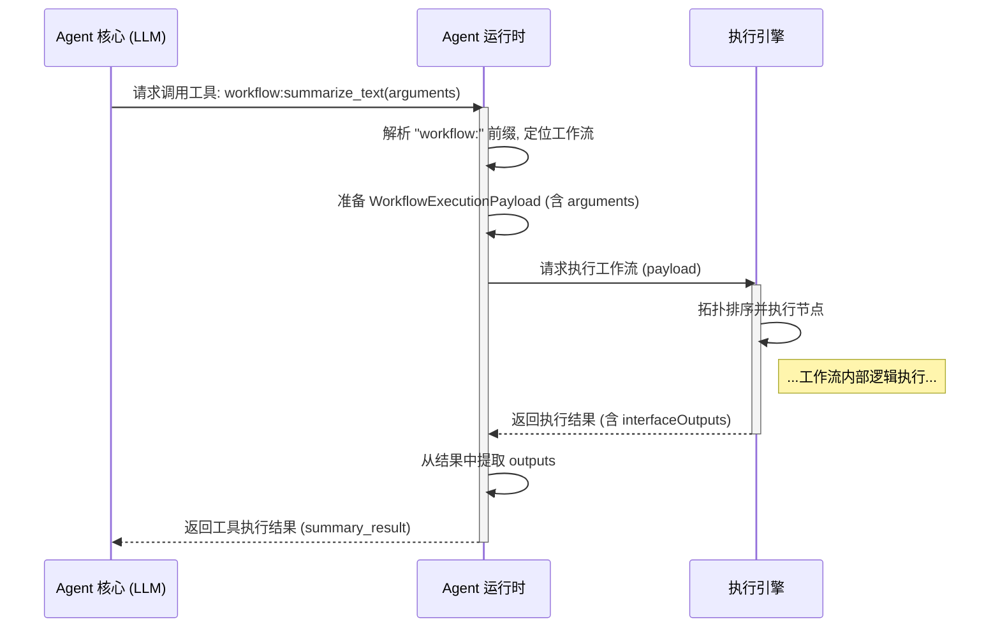

# 将工作流封装为 Agent 工具的设计文档

## 1. 目标与背景

本文档旨在设计并阐述一种内部机制，允许将 ComfyTavern 的**工作流 (Workflow)** 动态地封装成一个**工具 (Tool)**，并将其注册到 Agent 的可用工具列表中。此机制的核心优势在于，它能够充分利用现有工作流的强大编排能力和清晰的接口定义，快速地为 Agent 扩展新能力，特别是嵌套的LLM服务调用可以利用现有的API适配器，而无需为每个用途编写独立的、硬编码的插件或服务。

此设计与现有 Agent 架构紧密集成，特别是 `agent_profile.json` 中的 `tool_ids_inventory` 字段，旨在提供一个统一、可扩展的工具化方案。

## 2. 核心设计

### 2.1. 统一的工具声明

所有 Agent 可用的工具，无论其内部实现是原生服务还是工作流，都应在 `agent_profile.json` 的 `tool_ids_inventory` 数组中统一声明。我们不引入新的配置字段。

### 2.2. 基于命名空间的工具来源识别

为了让 `AgentRuntime` 能够区分不同来源的工具，我们引入命名空间前缀约定：

- **工作流工具 (Workflow-based Tools)**: 其工具 ID 必须遵循 `workflow:<workflow_id>` 的格式。`<workflow_id>` 是工作流定义文件的唯一标识符（例如，文件名去除扩展名）。
  - **示例**: `"workflow:summarize_text"`
- **原生/服务工具 (Native/Service Tools)**: 其工具 ID 可以使用其他前缀，如 `system:` 或 `kb:`，来表示由平台核心服务提供的能力。
  - **示例**: `"system:get_current_time"`, `"kb:Query"`

`AgentRuntime` 在加载 Agent Profile 并解析 `tool_ids_inventory` 时，会根据此前缀来决定如何加载工具的定义和执行逻辑。

**`agent_profile.json` 示例:**
```json
{
  // ...
  "tool_ids_inventory": [
    "system:get_current_time",
    "kb:Query",
    "workflow:summarize_text",
    "workflow:generate_image_from_prompt"
  ]
  // ...
}
```

### 2.3. 从工作流到工具 Schema 的动态生成

当 `AgentRuntime` 遇到一个以 `workflow:` 为前缀的工具 ID 时，它会执行以下操作来动态生成该工具的 JSON Schema（用于提供给 LLM）：

1.  **定位工作流**: 根据工具 ID (`workflow:<workflow_id>`)，加载对应 `<workflow_id>` 的工作流定义文件。
2.  **解析接口**: 读取工作流的 `interfaceInputs` 和 `interfaceOutputs`。
3.  **生成 Schema**: 遵循以下映射规则：

    - **工具名称 (`name`)**: 直接使用完整的工具 ID，例如 `workflow:summarize_text`。
    - **工具描述 (`description`)**: 使用工作流元数据中的 `description` 字段。为了给 LLM 提供更佳的指导，强烈建议为用作工具的工作流编写清晰、明确的描述。
    - **输入参数 (`parameters`)**:
        - **`type`**: 固定为 `object`。
        - **`properties`**: 遍历工作流的 `interfaceInputs` 对象，每个 `key` 对应一个 `property`。
            - **参数名称**: `interfaceInputs` 的 `key`。
            - **参数描述 (`description`)**: 使用 `interfaceInputs` 中对应条目的 `description`。
            - **参数类型 (`type`)**: 根据 `dataFlowType` 映射 (`STRING` -> `string`, `INTEGER` -> `integer`, `FLOAT` -> `number`, `BOOLEAN` -> `boolean`, `OBJECT` -> `object`, `ARRAY` -> `array`)。
            - **枚举值 (`enum`)**: 如果输入配置了 `suggestions` 且 `matchCategories` 包含 `ComboOption`，则其 `value` 列表可转换为参数的 `enum` 数组。
        - **`required`**: 一个数组，包含所有在 `interfaceInputs` 中标记为 `required: true` 的参数名称。

#### 2.3.1. 示例

**工作流 `summarize_text.json` 的接口定义:**
```json
{
  "description": "对提供的长文本进行摘要。当需要理解大量文本的核心内容时使用。",
  "interfaceInputs": {
    "text_to_summarize": {
      "description": "需要进行摘要处理的原始长文本内容。",
      "dataFlowType": "STRING",
      "required": true
    },
    "summary_length": {
      "description": "期望的摘要长度。",
      "dataFlowType": "STRING",
      "required": false,
      "matchCategories": ["ComboOption"],
      "config": {
        "default": "中等",
        "suggestions": [{ "value": "简短" }, { "value": "中等" }, { "value": "详细" }]
      }
    }
  },
  "interfaceOutputs": {
    "summary_result": {
      "description": "生成的摘要文本。",
      "dataFlowType": "STRING"
    }
  }
}
```

**为 `workflow:summarize_text` 动态生成的工具 Schema:**
```json
{
  "name": "workflow:summarize_text",
  "description": "对提供的长文本进行摘要。当需要理解大量文本的核心内容时使用。",
  "parameters": {
    "type": "object",
    "properties": {
      "text_to_summarize": {
        "type": "string",
        "description": "需要进行摘要处理的原始长文本内容。"
      },
      "summary_length": {
        "type": "string",
        "description": "期望的摘要长度。",
        "enum": ["简短", "中等", "详细"]
      }
    },
    "required": ["text_to_summarize"]
  }
}
```

### 2.4. 执行流程

当 Agent 决定调用一个由工作流封装的工具时，其执行流程如下：

1.  **Agent 决策**: Agent 的核心审议逻辑（LLM）输出一个工具调用请求，包含 `toolName` (e.g., `"workflow:summarize_text"`) 和 `arguments`。
2.  **Runtime 拦截与分发**: `AgentRuntime` 接收到该请求。它检查 `toolName` 的前缀。
3.  **工作流调用准备**:
    - `AgentRuntime` 确认前缀为 `workflow:`。
    - 它根据 `toolName` 找到对应的 `workflow_id` (`summarize_text`) 并加载其定义。
    - 它构造一个 `WorkflowExecutionPayload`，将工具调用的 `arguments` 对象映射到工作流的输入值。
4.  **提交执行引擎**: `AgentRuntime` 将准备好的 `WorkflowExecutionPayload` 提交给 `ExecutionEngine` 执行。
5.  **结果返回**:
    - `ExecutionEngine` 执行工作流并返回结果。
    - `AgentRuntime` 从执行结果中提取 `interfaceOutputs` 的值。
    - `AgentRuntime` 将 `interfaceOutputs` 的值（通常是一个对象，或在只有一个输出时直接取该值）作为工具调用的结果，返回给 Agent 的核心审议逻辑。

#### 2.4.1. Mermaid 时序图



## 3. 优势与应用场景

- **与现有架构无缝集成**: 直接利用 `tool_ids_inventory`，无需修改 Agent Profile 的核心结构。
- **高度复用**: 任何为应用面板或通用目的创建的、具有清晰接口的工作流，都可以被轻松地复用为 Agent 的工具。
- **可视化逻辑编辑**: Agent 工具的核心逻辑可以通过可视化的方式进行创建和维护，极大地降低了开发门槛。
- **快速迭代**: 为 Agent 添加新能力，可能只需要创建一个新的工作流并更新 Agent Profile 的 `tool_ids_inventory`，无需重新部署或编写复杂的代码。
- **复杂任务封装**: 可以将包含多个 LLM 调用、条件判断、数据处理的复杂任务序列封装成一个单一的、对 Agent 友好的工具。

## 4. 待讨论与未来扩展

- **错误处理**: 工作流执行失败时，应如何向 Agent 返回一个结构化的错误信息？建议 `AgentRuntime` 捕获 `ExecutionEngine` 的错误，并将其格式化为标准的工具调用错误响应。
- **流式输出 (Streaming)**: 如果工作流的 `interfaceOutputs` 是流式 (`isStream: true`)，当前模型下如何处理？初步设想是，工具调用可以返回一个句柄或ID，Agent 可以通过后续的工具来消费这个流。但这会增加 Agent 的使用复杂度，需要进一步设计。
- **UI 辅助配置**: 可以在项目管理界面中提供一个 UI，让用户可以方便地浏览项目中的所有工作流，并一键将其添加为某个 Agent 的工具，自动填充 `agent_profile.json`。