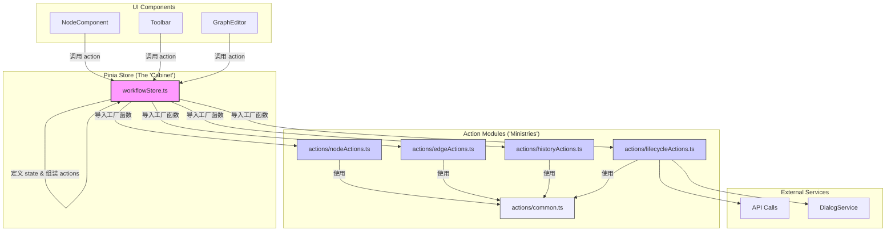

# 工作流状态管理重构计划 (Workflow Store Refactoring Plan)

**版本:** 1.0
**日期:** 2025-07-25
**作者:** 咕咕

## 1. 背景与问题 (Problem Statement)

当前的工作流状态管理核心 `workflowStore.ts` 在架构上扮演了一个“指令中转站”或“外观模式 (Facade)”的角色。它自身不包含复杂的业务逻辑，而是将几乎所有的交互操作委托给一个庞大的、拥有超过 2000 行代码的组合式函数——`useWorkflowInteractionCoordinator.ts`。

这种模式导致了以下核心问题：

1.  **高度耦合 (High Coupling):** `workflowStore` 与 `useWorkflowInteractionCoordinator` 紧密耦合，使得逻辑边界模糊，难以独立理解和修改任一方。
2.  **巨石文件 (Monolithic File):** `useWorkflowInteractionCoordinator.ts` 成为了一个“巨兽”文件，违反了单一职责原则。这极大地增加了维护成本和认知负荷。
3.  **对 AI 协作者不友好 (AI-Unfriendly):** 对于以文件为主要上下文单位的 AI 辅助开发模式，过大的文件会撑爆上下文窗口、稀释注意力并诱发幻觉，严重影响开发效率和代码质量。
4.  **职责倒置 (Inversion of Responsibility):** Pinia Store 本应是状态管理的最终归宿和逻辑的执行者，但现在却依赖于一个为了解决“没有 Pinia”时的问题而创造的旧模式产物。

## 2. 重构目标 (Goals)

本次重构旨在解决上述问题，达成以下目标：

1.  **解耦 (Decoupling):** 将业务逻辑从 `useWorkflowInteractionCoordinator` 中剥离，消除其与 `workflowStore` 的强依赖关系。
2.  **模块化 (Modularity):** 将庞大的业务逻辑按职责拆分到多个小而美的、可独立维护的模块中。
3.  **AI 友好 (AI-Friendly Architecture):** 确保每个逻辑文件的规模和职责都适合 AI 进行分析、修改和生成，优化人机协作开发流程。
4.  **权责归位 (Restoring Responsibility):** 将 `workflowStore.ts` 重塑为真正的状态管理中心，使其负责定义状态、组合并执行 Actions，而不是委托指令。

## 3. 新架构方案：“内阁制”模型 (The "Cabinet Model")

我们将采用一种“分而治之”的 Pinia 架构模式，将 `workflowStore` 从一个“中央集权”的皇帝，改造为一个组建“内阁”的“总理”。

### 3.1. 核心理念

- **`workflowStore.ts` (内阁府):** 保持精简，核心职责是定义核心状态 (State)、从各个“部门”导入 Actions，并将它们组装后统一暴露给外部。它本身不实现复杂业务逻辑。
- **`stores/workflow/actions/*.ts` (各部委):** 每个文件是一个独立的“部门”，负责一块具体的业务领域（如节点操作、连接操作等）。它们是无状态的，其操作逻辑通过接收主 Store 的上下文 (State 和底层方法) 来执行。

### 3.2. 新文件结构

```
apps/frontend-vueflow/src/stores/
├── workflowStore.ts         # 新的、精简的“内阁府”
└── workflow/                # 新建目录：“内阁办公室”
    ├── actions/             # 新建目录：“各部委”
    │   ├── nodeActions.ts
    │   ├── edgeActions.ts
    │   ├── historyActions.ts
    │   ├── lifecycleActions.ts
    │   └── common.ts        # 共享的辅助函数
    └── types.ts             # 内部协作的类型定义
```

### 3.3. 架构示意图



## 4. 重构执行步骤 (Phasing)

本次重构将分阶段进行，确保过程平稳、可控、可回滚。

### **第一阶段：搭建新架构的脚手架 (Scaffolding)**

1.  **创建目录:**
    - `apps/frontend-vueflow/src/stores/workflow/`
    - `apps/frontend-vueflow/src/stores/workflow/actions/`
2.  **创建空文件:**
    - `stores/workflow/types.ts`
    - `stores/workflow/actions/common.ts`
    - `stores/workflow/actions/nodeActions.ts`
    - `stores/workflow/actions/edgeActions.ts`
    - `stores/workflow/actions/historyActions.ts`
    - `stores/workflow/actions/lifecycleActions.ts`
3.  **定义内部协作接口:** 在 `stores/workflow/types.ts` 中定义 `WorkflowStoreContext` 接口，用于规范主 Store 与各 Action 模块的交互。

### **第二阶段：逻辑的渐进式迁移 (Progressive Migration)**

这是重构的核心。我们将逐个函数地将逻辑从 `useWorkflowInteractionCoordinator.ts` 和旧 `workflowStore.ts` 迁移到新的 `actions` 文件中。

- **核心迁移策略：复刻 -> 代理 -> 迁移 -> 测试 -> 清理**
  1.  **复刻 (Replicate):** 首先，将 `useWorkflowInteractionCoordinator.ts` 中的目标函数逻辑，几乎原封不动地迁移到新的 `actions` 模块中。在 Action 模块中，通过 `context` 对象访问所需的依赖（如 `workflowManager`）。
  2.  **代理 (Proxy):** 将 `useWorkflowInteractionCoordinator.ts` 中被迁移的函数改造为一个代理。它不再执行任何逻辑，而是转而调用 `workflowStore` 中新实现的对应 Action。
  3.  **迁移调用方 (Redirect Calls):** _[此步骤在后期进行]_ 当所有 `actions` 都已迁移并验证后，才开始逐步修改 UI 组件，使其直接调用 `workflowStore` 中的 actions，从而绕过 `coordinator`。
  4.  **测试 (Test):** 在每个关键阶段（特别是完成一组相关功能的迁移后），进行端到端的功能测试，确保新实现的行为与旧实现完全一致，没有出现回归性 Bug。
  5.  **清理 (Cleanup):** 只有当所有 UI 组件的调用都已直接指向 `workflowStore`，并通过了完整的功能测试后，才能安全地废弃并删除 `useWorkflowInteractionCoordinator.ts`。
- **迁移目标 (示例):**
  - **`historyActions.ts`**: 迁移 `undo`, `redo` 逻辑。
  - **`nodeActions.ts`**: 迁移 `updateNodePositionAndRecord`, `updateNodeLabelAndRecord`, `addNodeAndRecord` 等。
  - **`edgeActions.ts`**: 迁移 `handleConnectionWithInterfaceUpdate`, `addEdgeAndRecord`, `removeElementsAndRecord` 等。
  - **`lifecycleActions.ts`**: 迁移 `promptAndSaveWorkflow`, `fetchAvailableWorkflows`, `loadWorkflow` 等。
  - **`common.ts`**: 迁移如 `validateAndGetSnapshot`, `recordHistory` 等被多处调用的通用辅助函数。

### **第三阶段：重组 `workflowStore.ts` (Store Reassembly)**

当大部分逻辑迁移完成后，我们将重写 `workflowStore.ts`。

1.  移除所有对旧 `use...` composables 的依赖。
2.  定义核心的 `state` 和 `getters`。
3.  导入所有 `create...Actions` 工厂函数。
4.  在 `setup` 函数中，创建 `context` 对象，并调用工厂函数生成 `actions`。
5.  在 `return` 语句中，使用扩展运算符 (`...`) 组装并暴露最终的 Store API。

### **第四阶段：清理与收尾 (Cleanup)**

**前提条件：** 所有业务逻辑均已迁移至 `actions` 模块，并通过了完整的端到端功能测试，且所有之前依赖于 `useWorkflowInteractionCoordinator.ts` 的 UI 组件都已被重构为直接调用 `useWorkflowStore`。

在确认新架构完全稳定、功能无误后，执行最后的清理工作。

1.  安全地删除 `apps/frontend-vueflow/src/composables/workflow/useWorkflowInteractionCoordinator.ts` 文件。
2.  审查 `composables/workflow/` 目录下的其他 `use...` 文件（如 `useWorkflowManager`, `useWorkflowHistory` 等），由于它们现在是 Store 内部的实现细节，确认没有外部模块直接调用它们后，可以考虑将其变成 Store 私有或进行进一步整合。
3.  整理并移除项目中所有不再需要的相关引用。

## 5. 风险与应对 (Risks & Mitigation)

- **风险:** 重构过程中可能引入新的 Bug。
- **应对:**
  - 采用小步快跑、渐进式的迁移策略。
  - 每完成一小部分迁移，就进行充分的测试。
  - 保持版本控制的清晰，确保每个阶段都可回滚。
