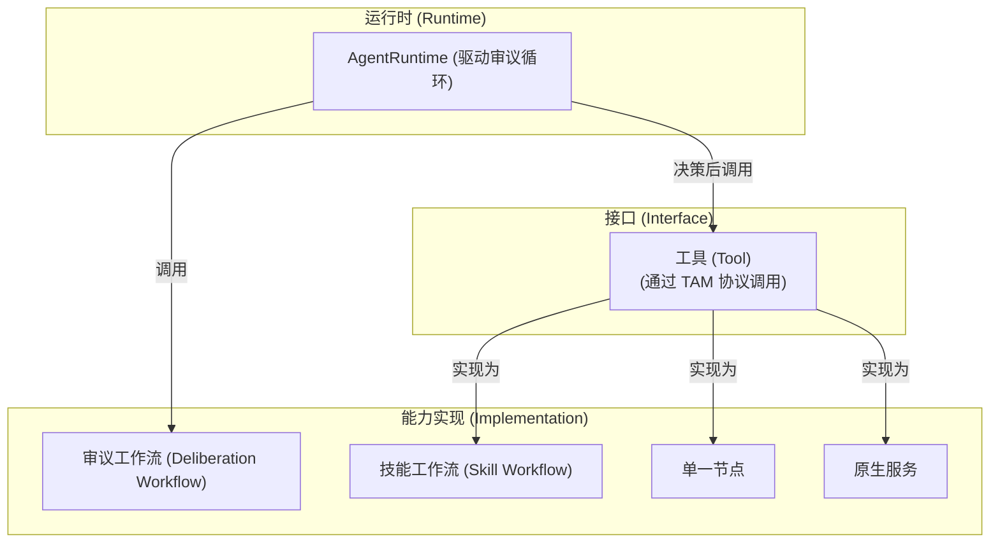

# 架构澄清：画布工作流 vs. Agent 运行时

## 1. 问题陈述与动机

在 ComfyTavern 的架构演进中，我们发现一个核心概念的混淆点：“工作流”一词被同时用于描述两个不同的实体，这可能导致设计偏差和开发混淆。

- **当前的误解**: 将我们在节点编辑器中构建的“可视化工作流”等同于传统意义上 Agent 进行思考和决策的“Agent 工作流”。
- **潜在风险**: 如果不加以澄清，可能会导致开发者将 Agent 的核心决策逻辑（即“大脑”）错误地固化在画布工作流中，从而限制了 Agent 的动态性、可扩展性和对复杂环境的响应能力。

本文档旨在明确澄清这两个概念的边界，重新对齐术语，并为平台的未来发展提供一个清晰、一致的架构指导。

## 2. 概念对齐与术语标准

为了精确沟通，我们在此定义以下核心术语：

- **画布工作流 (Canvas Workflow)**:

  - **定义**: 一个由多个节点通过连接线组成的、可视化的**有向无环图 (DAG)**。
  - **角色**: 它是 ComfyTavern 中**能力的可视化编排器**和**可执行单元**。其本质是一种“可视化编程”，用于定义一个具体的、可复用的任务逻辑。
  - **执行者**: 由平台的 **`ExecutionEngine`** 负责解释和执行。`ExecutionEngine` 只关心节点的拓扑结构和数据流，不感知 Agent 的存在。

- **Agent 运行时 (AgentRuntime)**:

  - **定义**: 一个在后端运行的、负责驱动单个 Agent 实例生命活动的**核心服务**。
  - **角色**: 它是 Agent 的“大脑”和“心跳”，是 Agent **审议循环 (Deliberation Loop)** 的真正宿主。它负责整合 Agent 的感知输入，驱动其决策，并调度其行动。
  - **与工作流的关系**: `AgentRuntime` 是画布工作流的**调用者**，而非被其驱动。

- **技能工作流 (Skill Workflow)**:

  - **定义**: 一个被 Agent 用来执行**具体能力**的“画布工作流”。
  - **角色**: 它封装了一个多步骤的、可复用的复杂操作序列，是 Agent 执行具体任务、与环境进行复杂交互的主要方式。例如 `Generate_Image.json`。
  - **调用**: 由 `AgentRuntime` 在 Agent 决策后，作为一项“技能”来调用。

- **审议工作流 (Deliberation Workflow)**:

  - **定义**: 一个特殊的“画布工作流”，其内部可能包含 LLM 调用节点，用于实现 Agent 的部分或全部**思考与决策逻辑**。
  - **角色**: 它是 `AgentRuntime` 驱动审议循环时调用的核心逻辑单元。`AgentRuntime` 会为其注入必要的上下文（世界状态、私有状态、感知事件等）。

- **工具 (Tool)**:

  - **定义**: 一个标准化的、可被外部调用的**能力接口**。它向调用者暴露一个稳定的 ID 和一组参数。
  - **实现**: 工具的内部实现是多样的，可以是一个**技能工作流**、一个**单一节点**，或是一个**后端原生服务**。
  - **调用协议**: 所有 Agent 对工具的程序化调用都必须通过 **Tavern Action Manifest (TAM)** 协议发起。

- **场景 (Scene)**:
  - **定义**: Agent 运行时实例的**宿主环境**和**生命周期管理者**。
  - **角色**: 为 Agent 提供运行所需的隔离环境，包括专属的世界状态 (`WorldState`) 和事件总线 (`EventBus`)。

### 术语关系图

## 3. 边界重划：谁负责什么？

- **`ExecutionEngine` (执行层)**: **只负责执行 DAG**。它接收一个工作流定义和输入，返回输出。它不关心这个工作流是用来审议还是执行技能，更不感知 Agent 的存在。

- **`AgentRuntime` (决策层)**: **负责 Agent 的“思考”**。它驱动审议循环，调用“审议工作流”，并最终输出一个或多个符合 **TAM 协议** 的行动指令。

- **`ToolManager` (调度层)**: **负责解析和调度行动**。它接收 `AgentRuntime` 输出的 TAM 指令，根据工具定义将其分发给正确的执行器（`ExecutionEngine`、原生服务或脚本执行器）。

- **画布工作流 (能力层)**: **负责“如何做”**。它作为一种能力实现方式，被封装成工具或技能，供 `AgentRuntime` 或其他上层逻辑（如场景、面板）调用。

## 4. 交互与调用路径规范

### 正确的调用路径

1.  **Agent 驱动的路径**:
    `AgentRuntime` -> (生成) `TAM` -> `ToolManager` -> (分发) -> `ExecutionEngine` (执行技能工作流)
2.  **前端直接驱动的路径**:
    `应用面板` -> (调用) `invokeWorkflow` API -> `ExecutionEngine` (执行工作流)

### 核心反模式 (Anti-Pattern)

**禁止将 Agent 的核心决策主循环完全固化在画布工作流中，特别是那种试图在节点之间传递控制权来模拟思考流程的模式。**

- **为什么这是反模式?**
  - **僵化**: 画布是静态的，难以应对动态变化的环境和目标。
  - **状态管理混乱**: Agent 的内部状态（记忆、情绪）不应散落在节点的输出中，而应由 `AgentRuntime` 统一管理。
  - **扩展性差**: 增加新的决策逻辑需要修改画布，而不是为 `AgentRuntime` 扩展新的策略。
  - **性能问题**: 复杂的决策流在 DAG 中执行，可能比在原生代码中驱动更低效。

### 正确的模式

- **Agent 的“大脑”在 `AgentRuntime` 中**，这是一个由代码驱动的、灵活的循环。
- **画布工作流是 Agent 可以使用的“工具箱”**，`AgentRuntime` 根据需要从中挑选工具来使用。

## 5. 与现有文档的关系与锚点

本澄清文档是理解以下架构文档的前提和核心枢纽：

- **主要关联**:
  - **Agent 架构总文档** ([`agent_architecture_consolidated.md`](./agent_architecture_consolidated.md:1)): 本文明确了其“审议循环”的宿主是 `AgentRuntime`，而非画布本身。
  - **统一插件与工具架构** ([`unified-plugin-and-tool-architecture.md`](./unified-plugin-and-tool-architecture.md:1)): 本文解释了其“工具”接口与“工作流”实现之间的关系。
  - **TAM 协议** ([`TAM_tools.md`](./TAM_tools.md:1)): 本文定义了 `AgentRuntime` 输出决策的标准格式。
  - **Workflow-as-Tool 封装** ([`workflow-as-tool-design.md`](./workflow-as-tool-design.md:1)): 本文是该设计的一个具体应用场景，即如何将“画布工作流”这个实现，桥接到“工具”这个接口上。

## 6. 落地影响与兼容策略

本次澄清主要影响的是**概念和设计模式**，对现有代码的**破坏性变更极小**。

- **代码层面**:
  - 无需修改 `ExecutionEngine`。
  - `AgentRuntime` 的实现需要遵循本篇文档的指导。
  - `ToolManager` 的实现需要遵循本篇文档的指导。
  - `packages/types` 中的注释和 JSDoc 需要更新，以反映正确的术语。
- **UI 与文案**:
  - 在工作流编辑器的帮助文案、Tooltip 或空画布引导中，应加入提示：“画布工作流用于编排可执行的能力。要创建 Agent，请定义 Agent Profile 并为其配置审议逻辑。”
- **开发者文档**:
  - 在 `docs-site` 的架构部分，应新增此澄清文档的链接，并更新相关教程，引导开发者使用正确的模式。

通过这次概念澄清和边界重划，我们可以确保 ComfyTavern 的 Agent 系统建立在一个稳固、可扩展且逻辑清晰的基础之上。
