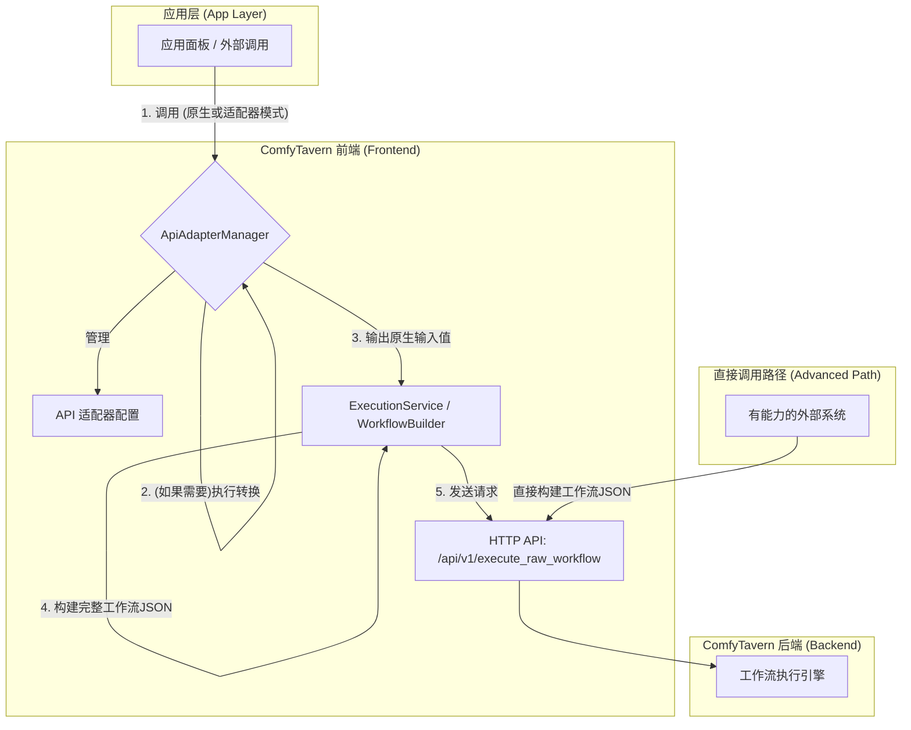
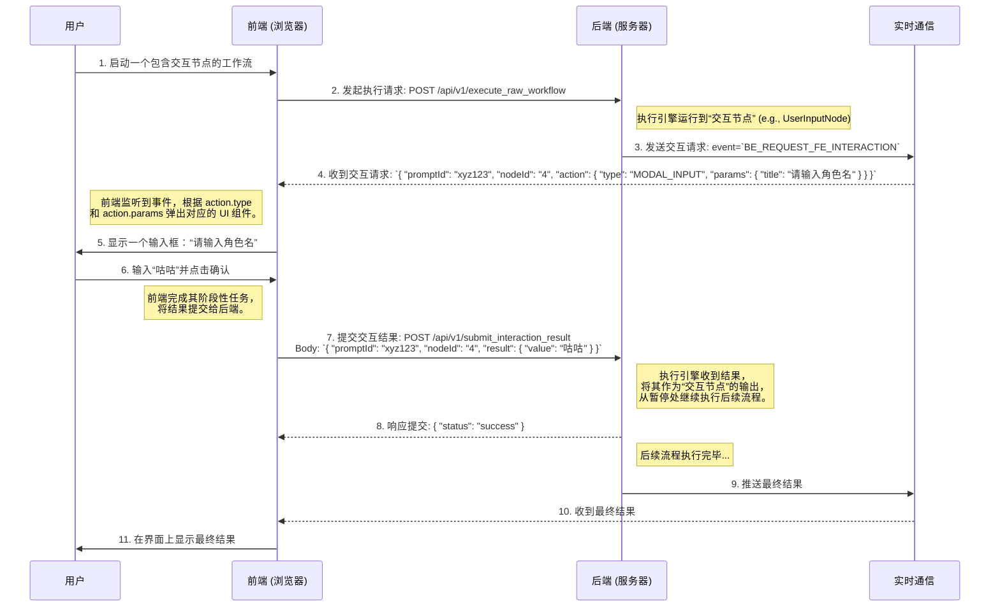

# 设计文档：前端 API 适配管理器与集成接口 (v2.1)

## 1. 引言与目标

ComfyTavern 平台旨在通过一套多层次、清晰定义的 API 服务，将其核心的工作流执行能力和应用面板集成能力，灵活地暴露给不同类型的消费者，包括内部的应用面板、外部的第三方应用以及开发者。

本文档是对 `api-services-and-integration.md` 和 `api-adapter-design.md` 的整合与演进，旨在设计一个**纯前端的、以适配为核心**的 **API 适配管理器 (ApiAdapterManager)**。

**核心目标**：

- **简化应用开发**：创建一个名为 `ApiAdapterManager` 的前端核心服务，作为**从应用层（面板、外部调用）到内部原生工作流输入格式之间的“翻译层”**。它不直接与后端通信，而是为前端其他模块准备数据。
- **增强应用面板能力**：为**应用面板（微应用）**提供一个功能更强大、更灵活的 JavaScript API。面板开发者可以选择以**原生方式**直接提供工作流输入，也可以选择通过**适配器模式**，使用如 OpenAI API 的标准格式与工作流通信。
- **集成外部 API 兼容层**：将 **API 适配器 (ApiAdapter)** 的概念正式化，作为 `ApiAdapterManager` 的核心管理单元，用于执行外部 API 格式到内部工作流输入的转换。
- **明确分层**：清晰划分前端与后端的职责。前端负责用户交互、数据适配和最终执行载荷的构建；后端专注于接收标准化的工作流 JSON 并安全地执行。
- **确保设计的安全性、可扩展性和易用性**：所有设计都遵循这一基本原则。

## 2. 核心概念：前端 API 适配管理器 (`ApiAdapterManager`)

`ApiAdapterManager` 是一个运行在 ComfyTavern 前端的核心服务。它是一个**纯粹的前端数据准备与转换层**，而非一个 API 代理或网关。

它的核心职责是：接收来自应用层（如应用面板）的请求，如果需要，则使用预定义的 **API 适配器 (ApiAdapter)** 规则进行数据格式转换，最终输出可供前端其他部分（如 `ExecutionService`）用于构建最终工作流 JSON 的**原生输入值**。它还负责提供适配器的测试与调试能力。

### 2.1. 错误处理与调试机制

为了确保适配器开发的可靠性和效率，`ApiAdapterManager` 必须提供强大的错误处理和调试功能。

- **结构化错误**:

  - 当转换失败时（如 `adapterId` 不存在、`sourcePath` 无效、Transformer 执行错误等），`ApiAdapterManager` 必须抛出一个结构化的错误对象，而不是简单的字符串。
  - **示例错误结构**:
    ```typescript
    class AdapterError extends Error {
      constructor(
        public code:
          | "ADAPTER_NOT_FOUND"
          | "INVALID_SOURCE_PATH"
          | "TRANSFORMER_EXECUTION_FAILED"
          | "VALIDATION_FAILED",
        message: string,
        public details?: any
      ) {
        super(message);
        this.name = "AdapterError";
      }
    }
    ```
  - `panelApi` 的 `executeWorkflow` 方法会捕获此错误，并将其转换为对应用面板开发者友好的格式。

- **适配器测试能力**:

  - `ApiAdapterManager` 应提供一个离线测试方法，允许开发者在不实际执行整个工作流的情况下，验证适配器的转换逻辑。
  - **方法定义**:
    ```typescript
    // 在 ApiAdapterManager 内部
    async testAdapterTransform(
      adapterId: string,
      sampleData: any
    ): Promise<{
      success: boolean;
      result?: Record<string, any>; // 转换后的原生输入
      error?: AdapterError;
    }>
    ```
  - **后端测试端点 (Phase 2)**: 为支持更全面的测试（例如，当转换逻辑依赖于后端数据时），可以提供一个后端端点。
    - `POST /api/v1/adapters/{id}/test`：接收模拟的输入数据 (`sampleData`)，在后端环境中执行转换并返回结果。这对于验证同构的转换逻辑至关重要。
  - **实现说明**: 在 `Transformer` 保持纯函数（不依赖后端上下文）的前提下，此后端端点的价值有限，其实现可以推迟。仅当前端 `testAdapterTransform` 无法满足测试需求时（例如未来引入了依赖后端数据的上下文），再考虑实现此端点。

- **接口耦合验证**:
  - `ApiAdapter` 与其 `targetWorkflowId` 存在耦合关系。如果目标工作流的输入接口发生变化，适配器可能会失效。
  - **验证时机**:
    1.  **加载时 (推荐)**: 在前端从后端加载/刷新适配器列表时 (`GET /api/v1/adapters`)。工作流可能在任何时候被修改，此举可以尽早暴露接口不匹配问题。建议后端在提供列表时，为每个适配器附加一个 `validationStatus: 'OK' | 'OUTDATED' | 'WORKFLOW_NOT_FOUND'` 状态字段，以便前端 UI 能直观地展示适配器的健康状况，提升用户体验。
    2.  **执行前**: 在 `executeWorkflow` 调用 `adapter` 模式时，`ApiAdapterManager` 在执行转换**前**，应先调用 `getWorkflowInterface(adapter.targetWorkflowId)`。
    3.  **保存时**: 在适配器编辑器中保存 `ApiAdapter` 时，也应执行此验证。
  - **验证逻辑**: 校验 `adapter.requestMapping` 中的每一个 `key`（即工作流输入插槽 ID）是否存在于从 `getWorkflowInterface` 获取的输入接口定义中。
  - **失败处理**: 如果验证失败，应立即抛出 `AdapterError` (例如，`code: 'VALIDATION_FAILED'`)，并提供清晰的错误信息，指出哪个映射字段在工作流接口中已不存在，从而避免运行时才发现问题。

### 架构图



## 3. 面板通信 API (`window.comfyTavern.panelApi`)

这是暴露给应用面板的接口，旨在提供稳定、易用且安全的通信桥梁。它内部会调用 `ApiAdapterManager`。

### 3.1. 核心方法

- `async getWorkflowInterface(workflowId: string): Promise<WorkflowInterface>`
- `subscribeToExecutionEvents(promptId: string, callbacks: PanelExecutionCallbacks): () => void`
- `async getCurrentTheme(): Promise<ThemeInfo>`
- `async requestHostService(serviceName: string, args?: any): Promise<any>`
  - **描述**: 允许应用面板请求宿主环境（ComfyTavern 主应用）提供的特定服务，如弹出通知、访问本地存储等。
  - **安全边界**: 这是应用面板与宿主环境交互的最危险边界，必须严格控制。
    - **服务白名单**: 宿主环境必须维护一个明确的**服务白名单**，只有在白名单中注册的服务才能被面板调用。
    - **最小权限原则**: 白名单服务暴露给面板的功能必须是完成其业务所必需的**最小集合**，严禁提供任何可能触及系统底层或用户敏感信息的能力。
    - **权限控制**: 面板的定义 (`PanelDefinition`) 中可以声明其需要的服务权限，宿主在加载面板时可以据此进行授权。
    - **限流/限频**: 必须对来自面板的服务调用实施限流策略，防止面板通过高频调用（如连续弹出通知）进行 DoS 攻击或骚扰用户。
    - **参数校验**: 宿主环境在接收到服务调用请求时，必须对传入的 `args` 进行严格的类型和内容校验，防止恶意参数注入。

### 3.2. 核心交互：`executeWorkflow`

此方法封装了从数据准备到触发前端执行服务的完整流程。

`async executeWorkflow(executionRequest: WorkflowExecutionRequest): Promise<{ promptId: string }>`

其中 `WorkflowExecutionRequest` 定义如下：

```typescript
type WorkflowExecutionRequest = {
  workflowId: string;
  // 调用方选择一种模式来提供输入
  inputs:
    | {
        // 模式一：原生模式
        // 直接提供与工作流输入接口匹配的键值对。
        mode: "native";
        values: Record<string, any>;
      }
    | {
        // 模式二：适配器模式
        // 使用一个预定义的 API 适配器来转换数据。
        mode: "adapter";
        adapterId: string; // 例如: 'openai_chat_v1'
        // 提供符合该适配器源 API 格式的数据。
        data: any; // 例如: { model: '...', messages: [...] }
      };
};
```

**内部流程**:

1.  `executeWorkflow` 接收到请求后，将其传递给 `ApiAdapterManager`。
2.  `ApiAdapterManager` 处理 `inputs`：
    - 如果是 `native` 模式，直接返回 `values`。
    - 如果是 `adapter` 模式，根据 `adapterId` 查找规则，对 `data` 进行转换，返回转换后的原生 `values`。
3.  `executeWorkflow` 将 `workflowId` 和转换后的原生 `values` 交给前端的 `ExecutionService`。
4.  `ExecutionService` 负责构建完整的工作流 JSON 并发送到后端，最终返回 `promptId`。

## 4. API 适配器 (`ApiAdapter`)

`ApiAdapter` 是一个独立的、可配置的实体，与“工作流”在概念上平级。它定义了**一个外部 API 请求格式与一个内部 ComfyTavern 工作流输入之间的单向转换规则**。

这部分完整吸收了 `api-adapter-design.md` 的设计，但重点在于**请求转换**。

### 4.1. 映射规则

适配器的核心是其灵活的映射规则，它定义了数据如何从源（外部 API 请求）流向目标（工作流输入）。

- **简单映射**：直接的一对一字段映射。

  - 示例：工作流输入 `temp` ← 源 `request.body.temperature`

- **高级映射：转换器 (Transformer)**：当数据结构不匹配或需要预处理时使用。
  - **模板引擎 (Template Engine)**：使用 Handlebars.js 或 LiquidJS 等安全模板引擎处理文本和 `messages` 列表。
  - **预置函数 (Preset Functions)**：提供 `json.stringify`, `array.join`, `array.map` 等安全、无副作用的内置函数。
  - **JSONata (可选)**：用于复杂的 JSON 到 JSON 的查询和转换。

### 4.2. 数据结构 (示例)

一个 `ApiAdapter` 对象的概念性数据结构如下：

```typescript
interface ApiAdapter {
  id: string;
  name: string; // e.g., "My Character Chatbot API"
  adapterType: "openai_chat_v1" | "openai_completion_v1" | "custom";
  targetWorkflowId: string;
  modelIdentifier: string; // 主要用于后端 OpenAI 兼容层，根据外部请求的 `model` 字段路由到此适配器。在前端 `panelApi` 的 `adapter` 模式下不直接使用。

  // 请求映射规则 (Key: 工作流的输入插槽ID)
  requestMapping: Record<string, MappingRule>;

  // 响应映射规则 (可选，用于适配器测试或未来扩展)
  responseMapping?: Record<string, MappingRule>;
}

interface MappingRule {
  sourcePath: string; // e.g., "request.body.messages"
  transformer?: {
    type: "template" | "function" | "jsonata";
    expression: string; // 模板字符串或函数调用链
  };
  defaultValue?: any;
}
```

> **注**: `modelIdentifier` 是一个面向外部兼容 API 的“别名”或“路由键”。在前端通过 `panelApi.executeWorkflow` 以 `adapter` 模式调用时，系统直接使用 `adapterId` 作为唯一标识，`modelIdentifier` 在此链路中不发挥作用。其主要应用场景见 5.3 节。

### 4.3. 适配器的生命周期与来源管理

为了确保 `ApiAdapter` 的一致性、可发现性和可管理性，其生命周期管理遵循以下原则：

- **统一来源**: 所有 `ApiAdapter` 的权威定义都存储在**后端**，与工作流 (`Workflow`) 的管理方式类似。
- **API 端点**: 后端提供专门的 RESTful API 用于对 `ApiAdapter` 进行增删改查（CRUD）操作。
  - `GET /api/v1/adapters`: 获取所有可用的适配器列表。
  - `GET /api/v1/adapters/{id}`: 获取单个适配器的详细定义。
  - `POST /api/v1/adapters`: 创建一个新的适配器。
  - `PUT /api/v1/adapters/{id}`: 更新一个现有的适配器。
  - `DELETE /api/v1/adapters/{id}`: 删除一个适配器。
- **前端加载与缓存**:
  - 前端的 `ApiAdapterManager` 在初始化时，或在需要时，通过调用 `GET /api/v1/adapters` 来获取所有适配器配置。
  - 获取到的配置可以被缓存在前端，以减少不必要的网络请求。管理器应提供刷新机制以获取最新配置。
- **用户界面**:
  - 平台应提供一个专门的管理界面，让用户可以（在拥有相应权限时）创建、编辑和删除 `ApiAdapter`。
  - 这个界面会使用上述 API 与后端进行交互。

### 4.4. 数据源与上下文

**当前设计**:
在当前设计中，`ApiAdapter` 的 `MappingRule` 的 `sourcePath` 只能从 `WorkflowExecutionRequest.inputs.data` 这个载荷中获取数据。这确保了转换过程是一个纯函数，其输出完全由输入决定，易于测试和预测。

**未来考量**:
在某些高级场景下，转换逻辑可能需要依赖 `data` 之外的上下文信息，例如：

- 当前登录用户的 ID 或权限。
- 当前时间戳。
- 从后端动态获取的某个全局配置项。

如果未来需要支持这些场景，可以考虑以下方案：

- **上下文注入**: 由 `ApiAdapterManager` 在执行转换前，向 `data` 对象中安全地注入一个预定义的 `context` 对象，其中包含允许访问的上下文信息。
- **扩展 Transformer 环境**: 为 Transformer 的沙箱环境安全地提供一些只读的全局变量或函数来访问上下文。

无论采用何种方案，都必须严格控制上下文的访问范围和权限，确保适配器的安全性和可预测性。在当前版本中，我们优先保持其纯函数特性。

## 5. 后端 HTTP API 支持

后端的 API 设计可以保持简洁和专注，主要提供一个强大的、标准化的工作流执行入口。

### 5.1. 核心执行端点

- `POST /api/v1/execute_raw_workflow`
  - **这是前端调用的主要目标端点。**
  - 它接收一个完整的、扁平化的工作流 JSON 定义，以及可选的初始输入值。
  - 后端对此端点进行严格的安全校验（节点白名单、资源限制等）后执行。
  - 调用方（通常是前端的 `ExecutionService`）对工作流 JSON 的正确性和完整性负责。

### 5.2. 辅助端点

- `GET /api/v1/workflows/{workflowId}/interface`
  - 获取指定工作流的输入输出接口定义，供前端构建 UI 或进行验证。
- `GET /api/v1/executions/{promptId}/status`
  - 查询特定执行的状态和结果。
- **Webhook & Server-Sent Events (SSE)**
  - 继续支持 Webhook 回调和 SSE 事件流，用于异步通知。

### 5.3. 面向外部系统的 OpenAI 兼容层 (Phase 2)

如果仍需为**不经过前端 UI 的纯外部系统**提供 OpenAI 兼容 API，可以单独在后端或一个独立的 API 网关中实现。

- `POST /v1/chat/completions`
  - 此端点内部会加载并执行与前端**相同**的 `ApiAdapter` 转换逻辑，然后调用内部的工作流执行引擎。这确保了无论调用来自前端面板还是外部 API，行为都保持一致。
  - **`modelIdentifier` 的作用**：在此场景下，API 请求中的 `model` 字段将用于查找 `modelIdentifier` 匹配的 `ApiAdapter`，从而实现路由。

### 5.4. 前后端一致性保障

为了保证在前端 `ApiAdapterManager` 和后端兼容层中执行的转换逻辑完全一致，必须遵循以下原则：

- **同构包 (Isomorphic Package)**：
  - 将 `ApiAdapter` 的 TypeScript 接口定义、所有 `MappingRule` 相关的类型，以及最核心的 **Transformer 执行器**（包括模板引擎、预置函数库、JSONata 引擎的封装）抽取到一个独立的、前后端均可引用的 npm 包中（例如 `@comfytavern/adapter-core`）。
  - 这样做可以从根本上保证“同一份代码，同一种解释”，避免因环境差异（如不同的模板引擎版本或实现）导致的行为不一致。
- **沙箱环境对齐**:
  - 同构包中的 Transformer 执行器需要考虑到不同环境的沙箱实现。
  - 在前端，它可能利用 Web Worker。
  - 在后端（Bun/Node.js），它可能利用 `vm` 模块或一个独立的进程。
  - 无论实现方式如何，其暴露的接口和功能（如允许的全局变量、可用的预置函数）必须是完全一致的。

## 6. 通用设计原则与安全

- **认证与授权**：所有后端 HTTP API 均需通过 API Key 进行认证。
- **错误处理**：使用标准 HTTP 状态码和结构化的 JSON 错误响应体。
- **API 版本管理**：通过 URL 路径进行版本控制 (`/api/v1/...`)。
- **输入验证**：对所有 API 接收的参数和数据进行严格的 Zod 验证。
- **转换器沙箱环境**：所有在 `ApiAdapter` 中定义的转换器（模板、函数、JSONata）的执行都必须在一个严格的前端沙箱环境中运行，禁止访问不安全的 API，并限制其计算资源。
  - **实现建议 (前端)**: 强烈建议使用 **Web Worker** 来执行这些转换逻辑。这能带来双重好处：
    1.  **安全隔离**: Web Worker 运行在独立的线程中，拥有自己的全局作用域，天然地隔离了主线程的 `window` 和 `document` 对象，防止转换逻辑意外或恶意地操作 DOM 或访问敏感数据。
    2.  **性能提升**: 对于计算密集的转换（如处理大型 `messages` 数组的模板），在 Web Worker 中执行可以避免阻塞主线程，确保 UI 的流畅响应。
- **原始工作流执行安全**：后端对 `/api/v1/execute_raw_workflow` 的调用执行最严格的校验，包括限制可执行节点类型、检查资源消耗等。

## 7. 关于 `promptId` 和历史记录

(此部分保留 `api-services-and-integration.md` 中的详细说明，作为重要附录)

目前，`promptId` 的管理主要是在内存中针对活跃的执行任务。执行结果会通过 WebSocket 实时发送给客户端。**但是，对于已完成的执行，目前没有一个明确的、已实现的持久化存储方案来保存其 `promptId` 对应的详细结果和历史记录。** 相关的 `HistoryService` 仍处于 `TODO` 状态。

## 8. 交互式执行流 (Phase 2)

**(注意：本章节描述的功能强大但实现复杂，已规划为第二阶段 (Phase 2) 的开发内容。第一阶段将专注于实现无中断的核心执行链路。)**

本章节将补充设计一个**交互式执行流**，用于处理在工作流**执行过程中**需要暂停，并由前端（通常是用户）提供输入的场景。

这使得 ComfyTavern 的能力从纯粹的自动化处理，扩展到了需要人机协作的复杂任务。这些交互不仅可以由用户在应用面板上的直接操作触发，也可以由 **Agent 在其执行逻辑中（通过调用特定的“面板交互工具/节点”）主动发起**，以获取必要的外部输入或进行关键决策的确认。

**核心用例**:

- **动态参数输入**: 工作流执行到某一步时，弹出一个对话框，要求用户输入文本、选择选项或确认操作。
- **文件上传与预处理**: 流程需要用户上传一个文件（如图片、文档），前端可以在上传前进行预览、裁剪或读取元数据，然后将处理后的结果提交给后端继续执行。
- **利用浏览器独有 API**: 流程需要调用 WebGL、Web Audio 或其他只能在浏览器中运行的 API。
- **Agent 主动请求用户确认或输入**: Agent 在其决策流程中，可能需要用户对某个提议进行确认（例如，“是否接受此任务？”），或提供额外信息以继续其内部任务（例如，“请输入目标的具体名称”）。

### 8.1. 架构与流程

此流程的核心思想是：后端作为“总指挥”（无论是场景的编排逻辑还是 Agent 的审议核心），在需要时“委托”前端作为“交互专家”来完成特定任务。



### 8.2. 新增组件与职责

- **特殊节点：交互节点 (`Interactive Node`)**

  - 这是一种特殊的后端节点类型。当 `ExecutionEngine` 遇到它时，不会在后端执行逻辑，而是触发向前端的交互请求。
  - 节点的定义中需要包含 `action` 的描述，告知前端应该执行何种交互操作。

- **前端：交互服务 (`InteractionService`)**
  - 这是一个新的前端服务，通过 WebSocket 监听来自后端的 `BE_REQUEST_FE_INTERACTION` 事件。
  - 它负责解析 `action` 并调用对应的 UI 服务（如 `DialogService`）来显示模态框、文件选择器等。
  - 在用户完成交互后，它负责调用新的后端 API 来提交结果。

### 8.3. 新增 API 与事件

- **WebSocket 事件 (Backend -> Frontend)**

  - **事件名**: `BE_REQUEST_FE_INTERACTION`
  - **载荷 (Payload)**:
    ```typescript
    interface InteractionRequest {
      promptId: string; // 当前执行的任务 ID
      nodeId: string; // 需要交互的节点 ID
      action: {
        type: "MODAL_INPUT" | "FILE_UPLOAD" | "CONFIRMATION"; // 交互类型
        params: any; // 渲染 UI 所需的参数 (如标题、消息、选项等)
      };
    }
    ```

- **HTTP 端点 (Frontend -> Backend)**
  - **端点**: `POST /api/v1/submit_interaction_result`
  - **载荷 (Body)**:
    ```typescript
    interface InteractionResult {
      promptId: string;
      nodeId: string;
      result: any; // 用户交互产生的结果
    }
    ```
  - **职责**: 后端接收此请求，验证 `promptId` 和 `nodeId`，然后将 `result` 提供给暂停的 `ExecutionEngine`，使其可以继续执行。

### 8.4. 对现有模块的影响

- **后端 `ExecutionEngine`**: 需要增加逻辑，以识别和处理 `Interactive Node`，实现工作流的暂停和恢复。
- **前端 `panelApi`**: 可以考虑增加一个方法 `subscribeToInteractionRequests`。为保证核心状态管理的健壮与安全，此订阅**不应**将状态处理（如重试、提交、F5 恢复）的责任转移给面板。一个更安全的模型是：
  - 宿主的 `InteractionService` **始终**负责监听事件、管理超时、调用后端 API（提交/取消）、处理重试和恢复待处理的交互。
  - 面板通过 `subscribeToInteractionRequests` 注册的是一个**自定义 UI 提供者 (UI Provider)**。
  - 当 `InteractionService` 收到交互请求时，它会检查是否有面板为该交互类型注册了 UI Provider。如果有，则调用该 Provider 来渲染界面；否则，使用平台默认的 UI。
  - Provider 的职责仅限于渲染 UI 并将用户的输入结果（或取消信号）返回给 `InteractionService`。后续所有与后端的通信和状态管理均由 `InteractionService` 统一处理。这避免了将复杂的、安全关键的状态逻辑分散到不可信的面板代码中。

### 8.5. 鲁棒性设计

为了处理交互过程中的异常情况（如用户关闭页面、网络中断、长时间不操作等），必须引入以下机制：

- **后端超时机制**:

  - 当 `ExecutionEngine` 发出 `BE_REQUEST_FE_INTERACTION` 事件后，必须为该 `promptId` 启动一个**等待计时器**。
  - 如果在指定的时限内没有收到对应的 `POST /api/v1/submit_interaction_result` 请求，后端必须将该 `promptId` 标记为**超时失败**，并立即释放相关资源（如内存、计算资源），以防止“僵尸任务”耗尽系统资源。
  - 这个超时事件也应该通过 WebSocket 推送给前端，以便 UI 可以相应地更新状态。

- **可配置的等待时限**:

  - `Interactive Node` 的节点定义中应增加一个可选属性 `timeoutSeconds` (例如，默认为 300 秒)。
  - 这允许工作流的设计者根据交互的性质（例如，一个简单的确认 vs. 一个需要长时间思考的输入）来灵活地设置等待时限。

- **用户取消操作**:

  - 必须为用户提供明确的取消交互的途径（如弹窗上的“取消”按钮）。
  - 当用户取消时，前端应主动通知后端，而不是被动等待超时。建议通过调用一个专门的端点 `POST /api/v1/cancel_interaction`，或在 `submit_interaction_result` 中提交一个特殊状态 `{"status": "cancelled"}` 来实现。
  - 后端收到取消指令后，应立即终止该 `promptId` 的执行并释放资源。

- **提交幂等性**:

  - `POST /api/v1/submit_interaction_result` 接口必须实现幂等性。如果前端因网络抖动等原因重试提交了相同 `promptId` 和 `nodeId` 的结果，后端应能正确处理，避免工作流被重复触发或进入错误状态。例如，如果一个 `promptId` 已被后续结果或超时/取消事件终结，那么迟到的结果提交应被拒绝。

- **前端重试与用户通知**:

  - 前端的 `InteractionService` 在调用 `POST /api/v1/submit_interaction_result` 时，如果遇到网络错误或服务器错误（如 5xx），应该实现**有限次数的自动重试逻辑**。
  - 如果重试最终失败，必须向用户显示明确的错误提示，告知其提交失败，并建议其检查网络连接或联系管理员。不能让用户的输入“无声地消失”。

- **连接恢复与状态同步 (F5 警告)**:
  - 如果 WebSocket 连接断开后重连（例如用户刷新页面），前端需要有一种机制来查询当前是否有待处理的交互请求，以避免错过在断线期间后端发送的请求。这可以是一个在重连成功后调用的 API 端点 `GET /api/v1/pending_interactions`。
  - 前端的 `InteractionService` 需要设计得足够健壮，能够处理跨页面生命周期的状态恢复，正确处理“请求已收到但 UI 未显示”、“UI 已显示但用户未操作”等各种中间状态。

## 9. 实现阶段划分 (Implementation Phasing)

为了确保项目可以循序渐进、稳定交付，建议将本文档中描述的功能划分为以下两个主要阶段：

### 9.1. Phase 1: 核心适配与执行链路 (MVP)

第一阶段的目标是构建一个稳定、高效、安全的无中断工作流执行核心。

- **前端 `ApiAdapterManager`**: 实现完整的适配器加载、管理和纯前端的数据转换逻辑 (Section 2, 4)。
- **前端 `panelApi`**: 实现除交互式订阅外的所有核心方法，特别是 `executeWorkflow` 的 `native` 和 `adapter` 模式 (Section 3)。
- **核心执行流**: 确保从 `panelApi` -> `ApiAdapterManager` -> `ExecutionService` -> 后端 `execute_raw_workflow` 的链路通畅 (Section 3.2, 5.1)。
- **适配器管理**: 提供适配器的 CRUD API (`/api/v1/adapters`) 和前端管理界面 (Section 4.3)。
- **前端测试能力**: 实现 `ApiAdapterManager` 的离线测试方法 `testAdapterTransform` (Section 2.1)。
- **一致性保障**: 建立 `@comfytavern/adapter-core` 同构包 (Section 5.4)。

### 9.2. Phase 2: 高级交互与外部集成

在核心链路稳定后，第二阶段将引入更高级的功能，增强平台的交互能力和集成范围。

- **交互式执行流**: 完整实现 Section 8 中描述的全部功能，包括特殊交互节点、前后端服务、API、事件以及全套鲁棒性设计。
- **后端 OpenAI 兼容层**: 实现 Section 5.3 中描述的外部兼容 API。
- **后端适配器测试**: 根据需要实现 `POST /api/v1/adapters/{id}/test` 端点 (Section 2.1)。
