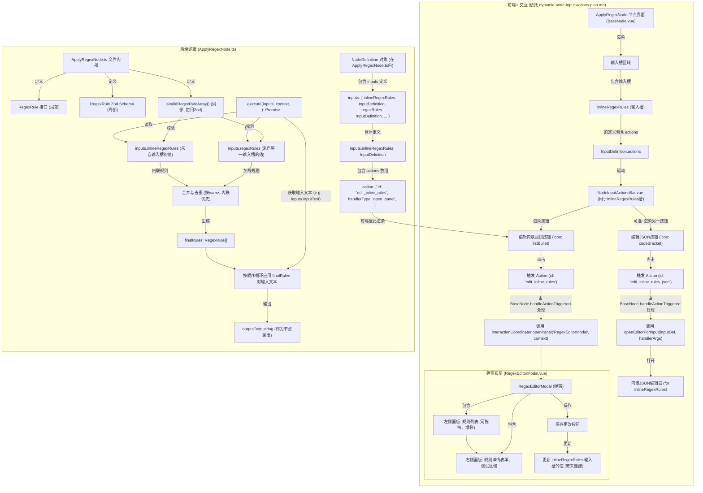

# ApplyRegexNode 内联正则规则编辑器增强计划

## 1. 目标

为 `ApplyRegexNode` 节点添加内联（节点上直接配置）的正则表达式规则编辑功能。用户可以直接在节点上创建、编辑、排序和测试正则表达式规则列表，而无需依赖外部文件加载。这将提高易用性，特别是在快速原型设计和规则微调时。

## 2. 核心变更点

### 2.1. `RegexRule` 类型、Zod Schema 及校验函数的局部定义

这些定义将严格限制在 `apps/backend/src/nodes/processors/ApplyRegexNode.ts` 文件内部，以保持节点定义的独立性和核心类型的纯净性。

```typescript
// 在 apps/backend/src/nodes/processors/ApplyRegexNode.ts 顶部
import { z } from "zod";
import type { NodeDefinition, NodeExecutionContext } from "@comfytavern/types"; // 调整此导入以匹配项目结构

// 1. RegexRule 接口 (文件内局部定义)
interface RegexRule {
  name: string; // 规则名称，用于显示、排序和去重
  pattern: string; // 正则表达式字符串
  replacement: string; // 替换字符串
  flags?: string; // 正则标志 (e.g., 'g', 'i', 'm')
  description?: string; // 规则描述 (可选)
}

// 2. RegexRule 的 Zod Schema (文件内局部定义)
const RegexRuleSchema = z.object({
  name: z.string().min(1, { message: "规则名称不能为空" }),
  pattern: z.string().min(1, { message: "正则表达式不能为空" }),
  replacement: z.string(),
  flags: z.string().optional(),
  description: z.string().optional(),
});

// 3. RegexRule 数组的 Zod Schema (文件内局部定义)
const RegexRuleArraySchema = z.array(RegexRuleSchema);

// 4. 校验函数，使用Zod进行数据校验 (文件内局部定义)
function isValidRegexRuleArray(data: any): data is RegexRule[] {
  return RegexRuleArraySchema.safeParse(data).success;
}
```

### 2.2. 后端 `inputs` 定义调整

`inlineRegexRules` 将作为 `ApplyRegexNode.ts` 中 `definition`对象的 `inputs` (输入槽) 之一进行定义。它将利用 [`DesignDocs/old/dynamic-node-input-actions-plan.md`](DesignDocs/old/dynamic-node-input-actions-plan.md) 中描述的 `actions` 属性来提供编辑功能。

```typescript
// 在 export const definition: NodeDefinition = { ... } 中

inputs: { // 或者 inputs: InputDefinition[] 如果是数组形式
  // ... 其他可能的输入槽，如 'inputText' ...
  inlineRegexRules: {
    key: 'inlineRegexRules', // 确保 key 与对象属性名一致或明确指定
    label: '内联正则规则',
    dataFlowType: 'value', // 表示它承载一个值，而不是流控制
    valueType: 'RegexRule[]', // 自定义值类型，用于类型提示和可能的运行时校验，对应 RegexRuleArraySchema
    description: '直接在节点上编辑的正则表达式规则列表。如果此输入槽连接了数据，则使用连接的值；如果未连接，则可以使用下方按钮编辑并使用此处存储的值。规则将按顺序应用，并与 `regexRules` 输入槽加载的规则合并（内联规则优先，同名去重）。',
    defaultValue: [], // 默认值为空数组
    required: false, // 通常内联编辑的值不是必需连接的
    actions: [
      {
        id: 'edit_inline_rules',
        icon: 'ListBulletIcon', // 建议使用 Heroicons v2 outline 风格的图标名称，如 'listBullet'
        tooltip: '编辑内联正则规则',
        handlerType: 'open_panel', // 参照 dynamic-node-input-actions-plan.md
        handlerArgs: {
          panelId: 'RegexEditorModal', // 唯一标识符，用于前端注册和查找对应的模态框组件
          panelTitle: '编辑内联正则规则',
          // BaseNode.vue 在触发时会向 panelId 对应的组件传递上下文，
          // 例如 { nodeId: string, inputKey: 'inlineRegexRules', currentValue: any }
          // RegexEditorModal.vue 将接收这些参数来初始化和保存数据
        },
        showConditionKey: 'ifNotConnected', // 仅当输入槽未连接时显示此按钮 (dynamic-node-input-actions-plan.md)
      }
    ]
  },
  regexRules: { // 保留原有的用于加载外部规则的输入槽
    key: 'regexRules',
    label: '加载的正则规则',
    dataFlowType: 'value',
    valueType: 'RegexRule[]',
    description: '通过连接加载的正则表达式规则列表。',
    required: false,
  }
  // ... 其他输入槽，如 'inputText' ...
},
```

### 2.3. 后端 `execute` 方法的合并与去重逻辑

`ApplyRegexNodeImpl.execute` 方法将实现以下逻辑：

1.  同时获取 `inputs.inlineRegexRules` (通过节点内部编辑或连接提供的内联规则) 和 `inputs.regexRules` (通过连接加载的规则)。在 `execute` 方法中，应使用类似 `const inlineRules = (inputs.inlineRegexRules as RegexRule[]) || [];` 的方式获取输入值，并处理未连接时的情况（此时 `inputs.inlineRegexRules` 会是节点内部存储的由 `RegexEditorModal` 编辑的值，如果该输入槽未连接）。
2.  使用文件内定义的 `isValidRegexRuleArray` 对两组规则分别进行校验。
3.  **合并与去重**:
    - 创建一个最终规则列表 `finalRules`。
    - 使用一个 `Set` 记录已添加规则的 `name`。
    - 首先遍历内联规则：如果规则有效且其 `name` 未被添加，则加入 `finalRules` 和 `Set`。
    - 然后遍历加载的规则：如果规则有效且其 `name` 未被添加，则加入 `finalRules` 和 `Set`。
    - 这样确保内联规则优先，并基于 `name` 去重。
4.  使用 `finalRules` 按顺序执行正则表达式替换。

### 2.4. 前端模态编辑器 (`RegexEditorModal.vue`) 及触发机制

- **触发方式**:
  - `ApplyRegexNode` 的 `inlineRegexRules` 输入槽在其定义中 (见 2.2 节) 通过 `actions` 属性声明了一个编辑操作。
  - 前端的 `BaseNode.vue` 组件在渲染输入槽时，会委托 `NodeInputActionsBar.vue` 组件来处理这些 `actions`。
  - `NodeInputActionsBar.vue` 会根据 `action` 定义（包括 `icon`, `tooltip`, `showConditionKey`）渲染一个按钮。
  - 当用户点击此按钮时，`NodeInputActionsBar.vue` 会发出 `action-click` 事件，由 `BaseNode.vue` 的 `handleActionTriggered` 方法捕获。
  - `handleActionTriggered` 方法根据 `action.handlerType` (在此为 `'open_panel'`) 和 `action.handlerArgs` (包含 `panelId: 'RegexEditorModal'`) 来调用相应的服务 (如 `interactionCoordinator`) 打开 `RegexEditorModal.vue` 弹窗。
  - `BaseNode.vue` (或 `interactionCoordinator`) 会向 `RegexEditorModal.vue` 传递必要的上下文，如节点 ID (`nodeId`)、输入槽的键名 (`inputKey: 'inlineRegexRules'`) 以及当前输入槽的值 (`currentValue`)，以便模态框进行初始化。
- **弹窗布局 (`RegexEditorModal.vue`)**:
  - **左侧面板**:
    - 显示 `inlineRegexRules` 的列表，每条规则主要显示其 `name`。
    - 支持拖拽排序。
    - 提供“添加新规则”按钮。
    - 每条规则旁边有“删除”按钮。
    - 点击列表中的某条规则，会在右侧面板加载其详细信息进行编辑。
  - **右侧面板**:
    - 规则详情编辑表单，包含 `name`, `pattern`, `replacement`, `flags`, `description` 字段。
    - **正则表达式测试区域**:
      - 一个输入框供用户粘贴示例文本。
      - 一个“测试”按钮，使用当前右侧表单中的 `pattern`, `flags`, `replacement` 对示例文本进行测试。
      - 一个区域展示测试结果（例如，匹配结果、替换后文本）。此功能初期可简单实现，后续迭代。
    - “保存/应用”按钮：点击后，`RegexEditorModal.vue` 会将编辑后的规则列表数据通过事件或回调传递回 `BaseNode.vue` (或通过 `interactionCoordinator`)。`BaseNode.vue` 随后更新对应节点 (`nodeId`) 的 `inlineRegexRules` 输入槽的值 (如果该输入槽未连接，则更新节点内部数据；如果已连接，此编辑功能通常被禁用或行为不同，由 `showConditionKey: 'ifNotConnected'` 控制按钮显隐)。
- **原始 JSON 编辑**:
  - 可以作为 `inlineRegexRules` 输入槽的另一个 `action` 来实现，利用 `dynamic-node-input-actions-plan.md` 中定义的 `'builtin_editor'` 处理器。
  - 在 `inputs.inlineRegexRules.actions` 数组中额外添加一个 `NodeInputAction` 定义：
    ```typescript
    {
      id: 'edit_inline_rules_json',
      icon: 'CodeBracketIcon', // Heroicon v2 outline, e.g., 'codeBracket'
      tooltip: '编辑内联规则 (JSON)',
      handlerType: 'builtin_editor',
      handlerArgs: {
        editorType: 'json', // 指定使用内置的JSON编辑器
        // BaseNode.vue 会将当前输入槽的值 (currentValue) 传递给此编辑器
      },
      showConditionKey: 'ifNotConnected', // 同样，仅当输入槽未连接时显示
    }
    ```

## 3. Mermaid 图 - 系统交互与逻辑


