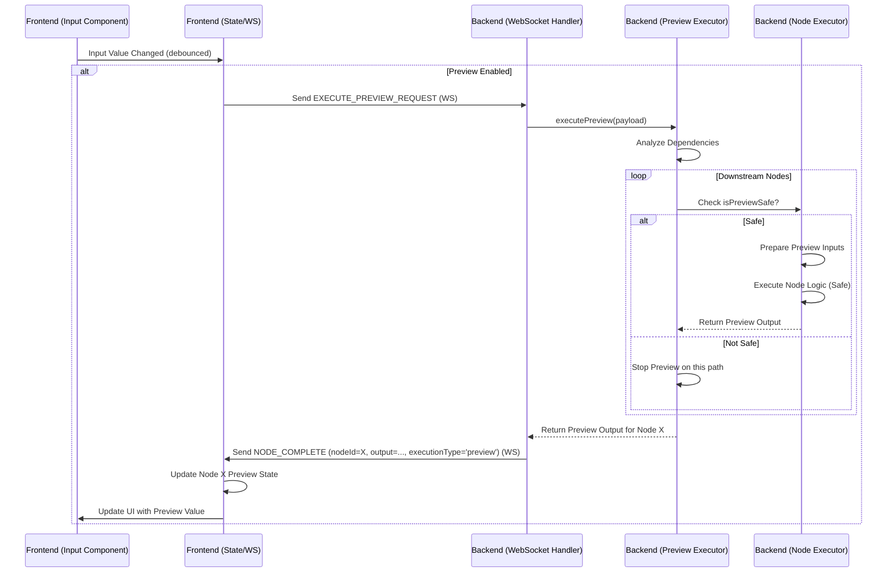

# 实时编辑预览执行方案

## 目标

实现一个可选的、由后端处理的实时编辑预览执行机制。当用户修改某个节点的输入，并且预览功能开启时，后端会尝试执行下游“预览安全”的节点，并将计算结果通过统一的 `NODE_COMPLETE` WebSocket 消息（标记为预览类型）发回前端展示。此机制旨在提供编辑时的快速反馈，其执行范围和结果生命周期不同于完整的“点击运行”执行。

## 核心流程

1.  **用户修改输入 & 预览开启:**
    *   用户在前端某个节点的输入控件中修改了值。
    *   全局“实时预览”开关处于开启状态。
2.  **前端发送预览执行请求 (WebSocket):**
    *   前端检测到输入变化（建议进行防抖/节流处理）。
    *   通过 WebSocket 发送 `EXECUTE_PREVIEW_REQUEST` 消息。
    *   Payload: `{ previewRequestId?: string, workflowId?: string, changedNodeId: string, inputKey: string, newValue: any }` (需要定义 `ExecutePreviewRequestPayload`, `changedNodeId` 是 Nano ID)。后端可根据 `workflowId` 或其他上下文获取完整工作流状态。
3.  **后端接收并处理预览请求:**
    *   WebSocket Handler 接收 `EXECUTE_PREVIEW_REQUEST`。
    *   调用 `PreviewExecutionService` 或 `ExecutionEngine.executePreview(...)`。
4.  **后端部分执行:**
    *   根据 `workflowId` 或上下文加载工作流结构 (使用 Nano ID)。
    *   从 `changedNodeId` 开始，分析下游依赖。
    *   遍历下游节点（按拓扑顺序）。
    *   检查节点定义中的 `isPreviewSafe: boolean` 标志。
    *   **如果安全:** 使用上游（预览）输出作为输入，执行节点的（预览）逻辑，存储“预览输出”。
    *   **如果不安全:** 停止沿该路径的预览。
    *   收集所有成功计算出的“预览输出”。
5.  **后端发送节点完成消息 (WebSocket):**
    *   对于每个成功计算出预览输出的节点，通过 WebSocket 发送统一的 `NODE_COMPLETE` 消息。
    *   Payload: `{ promptId: string, nodeId: string, output: any, executionType: 'preview' }` (`nodeId` 是 Nano ID, `promptId` 可能与 `previewRequestId` 关联或独立生成)。
6.  **前端接收并更新状态:**
    *   `useWebSocket` 处理统一的 `NODE_COMPLETE` 消息 (通过 `nodeId` 关联)。
    *   检查 `executionType`。如果为 `'preview'`，则将 `output` 数据视为临时预览结果，更新前端状态（例如存储到 `node.data.previewOutputs` 或其他地方）。
7.  **前端 UI 更新:**
    *   显示预览的组件读取并展示相应的预览状态值。

## 流程图 (Mermaid)

## 需要进行的修改点

*   **类型定义 (`@comfytavern/types`):**
    *   `NodeDefinition`: 添加 `isPreviewSafe?: boolean`。
    *   `WebSocketMessageType`: 添加 `EXECUTE_PREVIEW_REQUEST` (移除 `PREVIEW_REQUEST`, `PREVIEW_UPDATE`)。
    *   定义 `ExecutePreviewRequestPayload` (使用 Nano ID)。
    *   确保 `NODE_COMPLETE` 载荷包含 `executionType` 和 Nano ID (与 workflow-execution-plan.md 一致)。
*   **后端:**
    *   `NodeDefinition` 实现：添加 `isPreviewSafe` 标记。
    *   `websocket/handler.ts`: 处理 `EXECUTE_PREVIEW_REQUEST`。
    *   `ExecutionEngine.ts` / 新服务: 实现 `executePreview` 逻辑，处理 Nano ID，应用有效默认值，并为每个成功的预览节点发送 `NODE_COMPLETE` 消息 (设置 `executionType: 'preview'`, 使用 Nano ID)。
*   **前端:**
    *   `useWebSocket.ts`: 处理统一的 `NODE_COMPLETE` 消息，根据 `executionType` 和 Nano ID 分发数据。
    *   状态管理 (`stores`, `composables`): 需要设计如何存储和区分预览数据与完整执行数据。
    *   输入组件 / `useWorkflowInteractionCoordinator.ts`: 发送 `EXECUTE_PREVIEW_REQUEST` (含防抖/节流)。
    *   输出/显示组件: 读取相应的状态来显示预览值或最终值。
    *   UI: 添加全局预览开关。

## 与撤销/重做 (Undo/Redo) 的交互

为了确保后端驱动的预览功能与现有的撤销/重做系统（基于 `docs/architecture/history-recording-pattern.md`）正确集成，遵循以下原则：

1.  **预览状态非历史记录**:
    *   通过 `NODE_COMPLETE` 消息接收到的、`executionType` 为 `'preview'` 的 `output` 数据被视为临时的、派生的状态。
    *   它**不**属于核心工作流状态 (`nodes`, `edges` in storage format) 的一部分，因此**不会**被包含在撤销/重做的历史快照中。
    *   前端接收到 `executionType: 'preview'` 的 `NODE_COMPLETE` 消息时，更新相应的预览状态 (通过 Nano ID 关联)，此操作**不**触发历史记录。

2.  **撤销/重做恢复核心状态**:
    *   撤销/重做操作仅恢复核心的存储格式状态快照 (`WorkflowStorageObject`)。

3.  **预览请求的触发时机**:
    *   **用户手动修改输入**: 在协调器函数（如 `updateNodeInputValueAndRecord`）中，当核心状态 (VueFlow 节点/边) 更新，并通过 `workflowManager` 应用，并且历史快照记录**之后**，如果预览功能开启，则发送 `EXECUTE_PREVIEW_REQUEST` (包含 `changedNodeId` Nano ID)。
    *   **撤销/重做操作**: 当 `historyManager` 恢复一个旧的存储格式快照并通过 `workflowManager` 应用**之后**，前端逻辑需要检查是否有节点的输入值因此发生变化。如果变化且预览功能开启，则**必须**触发一次新的 `EXECUTE_PREVIEW_REQUEST` (包含 `changedNodeId` Nano ID)，以确保预览反映恢复后的核心状态。

这种设计将预览的实时性与历史记录的稳定性解耦，保证了状态的一致性和系统的可维护性。

## 待讨论细节

*   `isPreviewSafe` 的具体标准。
*   预览请求的防抖/节流策略。
*   前端如何存储、区分和展示通过统一 `NODE_COMPLETE` 消息接收到的预览值与完整执行值。
*   错误处理（预览执行失败等）。