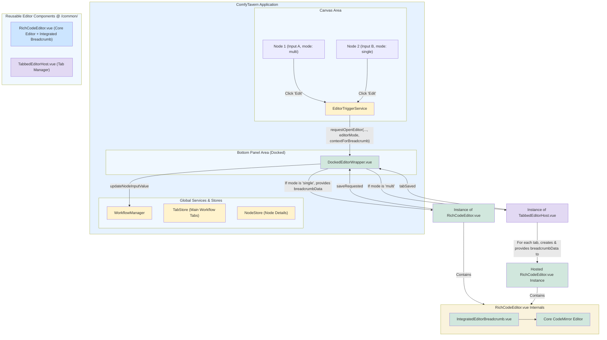

# ComfyTavern 增强型底部编辑器面板设计方案 (v1)

## 1. 引言与目标

本文档旨在为 ComfyTavern 项目的底部编辑器面板提供一个全面的增强设计方案。该方案源于对 [`DesignDocs/architecture/floating-preview-editor-design.md`](DesignDocs/architecture/floating-preview-editor-design.md) 中初步设想的演进和细化，特别是针对节点复杂输入的**内容编辑**功能。

核心目标是实现一个模块化、功能丰富、用户体验类似“迷你 VSCode”的底部编辑区域，主要包括：

1.  **高度可复用的核心编辑器组件**：提供强大的单页编辑能力，并内置上下文感知面包屑导航。
2.  **灵活的标签页管理**：支持类似 VSCode 的持久化标签页行为，允许用户管理多个编辑会话。
3.  **按需加载编辑模式**：根据具体场景和节点配置，可选择加载轻量级单页编辑模式或全功能多标签编辑模式。
4.  **清晰的文件组织和迭代的实现路径**。

此方案旨在显著提升复杂内容（如代码、Markdown、JSON）的编辑体验，同时保持架构的灵活性和可扩展性。

## 2. 核心架构与组件

增强型底部编辑器面板采用三层组件架构：

### 2.1. `RichCodeEditor.vue` (核心单页编辑器)

*   **位置**: [`apps/frontend-vueflow/src/components/common/RichCodeEditor.vue`](apps/frontend-vueflow/src/components/common/RichCodeEditor.vue)
*   **职责**:
    *   提供一个功能丰富、高性能的单页代码/文本编辑体验，基于 CodeMirror 6。
    *   集成核心编辑功能：语法高亮、搜索与替换、行号、自动换行、缩进控制等。
    *   支持特定语言的特化处理（如 JSON 格式化与校验，Markdown 预览支持等）。
    *   **内置面包屑导航**: 在编辑器顶部显示当前编辑内容的上下文路径 (例如：`工作流 > 节点 > 输入项`)。
*   **主要接口 (概要)**:
    *   **Props**:
        *   `editorId: string` (唯一标识)
        *   `initialContent: string`
        *   `languageHint?: string`
        *   `breadcrumbData?: { workflowName?: string; nodeName?: string; inputName?: string; [key: string]: any }` (用于填充面包屑)
        *   `config?: EditorInstanceConfig` (主题、只读、字体大小等)
    *   **Events**:
        *   `contentChanged(editorId: string, newContent: string, isDirty: boolean)`
        *   `saveRequested(editorId: string, content: string)`
    *   **Methods**: `getContent()`, `setContent()`, `isDirty()`, `focusEditor()`, `triggerSave()`

### 2.2. `TabbedEditorHost.vue` (标签页宿主/管理器)

*   **位置**: [`apps/frontend-vueflow/src/components/common/TabbedEditorHost.vue`](apps/frontend-vueflow/src/components/common/TabbedEditorHost.vue)
*   **职责**:
    *   管理多个 `RichCodeEditor.vue` 实例，每个实例对应一个标签页。
    *   提供类似 VSCode 的持久化标签页 UI 和交互逻辑（打开、关闭、切换标签）。
    *   为每个托管的 `RichCodeEditor.vue` 实例准备并传递正确的 `breadcrumbData`。
*   **主要接口 (概要)**:
    *   **Props**:
        *   `initialTabsData?: TabData[]` (其中 `TabData` 包含为 `RichCodeEditor` 准备的 `initialContent`, `languageHint`, `breadcrumbData` 等)
        *   `activeTabId?: string`
    *   **Events**: `tabOpened`, `tabClosed`, `tabSaved` (包装内部编辑器的保存请求), `activeTabChanged`, `allTabsClosed`
    *   **Methods**: `openEditorTab(tabData: TabData)`, `closeEditorTab(tabId: string)`, `saveEditorTab(tabId: string)`

### 2.3. `DockedEditorWrapper.vue` (编辑器场景包装器)

*   **位置**: [`apps/frontend-vueflow/src/components/graph/editor/DockedEditorWrapper.vue`](apps/frontend-vueflow/src/components/graph/editor/DockedEditorWrapper.vue) (或类似场景特定路径)
*   **职责**:
    *   管理底部（或顶部）可停靠编辑面板的整体 UI 状态（显示/隐藏、高度调整、是否常驻等，状态持久化到 `localStorage`)。
    *   根据节点输入的配置 (`InputDefinition.config.bottomEditorMode: 'lightweightSingle' | 'fullMultiTab'`)，按需加载和实例化：
        *   `'lightweightSingle'`: 直接加载一个 `RichCodeEditor.vue` 实例。
        *   `'fullMultiTab'`: 加载一个 `TabbedEditorHost.vue` 实例。
    *   负责从全局状态 (如 `TabStore`, `NodeStore`, `InputDefinition`) 收集合适的信息，以构建 `breadcrumbData`。
    *   将 `breadcrumbData` 传递给 `RichCodeEditor.vue` (单页模式) 或 `TabbedEditorHost.vue` (多标签模式，由其再分发给内部的编辑器实例)。
    *   统一处理来自被加载编辑器（单页或多标签宿主）的保存请求，并与 `WorkflowManager` 对接以更新节点数据和创建历史记录。

## 3. 关键特性与行为详细说明

### 3.1. 标签页行为 (“模仿VSCode”模式)
当使用 `TabbedEditorHost.vue` 时：
*   **持久化**: 为节点输入打开的编辑标签页将在底部编辑器中保持打开状态，直到用户在编辑器面板中手动关闭。
*   **用户管理**: 用户可以自由打开、切换和关闭这些编辑标签页。
*   **激活逻辑**: 当用户点击节点上的“编辑”按钮请求编辑某个输入时，如果对应的标签页（由 `nodeId:inputKey` 唯一标识）已存在于 `TabbedEditorHost.vue` 中，则激活该标签页；否则，新建一个标签页并加载内容。

### 3.2. 面包屑导航
*   集成在 `RichCodeEditor.vue` 的顶部。
*   显示路径如：`当前工作流标签页名称 > 节点名称 (或ID) > 输入项名称 (或ID)`。
*   数据由 `DockedEditorWrapper.vue` 收集并逐层传递。
*   未来可考虑扩展到支持文档内结构导航 (如 Markdown 标题)。

### 3.3. 按需加载编辑模式
*   节点输入的 `InputDefinition.config` 中将包含一个字段，如 `bottomEditorMode?: 'lightweightSingle' | 'fullMultiTab'` (默认为 `'fullMultiTab'`)。
*   `DockedEditorWrapper.vue` 根据此配置加载相应组件，实现轻量级与全功能模式的切换。

### 3.4. 状态持久化
*   **UI状态**: 底部面板的可见性、高度、是否常驻等通过 `localStorage` 持久化。
    *   例如：`bottomDockedEditorLayout: { isVisible: boolean, height: number, isResident: boolean }`
*   **编辑标签页状态 (针对 `TabbedEditorHost.vue`)**:
    *   **当前**：暂且不保存标签页状态，刷新页面会重置标签页状态，只在标签页切换时更新面包屑导航。
    *   **初步方案**: 活动标签页的元信息列表（例如 `Array<{ tabId: string, nodeId: string, inputKey: string, workflowTabId: string }>`）以及可能的未保存草稿，可以考虑通过 `localStorage` 与当前主工作流标签页 ID 或工作流文件路径关联存储。
    *   **方案二**：保存到项目数据中，并在用户刷新页面或重新打开同一项目时尝试恢复，但需要在实现项目数据读写API之后。

## 4. 实现阶段建议 (迭代方法)

1.  **阶段一：核心单页编辑器 (`RichCodeEditor.vue`)**
    *   实现基础 CodeMirror 6 集成和核心编辑功能 (语法高亮, 行号等)。
    *   实现面包屑导航 UI 并定义 `breadcrumbData` prop。
    *   实现基本的搜索功能。
    *   确保清晰的 Props, Events, Methods 接口。
2.  **阶段二：标签页宿主 (`TabbedEditorHost.vue`)**
    *   实现标签页 UI 和基本的标签页管理逻辑 (打开、关闭、切换)。
    *   集成 `RichCodeEditor.vue` 作为标签页内容，并为其传递 `breadcrumbData`。
    *   实现“模仿VSCode”的持久化标签行为。
3.  **阶段三：底部包装器与调度 (`DockedEditorWrapper.vue`)**
    *   实现底部面板的停靠、显隐、高度调整。
    *   实现基于 `bottomEditorMode` 的编辑器模式调度逻辑。
    *   实现与 `WorkflowManager` 的数据保存对接。
    *   完成 `breadcrumbData` 的收集与传递逻辑。
4.  **阶段四：功能丰富与优化**
    *   完善 `RichCodeEditor.vue` 的高级功能 (JSON/Markdown 特化处理, 更完善的搜索UI, 可配置性如主题/字体)。
    *   细化并实现标签页状态的持久化方案 (localStorage)。
    *   更新节点配置 (`InputDefinition.config`) 和触发机制。
    *   编写完整的单元测试和集成测试。
    *   更新所有相关设计文档。

## 5. Mermaid 架构图

## 6. 对现有文档 `floating-preview-editor-design.md` 的影响

本文件 ([`enhanced-editor-panel-design.md`](DesignDocs/architecture/enhanced-editor-panel-design.md)) 的内容将取代 [`DesignDocs/architecture/floating-preview-editor-design.md`](DesignDocs/architecture/floating-preview-editor-design.md) 中关于**底部弹出式编辑面板 (`BottomEditorPanel.vue`)** 的所有设计。具体包括原文档的以下部分：

*   第 2.2 节 (`BottomEditorPanel.vue`)
*   第 4 节 (编辑机制)
*   第 5.2 节 (编辑数据流)
*   第 6.2 节 (底部编辑面板内容渲染策略)
*   第 10 节中与底部编辑面板相关的实现步骤。

[`DesignDocs/architecture/floating-preview-editor-design.md`](DesignDocs/architecture/floating-preview-editor-design.md) 中关于右侧预览面板和插槽标记预览机制的设计依然有效，除非另有说明。