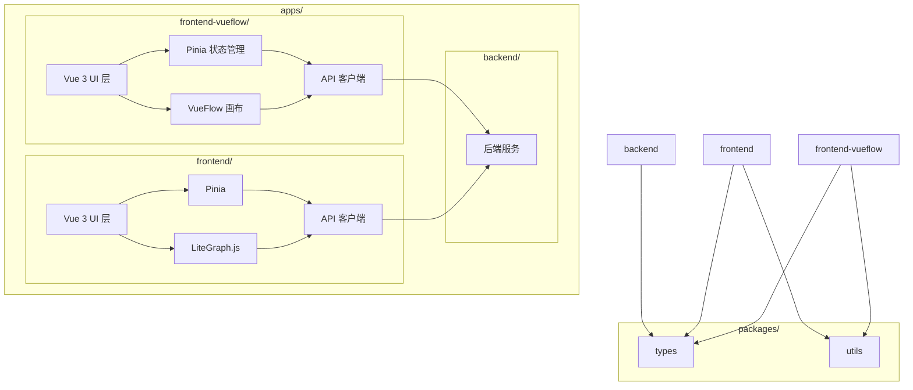

# VueFlow 前端迁移计划

## 1. 目标
- 新建一个基于 VueFlow 的前端项目，解决 LiteGraph.js 硬编码样式问题。
- 初期与现有前端（`apps/frontend/`）并行运行，验证可行性。
- 保留现有后端接口（`apps/backend/`）和共享包（`packages/types/`, `packages/utils/`）。

## 2. 架构设计


## 3. 实施步骤

### 3.1 项目初始化
- **目标**：搭建 VueFlow 前端基础结构。
- **步骤**：
  1. 在 `apps/` 下创建新目录 `frontend-vueflow/`。
  2. 初始化 Vue 3 + TypeScript 项目：
     ```powershell
     cd apps/frontend-vueflow
     bun create vue
     bun install vue@next vue-router@4 pinia @vueuse/core vueflow tailwindcss
     ```
  3. 配置 `vite.config.ts` 和 `tsconfig.json`，参考 `apps/frontend/`。
  4. 添加基本文件结构：
     ```
     frontend-vueflow/
     ├── src/
     │   ├── components/
     │   │   └── graph/
     │   │       └── Canvas.vue
     │   ├── stores/
     │   ├── api/
     │   ├── types/
     │   ├── utils/
     │   └── main.ts
     ├── package.json
     └── vite.config.ts
     ```

### 3.2 画布集成
- **目标**：实现 VueFlow 画布，替换 LiteGraph.js。
- **步骤**：
  1. 在 `src/components/graph/Canvas.vue` 中集成 VueFlow：
     ```vue
     <template>
       <VueFlow v-model="elements" />
     </template>
     <script setup lang="ts">
     import { VueFlow } from '@vue-flow/core'
     import { ref } from 'vue'
     const elements = ref([
       { id: '1', label: 'Node 1', position: { x: 250, y: 5 } },
     ])
     </script>
     <style scoped>
     .vue-flow { height: 100vh; }
     </style>
     ```
  2. 配置节点样式（避免硬编码，使用 scoped CSS）。
  3. 测试拖拽和连线功能。

### 3.3 状态管理和通信
- **目标**：复用现有状态管理和后端接口。
- **步骤**：
  1. 复制 `apps/frontend/src/stores/` 到新项目，调整为 VueFlow 数据结构。
  2. 复制 `apps/frontend/src/api/`，确保 WebSocket 和 HTTP 请求正常。
  3. 更新 `Canvas.vue` 绑定状态和事件。

### 3.4 测试与验证
- **目标**：验证 VueFlow 是否解决样式问题。
- **步骤**：
  1. 启动新前端（端口设为 5233，避免与 5173 冲突）。
     ```powershell
     cd apps/frontend-vueflow
     bun dev --port 5233
     ```
  2. 测试节点样式自定义能力。
  3. 与现有前端对比功能完整性。

## 4. 注意事项
- **端口分配**：使用`config.ts`文件统一管理端口号。
- **依赖管理**：确保 `packages/types/` 和 `packages/utils/` 被新前端引用。
- **样式灵活性**：优先使用 TailwindCSS 和 scoped CSS，避免硬编码。

## 5. 下一步
- 根据测试结果，决定是否迁移更多功能（如 Chat 组件）。
- 如果成功，逐步废弃 `apps/frontend/`。

---
**状态**：计划已制定，待实施。当前优先完成现有前端任务。