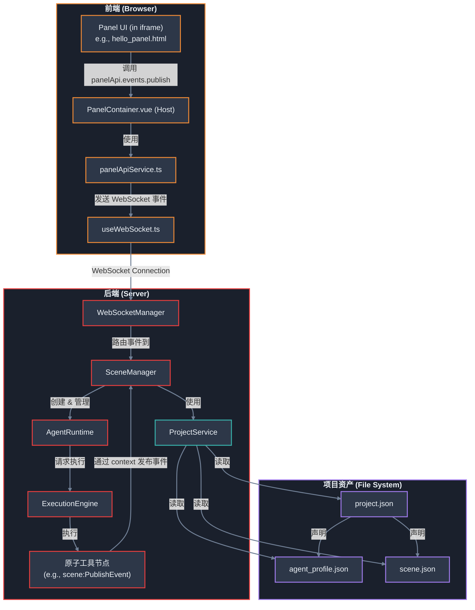
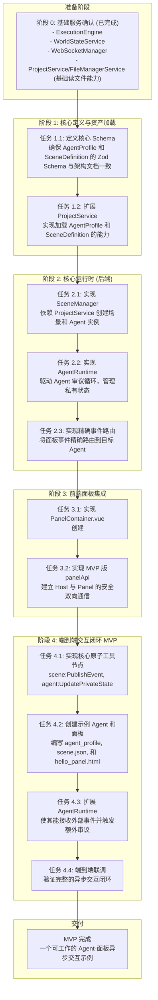

# Agent 架构 v3 - 面板交互 MVP 实施计划 (重构版)

## 1. 引言与目标

### 1.1. 基准架构

本实施计划完全基于 [`DesignDocs/architecture/agent_architecture_v3_consolidated.md`](DesignDocs/architecture/agent_architecture_v3_consolidated.md:1) 中定义的统一 Agent 架构。该文档是我们所有后续开发工作的最终目标和“真理之源”。

### 1.2. 架构对齐

本计划的实施严格依赖于平台已有的或即将实现的核心服务，并遵循以下核心架构文档中定义的原则：

-   **项目与资产管理**: 依赖 [`DesignDocs/architecture/project-architecture.md`](DesignDocs/architecture/project-architecture.md:1) 和 [`DesignDocs/architecture/unified-file-asset-management.md`](DesignDocs/architecture/unified-file-asset-management.md:1) 中定义的 `ProjectService` 和 `FileManagerService`，来负责加载和管理 `Agent Profile`、`Scene Definition` 等核心资产。
-   **场景作为宿主**: 严格遵循 [`DesignDocs/architecture/scene-architecture.md`](DesignDocs/architecture/scene-architecture.md:1) 的核心原则，将 **场景 (Scene)** 定位为 Agent 运行时实例的“宿主环境”和“生命周期管理者”。
-   **面板集成**: 应用面板的实现将作为 [`DesignDocs/architecture/面板与接口/application-panel-integration-plan.md`](DesignDocs/architecture/面板与接口/application-panel-integration-plan.md:1) 中宏大集成方案的**首个 MVP 实例**。

### 1.3. 本计划目标

定义一个清晰、务实、分阶段的路线图，用于构建 v3 Agent 架构的**最小可行产品 (MVP)**。我们将从现有代码出发，在坚实的架构基础上，逐步实现 `SceneManager`、`AgentRuntime`、以及与之配套的前端应用面板，最终打通一个从 Agent 主动发起交互，到面板响应并回传用户输入的完整闭环。

---

## 2. 修订后架构图 (MVP)

此图展示了 MVP 阶段各核心组件的交互关系，特别强调了 `ProjectService` 在资产加载中的关键角色。



## 3. 实施路线图



## 4. 实施阶段详解

### 阶段 0: 基础服务确认 (已完成)

*   **确认项**:
    *   `ExecutionEngine` 可执行工作流。
    *   `WorldStateService` 可管理场景状态 (MVP 阶段可简化)。
    *   `WebSocketManager` 支持按场景隔离的事件发布/订阅。
    *   `ProjectService`/`FileManagerService` 具备根据项目结构读取 JSON 文件的基础能力。

### 阶段 1: 核心定义与资产加载

**目标**: 确保核心数据结构定义清晰，并让平台具备加载这些核心资产的能力。

*   **任务 1.1: 定义核心 Schema**
    *   **描述**: 在 `packages/types/src/schemas.ts` 中，严格根据 [`agent_architecture_v3_consolidated.md`](DesignDocs/architecture/agent_architecture_v3_consolidated.md:1) 的附录，创建或验证 `AgentProfileSchema` 和 `SceneDefinitionSchema`。
    *   **关键产出**: `packages/types/src/schemas.ts` 中新增或更新 `AgentProfileSchema`, `SceneAgentInstanceSchema`, `SceneDefinitionSchema`。

*   **任务 1.2: 扩展 `ProjectService` 以加载 Agent 资产**
    *   **描述**: 增强现有的 `ProjectService`，使其能够理解并处理 `project.json` 中关于 Agent 和 Scene 的声明。
    *   **MVP 功能**:
        *   `getAgentProfile(userId, projectId, profileId)`: 读取项目配置，找到对应的 `agent_profile.json` 文件路径，加载并使用 `AgentProfileSchema` 进行校验后返回。
        *   `getSceneDefinition(userId, projectId, sceneId)`: 类似地，加载并校验 `scene.json` 文件。
    *   **关键产出**: `apps/backend/src/services/projectService.ts` 的功能增强及相应测试。

### 阶段 2: 核心运行时 (后端)

**目标**: 搭建 v3 架构的核心后端组件 `SceneManager` 和 `AgentRuntime`。

*   **任务 2.1: 实现 `SceneManager` 服务**
    *   **描述**: 创建 `SceneManager` 服务，负责管理场景实例的生命周期。
    *   **实施细节建议**:
        ```typescript
        // apps/backend/src/services/SceneManager.ts
        import { SceneDefinition, AgentProfile } from '@comfytavern/types';
        import { AgentRuntime } from './AgentRuntime';
        import { ProjectService } from './projectService'; // 依赖注入
        import { ExecutionEngine } from '../ExecutionEngine';
        import { WebSocketManager } from '../websocket/WebSocketManager';

        export class SceneManager {
          private activeScenes: Map<string, { /* ... */ }> = new Map();

          constructor(
            private projectService: ProjectService,
            private executionEngine: ExecutionEngine,
            private wsManager: WebSocketManager
          ) {}

          public async createScene(userId: string, projectId: string, sceneId: string): Promise<string> {
            const sceneDefinition = await this.projectService.getSceneDefinition(userId, projectId, sceneId);
            if (!sceneDefinition) throw new Error('Scene definition not found');

            const sceneInstanceId = `scene_${crypto.randomUUID()}`;
            const agents = new Map<string, AgentRuntime>();

            for (const agentInstanceDef of sceneDefinition.agent_instances) {
              const profile = await this.projectService.getAgentProfile(userId, projectId, agentInstanceDef.profile_id);
              if (!profile) continue; // or throw error

              const agentRuntime = new AgentRuntime(/* ... */);
              agents.set(agentInstanceDef.instance_id, agentRuntime);
            }

            // ... 初始化 WorldState, EventBus, 存储 activeScenes ...
            
            agents.forEach(agent => agent.start());
            return sceneInstanceId;
          }

          // ... destroyScene, handlePanelEvent 等方法
        }
        ```
    *   **关键产出**: `apps/backend/src/services/SceneManager.ts`。

*   **任务 2.2: 实现 `AgentRuntime` 服务骨架**
    *   **描述**: 创建 `AgentRuntime` 服务，驱动单个 Agent 实例。其实现与原始计划相似，核心是驱动审议循环。
    *   **关键产出**: `apps/backend/src/services/AgentRuntime.ts`。

*   **任务 2.3: 实现精确的入站事件路由**
    *   **描述**: `WebSocketManager` 在收到 `PANEL_EVENT` 时，需将事件精确路由到目标 Agent。
    *   **实施细节建议**:
        1.  在 `panelApiService` (前端) 中，确保发出的 WebSocket 消息包含目标信息：
            ```typescript
            // payload of 'PANEL_EVENT'
            {
              sceneInstanceId: 'scene_xyz',
              targetAgentInstanceId: 'elara_the_herbalist_instance_1',
              event: { type: 'user_name_response', payload: { name: '咕咕' } }
            }
            ```
        2.  在 `websocket/handler.ts` 中，解析 payload 并调用 `SceneManager`:
            ```typescript
            case 'PANEL_EVENT': {
                const { sceneInstanceId, targetAgentInstanceId, event } = message.payload;
                sceneManager.handlePanelEvent(sceneInstanceId, targetAgentInstanceId, event);
                break;
            }
            ```
        3.  在 `SceneManager` 中，找到对应的 Agent 并触发其逻辑：
            ```typescript
            // in SceneManager class
            public async handlePanelEvent(sceneInstanceId: string, targetAgentInstanceId: string, event: any) {
              const scene = this.activeScenes.get(sceneInstanceId);
              const agent = scene?.agents.get(targetAgentInstanceId);
              if (agent) {
                agent.triggerDeliberationWithEvent(event); // AgentRuntime 需要此新方法
              }
            }
            ```
    *   **关键产出**: `websocket/handler.ts` 和 `SceneManager.ts` 的功能更新。

### 阶段 3: 前端面板集成

**目标**: 搭建前端应用面板的承载容器，并实现与后端的安全通信。

*   **任务 3.1: 实现 `PanelContainer.vue` 组件**
    *   **描述**: 创建一个 Vue 组件，该组件能渲染一个 `<iframe>` 来加载面板的 `uiEntryPoint`。
    *   **关键产出**: `apps/frontend-vueflow/src/components/panel/PanelContainer.vue`。

*   **任务 3.2: 实现 MVP 版 `panelApi` 并建立通信**
    *   **描述**: 实现一个 MVP 版 `panelApi`，核心是事件总线。
    *   **实施细节建议**:
        *   **Panel (in iframe)**: 提供 `window.comfyTavern.panelApi.events.publish({ type: '...', payload: {...} })` 方法。
        *   **Host (`PanelContainer.vue`)**: 监听来自 iframe 的 `message` 事件，通过 `panelApiService` 将其包装成如 **任务 2.3** 所述的结构，再通过 WebSocket 发送到后端。
        *   **Host -> Panel**: 后端通过 WebSocket 发来的、目标为该面板的事件，由 Host 通过 `iframe.contentWindow.postMessage` 转发给 `<iframe>`。
    *   **关键产出**: `apps/frontend-vueflow/src/services/panelApiService.ts`。

### 阶段 4: 端到端交互闭环 MVP

**目标**: 打通从 Agent 主动发布事件到前端面板响应并回传事件的完整流程。

*   **任务 4.1: 实现核心原子工具节点**
    *   **描述**: 实现 `scene:PublishEvent` 和 `agent:UpdatePrivateState` 节点。
    *   **关键产出**: `plugins/nodes/scene/PublishEvent.ts`, `plugins/nodes/agent/UpdatePrivateState.ts`。

*   **任务 4.2: 创建示例 Agent 和面板**
    *   **Agent (后端)**:
        *   创建 `agent_profile.json`，其核心审议流会调用 `scene:PublishEvent` 发布 `{type: 'request_user_name'}`。
        *   创建 `scene.json`，在其中实例化此 Agent。
    *   **面板 (前端)**:
        *   创建 `hello_panel.html`，它会订阅事件，并在收到 `request_user_name` 时显示 UI，用户交互后 `publish` 一个 `user_name_response` 事件。
    *   **关键产出**: `/public/projects/default/` 下的示例 `agent_profile.json`, `scene.json`, `workflow.json` 和 `hello_panel.html`。

*   **任务 4.3: 扩展 `AgentRuntime` 以处理入站事件**
    *   **描述**: 为 `AgentRuntime` 添加一个新方法，如 `triggerDeliberationWithEvent(event)`，它会将外部事件作为额外上下文注入到下一次审议循环中，并立即触发该循环。
    *   **关键产出**: `AgentRuntime.ts` 功能增强。

*   **任务 4.4: 端到端联调**
    *   **描述**: 启动包含示例 Agent 和面板的场景，验证完整的异步交互闭环能够正常工作。
    *   **关键产出**: 一个可工作的、文档化的成功示例。

---

## 5. 后续展望 (Post-MVP)

在完成 MVP 后，我们将按照 v3 架构文档的指引，继续完善和增强系统：

*   **丰富 Agent 能力**: 实现更多原子工具和学习反思机制。
*   **完善 `SceneManager`**: 实现更复杂的事件到工作流的路由、场景生命周期工作流等。
*   **增强面板功能**: 逐步完整实现 `panelApi`，包括工作流执行、接口获取等高级功能。
*   **可视化与调试**: 为 Agent 的 `PrivateState` 和审议过程提供可视化调试工具。