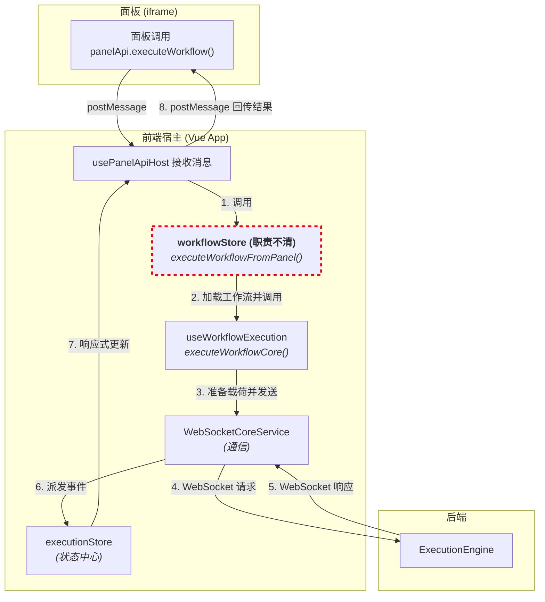
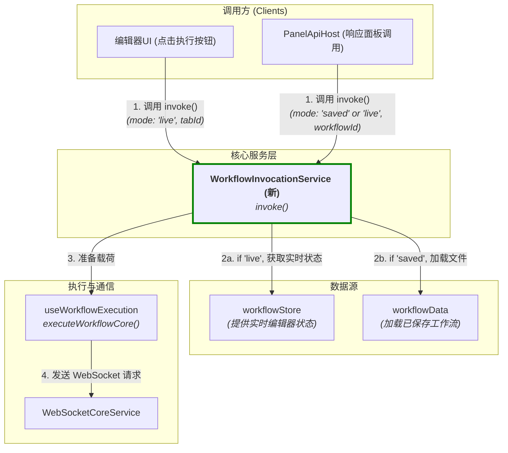

# 设计文档：工作流调用重构与统一服务计划

## 1. 背景与调查结论

当前系统的工作流调用逻辑与UI组件（特别是编辑器标签页的 `workflowStore`）存在严重耦合。面板（Panel）的执行能力是在此基础上临时“打补丁”实现的，导致职责不清、扩展性差。

### 1.1. 现有执行链路分析

经过对 `useWorkflowExecution.ts`, `workflowStore.ts`, `executionStore.ts`, `usePanelApiHost.ts` 等关键文件的分析，当前从面板发起调用的数据流如下图所示：

**核心问题**: `workflowStore` (上图红框部分) 承担了本不应属于它的 API 执行职责，导致其逻辑臃肿，且使得面板调用逻辑依赖于一个本应只服务于UI编辑器的内部状态管理器。

### 1.2. 两种执行模式

当前系统存在两种事实上的执行模式：

1.  **编辑器执行模式**：从 `workflowStore` 中获取当前标签页的实时 VueFlow 状态，经过一系列转换（`flattenWorkflow`, `transformVueFlowToCoreWorkflow`, `transformStorageToExecutionPayload`），生成后端可执行的载荷。此模式支持运行未保存的更改。
2.  **面板执行模式**（当前实现）：通过 `workflowStore.executeWorkflowFromPanel`，加载已保存的工作流文件，然后将其传递给核心执行逻辑。此模式无法利用编辑器中的实时状态。

## 2. 重构目标

1.  **解耦**：将工作流的调用逻辑从 `workflowStore` 中完全剥离。
2.  **抽象**：创建一个统一的、职责清晰的 `WorkflowInvocationService`，作为前端所有工作流调用的唯一入口。
3.  **统一**：使新的服务能够处理来自不同源（编辑器、面板、未来可能的其他服务）的调用请求。
4.  **增强**：实现“实时预览”功能，允许面板调用一个当前在编辑器中打开的工作流的实时、未保存的状态，以加速开发调试。
5.  **奠基**：为未来的 `ApiAdapter` (适配器) 抽象层和配置面板打下坚实的架构基础。

## 3. 拟议新架构

我们将引入一个新的核心服务 `WorkflowInvocationService`，它将作为所有工作流调用的中央协调器。

### `WorkflowInvocationService` 核心职责：

-   提供一个统一的 `invoke(request: InvocationRequest)` 方法。
-   `InvocationRequest` 将包含：
    -   `mode`: `'live' | 'saved'`。
    -   `targetId`: 根据模式，可以是 `tabId` (对于`live`模式) 或 `workflowId` (对于`saved`模式)。
    -   `inputs`: 覆盖工作流的输入值。
-   **智能数据源选择**：
    -   当 `mode` 为 `'live'` 时，服务从 `workflowStore` 获取对应 `tabId` 的实时 VueFlow 元素，并执行转换。
    -   当 `mode` 为 `'saved'` 时，服务调用 `workflowData` 加载已保存的工作流文件。
-   **面板实时预览逻辑**：`PanelApiHost` 在接收到调用请求时，可以检查目标工作流是否在某个编辑器标签页中打开。如果是，则将调用模式切换为 `'live'` 并传递对应的 `tabId`，从而实现实时调试功能。

## 4. 分阶段实施计划

### 阶段一：核心服务解耦 (技术重构) - ✅ 已完成

1.  **创建 `apps/frontend-vueflow/src/services/WorkflowInvocationService.ts`** - ✅ 已完成。实现了 `invoke` 方法，能处理 `live` 和 `saved` 模式。
2.  **重构 `useWorkflowExecution.ts`** - ✅ 已完成。大部分逻辑已移至新服务。
3.  **净化 `workflowStore.ts`** - ✅ 已完成。移除了 `executeWorkflowFromPanel` 等执行相关方法。
4.  **调整调用方** - ✅ 已完成。编辑器的执行按钮和 `usePanelApiHost` 都已转向调用新服务。

### 阶段二：面板实时预览功能 - ✅ 已完成

1.  **增强 `usePanelApiHost.ts`** - ✅ 已完成。
    -   实现了在调用时检查工作流是否在 `tabStore` 中打开。
    -   能根据检查结果智能选择 `'live'` 或 `'saved'` 模式进行调用。
    -   重构了 `usePanelApiHost` 内部的事件订阅和消息处理逻辑，使其更加健壮和清晰。

### 阶段三：API 适配器与配置UI (未来)

在完成上述重构的基础上，再进行更高层次的抽象：

1.  **创建 `ApiAdapterManager`**: 在 `WorkflowInvocationService` 之上再封装一层，处理 `adapterId`到 `workflowId` 的映射。
2.  **创建 `adapterStore.ts`**: 用于管理适配器定义。
3.  **开发适配器配置UI**：实现您设想的配置面板，允许用户创建和管理适配器。

这份计划首先解决了当前最紧迫的架构问题，然后在此基础上构建了您期望的“实时预览”功能，并为最终的 `ApiAdapter` 体系铺平了道路。