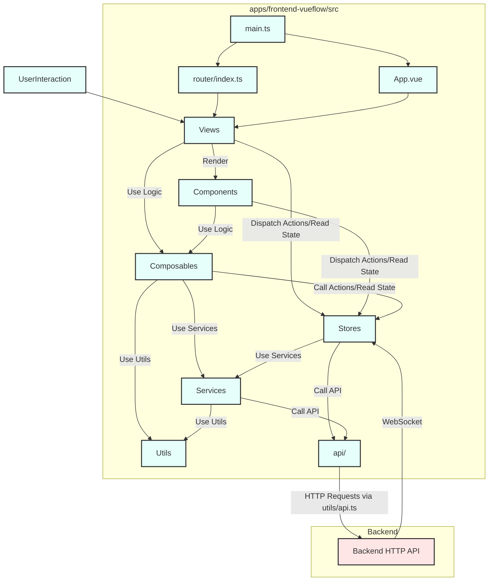

# 前端应用 (`apps/frontend-vueflow`) 架构总览

本文档旨在提供 ComfyTavern 前端应用 (`apps/frontend-vueflow`) 的整体架构概览，包括其核心职责、技术选型、目录结构、核心模块、关键交互流程以及设计原则。它是对 [`DesignDocs/整理/Frontend/`](DesignDocs/整理/Frontend/) 目录下各详细文档的综合性总结。

## 1. 前端应用整体架构概览

`apps/frontend-vueflow` 是 ComfyTavern 项目的用户交互界面核心，负责提供一个功能丰富且用户友好的环境，供创作者构建 AI 工作流，并让最终用户能够便捷地使用这些工作流封装的应用。

### 1.1. 核心职责

前端应用在 ComfyTavern 项目中承担以下核心职责：

*   **图形化工作流编排**：提供一个基于 VueFlow 的可视化节点编辑器，允许用户通过拖拽、连接和配置节点来创建、编辑和管理复杂的 AI 工作流。
*   **用户界面 (GUI) 提供**：为用户提供直观的界面，用于项目管理、工作流管理、节点库浏览、设置配置等。
*   **后端 API 通信**：与后端 API ([`apps/backend/`](apps/backend/)) 进行高效通信，以：
    *   加载和保存项目及工作流数据。
    *   获取节点定义和可用资源。
    *   触发工作流的执行。
    *   管理用户认证和用户特定数据（如 API 密钥、个人资料）。
*   **实时状态展示**：通过 WebSocket 连接，实时接收并展示工作流的执行状态、节点进度、日志信息和最终结果。
*   **状态管理**：管理应用级的状态，包括用户会话、当前项目、活动工作流、UI 偏好（如主题）以及编辑器状态。
*   **应用面板交互**：为最终用户提供直接与之交互的“应用面板”界面，这些面板是创作者将复杂工作流封装后的产物，旨在简化特定 AI 功能的使用。
*   **响应式与用户体验**：确保在不同设备和屏幕尺寸上提供良好的用户体验，并利用现代前端技术提升应用的性能和响应速度。

### 1.2. 主要技术选型

前端应用采用了以下主要技术栈：

*   **Vue 3**: 作为核心的 JavaScript 框架。
    *   **Composition API**: 全面采用组合式 API 进行逻辑组织和复用。
    *   **`<script setup>`**: 广泛使用 `<script setup>` 语法糖简化组件定义。
*   **Vite**: 作为现代化的前端构建工具，提供极速的冷启动、即时热模块更新 (HMR) 和优化的构建输出。
*   **TypeScript**: 为整个项目提供静态类型检查，增强代码的健壮性和可维护性。
*   **VueFlow**: ([`@vue-flow/core`](https://www.npmjs.com/package/@vue-flow/core)) 一个高度可定制的 Vue 3 组件库，用于构建基于节点的编辑器和交互式图表，是工作流画布的核心。
*   **Pinia**: Vue 官方推荐的状态管理库，用于管理应用的全局状态。
*   **Vue Router**: Vue 官方的路由管理器，用于实现单页应用 (SPA) 的导航和视图切换。
*   **Tailwind CSS**: 一个功能类优先的 CSS 框架，用于快速构建用户界面和实现一致的样式。
*   **Axios**: 用于发起 HTTP 请求，与后端 API 进行通信。
*   **Floating UI**: ([`@floating-ui/vue`](https://www.npmjs.com/package/@floating-ui/vue)) 用于处理浮动元素（如 Tooltip、上下文菜单）的定位。
*   **OverlayScrollbars**: ([`overlayscrollbars-vue`](https://www.npmjs.com/package/overlayscrollbars-vue)) 用于提供美观且高性能的自定义滚动条。
*   **CodeMirror**: ([`codemirror`](https://codemirror.net/) 和相关 Vue 封装) 用于实现富文本代码编辑器，支持语法高亮等功能。

## 2. `apps/frontend-vueflow/src/` 目录结构与核心模块总结

前端应用源代码主要位于 [`apps/frontend-vueflow/src/`](apps/frontend-vueflow/src/) 目录下。以下是对其主要子目录/模块的功能和职责总结：

*   **[`main.ts`](apps/frontend-vueflow/src/main.ts:1) & [`App.vue`](apps/frontend-vueflow/src/App.vue:1)**:
    *   **职责**: 应用的入口点和根组件。
    *   [`main.ts`](apps/frontend-vueflow/src/main.ts:1) 负责创建 Vue 应用实例，注册全局插件 (Pinia, Vue Router)、指令 (如 `v-comfy-tooltip`)，导入全局样式，并将应用挂载到 DOM。
    *   [`App.vue`](apps/frontend-vueflow/src/App.vue:1) 作为应用的顶层容器，定义了整体布局，承载 `<RouterView />`，并包含全局 UI 组件（如对话框容器、Tooltip 渲染器、设置模态框）和全局初始化逻辑（如主题加载、WebSocket 连接）。
    *   参考文档: [`DesignDocs/整理/Frontend/EntryPoints.md`](DesignDocs/整理/Frontend/EntryPoints.md:1)

*   **[`api/`](apps/frontend-vueflow/src/api/)**:
    *   **职责**: 封装与后端 HTTP API 的交互逻辑。每个文件通常对应一个或一组相关的 API 端点（如 `authApi.ts`, `workflow.ts`）。
    *   它们依赖通用的 [`utils/api.ts`](apps/frontend-vueflow/src/utils/api.ts:1) 来执行实际的 HTTP 请求。
    *   参考文档: [`DesignDocs/整理/Frontend/APIIntegration.md`](DesignDocs/整理/Frontend/APIIntegration.md:1)

*   **[`assets/`](apps/frontend-vueflow/src/assets/)**:
    *   **职责**: 存放静态资源，如全局 CSS 样式表 ([`main.css`](apps/frontend-vueflow/src/assets/main.css:1), [`shared.css`](apps/frontend-vueflow/src/assets/styles/shared.css:1))、图片、字体等。

*   **[`components/`](apps/frontend-vueflow/src/components/)**:
    *   **职责**: 包含所有可复用的 Vue 组件。这些组件根据功能被组织到子目录中，如 `common/` (通用基础组件，如模态框、按钮), `graph/` (画布及节点相关组件), `modals/` (特定功能模态框), `settings/` (设置界面组件)。
    *   参考文档: [`DesignDocs/整理/Frontend/Components.md`](DesignDocs/整理/Frontend/Components.md:1)

*   **[`composables/`](apps/frontend-vueflow/src/composables/)**:
    *   **职责**: 存放 Vue Composition API 函数 (Hooks)，用于封装和复用有状态的、响应式的逻辑。例如，`useWebSocket.ts` 管理 WebSocket 连接，`useCanvasInteraction.ts` 处理画布交互逻辑，`useWorkflowManager.ts` 管理工作流状态。
    *   参考文档: [`DesignDocs/整理/Frontend/Composables.md`](DesignDocs/整理/Frontend/Composables.md:1)

*   **[`constants/`](apps/frontend-vueflow/src/constants/)**:
    *   **职责**: 定义应用中使用的常量，例如句柄相关的常量 ([`handleConstants.ts`](apps/frontend-vueflow/src/constants/handleConstants.ts:1))。

*   **[`directives/`](apps/frontend-vueflow/src/directives/)**:
    *   **职责**: 存放自定义 Vue 指令。例如，[`vComfyTooltip.ts`](apps/frontend-vueflow/src/directives/vComfyTooltip.ts:1) 实现了全局 Tooltip 功能。

*   **[`router/`](apps/frontend-vueflow/src/router/)**:
    *   **职责**: 配置应用的路由规则。[`index.ts`](apps/frontend-vueflow/src/router/index.ts:1) 文件定义了 URL 路径与视图组件的映射关系，并可能包含导航守卫。
    *   参考文档: [`DesignDocs/整理/Frontend/Routing.md`](DesignDocs/整理/Frontend/Routing.md:1)

*   **[`services/`](apps/frontend-vueflow/src/services/)**:
    *   **职责**: 提供前端应用级的服务。例如，[`DialogService.ts`](apps/frontend-vueflow/src/services/DialogService.ts:1) 提供了全局显示模态对话框和通知的功能。[`SillyTavernService.ts`](apps/frontend-vueflow/src/services/SillyTavernService.ts:1) 用于处理与角色卡相关的数据获取。
    *   这些服务通常是单例的，并在应用各处被注入或使用。
    *   *(注: [`DesignDocs/整理/Frontend/Services.md`](DesignDocs/整理/Frontend/Services.md:1) 为空, 此总结基于其他文档和代码结构)*

*   **[`stores/`](apps/frontend-vueflow/src/stores/)**:
    *   **职责**: 存放 Pinia 全局状态管理模块。每个 store 文件（如 `authStore.ts`, `workflowStore.ts`, `uiStore.ts`）负责管理应用特定领域的状态、getter 和 action。
    *   参考文档: [`DesignDocs/整理/Frontend/Stores.md`](DesignDocs/整理/Frontend/Stores.md:1)

*   **[`types/`](apps/frontend-vueflow/src/types/)**:
    *   **职责**: 定义前端应用特有的 TypeScript 类型和接口。例如，编辑器相关的类型 ([`editorTypes.ts`](apps/frontend-vueflow/src/types/editorTypes.ts:1))、设置相关的类型 ([`settings.ts`](apps/frontend-vueflow/src/types/settings.ts:1))。
    *   共享的跨包类型定义位于 [`packages/types/`](packages/types/)。

*   **[`utils/`](apps/frontend-vueflow/src/utils/)**:
    *   **职责**: 存放通用的辅助函数和工具模块，如深拷贝 (`deepClone.ts`)、节点处理 (`nodeUtils.ts`)、文本处理 (`textUtils.ts`)、URL 构建 (`urlUtils.ts`) 以及工作流数据转换 (`workflowTransformer.ts`, `workflowFlattener.ts`)。
    *   [`api.ts`](apps/frontend-vueflow/src/utils/api.ts:1) 是一个关键的工具，提供了发起 HTTP 请求的基础封装。
    *   参考文档: [`DesignDocs/整理/Frontend/Utils.md`](DesignDocs/整理/Frontend/Utils.md:1)

*   **[`views/`](apps/frontend-vueflow/src/views/)**:
    *   **职责**: 存放页面级的 Vue 组件，这些组件通常由 Vue Router 直接渲染，代表应用的主要功能区域或页面（如 `EditorView.vue`, `HomeView.vue`, `SettingsView.vue`）。
    *   参考文档: [`DesignDocs/整理/Frontend/Views.md`](DesignDocs/整理/Frontend/Views.md:1)

### 模块交互示意

**数据流与交互简述**：

1.  **用户交互**：用户通过浏览器与**视图 (Views)** 和其中的**组件 (Components)** 交互。
2.  **视图与组件**：
    *   视图和组件负责渲染 UI。
    *   它们可能会使用**可组合函数 (Composables)** 来封装复杂的响应式逻辑和副作用。
    *   它们通过调用 **Pinia Stores** 中的 actions 来触发状态变更或业务逻辑，并通过 getters 或直接订阅 state 来获取和展示数据。
3.  **可组合函数 (Composables)**：
    *   封装可复用的逻辑，可以操作或订阅 **Stores**。
    *   可能会调用**服务 (Services)** 来执行特定任务（如显示对话框）。
    *   可能会使用**工具函数 (Utils)** 进行数据处理。
4.  **Pinia Stores**:
    *   作为应用状态的单一事实来源。
    *   Actions 中可能包含业务逻辑，调用 **API 客户端 (api/)** 与后端通信，或使用**服务 (Services)**。
5.  **服务 (Services)**：
    *   提供应用级的功能，如对话框服务。
    *   可能需要调用 **API 客户端**或使用**工具函数**。
6.  **API 客户端 (api/)**:
    *   封装了对后端 HTTP API 的具体调用，通常依赖 [`utils/api.ts`](apps/frontend-vueflow/src/utils/api.ts:1) 来发送请求。
7.  **后端通信**:
    *   HTTP 请求通过 API 客户端发送到后端。
    *   WebSocket 连接由 [`useWebSocket.ts`](apps/frontend-vueflow/src/composables/useWebSocket.ts:1) (Composable) 管理，并将接收到的实时消息分发到相关的 **Stores** (主要是 [`executionStore.ts`](apps/frontend-vueflow/src/stores/executionStore.ts:1)) 进行处理。
8.  **路由 (Router)**：
    *   根据 URL 将用户导航到不同的**视图 (Views)**。
    *   导航守卫可能在路由切换前与 **Stores** 交互（如加载项目数据）。

## 3. 关键用户交互流程与数据流

以下从较高层面描述两个关键的前端用户交互流程：

### 3.1. 加载并编辑工作流

1.  **用户操作**: 用户在项目列表视图 ([`ProjectListView.vue`](apps/frontend-vueflow/src/views/ProjectListView.vue:1)) 中选择一个项目，或直接通过 URL 访问特定项目的编辑器。
2.  **路由导航**: Vue Router 将 URL 导航到编辑器视图 ([`EditorView.vue`](apps/frontend-vueflow/src/views/EditorView.vue:1))。
    *   路由守卫 (`beforeEnter` in [`router/index.ts`](apps/frontend-vueflow/src/router/index.ts:1)) 触发，调用 [`projectStore.loadProject()`](apps/frontend-vueflow/src/stores/projectStore.ts:1) 从后端 API 加载项目元数据。
3.  **编辑器视图加载**:
    *   [`EditorView.vue`](apps/frontend-vueflow/src/views/EditorView.vue:1) 挂载后，其内部的 [`useRouteHandler`](apps/frontend-vueflow/src/composables/editor/useRouteHandler.ts:1) Composable 会处理路由参数 (`projectId`, `workflowId`)。
    *   如果 `workflowId` 存在，它会调用 [`workflowStore.loadWorkflow()`](apps/frontend-vueflow/src/stores/workflowStore.ts:1) (内部使用 [`useWorkflowLifecycleCoordinator`](apps/frontend-vueflow/src/composables/workflow/useWorkflowLifecycleCoordinator.ts:1) 和 [`useWorkflowData`](apps/frontend-vueflow/src/composables/workflow/useWorkflowData.ts:1))。
    *   [`useWorkflowData`](apps/frontend-vueflow/src/composables/workflow/useWorkflowData.ts:1) 通过 [`workflow.ts (API client)`](apps/frontend-vueflow/src/api/workflow.ts:1) 从后端获取工作流数据。
    *   获取的数据通过 [`workflowTransformer.transformWorkflowToVueFlow()`](apps/frontend-vueflow/src/utils/workflowTransformer.ts:1) 转换为 VueFlow 画布所需的格式。
    *   转换后的节点和边数据更新到 [`workflowStore`](apps/frontend-vueflow/src/stores/workflowStore.ts:1) (通过 `useWorkflowManager`)，画布组件 ([`Canvas.vue`](apps/frontend-vueflow/src/components/graph/Canvas.vue:1)) 响应式地渲染工作流。
4.  **用户编辑**:
    *   用户在画布上拖拽节点、修改节点属性、连接节点等。
    *   这些交互由 [`Canvas.vue`](apps/frontend-vueflow/src/components/graph/Canvas.vue:1) 及其内部的 Composables (如 [`useCanvasInteraction`](apps/frontend-vueflow/src/composables/canvas/useCanvasInteraction.ts:1), [`useCanvasConnections`](apps/frontend-vueflow/src/composables/canvas/useCanvasConnections.ts:1)) 处理。
    *   节点属性的修改通过 [`BaseNode.vue`](apps/frontend-vueflow/src/components/graph/nodes/BaseNode.vue:1) 及其内部的输入组件和 [`useNodeState`](apps/frontend-vueflow/src/composables/node/useNodeState.ts:1) Composable 处理。
    *   所有状态变更都会通过 [`workflowStore`](apps/frontend-vueflow/src/stores/workflowStore.ts:1) (主要是其协调器 Composable 如 `useWorkflowInteractionCoordinator`) 进行，并记录到历史记录 (`useWorkflowHistory`)。
    *   UI 响应式地更新以反映这些变更。
5.  **保存工作流**:
    *   用户点击保存按钮或使用快捷键。
    *   [`workflowStore.saveWorkflow()`](apps/frontend-vueflow/src/stores/workflowStore.ts:1) (通过 `useWorkflowLifecycleCoordinator`) 被调用。
    *   当前画布状态通过 [`workflowTransformer.transformVueFlowToCoreWorkflow()`](apps/frontend-vueflow/src/utils/workflowTransformer.ts:1) 转换为后端存储格式。
    *   通过 [`workflow.ts (API client)`](apps/frontend-vueflow/src/api/workflow.ts:1) 将数据发送到后端保存。

### 3.2. 执行工作流并查看结果

1.  **用户操作**: 用户在编辑器视图 ([`EditorView.vue`](apps/frontend-vueflow/src/views/EditorView.vue:1)) 中点击“执行”按钮。
2.  **触发执行**:
    *   调用 [`workflowStore.executeWorkflow()`](apps/frontend-vueflow/src/stores/workflowStore.ts:1) (内部使用 [`useWorkflowExecution`](apps/frontend-vueflow/src/composables/workflow/useWorkflowExecution.ts:1))。
3.  **前端预处理**:
    *   [`useWorkflowExecution`](apps/frontend-vueflow/src/composables/workflow/useWorkflowExecution.ts:1) 首先会执行当前工作流中节点定义的客户端脚本钩子 (`onWorkflowExecute`)，这可能修改节点数据。
    *   然后，它会调用 [`workflowFlattener.flattenWorkflow()`](apps/frontend-vueflow/src/utils/workflowFlattener.ts:1) 将包含节点组的工作流扁平化。
    *   扁平化后的工作流通过 [`workflowTransformer.transformVueFlowToExecutionPayload()`](apps/frontend-vueflow/src/utils/workflowTransformer.ts:1) 转换为后端执行引擎所需的格式。
4.  **发送执行请求**:
    *   执行载荷通过 WebSocket ([`useWebSocket.sendMessage()`](apps/frontend-vueflow/src/composables/useWebSocket.ts:1)) 发送到后端。
    *   [`executionStore.prepareForNewExecution()`](apps/frontend-vueflow/src/stores/executionStore.ts:1) 被调用以重置当前标签页的执行状态。
5.  **后端处理与 WebSocket 通信**:
    *   后端接收请求，开始执行工作流。
    *   后端通过 WebSocket 连接实时推送执行状态更新消息 (如 `PROMPT_ACCEPTED`, `EXECUTION_STATUS_UPDATE`, `NODE_EXECUTING`, `NODE_PROGRESS`, `NODE_COMPLETE`, `NODE_ERROR`, `NODE_YIELD`, `WORKFLOW_INTERFACE_YIELD`)。
6.  **前端状态更新与展示**:
    *   [`useWebSocket.ts`](apps/frontend-vueflow/src/composables/useWebSocket.ts:1) 接收到 WebSocket 消息后，根据消息类型将其分发给 [`executionStore.ts`](apps/frontend-vueflow/src/stores/executionStore.ts:1) 中的相应 action。
    *   [`executionStore`](apps/frontend-vueflow/src/stores/executionStore.ts:1) 更新其内部状态，包括工作流整体状态、各节点状态、进度、输出、错误和流式内容。
    *   UI 组件（如 [`BaseNode.vue`](apps/frontend-vueflow/src/components/graph/nodes/BaseNode.vue:1) 用于显示节点状态和输出，[`StatusBar.vue`](apps/frontend-vueflow/src/components/graph/StatusBar.vue:1) 用于显示整体状态）订阅 [`executionStore`](apps/frontend-vueflow/src/stores/executionStore.ts:1) 的状态，并实时更新以向用户展示执行过程和结果。

## 4. 设计原则与未来方向

### 4.1. 设计原则

前端架构在设计和实现过程中，体现了以下一些原则：

*   **组件化与模块化**: 大量使用 Vue 组件和 Composition API 函数 (Composables) 将 UI 和逻辑拆分为更小、可管理、可复用的单元。
*   **响应式设计**: 充分利用 Vue 3 的响应式系统和 Pinia 的状态管理，确保数据变化时 UI 能够自动更新。
*   **关注点分离 (SoC)**:
    *   UI (Views, Components)
    *   状态管理 (Pinia Stores)
    *   业务逻辑/可复用逻辑 (Composables, Services)
    *   API 通信 (api/ 目录)
    *   工具函数 (utils/ 目录)
*   **Composition API 的充分利用**: 广泛使用 `<script setup>` 和 Composable 函数来组织逻辑，提高代码的可读性和可维护性。
*   **类型安全**: 全面使用 TypeScript，确保代码的健壮性和开发效率。
*   **单向数据流 (部分场景)**: 虽然 Vue 本身支持双向绑定，但在复杂场景下，数据流倾向于从 Store -> Component (Props) -> Store (Actions)，以保持状态的可预测性。
*   **用户体验优先**: 注重提供流畅的交互、清晰的反馈和高效的操作流程。
*   **可扩展性**: 模块化的设计使得添加新功能、新节点类型或新的 UI 部分相对容易。

### 4.2. 未来方向与待改进点 (可选)

*   **性能优化**:
    *   持续关注大规模工作流的渲染性能和交互性能。
    *   优化组件渲染，减少不必要的更新。
    *   考虑虚拟滚动或按需渲染等技术应用于节点面板或大型列表。
*   **组件库完善**:
    *   进一步抽象和封装通用组件，提高复用性。
    *   对现有组件进行代码审查和重构，提升质量。
*   **测试覆盖**:
    *   增加单元测试和端到端测试的覆盖率，确保代码质量和功能稳定性。
*   **国际化 (i18n)**:
    *   如果项目需要支持多语言，需要引入国际化方案。
*   **可访问性 (a11y)**:
    *   持续改进应用的可访问性，确保所有用户都能顺畅使用。
*   **文档完善**:
    *   持续更新和完善前端相关的开发文档和用户文档。
*   **应用面板 (Mini Apps) 的进一步发展**:
    *   探索更灵活和强大的应用面板创建和集成机制，使其成为最终用户体验的核心。

通过遵循这些设计原则并关注未来的改进方向，ComfyTavern 的前端应用将能够持续发展，为用户提供更强大、更易用的 AI 创作与应用体验。