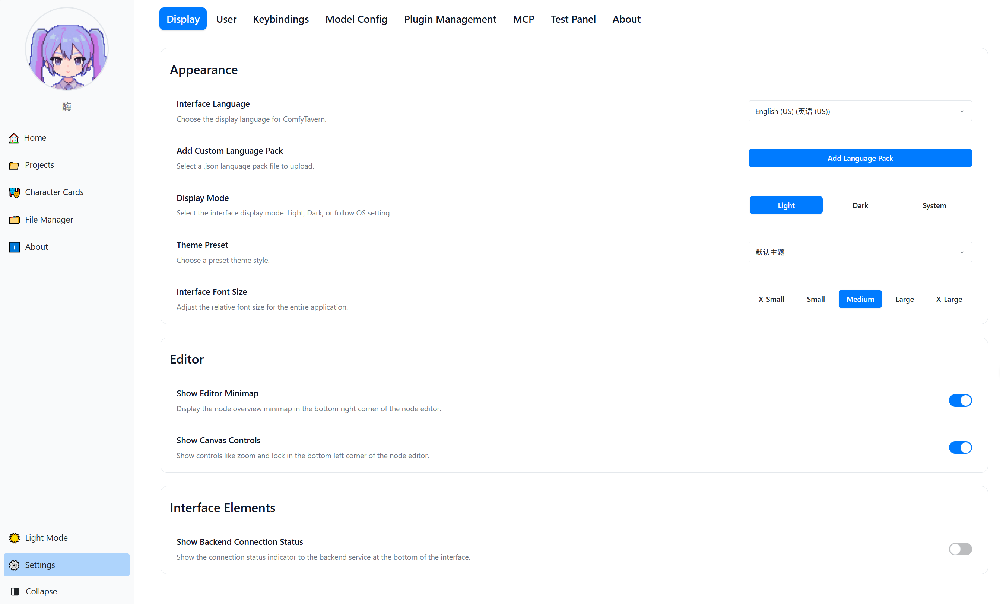

# ComfyTavern (ベータ版)

[](https://github.com/ComfyTavern/comfytavern)
[](./LICENSE)
[](https://github.com/ComfyTavern/comfytavern)

<p align="center">
  <a href="./README.md">简体中文</a>
  &nbsp;•&nbsp;
  <a href="./README.en.md">English</a>
  &nbsp;•&nbsp;
  <a href="./README.ja.md"><b>日本語</b></a>
  &nbsp;•&nbsp;
  <a href="./README.ru.md">Русский</a>
  &nbsp;•&nbsp;
  <a href="./README.wyw.md">文言</a>
</p>

### 🌉 AI創作とエンドユーザー体験を繋ぐ

ComfyTavernは、複雑なAIワークフローを直感的で使いやすく、インタラクティブな**ミニアプリケーション**へと変換することを目指しています。

私たちは**クリエイター**に、AIロジックを編成するための強力でスムーズなビジュアルノードエディタを提供します。同時に、**エンドユーザー**は、基盤となる技術を気にすることなく、独立した**アプリケーションパネル**を通じて、AIチャット、ビジュアルノベル、インテリジェントエージェント（Agent）などの豊富な機能を「すぐに使える」形で体験できます。

私たちは、AIの力は創造プロセスの精巧さだけでなく、最終的な体験の利便性にもあると信じています。

**➡️ 現在のコア：PC版VueFlowノードエディタ + 基本的なワークフロー実行。**

## [👉 クイックスタート](#-インストールと起動)

---

## 📸 インターフェース一覧

<p align="center">
  
  
</p>
<p align="center">
  
  
  
</p>

---

### ✨ 主要機能

ComfyTavernのデザインは、**ユニークなエージェントアーキテクチャ → プロフェッショナルなオーケストレーションツール → オープンなアプリケーションエコシステム**という3つの柱を中心に展開しています。

#### 1. 🎯 ビジョン：自律エージェント (Agent) を核としたアプリケーションアーキテクチャ

これは単なる機能ではなく、ComfyTavernを他のプラットフォームと区別するアーキテクチャの基盤です。私たちは既存のツールを単に複製したり組み合わせたりするのではなく、新しいパラダイムを提供します：

-   **ComfyUIとの焦点の違い**: ComfyUIは画像生成に優れています。ComfyTavernはより広範な目標を持ち、ロジック、テキスト、LLMインタラクション、エージェント構築をカバーする汎用AIアプリケーション構築および実行プラットフォームであり、ComfyUIと組み合わせて使用できます。
-   **SillyTavernとのアーキテクチャの違い**: SillyTavernは優れたチャットフロントエンドです。ComfyTavernの核となる利点は、その**統一された自律エージェント (Agent) アーキテクチャ**にあります。「シーン (Scene)」を中心に、エージェントが「生き生きと」活動できる実行環境を構築しています：
    -   **エージェントは「脳」と「記憶」を持つ実行コア**: 各エージェントは、内部の「審議ループ」、長期記憶（知識ベース）、および呼び出し可能なスキル（ワークフロー）を持つエンティティとして設計されています。
    -   **アプリケーションパネルはエージェントとユーザーのインタラクションの「顔」**: これらは固定されたUIではなく、エージェントと非同期通信し、その状態にリアルタイムで応答する動的なフロントエンドであり、真に活気のあるインタラクティブな体験を構築します。

このアーキテクチャにより、クリエイターは従来のプリセットをはるかに超える、動的な振る舞いと学習の可能性を備えたAIアプリケーションを構築できます。

#### 2. 🚀 能力：高性能エンジンとプロフェッショナルエディタ

-   **フルリンクストリーミングエンジン**: バックエンドはリアルタイムインタラクションのために特別に設計されています。入力、ノード伝送からAPI応答まで、ストリーミングと非同期並行処理を完全にサポートし、WebSocketを介して実行状態をリアルタイムでフィードバックし、AI会話、動的コンテンツ生成などのアプリケーションのパフォーマンスを保証します。
-   **プロフェッショナルビジュアルエディタ**:
    -   **モジュール式ノードグループ**: ワンクリックでノードグループを作成し、複雑なロジックを再利用可能なモジュールとしてカプセル化します。
    -   **スムーズな体験**: 簡素化されたUI、豊富な右クリックメニュー、多段階操作、デュアルクリップボード、履歴など。
    -   **強力なノードシステム**: さまざまなデータ型、カスタムスキーマ、組み込みインタラクティブコンポーネント、クライアントサイドスクリプト拡張をサポートします。

#### 3. ⭐ エコシステム：オープン、互換性、開発者フレンドリー

-   **API駆動**: コア機能はAPI (HTTP/WebSocket) を介して公開されており、プラットフォームが**Engine as a Service**として進化し、サードパーティ統合の基盤を築きます。
-   **拡張が容易**: クリアなTypeScriptインターフェースと堅牢な型定義を提供し、カスタムノードの作成を容易にし、コミュニティの貢献を奨励します。
-   **オープンな互換性**: SillyTavernなどのプラットフォームからのアセット（例：キャラクターカード）の移行を支援するツールを提供する予定であり、より広範なエコシステムに統合します。

---

### 📄 ドキュメント

-   **[ノードタイプシステム](docs/node-types/node-types.en.md)**：ノードデータインタラクションの基本を理解する。
-   **[カスタムノード開発ガイド](docs/guides/custom-node-development.en.md)**：ComfyTavernの機能を拡張する手順。
-   **[UI言語パックのカスタマイズ](docs/guides/customizing-ui-language.md)**：インターフェース言語の追加または更新。

---

### 🚦 ロードマップ

プロジェクトは積極的に進行中です：

-   **フェーズ1：コアエンジン (準備完了)**
    -   ✅ ビジュアルエディタコア (VueFlow)
    -   ✅ バックエンドノードの動的ロード
    -   ✅ ワークフロー実行エンジン (非同期、ストリーミング)

-   **フェーズ2：アプリケーションとサービス化 (最近のコア)**
    -   ⏳ **エージェントランタイム**: エージェントのロードとコアの「審議-行動」ループを実装。
    -   ⏳ **シーンベースのインフラストラクチャ**: 隔離されたイベントバスと共有ワールド状態を構築。
    -   ⏳ **インタラクティブアプリケーションMVP**: アプリケーションパネルとエージェント間の最初のエンドツーエンド非同期通信を確立。
    -   ⏳ **API標準化**: ワークフローAPIを継続的にカプセル化および最適化。

-   **フェーズ3：インテリジェントコア：記憶と学習 (中期計画)**
    -   ⏳ **構造化知識ベース**: エージェントの信頼性の高い長期記憶メカニズムを改善。
    -   ⏳ **エージェント自己進化**: エージェントに、反省を通じて知識ベースに経験を貢献する能力を付与。
    -   ⏳ **LLMサービスオーケストレーション**: より柔軟なLLMサービスアダプターを導入。

-   **フェーズ4：エコシステム構築：マルチエージェントコラボレーション (長期ビジョン)**
    -   🔭 **マルチエージェントコラボレーション**: 同じシーンで複数のエージェントの協調モードを探索およびサポート。
    -   🔭 **開発者エコシステム**: 標準化されたエージェントおよびパネルテンプレートを提供し、クリエイターコミュニティを構築。

-   **その他の計画**:
    -   ⏳ モバイル対応 (例：Tauri)
    -   ⏳ 組み込みエージェント作成アシスタント

---

### 🏗️ プロジェクト構造

```
apps/
  ├── backend/            # バックエンドサービス (Elysia + Bun)
  └── frontend-vueflow/   # フロントエンド (Vue 3 + Vite + VueFlow)
data/                     # アプリケーションデータ (データベースなど), system://data/ にマッピング
docs/                     # プロジェクトドキュメント
library/                  # グローバル共有アセットライブラリ (テンプレート、例), shared://library/ にマッピング
logs/                     # ログファイル
packages/
  ├── types/              # 共有TypeScript型
  └── utils/              # 共有ユーティリティ関数
plugins/
  └── nodes/              # ユーザーカスタムノード
public/                   # 公開静的リソース
userData/                 # ユーザーデータルートディレクトリ (各ユーザーの独立したプロジェクト、ライブラリなどを含む)
```

---

### 🚀 インストールと起動

**環境要件:**

-   [Bun](https://bun.sh) v1.2.5+ (主要ランタイム)
-   Node.js v20+ (開発ツール用)
-   Windows / Linux / macOS
-   (Dockerサポートは計画中)

**1. コードの取得:**

```bash
git clone https://github.com/ComfyTavern/comfytavern.git
cd comfytavern
```
> または、[GitHubリポジトリアーカイブ](https://github.com/ComfyTavern/comfytavern/archive/refs/heads/main.zip)からZIPをダウンロードして解凍します。

**2. 依存関係のインストール:**

```bash
bun install
```
> ネットワークの問題が発生した場合は、Taobaoミラーを試してください: `bun install --registry https://registry.npmmirror.com`

**3. アプリケーションの起動:**

- **初回起動または更新後**は、**フル起動**を使用することをお勧めします。これにより、必要なすべての設定（例：データベース）がチェックされ、準備されます：

| プラットフォーム    | プロダクションモード     | 開発モード           |
| :---------- | :----------------- | :----------------- |
| Windows     | `.\start.bat`      | `.\start.bat dev`  |
| Linux/macOS | `./start.sh`       | `./start.sh dev`   |

- **日常の開発中**、設定変更がないことを確認した場合は、**高速起動**を使用してチェックをスキップし、速度を向上させることができます：

| プラットフォーム    | プロダクションモード         | 開発モード               |
| :---------- | :--------------------- | :--------------------- |
| Windows     | `.\start_fast.bat`     | `.\start_fast.bat dev` |
| Linux/macOS | `./start_fast.sh`      | `./start_fast.sh dev`  |

**デフォルトアドレス:**

-   フロントエンド: `http://localhost:5573/`
-   バックエンド: `http://localhost:3233/`

-   フロントエンド: `http://localhost:5573/`
-   バックエンド: `http://localhost:3233/`

### よくある質問：

**フロントエンドの強制再ビルド**

起動速度を向上させるため、`start.bat` と `start_fast.bat` は、フロントエンドのビルド成果物（`apps/frontend-vueflow/dist` ディレクトリ）が既に存在する場合、デフォルトでビルドステップをスキップします。

フロントエンドのコードを変更した場合、またはフロントエンドの表示が正しくないと思われる場合は、強制的に再ビルドできます：

```bash
bun run build
```

このコマンドは、古いビルド成果物を削除し、新しいファイルを生成して、最新バージョンが表示されるようにします。

---

### 🛠️ 使用開始

#### ステップ1：プロジェクトの作成

起動に成功したら、フロントエンド `http://localhost:5573/` にアクセスします。

1.  左側のナビゲーションバーで**プロジェクト**をクリックします。
2.  **新しいプロジェクトを作成**ボタンをクリックします。
3.  プロジェクト名を入力して確認すると、ビジュアルノードエディタに入ります。

#### ステップ2：AIサービスの接続

セキュリティと利便性のため、APIキーはアプリケーション内で一元的に管理され、ワークフローファイルには保存されません。

1.  **設定** -> **モデル設定**ページに移動します。
2.  **新しいチャネル**をクリックし、AIサービスプロバイダー（例：OpenAI、Anthropicなど）を選択し、`Base URL`と`API Key`を入力します。
3.  このチャネルでサポートされているモデルID（例：`gpt-4o`）を追加します。
4.  チャネルを保存します。

#### ステップ3：ワークフローでAIを使用する

1.  **ノードの追加**: 左側のノードライブラリパネルから、`LLM`カテゴリの`💬メッセージを作成`と`⚡汎用LLMリクエスト`ノードをキャンバスに追加します。
2.  **コンテンツの入力**: `💬メッセージを作成`ノードを選択し、質問を入力します。`⚡汎用LLMリクエスト`ノードを選択し、設定済みのモデルID（例：`gpt-4o`）を入力します。
3.  **データフローの接続**:
    *   `💬メッセージを作成`の`メッセージ`出力を、`⚡汎用LLMリクエスト`の`メッセージリスト`入力に接続します。
    *   `⚡汎用LLMリクエスト`の`応答テキスト`出力を、`グループ出力`ノードに接続します。
4.  **実行と表示**: 実行をクリックすると、右側のプレビューパネルにAIの応答が表示されます。

#### ステップ4：結果の表示

-   エディタ右側の**プレビューパネル**（🔍アイコン）をクリックします。
-   **「グループ概要」**モードで、`グループ出力`ノードに接続されているすべての最終結果を表示することをお勧めします。
-   任意のノードの出力ハンドルを右クリックし、「プレビューとして設定」を選択して中間データを表示することもできます。

---

### ⚙️ 高度な管理

#### データベース

このプロジェクトはSQLiteを使用しており、初回起動時に自動的に作成されます（高速起動ではない場合）。バージョンを更新し、データベーススキーマの変更が含まれる場合は、次のコマンドを実行してアップグレードしてください：

```bash
bun run db:upgrade
```

#### プロダクション環境 (PM2)

プロジェクトには、PM2を介したプロダクション環境のデプロイと管理のためのスクリプトが用意されています。

-   **すべてのサービスを開始**:
    ```bash
    bun run manage:pm2 start
    ```
-   **すべてのサービスの状態を表示**:
    ```bash
    bun run manage:pm2 list
    ```
-   **ログを表示**:
    ```bash
    bun run manage:pm2 logs comfytavern-backend
    ```
-   **すべてのサービスを停止**:
    ```bash
    bun run manage:pm2 stop
    ```
> その他のコマンドについては、`ecosystem.config.cjs`またはPM2ドキュメントを参照してください。

---

### 🤝 貢献とフィードバック

プロジェクトは初期のベータ版であり、高速なイテレーション段階にあります。機能とAPIは変更される可能性があります。フィードバックと貢献を歓迎します！

-   **バグと提案**: [GitHub Issues](https://github.com/ComfyTavern/comfytavern/issues)
-   **開発への参加**: (貢献ガイドは作成中、Issue経由での議論を歓迎)
-   **コミュニティ**:
    -   **Discord**: [ComfyTavern](https://discord.gg/VE8AM7t4n6) (建設中)

---

### 💻 技術スタック

-   **フロントエンド**: Vue 3 + TypeScript + Vite + [Vue Flow](https://vueflow.dev/)
-   **バックエンド**: [Bun](https://bun.sh/) + [Elysia](https://elysiajs.com/)
-   **リアルタイム通信**: WebSocket

---

### 📜 ライセンス (License)

本プロジェクトは、コミュニティにおけるオープンな共有とプロジェクトの持続可能な発展のバランスを取ることを目的として、**デュアルライセンス (Dual-Licensing)** モデルを採用しています。

#### 1. オープンソースライセンス：GNU AGPLv3

個人開発者、学術研究、非営利団体、およびその他すべての非商用プロジェクトに対し、ComfyTavernは **GNU Affero General Public License v3.0 (AGPLv3)** ライセンスの下で提供されます。

**核心的な要件**：ComfyTavernのソースコードを改変した場合、またはそれをバックエンドとしてネットワーク経由でユーザーにサービスを提供する場合、あなたはあなたの完全なプロジェクトのソースコードを同じAGPLv3ライセンスで公開しなければなりません。

私たちはComfyTavernを基盤とした学習、革新、非商業的な共有を奨励します。

#### 2. 商用ライセンス (Commercial License)

商用環境でComfyTavernの使用を希望する組織および個人向けに、商用ライセンスを提供しています。

**以下の場合は商用ライセンスの購入が必須となります：**

*   ComfyTavernを任意の**クローズドソース**の商用製品またはサービスで使用する場合。
*   企業内で商用運営をサポートするためにComfyTavernを使用する場合（例：内部ツールチェーンの一部として）。
*   有料ユーザーにComfyTavernを基盤としたホスティングサービス（SaaS）を提供する場合。
*   AGPLv3のオープンソース義務に拘束されたくない、あらゆる商用シーン。

商用ライセンスは、あなたをAGPLv3のオープンソース要件から免除し、契約に基づいた技術サポートと法的保護を提供します。

---

私たちは、このモデルがComfyTavernがコミュニティに貢献しつつ、必要な資金援助を得て、より遠く、より安定して進むことを可能にすると信じています。

**➡️ 商用ライセンスに関するお問い合わせやご購入は、こちらまでご連絡ください：comfytavern@yeah.net**