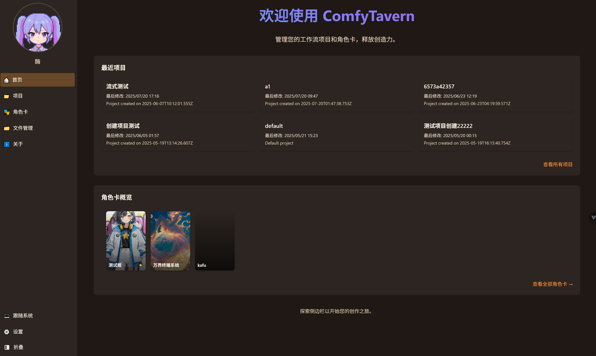
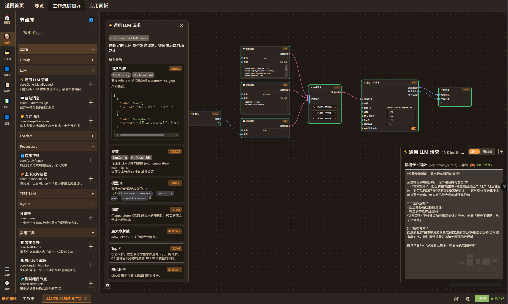
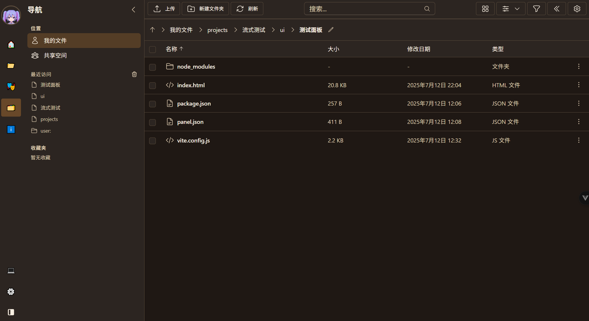

# ComfyTavern (ベータ版)

[](https://github.com/ComfyTavern/comfytavern)
[](./LICENSE)
[](https://github.com/ComfyTavern/comfytavern)

<p align="center">
  <a href="./README.md">简体中文</a>
  &nbsp;•&nbsp;
  <a href="./README.en.md">English</a>
  &nbsp;•&nbsp;
  <a href="./README.ja.md"><b>日本語</b></a>
  &nbsp;•&nbsp;
  <a href="./README.ru.md">Русский</a>
  &nbsp;•&nbsp;
  <a href="./README.wyw.md">文言</a>
</p>

### 🌉 AI創作とエンドユーザー体験を繋ぐ

ComfyTavernは、クリエイターとエンドユーザー向けのAI創作・アプリケーションプラットフォームです。複雑なAIワークフローを、直感的で使いやすく、インタラクティブな**ミニアプリケーション**へと変換することを目指しています。

私たちは**クリエイター**に、AIロジックを編成するための強力でスムーズなビジュアルノードエディタを提供します。同時に、**エンドユーザー**は、基盤となる技術を気にすることなく、独立した**アプリケーションパネル**を通じて、AIチャット、ビジュアルノベル、インテリジェントエージェント（Agent）などの豊富な機能を「すぐに使える」形で体験できます。

私たちは、AIの力は創造プロセスの精巧さだけでなく、最終的な体験の利便性にもあると信じています。

**➡️ 現在のコア：PC版VueFlowノードエディタ + プラグイン拡張 + 統一ファイル資産管理。**

## [👉 クイックスタート](#-インストールと起動)

---

## 📸 インターフェース一覧

<p align="center">
  
  
</p>
<p align="center">
  
  
  
</p>

---

### ✨ 主要機能

ComfyTavernのデザインは、**プロフェッショナルなオーケストレーションツール → オープンなアプリケーションエコシステム → ユニークなインテリジェントエージェントアーキテクチャ**という3つの柱を中心に展開しています。

#### 1. 🚀 能力：高性能エンジンとプロフェッショナルエディタ

-   **フルリンクストリーミングエンジン**: バックエンドはリアルタイムインタラクションのために特別に設計されています。入力、ノード伝送からAPI応答まで、ストリーミングと非同期並行処理を完全にサポートし、WebSocketを介して実行状態をリアルタイムでフィードバックし、AI会話、動的コンテンツ生成などのアプリケーションのパフォーマンスを保証します。
-   **プロフェッショナルビジュアルエディタ**:
    -   **モジュール式ノードグループ**: ワンクリックでノードグループを作成し、複雑なロジックを再利用可能なモジュールとしてカプセル化します。
    -   **スムーズな体験**: 簡素化されたUI、豊富な右クリックメニュー、多段階操作、デュアルクリップボード、履歴など。
    -   **強力なノードシステム**: さまざまなデータ型、カスタムスキーマ、組み込みインタラクティブコンポーネント、クライアントサイドスクリプト拡張をサポートします。

#### 2. ⭐ エコシステム：オープン、互換性、開発者フレンドリー

-   **プラグインアーキテクチャ**: フロントエンドとバックエンドの両方でプラグイン拡張をサポートしています。開発者は、カスタムノード、UIコンポーネント、さらには新しいサービスを簡単に作成し、プラグインマネージャーを通じて動的にロードできます。
-   **統一ファイル資産管理 (FAM)**: プロジェクトレベルおよびユーザーレベルのファイル操作をサポートするビジュアルファイルマネージャーを提供し、AIアプリケーションに信頼性の高いデータおよび資産管理基盤を提供します。
-   **アプリケーションパネルSDK**: 専用の`@comfytavern/panel-sdk`を提供し、開発者がメインアプリケーションと安全に通信するインタラクティブなアプリケーションパネルを簡単に構築し、ワークフローを最終製品としてカプセル化できるようにします。
-   **API駆動**: コア機能はAPI (HTTP/WebSocket) を介して公開されており、サードパーティ統合および将来の**Engine as a Service**への進化の基盤を築きます。

#### 3. 🎯 ビジョン：自律エージェント (Agent) を核としたアプリケーションアーキテクチャ

これは単なる機能ではなく、ComfyTavernを他のプラットフォームと区別するアーキテクチャの基盤です。私たちは既存のツールを単に複製したり組み合わせたりするのではなく、新しいパラダイムを提供します：

-   **ComfyUIとの焦点の違い**: ComfyUIは画像生成に優れています。ComfyTavernはより広範な目標を持ち、ロジック、テキスト、LLMインタラクション、エージェント構築をカバーする汎用AIアプリケーション構築および実行プラットフォームであり、ComfyUIと組み合わせて使用できます。
-   **SillyTavernとのアーキテクチャの違い**: SillyTavernは優れたチャットフロントエンドです。ComfyTavernの核となる利点は、その**統一された自律エージェント (Agent) アーキテクチャ**にあります。「シーン (Scene)」を中心に、エージェントが「生き生きと」活動できる実行環境を構築しています：
    -   **エージェントは「脳」と「記憶」を持つ実行コア**: 各エージェントは、内部の「審議ループ」、長期記憶（知識ベース）、および呼び出し可能なスキル（ワークフロー）を持つエンティティとして設計されています。
    -   **アプリケーションパネルはエージェントとユーザーのインタラクションの「顔」**: これらは固定されたUIではなく、エージェントと非同期通信し、その状態にリアルタイムで応答する動的なフロントエンドであり、真に活気のあるインタラクティブな体験を構築します。

このアーキテクチャにより、クリエイターは従来のプリセットをはるかに超える、動的な振る舞いと学習の可能性を備えたAIアプリケーションを構築できます。

---

### 📄 ドキュメント

-   **[プロジェクト概要](DesignDocs/整理/ProjectOverview.md)**：プロジェクトアーキテクチャ、技術選定、コアモジュールの詳細な理解。
-   **[カスタムノード開発ガイド](docs/guides/custom-node-development.zh.md)**：ComfyTavernの機能を拡張する手順。
-   **[プラグインとツールアーキテクチャ](DesignDocs/architecture/unified-plugin-and-tool-architecture.md)**：プラグインシステムの仕組みを理解する。
-   **[ファイル資産管理ガイド](docs/guides/file-asset-management-guide.md)**：ファイルシステムの設計と使用方法を理解する。
-   **[アプリケーションパネルSDK開発ガイド](docs/guides/panel-sdk-guide.md)**：インタラクティブなアプリケーションパネルの作成方法を学ぶ。

---

### 🚦 ロードマップ

プロジェクトは積極的に進行中です：

-   **フェーズ1：コアエンジンと拡張性 (準備完了)**
    -   ✅ ビジュアルエディタコア (VueFlow)
    -   ✅ バックエンドノードの動的ロードと実行エンジン (非同期、ストリーミング)
    -   ✅ フロントエンドとバックエンドのプラグインアーキテクチャ
    -   ✅ 統一ファイル資産管理 (FAM)
    -   ✅ アプリケーションパネルSDK (Panel SDK)

-   **フェーズ2：アプリケーションとサービス化 (最近のコア)**
    -   ⏳ **エージェントランタイム**: エージェントのロードとコアの「審議-行動」ループを実装。
    -   ⏳ **シーンベースのインフラストラクチャ**: 隔離されたイベントバスと共有ワールド状態を構築。
    -   ⏳ **インタラクティブアプリケーションMVP**: アプリケーションパネルとエージェント間の最初のエンドツーエンド非同期通信を確立。
    -   ⏳ **API標準化**: ワークフローAPIを継続的にカプセル化および最適化。

-   **フェーズ3：インテリジェントコア：記憶と学習 (中期計画)**
    -   ⏳ **構造化知識ベース**: エージェントの信頼性の高い長期記憶メカニズムを改善。
    -   ⏳ **エージェント自己進化**: エージェントに、反省を通じて知識ベースに経験を貢献する能力を付与。
    -   ⏳ **LLMサービスオーケストレーション**: より柔軟なLLMサービスアダプターを導入。

-   **フェーズ4：エコシステム構築：マルチエージェントコラボレーション (長期ビジョン)**
    -   🔭 **マルチエージェントコラボレーション**: 同じシーンで複数のエージェントの協調モードを探索およびサポート。
    -   🔭 **開発者エコシステム**: 標準化されたエージェントおよびパネルテンプレートを提供し、クリエイターコミュニティを構築。

---

### 🏗️ プロジェクト構造

```
apps/
  ├── backend/            # バックエンドサービス (Elysia + Bun)
  └── frontend-vueflow/   # フロントエンド (Vue 3 + Vite + VueFlow)
packages/
  ├── types/              # 共有TypeScript型
  ├── utils/              # 共有ユーティリティ関数
  └── panel-sdk/          # アプリケーションパネルSDK
plugins/                  # ユーザーカスタムプラグイン
userData/                 # ユーザーデータルートディレクトリ (プロジェクト、設定などを含む)
...
```

---

### 🚀 インストールと起動

**環境要件:**

-   [Bun](https://bun.sh) v1.2.5+ (主要ランタイム)
-   Node.js v20+ (開発ツール用)
-   Windows / Linux / macOS

**1. コードの取得:**

```bash
git clone https://github.com/ComfyTavern/comfytavern.git
cd comfytavern
```
> または、[GitHubリポジトリアーカイブ](https://github.com/ComfyTavern/comfytavern/archive/refs/heads/main.zip)からZIPをダウンロードして解凍します。

**2. 依存関係のインストール:**

```bash
bun install
```
> ネットワークの問題が発生した場合は、Taobaoミラーを試してください: `bun install --registry https://registry.npmmirror.com`

**3. アプリケーションの起動:**

プロジェクトには、環境チェック、依存関係のインストール、データベースの初期化などを自動的に処理するワンクリック起動スクリプトが用意されています。

| プラットフォーム    | プロダクションモード     | 開発モード           |
| :---------- | :------------ | :---------------- |
| Windows     | `.\start.bat` | `.\start.bat dev` |
| Linux/macOS | `./start.sh`  | `./start.sh dev`  |

-   **日常の開発中**、設定変更がないことを確認した場合は、**高速起動**を使用してチェックをスキップし、速度を向上させることができます：

| プラットフォーム    | プロダクションモード         | 開発モード               |
| :---------- | :--------------------- | :--------------------- |
| Windows     | `.\start_fast.bat`     | `.\start_fast.bat dev` |
| Linux/macOS | `./start_fast.sh`      | `./start_fast.sh dev`  |

**デフォルトアドレス:**

-   フロントエンド: `http://localhost:5573/`
-   バックエンド: `http://localhost:3233/`

**フロントエンドの強制再ビルド**

起動スクリプトは、既存のフロントエンドビルドをデフォルトでスキップします。フロントエンドコードを変更した場合、またはフロントエンドが正しく表示されていないと思われる場合は、`bun run build`を実行して再ビルドを強制してください。

---

### 🛠️ 使用開始

#### ステップ1：プロジェクトの作成

1.  起動に成功したら、`http://localhost:5573/`（デフォルトポート）にアクセスします。
2.  左側のナビゲーションバーから**プロジェクトリスト**ページに移動します。
3.  **新しいプロジェクトを作成**ボタンをクリックし、プロジェクト名を入力して確認します。すると、プロジェクトの**概要ページ**に入ります。

#### ステップ2：AIサービスの接続

作成を開始する前に、ワークフローで使用するためにAIサービスを設定することをお勧めします。

1.  ホームページの左側ナビゲーションバーの**設定** -> **モデル設定**ページに移動します。
2.  **新しいチャネル**をクリックし、AIサービスプロバイダーを選択し、`Base URL`と`API Key`を入力します。
3.  このチャネルでサポートされているモデルID（例：`gpt-4o`）を追加して保存します。

#### ステップ3：ワークフローの作成と編集

1.  プロジェクト概要ページで、**ワークフローエディタ**をクリックして入ります。
2.  **ノードの追加**: 左側のノードライブラリの`LLM`カテゴリから、`💬メッセージを作成`と`⚡汎用LLMリクエスト`ノードをキャンバスに追加します。
3.  **コンテンツの入力**: `💬メッセージを作成`ノードに質問を入力し、`⚡汎用LLMリクエスト`ノードに前のステップで設定したモデルIDを入力します。
4.  **データフローの接続**: `💬メッセージを作成`の`メッセージ`出力を、`⚡汎用LLMリクエスト`の`メッセージリスト`入力に接続します。

#### ステップ4：実行と結果の表示

1.  キャンバス上部の**実行**ボタンをクリックします。
2.  すべてのノード出力は、右側の**プレビューパネル**にリアルタイムで送信されます。エディタ右下隅の**プレビュー**（🔍アイコン）ボタンをクリックすると、パネルを展開または折りたたむことができます。
3.  **推奨される使用法**:
    -   「**グループ概要**」モードでは、`グループ出力`ノードに接続されているすべての最終結果を明確に確認できます。
    -   任意のノードの出力ハンドルを右クリックし、「**プレビューとして設定**」を選択して、そのノードの中間データを個別に観察することもできます。

---

### ⚙️ 高度な管理

#### データベース

このプロジェクトはSQLiteを使用しており、初回起動時に自動的に作成および移行されます。バージョンを更新し、データベース構造の変更が含まれる場合は、`bun run db:upgrade`を実行してください。

#### プロダクション環境 (PM2)

プロジェクトには、PM2を介したプロダクション環境のデプロイと管理のためのスクリプトが用意されています。

-   **すべてのサービスを開始**: `bun run manage:pm2 start`
-   **すべてのサービスの状態を表示**: `bun run manage:pm2 list`
-   **ログを表示**: `bun run manage:pm2 logs comfytavern-backend`
-   **すべてのサービスを停止**: `bun run manage:pm2 stop`

---

### 🤝 貢献とフィードバック

プロジェクトは初期のベータ版であり、高速なイテレーション段階にあります。機能とAPIは変更される可能性があります。フィードバックと貢献を歓迎します！

-   **バグと提案**: [GitHub Issues](https://github.com/ComfyTavern/comfytavern/issues)
-   **開発への参加**: (貢献ガイドは作成中、Issue経由での議論を歓迎)
-   **コミュニティ**:
    -   **Discord**: [ComfyTavern](https://discord.gg/VE8AM7t4n6) (建設中)

---

### 💻 技術スタック

-   **フロントエンド**: Vue 3 + TypeScript + Vite + [Vue Flow](https://vueflow.dev/) + Pinia + Tailwind CSS
-   **バックエンド**: [Bun](https://bun.sh/) + [Elysia](https://elysiajs.com/) + Drizzle ORM (SQLite)
-   **リアルタイム通信**: WebSocket

---

### 📜 ライセンス (License)

本プロジェクトは、コミュニティにおけるオープンな共有とプロジェクトの持続可能な発展のバランスを取ることを目的として、**デュアルライセンス (Dual-Licensing)** モデルを採用しています。

#### 1. オープンソースライセンス：GNU AGPLv3

個人開発者、学術研究、非営利団体、およびその他すべての非商用プロジェクトに対し、ComfyTavernは **GNU Affero General Public License v3.0 (AGPLv3)** ライセンスの下で提供されます。

**核心的な要件**：ComfyTavernのソースコードを改変した場合、またはそれをバックエンドとしてネットワーク経由でユーザーにサービスを提供する場合、あなたはあなたの完全なプロジェクトのソースコードを同じAGPLv3ライセンスで公開しなければなりません。

私たちはComfyTavernを基盤とした学習、革新、非商業的な共有を奨励します。

#### 2. 商用ライセンス (Commercial License)

商用環境でComfyTavernの使用を希望する組織および個人向けに、商用ライセンスを提供しています。

**以下の場合は商用ライセンスの購入が必須となります：**

*   ComfyTavernを任意の**クローズドソース**の商用製品またはサービスで使用する場合。
*   企業内で商用運営をサポートするためにComfyTavernを使用する場合（例：内部ツールチェーンの一部として）。
*   有料ユーザーにComfyTavernを基盤としたホスティングサービス（SaaS）を提供する場合。
*   AGPLv3のオープンソース義務に拘束されたくない、あらゆる商用シーン。

商用ライセンスは、あなたをAGPLv3のオープンソース要件から免除し、契約に基づいた技術サポートと法的保護を提供します。

---

私たちは、このモデルがComfyTavernがコミュニティに貢献しつつ、必要な資金援助を得て、より遠く、より安定して進むことを可能にすると信じています。

**➡️ 商用ライセンスに関するお問い合わせやご購入は、こちらまでご連絡ください：comfytavern@yeah.net**