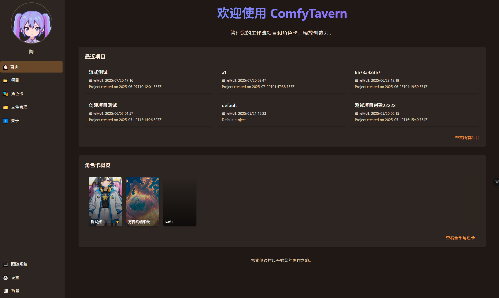
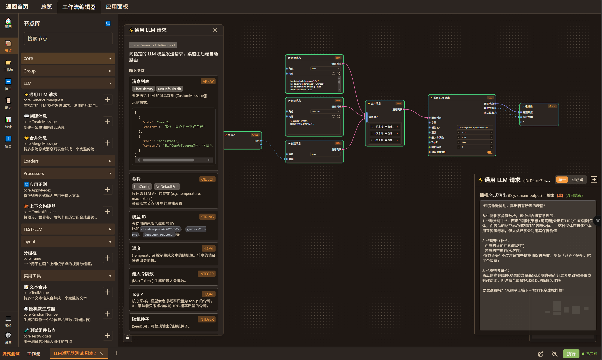
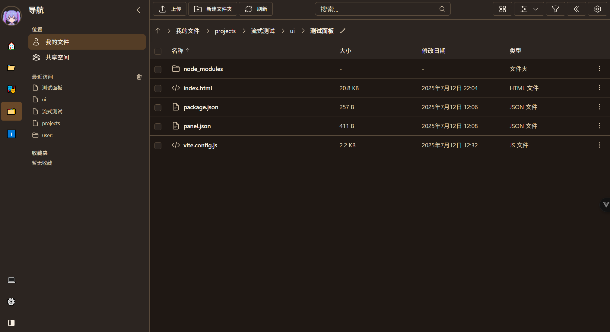
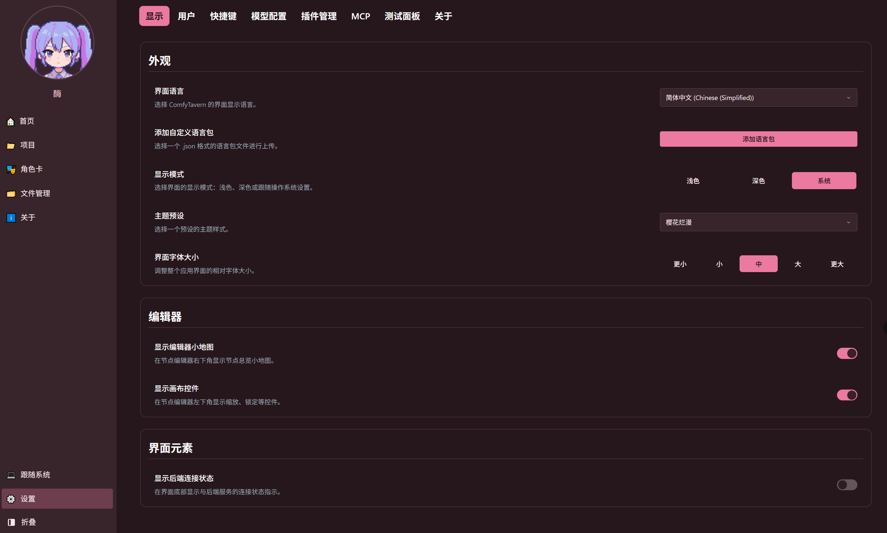
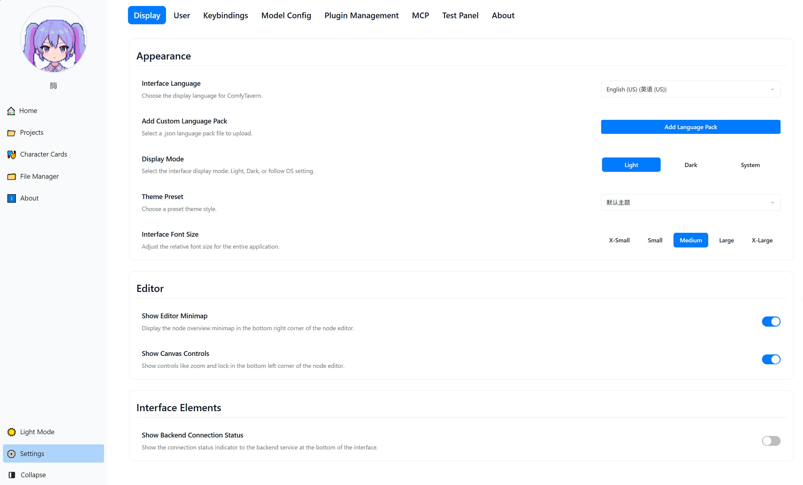

# 玄思妙境 (初行版)

[](https://deepwiki.com/ComfyTavern/comfytavern)
[](https://github.com/ComfyTavern/comfytavern)
[](./LICENSE)
[](https://github.com/ComfyTavern/comfytavern)

<p align="center">
  
</p>

<p align="center">
  <a href="./README.md">简体中文</a>
  &nbsp;•&nbsp;
  <a href="./README.en.md">English</a>
  &nbsp;•&nbsp;
  <a href="./README.ja.md">日本語</a>
  &nbsp;•&nbsp;
  <a href="./README.ru.md">Русский</a>
  &nbsp;•&nbsp;
  <a href="./README.wyw.md"><b>文言</b></a>
</p>

### 🌉 融 AI 妙创于终端之验

玄思妙境者，乃面向营造者与终端用户之 AI 创作与应用之台也。其志在化繁复之 AI 机巧流，为直观、易用、可交互之**袖珍应用**。

吾辈为**营造者**备以强大、流畅之可视化天工坊，以编排 AI 之玄理；亦使**终端用户**无需究其底层之术，仅凭独立之**应用仪盘**，即可“开箱即用”，体验 AI 清谈、视觉小说、智能灵偶等万千妙用。

吾辈深信，AI 之力，非仅在于营造过程之精妙，更在于最终体验之便捷。

**➡️ 当下核心：PC 端 VueFlow 天工坊 + 插件化扩展 + 统一文件资产管理。**

## [👉 初探门径](#-置备与发轫)

---

## 📸 界面一览

<p align="center">
  
  
</p>
<p align="center">
  
  
  
</p>

---

### ✨ 核心之妙

玄思妙境之营造，围绕三大支柱：**专业之编排利器 → 开放之应用生态 → 独特之智能体架构**。

#### 一、🚀 神通：高性能引擎与专业级天工坊

-   **全链路流式引擎**: 后端专为实时交互而设。从输入、机括传递至接口响应，全程支持流式处理与异步并发，通过 WebSocket 实时反馈执行状态，为 AI 对话、动态内容生成等应用提供性能保障。
-   **专业可视化天工坊**:
    -   **模块化机括组**：一键创建机括组，将复杂玄理封装为可复用之模块。
    -   **流畅体验**：精简之界面、丰富之右键菜单、多级操作、双暂存牍、往事之鉴等。
    -   **强大机括系统**：支持多种数据类型、自定义 Schema、内嵌交互组件、客户端脚本扩展。

#### 二、⭐ 生态：开放、兼容与利于营造者

-   **插件化架构**: 前后端皆支持插件化扩展。营造者可轻易创建自定义机括、界面组件，乃至集成新服务，并通过插件管理器动态加载。
-   **统一文件资产管理 (FAM)**: 提供可视化之文件管理器，支持项目级与用户级之文件操作，为 AI 应用提供可靠之数据与资产管理之基。
-   **应用仪盘 SDK**: 提供专用之 `@comfytavern/panel-sdk`，使营造者能轻易构建与主应用安全通信之交互式应用仪盘，将机巧流封装为最终之物。
-   **API 驱动**: 核心功能皆通过 API (HTTP/WebSocket) 显露，为第三方集成与未来发展为**独立后端之役 (引擎即服务)** 奠定基础。

#### 三、🎯 远志：以自运灵偶为核心之应用架构

此非仅一功能，乃玄思妙境区别于他者之架构基石。吾辈非简单复制或组合现有之器，而是提供一种全新之范式：

-   **与 ComfyUI 侧重有别**: ComfyUI 长于图像生成。玄思妙境之志更广，乃通用之 AI 应用构建与执行平台，涵盖玄理、文本、LLM 交互与灵偶构建，可与 ComfyUI 并用。
-   **与 SillyTavern 架构不同**: SillyTavern 乃优良之清谈前端。玄思妙境之核心优势，则源于其**统一之自运灵偶架构**。吾辈以“场景”为核心，构建了一个能让灵偶“活起来”的运行环境：
    -   **灵偶者，乃怀“心智”与“记忆”之行法核心**: 每尊灵偶皆被赋予内在之“审度之环”、长时记忆（知海）与可召之技（机巧流）。
    -   **应用仪盘者，乃灵偶与用户交互之“面容”**: 其不再是固定之界面，而是与灵偶异步通信、实时响应其状态之动态前端，构建真正有生命力之交互体验。

此架构使营造者能构建出远超传统预设、真正具备动态行为与学习潜力之 AI 应用。

---

### 📄 典籍

-   **[项目概览](DesignDocs/整理/ProjectOverview.md)**：深入了解项目架构、技术选型和核心模块。
-   **[自定义机括营造指南](docs/guides/custom-node-development.zh.md)**：拓展玄思妙境功能之步骤。
-   **[插件与工具架构](DesignDocs/architecture/unified-plugin-and-tool-architecture.md)**：了解插件系统之运作原理。
-   **[文件资产管理指南](docs/guides/file-asset-management-guide.md)**：了解文件系统之设计与运用。
-   **[应用仪盘 SDK 营造指南](docs/guides/panel-sdk-guide.md)**：学习如何创建交互式应用仪盘。

---

### 🚦 前路图

此项目正积极推进中：

-   **期一：核心引擎与扩展性 (已备)**
    -   ✅ 可视化天工坊核心 (VueFlow)
    -   ✅ 后端机括动态加载与执行引擎 (异步、流式)
    -   ✅ 前后端插件化架构
    -   ✅ 统一文件资产管理 (FAM)
    -   ✅ 应用仪盘 SDK (Panel SDK)

-   **期二：应用与服务化 (近期核心)**
    -   ⏳ **灵偶运行时**: 实现灵偶加载与核心“审度-行动”之环。
    -   ⏳ **场景化之基**: 搭建隔离之事件总线与共享世界之态。
    -   ⏳ **交互式应用 MVP**: 打通应用仪盘与灵偶之首次端到端异步通信。
    -   ⏳ **API 标准化**: 持续封装和优化机巧流 API。

-   **期三：智能核心：记忆与学习 (中期规划)**
    -   ⏳ **结构化知海**: 完善灵偶可靠之长时记忆机制。
    -   ⏳ **灵偶自我进化**: 赋予灵偶通过反思向知海贡献经验之能力。
    -   ⏳ **LLM 服务编排**: 引入更灵活之 LLM 服务适配器。

-   **期四：生态构建：多灵偶协作 (远期愿景)**
    -   🔭 **多灵偶协作**: 探索和支持多灵偶在同一场景下之协作模式。
    -   🔭 **营造者生态**: 提供标准化之灵偶与仪盘模板，构建营造者社区。

---

### 🏗️ 营造之构

```
apps/
  ├── backend/            # 后端服务 (Elysia + Bun)
  └── frontend-vueflow/   # 前端 (Vue 3 + Vite + VueFlow)
packages/
  ├── types/              # 共享之 TypeScript 类型
  ├── utils/              # 共享之工具函数
  └── panel-sdk/          # 应用仪盘 SDK
plugins/                  # 用户自定义之插件
userData/                 # 用户数据之根 (含锦囊、配置等)
...
```

---

### 🚀 置备与发轫

**所需之境:**

-   [Bun](https://bun.sh) v1.2.5+ (主要运行时)
-   Node.js v20+ (用于开发工具)
-   Windows / Linux / macOS

**一、获取源码:**

```bash
git clone https://github.com/ComfyTavern/comfytavern.git
cd comfytavern
```
> 或从 [GitHub 仓库打包](https://github.com/ComfyTavern/comfytavern/archive/refs/heads/main.zip) 下载 ZIP 并解压。

**二、置备依赖:**

```bash
bun install
```
> 若遇网络之阻，可试淘宝镜像: `bun install --registry https://registry.npmmirror.com`

**三、启动应用:**

项目提供一键启动脚本，将自动处理环境检查、依赖安装、数据库初始化等。

| 平台        | 生产模式           | 开发模式           |
| :---------- | :------------ | :---------------- |
| Windows     | `.\start.bat` | `.\start.bat dev` |
| Linux/macOS | `./start.sh`  | `./start.sh dev`  |

-   **日常开发中**，若确认配置无变，可使用 **快速启动** 以略过检查，提升速度：

| 平台        | 生产模式               | 开发模式               |
| :---------- | :--------------------- | :--------------------- |
| Windows     | `.\start_fast.bat`     | `.\start_fast.bat dev` |
| Linux/macOS | `./start_fast.sh`      | `./start_fast.sh dev`  |

**默认地址:**

-   前端: `http://localhost:5573/`
-   后端: `http://localhost:3233/`

**强令重构前端**

启动脚本默认略过已存之前端营造。君若修改前端之码，请运行 `bun run build` 以强令重构。

---

### 🛠️ 初探门径

#### 其一：创建锦囊

1.  启动功成后，访问 `http://localhost:5573/`（默认端口）。
2.  于左侧导引栏进入 **锦囊妙计** 页面。
3.  点击 **新辟锦囊** 之钮，输入锦囊之名并确认，即可进入该锦囊之**总览页面**。

#### 其二：连接 AI 服务

在开始创作前，建议先配置 AI 服务，以便于机巧流中调用。

1.  前往主页左侧导引栏之 **设置** -> **模型配置** 页面。
2.  点击 **新建渠道**，择君之 AI 服务商，并填入 `Base URL` 与 `API Key`。
3.  添加该渠道所支持之模型 ID (如 `gpt-4o`) 并保存。

#### 其三：创建并编辑机巧流

1.  于锦囊总览页面，点击进入 **机巧流天工坊**。
2.  **增设机括**: 从左侧机括宝库之 `LLM` 分类下，添加 `💬创建消息` 与 `⚡通用 LLM 请求` 机括至画布。
3.  **填写内容**: 于 `💬创建消息` 机括输入问题，于 `⚡通用 LLM 请求` 机括填入上一步配置好之模型 ID。
4.  **连接数据流**: 将 `💬创建消息` 之 `消息` 输出，连接至 `⚡通用 LLM 请求` 之 `消息列表` 输入。

#### 其四：执行并查看结果

1.  点击画布上方之 **执行** 按钮。
2.  所有机括之输出将实时送至右侧之 **略观仪盘**。点击天工坊右下角之 **预览** (🔍 图标) 按钮可展开或收起仪盘。
3.  **推荐用法**:
    -   在“**组览**”模式下，可清晰得见所有连接至 `组输出` 机括之最终结果。
    -   亦可右击任一机括之输出桩，择“**设为预览**”以单独观察该机括之中间数据。

---

### ⚙️ 精进之法

#### 数据库

此项目用 SQLite，初次启动时将自动创建并迁移。当君更新版本后，若涉数据库结构之变更，请执行 `bun run db:upgrade`。

#### 生产环境 (PM2)

项目提供了通过 PM2 进行生产环境部署和管理之脚本。

-   **启动所有服务**: `bun run manage:pm2 start`
-   **查看所有服务状态**: `bun run manage:pm2 list`
-   **查看日志**: `bun run manage:pm2 logs comfytavern-backend`
-   **停止所有服务**: `bun run manage:pm2 stop`

---

### 🤝 共襄与建言

项目尚处早期 Beta 与高速迭代之阶段，功能与 API 或有变动。欢迎建言与共襄！

-   **漏洞与建言**: [GitHub Issues](https://github.com/ComfyTavern/comfytavern/issues)
-   **参与营造**: (贡献指南完善中，可通过 Issue 讨论)
-   **社区**:
    -   **Discord**: [ComfyTavern](https://discord.gg/VE8AM7t4n6) (营造中)

---

### 💻 所用之术

-   **前端**: Vue 3 + TypeScript + Vite + [Vue Flow](https://vueflow.dev/) + Pinia + Tailwind CSS
-   **后端**: [Bun](https://bun.sh/) + [Elysia](https://elysiajs.com/) + Drizzle ORM (SQLite)
-   **实时通信**: WebSocket

---

### 📜 盟约 (License)

此项目采**双轨之盟 (Dual-Licensing)**，旨在衡公享于社区与项目之长远。

#### 一、开源之盟：GNU AGPLv3

凡格致之士、非营之社、及一切非商用之途，玄思妙境皆依 **GNU Affero General Public License v3.0 (AGPLv3)** 盟约以授。

**核心之要**：君若修玄思妙境之源码，或以之为后台，经由网络以服务于众，则须以同等之 AGPLv3 盟约，尽开君之项目源码。

吾辈鼓励基于玄思妙境之学、之新、及非商用之布施。

#### 二、商用之盟 (Commercial License)

若有组织或个人，欲于商海之中运用玄思妙境，吾辈亦备有商用之盟。

**以下情形，须购商用之盟：**

*   将玄思妙境用于任何**不开源**之商用产品或服务中。
*   于公司内部运用玄思妙境，以辅佐商业运营（譬如，作为内部工具链之一环）。
*   向付费用户提供基于玄思妙境之托管服务 (SaaS)。
*   任何不愿受 AGPLv3 开源义务约束之商业场景。

商用之盟将免除君之 AGPLv3 开源之责，并依约提供相应之技术扶持与法律保障。

---

吾辈深信，此模式能使玄思妙境在服务社区之余，获得必要之资助，从而行得更远、更稳。

**➡️ 若欲咨询或购置商用之盟，请联系吾辈：comfytavern@yeah.net**