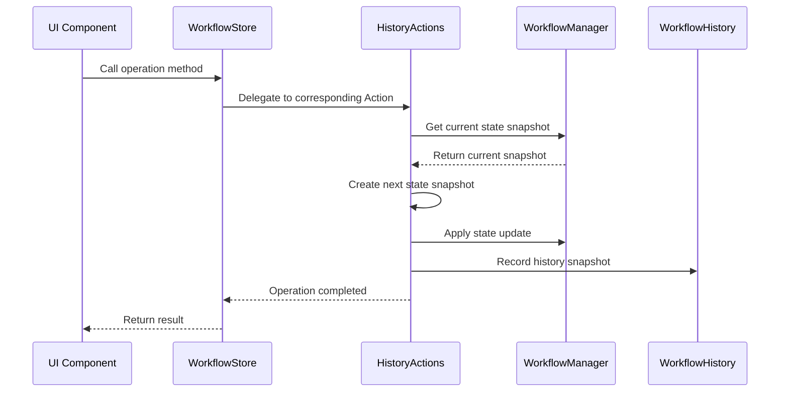
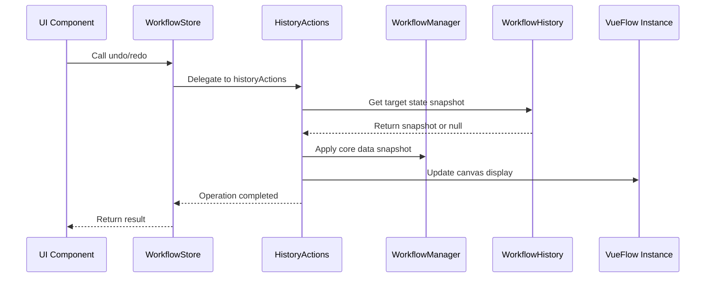

# ComfyTavern Workflow History and State Management Guide

## I. Overview

ComfyTavern adopts a modern state management architecture, implementing powerful history features (undo/redo) through Pinia Store and a modular Action system. This guide details the design principles, core components, and best practices of the history system.

### Key Features

- **Full Undo/Redo Support**: Supports undo and redo for all workflow operations.
- **Multi-Tab Isolation**: Each workflow tab maintains an independent history.
- **Atomic Operations**: Ensures consistency of state updates and history records.
- **Performance Optimization**: Uses deep cloning and snapshot mechanisms to guarantee data isolation.
- **Smart History Management**: Automatically limits history length to prevent memory overflow.

## II. Architectural Design

### 2.1 "Cabinet System" Architecture Pattern

ComfyTavern adopts a "Cabinet System" architectural pattern, decomposing workflow state management into multiple specialized modules:

```
workflowStore (Cabinet Office)
├── state (Core State)
├── getters (Computed Properties)
└── actions (Imported from various ministries)
    ├── historyActions (Ministry of History Records)
    ├── nodeActions (Ministry of Node Operations)
    ├── edgeActions (Ministry of Connection Operations)
    └── lifecycleActions (Ministry of Lifecycle)
```

### 2.2 Core Components

#### WorkflowStore
- **Location**: `apps/frontend-vueflow/src/stores/workflowStore.ts`
- **Responsibility**: Serves as the central hub for state management, assembling various Action modules and exposing a unified API.

#### HistoryActions
- **Location**: `apps/frontend-vueflow/src/stores/workflow/actions/historyActions.ts`
- **Responsibility**: Specifically handles undo/redo logic, managing the creation, application, and cleanup of history records.

#### WorkflowManager
- **Location**: `apps/frontend-vueflow/src/composables/workflow/useWorkflowManager.ts`
- **Responsibility**: Manages the core state of the workflow, including elements, viewport, and workflow data.

#### WorkflowHistory
- **Location**: `apps/frontend-vueflow/src/composables/workflow/useWorkflowHistory.ts`
- **Responsibility**: Underlying history storage and management, maintaining the history stack and index.

## III. Data Structures

### 3.1 WorkflowStateSnapshot

A complete workflow state snapshot, containing all information needed to restore a workflow:

```typescript
interface WorkflowStateSnapshot {
  elements: Array<VueFlowNode | VueFlowEdge>;  // Canvas elements
  viewport: Viewport;                          // Viewport state
  workflowData: WorkflowData | null;          // Workflow metadata
}
```

### 3.2 HistoryEntry

Structured history entry describing the details of an operation:

```typescript
interface HistoryEntry {
  actionType: string;           // Operation type: 'modify', 'add', 'remove', 'connect', 'disconnect', 'move', 'sync'
  objectType: string;           // Object type: 'nodeInput', 'nodeConfig', 'node', 'edge', 'workflowProperty'
  summary: string;              // Human-readable operation summary
  timestamp: number;            // Operation timestamp
  details?: Record<string, any>; // Detailed context information
}
```

### 3.3 HistoryItem

A single item in the history stack:

```typescript
interface HistoryItem {
  entry: HistoryEntry;              // Operation description
  payload: WorkflowStateSnapshot;   // State snapshot after the operation
}
```

## IV. Core Workflow

### 4.1 Standard Process for Recording History

When a user performs an operation that needs to be recorded, the system follows this standard process:



### 4.2 Undo/Redo Process



## V. Key API References

### 5.1 HistoryActions API

#### undo(steps?: number, internalId?: string)
Undoes the specified number of operations.

**Parameters**:
- `steps`: Number of steps to undo, defaults to 1.
- `internalId`: Optional tab ID, defaults to current active tab.

**Behavior**:
- Supports multi-step undo.
- Automatically handles undoing to the initial state.
- Attempts to apply default workflow on failure.

#### redo(steps?: number, internalId?: string)
Redoes the specified number of operations.

**Parameters**:
- `steps`: Number of steps to redo, defaults to 1.
- `internalId`: Optional tab ID, defaults to current active tab.

**Behavior**:
- Supports multi-step redo.
- Automatically validates redo feasibility.
- Maintains state consistency.

### 5.2 WorkflowManager API

#### `getCurrentSnapshot(internalId: string): WorkflowStateSnapshot | undefined`
Gets the current state snapshot of the specified tab.

#### `applyStateSnapshot(internalId: string, snapshot: WorkflowStateSnapshot): boolean`
Applies a state snapshot to the specified tab, mainly used for history recovery.

#### `setElements(internalId: string, elements: Array<VueFlowNode | VueFlowEdge>)`
Updates canvas elements and marks them as "dirty" state.

### 5.3 WorkflowHistory API

#### `recordSnapshot(internalId: string, entry: HistoryEntry, payload: WorkflowStateSnapshot)`
Records a new history snapshot.

#### `canUndo(internalId: string): ComputedRef<boolean>`
Checks if an undo operation can be performed.

#### `canRedo(internalId: string): ComputedRef<boolean>`
Checks if a redo operation can be performed.

#### `getHistorySummaries(internalId: string): ComputedRef<string[]>`
Gets a summary list of history records for UI display.

## VI. Implementing New History Operations

### 6.1 Adding New Operations in Action Modules

Taking adding a node operation as an example:

```typescript
// In nodeActions.ts
async function addNodeAndRecord(
  internalId: string,
  nodeToAdd: VueFlowNode,
  entry: HistoryEntry
) {
  // 1. Get current snapshot
  const currentSnapshot = workflowManager.getCurrentSnapshot(internalId);
  if (!currentSnapshot) {
    console.error(`Failed to get current snapshot for tab ${internalId}`);
    return;
  }

  // 2. Prepare next state snapshot
  const nextSnapshot = klona(currentSnapshot);
  nextSnapshot.elements.push(klona(nodeToAdd));

  // 3. Apply state update
  await workflowManager.setElements(internalId, nextSnapshot.elements);

  // 4. Record history
  historyManager.recordSnapshot(internalId, entry, nextSnapshot);
}
```

### 6.2 Calling in UI Components

```typescript
// In Vue component
import { useWorkflowStore } from '@/stores/workflowStore';
import { createHistoryEntry } from '@comfytavern/utils';

const workflowStore = useWorkflowStore();

function handleAddNode(nodeType: string, position: { x: number, y: number }) {
  const newNode = createNewNode(nodeType, position);
  
  const entry = createHistoryEntry(
    'add',
    'node',
    `Add node '${newNode.label}'`,
    {
      nodeId: newNode.id,
      nodeType: nodeType,
      position: position
    }
  );

  workflowStore.addNodeAndRecord(activeTabId, newNode, entry);
}
```

## VII. Best Practices

### 7.1 History Granularity

- **Appropriate Granularity**: The unit of operation a user expects to be able to undo.
- **Avoid Too Fine**: Do not record history for every character input.
- **Avoid Too Coarse**: Do not merge multiple independent operations into one history record.

### 7.2 Performance Optimization

- **Use klona for Deep Cloning**: Ensure data isolation for history records.
- **Limit History Length**: Prevent infinite memory growth.
- **Delayed Recording**: For continuous operations (e.g., dragging), record at the end of the operation.

### 7.3 Error Handling

- **Validate Snapshot Integrity**: Ensure snapshots contain all necessary data.
- **Graceful Degradation**: When history recording fails, it should not affect primary functionality.
- **Detailed Logging**: Record sufficient debugging information.

### 7.4 User Experience

- **Clear Operation Description**: Provide meaningful descriptions in `HistoryEntry.summary`.
- **Visual Feedback**: Display undo/redo availability in the UI.
- **Keyboard Shortcuts**: Support Ctrl+Z and Ctrl+Y.

## VIII. Debugging and Troubleshooting

### 8.1 Common Issues

**Issue**: Inconsistent state after undo.
**Solution**: Check if the snapshot contains complete state information, and ensure `applyStateSnapshot` is correctly implemented.

**Issue**: History records lost.
**Solution**: Verify that `recordSnapshot` is called correctly after state updates.

**Issue**: High memory usage.
**Solution**: Check `MAX_HISTORY_LENGTH` setting and ensure history records are properly cleaned up.

### 8.2 Debugging Tips

- Use browser developer tools to view history state.
- Add `console.log` at key operation points.
- Check Pinia state in Vue DevTools.
- Verify correct JSON serialization of snapshots.

## IX. Extension and Customization

### 9.1 Customizing History Behavior

Custom information can be added by extending the `details` field of `HistoryEntry`:

```typescript
const customEntry = createHistoryEntry(
  'modify',
  'nodeInput',
  'Update node input',
  {
    nodeId: 'node-123',
    inputKey: 'text',
    oldValue: 'old text',
    newValue: 'new text',
    // Custom fields
    userAction: 'paste',
    sourceApplication: 'clipboard'
  }
);
```

### 9.2 Adding New Action Modules

Create new Action modules according to the existing pattern:

```typescript
// New customActions.ts
export function createCustomActions(context: WorkflowStoreContext) {
  // Implement custom operation logic
  return {
    customOperation,
    anotherCustomOperation
  };
}
```

Then import and use in `workflowStore`.

## X. Conclusion

ComfyTavern's history system, through its modular architectural design, provides powerful and flexible undo/redo functionality. By following the patterns and best practices in this guide, developers can easily add history support for new features while maintaining system performance and stability.

Key takeaways:
- Use the standard snapshot-apply-record process.
- Maintain atomicity of operations.
- Provide clear user feedback.
- Pay attention to performance and memory management.
- Follow modular architectural principles.