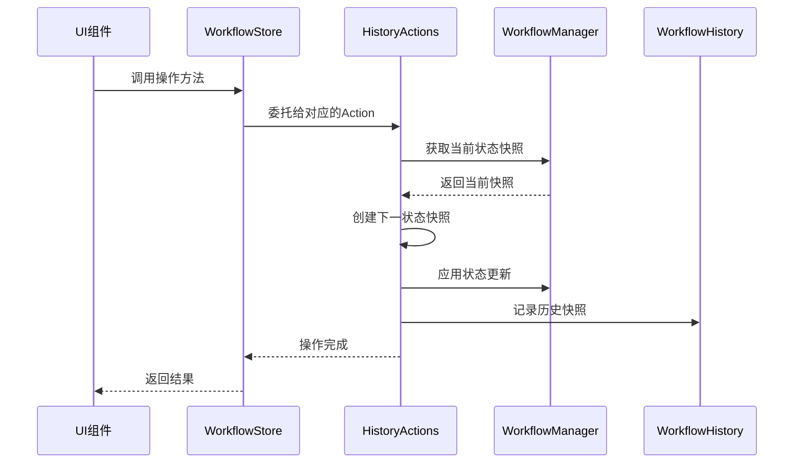
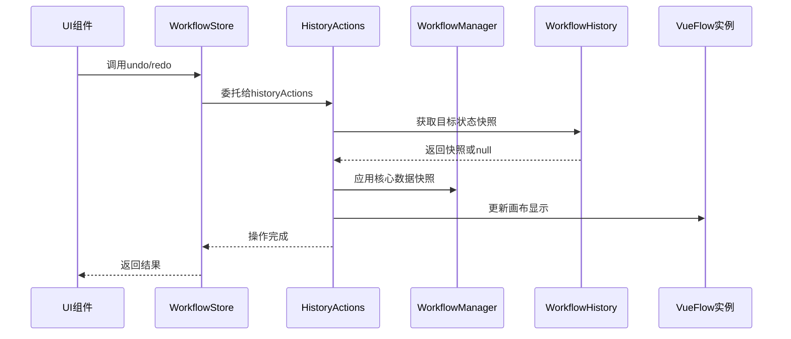

# ComfyTavern 工作流历史记录与状态管理指南

## 一、概述

ComfyTavern 采用现代化的状态管理架构，通过 Pinia Store 和模块化的 Action 系统实现强大的历史记录功能（撤销/重做）。本指南详细介绍了历史记录系统的设计原理、核心组件以及最佳实践。

### 核心特性

- **完整的撤销/重做支持**：支持所有工作流操作的撤销和重做
- **多标签页隔离**：每个工作流标签页维护独立的历史记录
- **原子性操作**：确保状态更新和历史记录的一致性
- **性能优化**：使用深拷贝和快照机制保证数据隔离
- **智能历史管理**：自动限制历史记录长度，防止内存溢出

## 二、架构设计

### 2.1 "内阁制"架构模式

ComfyTavern 采用"内阁制"架构模式，将工作流状态管理分解为多个专门的模块：

```
workflowStore (内阁府)
├── state (核心状态)
├── getters (计算属性)
└── actions (从各部委导入)
    ├── historyActions (历史记录部)
    ├── nodeActions (节点操作部)
    ├── edgeActions (连接操作部)
    └── lifecycleActions (生命周期部)
```

### 2.2 核心组件

#### WorkflowStore
- **位置**: [`apps/frontend-vueflow/src/stores/workflowStore.ts`](apps/frontend-vueflow/src/stores/workflowStore.ts:1)
- **职责**: 作为状态管理的中心枢纽，组装各个 Action 模块并暴露统一的 API

#### HistoryActions
- **位置**: [`apps/frontend-vueflow/src/stores/workflow/actions/historyActions.ts`](apps/frontend-vueflow/src/stores/workflow/actions/historyActions.ts:1)
- **职责**: 专门处理撤销/重做逻辑，管理历史记录的创建、应用和清理

#### WorkflowManager
- **位置**: [`apps/frontend-vueflow/src/composables/workflow/useWorkflowManager.ts`](apps/frontend-vueflow/src/composables/workflow/useWorkflowManager.ts:1)
- **职责**: 管理工作流的核心状态，包括元素、视口和工作流数据

#### WorkflowHistory
- **位置**: [`apps/frontend-vueflow/src/composables/workflow/useWorkflowHistory.ts`](apps/frontend-vueflow/src/composables/workflow/useWorkflowHistory.ts:1)
- **职责**: 底层历史记录存储和管理，维护历史栈和索引

## 三、数据结构

### 3.1 WorkflowStateSnapshot

完整的工作流状态快照，包含恢复工作流所需的所有信息：

```typescript
interface WorkflowStateSnapshot {
  elements: Array<VueFlowNode | VueFlowEdge>;  // 画布元素
  viewport: Viewport;                          // 视口状态
  workflowData: WorkflowData | null;          // 工作流元数据
}
```

### 3.2 HistoryEntry

结构化的历史记录条目，描述操作的详细信息：

```typescript
interface HistoryEntry {
  actionType: string;           // 操作类型：'modify', 'add', 'remove', 'connect', 'disconnect', 'move', 'sync'
  objectType: string;           // 对象类型：'nodeInput', 'nodeConfig', 'node', 'edge', 'workflowProperty'
  summary: string;              // 人类可读的操作摘要
  timestamp: number;            // 操作时间戳
  details?: Record<string, any>; // 详细的上下文信息
}
```

### 3.3 HistoryItem

历史记录栈中的单个项目：

```typescript
interface HistoryItem {
  entry: HistoryEntry;              // 操作描述
  payload: WorkflowStateSnapshot;   // 操作后的状态快照
}
```

## 四、核心工作流程

### 4.1 记录历史的标准流程

当用户执行一个需要记录的操作时，系统遵循以下标准流程：



### 4.2 撤销/重做流程



## 五、关键API参考

### 5.1 HistoryActions API

#### undo(steps?: number, internalId?: string)
撤销指定步数的操作。

**参数**:
- `steps`: 要撤销的步数，默认为 1
- `internalId`: 可选的标签页ID，默认使用当前活动标签页

**行为**:
- 支持多步撤销
- 自动处理撤销到初始状态的情况
- 失败时会尝试应用默认工作流

#### redo(steps?: number, internalId?: string)
重做指定步数的操作。

**参数**:
- `steps`: 要重做的步数，默认为 1
- `internalId`: 可选的标签页ID，默认使用当前活动标签页

**行为**:
- 支持多步重做
- 自动验证重做的可行性
- 保持状态一致性

### 5.2 WorkflowManager API

#### getCurrentSnapshot(internalId: string): WorkflowStateSnapshot | undefined
获取指定标签页的当前状态快照。

#### applyStateSnapshot(internalId: string, snapshot: WorkflowStateSnapshot): boolean
应用状态快照到指定标签页，主要用于历史记录恢复。

#### setElements(internalId: string, elements: Array<VueFlowNode | VueFlowEdge>)
更新画布元素并标记为"脏"状态。

### 5.3 WorkflowHistory API

#### recordSnapshot(internalId: string, entry: HistoryEntry, payload: WorkflowStateSnapshot)
记录新的历史快照。

#### canUndo(internalId: string): ComputedRef<boolean>
检查是否可以执行撤销操作。

#### canRedo(internalId: string): ComputedRef<boolean>
检查是否可以执行重做操作。

#### getHistorySummaries(internalId: string): ComputedRef<string[]>
获取历史记录的摘要列表，用于UI显示。

## 六、实现新的历史记录操作

### 6.1 在Action模块中添加新操作

以添加节点操作为例：

```typescript
// 在 nodeActions.ts 中
async function addNodeAndRecord(
  internalId: string,
  nodeToAdd: VueFlowNode,
  entry: HistoryEntry
) {
  // 1. 获取当前快照
  const currentSnapshot = workflowManager.getCurrentSnapshot(internalId);
  if (!currentSnapshot) {
    console.error(`无法获取标签页 ${internalId} 的当前快照`);
    return;
  }

  // 2. 准备下一状态快照
  const nextSnapshot = klona(currentSnapshot);
  nextSnapshot.elements.push(klona(nodeToAdd));

  // 3. 应用状态更新
  await workflowManager.setElements(internalId, nextSnapshot.elements);

  // 4. 记录历史
  historyManager.recordSnapshot(internalId, entry, nextSnapshot);
}
```

### 6.2 在UI组件中调用

```typescript
// 在Vue组件中
import { useWorkflowStore } from '@/stores/workflowStore';
import { createHistoryEntry } from '@comfytavern/utils';

const workflowStore = useWorkflowStore();

function handleAddNode(nodeType: string, position: { x: number, y: number }) {
  const newNode = createNewNode(nodeType, position);
  
  const entry = createHistoryEntry(
    'add',
    'node',
    `添加节点 '${newNode.label}'`,
    {
      nodeId: newNode.id,
      nodeType: nodeType,
      position: position
    }
  );

  workflowStore.addNodeAndRecord(activeTabId, newNode, entry);
}
```

## 七、最佳实践

### 7.1 历史记录粒度

- **合适的粒度**: 用户期望能够撤销的操作单位
- **避免过细**: 不要为每个字符输入都记录历史
- **避免过粗**: 不要将多个独立操作合并为一个历史记录

### 7.2 性能优化

- **使用klona进行深拷贝**: 确保历史记录的数据隔离
- **限制历史记录长度**: 防止内存无限增长
- **延迟记录**: 对于连续操作（如拖拽），在操作结束时记录

### 7.3 错误处理

- **验证快照完整性**: 确保快照包含所有必要数据
- **优雅降级**: 当历史记录失败时，不影响主要功能
- **详细日志**: 记录足够的调试信息

### 7.4 用户体验

- **清晰的操作描述**: 在HistoryEntry.summary中提供有意义的描述
- **视觉反馈**: 在UI中显示撤销/重做的可用性
- **键盘快捷键**: 支持Ctrl+Z和Ctrl+Y

## 八、调试和故障排除

### 8.1 常见问题

**问题**: 撤销后状态不一致
**解决**: 检查快照是否包含完整的状态信息，确保applyStateSnapshot正确实现

**问题**: 历史记录丢失
**解决**: 验证recordSnapshot是否在状态更新后正确调用

**问题**: 内存使用过高
**解决**: 检查MAX_HISTORY_LENGTH设置，确保历史记录被正确清理

### 8.2 调试技巧

- 使用浏览器开发者工具查看历史记录状态
- 在关键操作点添加console.log
- 检查Vue DevTools中的Pinia状态
- 验证快照的JSON序列化是否正确

## 九、扩展和定制

### 9.1 自定义历史记录行为

可以通过扩展HistoryEntry的details字段来添加自定义信息：

```typescript
const customEntry = createHistoryEntry(
  'modify',
  'nodeInput',
  '更新节点输入',
  {
    nodeId: 'node-123',
    inputKey: 'text',
    oldValue: 'old text',
    newValue: 'new text',
    // 自定义字段
    userAction: 'paste',
    sourceApplication: 'clipboard'
  }
);
```

### 9.2 添加新的Action模块

按照现有模式创建新的Action模块：

```typescript
// 新建 customActions.ts
export function createCustomActions(context: WorkflowStoreContext) {
  // 实现自定义操作逻辑
  return {
    customOperation,
    anotherCustomOperation
  };
}
```

然后在workflowStore中导入和使用。

## 十、总结

ComfyTavern的历史记录系统通过模块化的架构设计，提供了强大而灵活的撤销/重做功能。通过遵循本指南中的模式和最佳实践，开发者可以轻松地为新功能添加历史记录支持，同时保持系统的性能和稳定性。

关键要点：
- 使用标准的快照-应用-记录流程
- 保持操作的原子性
- 提供清晰的用户反馈
- 注意性能和内存管理
- 遵循模块化的架构原则