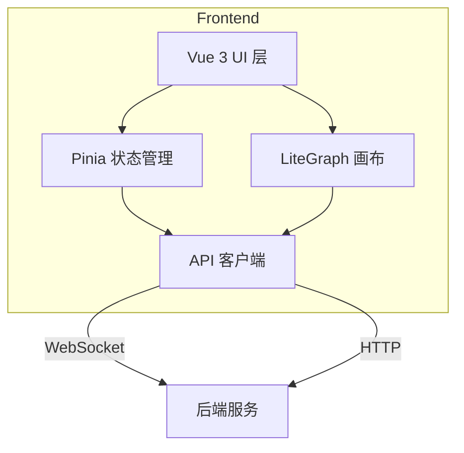

# ComfyUI 风格的前端架构设计

## 1. 整体架构



## 2. 技术栈

- **核心框架**: Vue 3 (Composition API)
- **类型系统**: TypeScript
- **状态管理**: Pinia
- **路由系统**: Vue Router
- **UI 组件**: PrimeVue + TailwindCSS
- **工具函数**:
  - VueUse (Vue Hooks)
  - Lodash (通用工具)
- **错误监控**: Sentry
- **国际化**: vue-i18n
- **画布引擎**: LiteGraph.js
- **构建工具**: Vite (Bun 兼容模式)
- **包管理**: Bun

## 3. 应用结构

```
frontend/
├── src/
│   ├── components/     # Vue 组件
│   │   ├── graph/     # 画布相关组件
│   │   ├── node/      # 节点相关组件
│   │   ├── sync/      # 状态同步组件
│   │   └── shared/    # 通用组件
│   ├── router/        # 路由配置
│   │   └── index.ts   # 路由定义
│   ├── stores/        # Pinia 状态存储
│   │   ├── graph.ts   # 画布状态
│   │   ├── workspace.ts # 工作区和节点状态
│   │   └── ui.ts      # UI和同步状态
│   ├── api/           # API 客户端
│   │   ├── http.ts    # HTTP 请求
│   │   └── ws.ts      # WebSocket 通信
│   ├── types/         # TypeScript 类型
│   ├── utils/         # 工具函数
│   ├── plugins/       # Vue 插件配置
│   └── views/         # 页面组件
│       ├── HomeView.vue     # 主页（选择模式）
│       ├── NodesView.vue    # 节点编辑器页面
│       └── FrontendView.vue # 封装前端页面
└── vite.config.ts     # Vite 配置
```

## 4. 核心功能实现

### 4.1 状态管理设计

1. **画布状态 (graphStore)**
```typescript
export const useGraphStore = defineStore('graph', () => {
  const canvas = shallowRef<LGraphCanvas>(null)
  const selectedItems = ref<Array<LGraphNode | LGraphGroup>>([])

  // 性能优化
  const markRawCanvas = (newCanvas: LGraphCanvas) => {
    canvas.value = markRaw(newCanvas)
  }

  return { canvas, selectedItems, markRawCanvas }
})
```

2. **工作区状态 (workspaceStore)**
```typescript
export const useWorkspaceStore = defineStore('workspace', () => {
  // 工作区状态
  const activeWorkspace = ref<ComfyWorkspace | null>(null)
  const workspaceList = ref<ComfyWorkspace[]>([])

  // 工作流状态
  const activeWorkflow = ref<ComfyWorkflow | null>(null)
  const workflowList = ref<ComfyWorkflow[]>([])

  // 工作区和工作流操作
  const saveWorkspace = async () => {
    if (activeWorkspace.value) {
      await activeWorkspace.value.save()
    }
  }

  const saveWorkflow = async () => {
    if (activeWorkflow.value) {
      await activeWorkflow.value.save()
    }
  }

  return {
    activeWorkspace, workspaceList, saveWorkspace,
    activeWorkflow, workflowList, saveWorkflow
  }
})
```

3. **UI 状态 (uiStore)**
```typescript
export const useUiStore = defineStore('ui', () => {
  // UI状态
  const mode = ref<'nodes' | 'dialogue'>('nodes')
  const toggleMode = () => mode.value = mode.value === 'nodes' ? 'dialogue' : 'nodes'

  // 多实例同步状态
  const instanceId = ref(generateUUID())
  const connectedInstances = ref<Map<string, InstanceInfo>>(new Map())
  const activeInstanceId = ref<string | null>(null)
  const wsConnection = ref<WebSocket | null>(null)

  // 同步相关操作
  const broadcastUpdate = (update: any) => {
    if (wsConnection.value) {
      wsConnection.value.send(JSON.stringify({
        type: 'STATE_UPDATE',
        instanceId: instanceId.value,
        data: update
      }))
    }
  }

  return {
    mode, toggleMode,
    instanceId, connectedInstances, activeInstanceId,
    wsConnection, broadcastUpdate
  }
})
```

### 4.2 节点编辑器实现

1. **画布管理**
   - LiteGraph.js 集成
   - 自定义节点系统
   - 实时预览支持
   - 性能优化（使用 shallowRef 和 markRaw）

2. **节点交互**
   - 拖拽创建
   - 属性编辑
   - 连线管理
   - 节点分组

3. **工作流操作**
   - 保存/加载
   - 撤销/重做
   - 复制/粘贴
   - 导入/导出

### 4.3 通信层设计

1. **WebSocket 通信**
   - 多实例同步
   - 状态同步
   - 执行进度
   - 实时日志
   - 预览更新

2. **HTTP 通信**
   - 节点定义获取
   - 配置管理
   - 工作流存储
   - 资源加载

3. **错误处理**
   - 全局错误捕获
   - 重连机制
   - 状态恢复

## 5. 实施计划

### 5.1 第一阶段：基础架构（1周）

1. **项目初始化**
```bash
cd apps/frontend
bun install vue@next pinia @vueuse/core primevue tailwindcss litegraph.js
```

2. **核心配置**
```typescript
// main.ts
import { createApp } from 'vue'
import { createPinia } from 'pinia'
import PrimeVue from 'primevue/config'
import App from './App.vue'

const app = createApp(App)
app.use(createPinia())
app.use(PrimeVue, { ripple: true })
app.mount('#app')
```

### 5.2 第二阶段：功能实现（2周）

1. **画布系统**
   - LiteGraph.js 集成与封装
   - 自定义节点组件
   - 画布交互控制

2. **状态管理**
   - 核心 Store 实现
   - 持久化机制
   - 状态同步

3. **UI 组件**
   - 节点编辑面板
   - 工具栏
   - 属性面板
   - 状态面板

4. **通信实现**
   - WebSocket 客户端
   - HTTP API 封装
   - 实时更新机制

### 5.3 最终阶段：优化和测试（1周）

1. **性能优化**
   - 响应式优化（shallowRef、markRaw）
   - 渲染优化（虚拟滚动、懒加载）
   - 状态优化（精细化更新、缓存）

2. **开发支持**
   - Vue Devtools 集成
   - 性能监控
   - 日志系统

3. **测试与文档**
   - 单元测试
   - E2E 测试
   - API 文档

## 6. Chat组件快速实现

### 目标
快速开发一个 `Chat` 组件，用于测试 AI 聊天功能。

### 步骤

1. **设计 Chat 组件**
   - 在 `components/shared/` 创建 `ChatModule.vue`
   - 包含聊天记录显示、输入框和发送按钮

2. **集成状态管理**
   - 在 `stores/ui.ts` 添加 `chatMessages` 和 `sendMessage`
   - 使用 Pinia 管理聊天历史

3. **连接后端 AI**
   - 在 `api/ws.ts` 添加 WebSocket 调用
   - 更新 `chatMessages` 以显示 AI 响应

4. **测试与部署**
   - 在 `views/FrontendView.vue` 引入组件
   - 使用 `bun dev` 测试功能

## 7. 后续优化方向

1. **性能优化**
   - 大规模节点图渲染优化
   - 响应式系统性能调优
   - WebSocket 连接管理优化
   - 画布渲染性能优化（WebGL）

2. **功能扩展**
   - 高级节点特性（模板、组合）
   - 工作流版本控制
   - 协同编辑支持
   - 自定义主题支持

3. **开发体验**
   - 调试工具完善
   - 实时预览增强
   - 热重载优化
   - TypeScript 类型完善