# `workflowStore.ts` 重构计划（修订版）（已完成）

## 目标

将庞大的 `apps/frontend-vueflow/src/stores/workflowStore.ts` 文件重构为更小、更易于管理的单元。旨在提高代码可读性和可维护性，并解决之前过度拆分方法导致的状态同步问题。

## 策略（修订版）

利用 Vue Composition API 和 Pinia 最佳实践。创建一个核心的 `useWorkflowManager.ts` Composable，以处理紧密耦合的核心状态管理、历史记录和应用程序逻辑。其他职责，如 API 交互、视图管理和接口管理，将保留在单独的 Composables 中。主 `workflowStore.ts` 文件将充当协调器，主要在 `useWorkflowManager` 和其他专门的 Composables 之间进行协调。

## 详细步骤

1.  **创建类型文件：**（无更改）

    - **文件：** `apps/frontend-vueflow/src/types/workflowTypes.ts`
    - **操作：** 集中所有相关的 TypeScript 接口和类型。（包括 `WorkflowData`、`TabWorkflowState`、`Viewport`、`ManagedVueFlowInstance`、`WorkflowStateSnapshot`、`HistoryState`、`EdgeStyleProps` 等。）

2.  **创建/更新 Composable 函数（修订结构）：**

    - **`useWorkflowManager.ts`（新增 - 核心逻辑）：**

      - **职责：** 管理核心的 `tabStates` 响应式映射，处理撤销/重做历史记录，并将工作流数据应用于状态。这结合了之前计划为 `useWorkflowState`、`useWorkflowHistory` 和 `useWorkflowCoreLogic` 部分的基本功能。
      - **要实现的函数：**
        - `tabStates` 响应式映射定义。
        - `tabHistories` 响应式映射定义。
        - `ensureTabState`（初始化状态和历史记录）。
        - `getActiveTabState`（基于 `tabStore.activeTabId` 的辅助函数）。
        - `getWorkflowData`（Getter）。
        - `isWorkflowDirty`（Getter）。
        - `getElements`（Getter）。
        - `setElements`（Setter，包括深拷贝、标记为脏、记录历史）。
        - `markAsDirty`（更新状态并与 `tabStore` 同步）。
        - `removeWorkflowData`（删除状态和历史记录）。
        - `clearWorkflowStatesForProject`（清除项目的状态和历史记录）。
        - `isTabLoaded`（Getter）。
        - `getAllTabStates`（计算 Getter）。
        - `recordHistory`（内部或由 Setter 调用）。
        - `undo`（将快照应用于状态）。
        - `redo`（将快照应用于状态）。
        - `clearHistory`、`removeHistory`。
        - `_applyWorkflowToTab`（将加载/默认数据应用于 `tabStates` 的核心函数）。
        - `applyDefaultWorkflowToTab`（处理创建和应用空白/默认工作流，可能由 `ensureTabState` 或操作调用）。
      - **依赖项：** `types/workflowTypes.ts`、`stores/tabStore.ts`。

    - **`useWorkflowViewManagement.ts`（修订依赖项）：**

      - **职责：** 管理 VueFlow 实例和与视图相关的更新。
      - **要移动/实现的函数：**
        - `setVueFlowInstance`
        - `getVueFlowInstance`
        - `setViewport`（可能与 `useWorkflowManager` 交互以更新 `tabStates` 中的视口）。
        - `updateEdgeStylesForTab`
      - **依赖项：** `useWorkflowManager`（用于获取状态/视口）、`useEdgeStyles`、`stores/theme.ts`。

    - **`useWorkflowInterfaceManagement.ts`（修订依赖项）：**

      - **职责：** 管理工作流和组的输入/输出接口定义。
      - **要移动/实现的函数：**
        - `updateWorkflowInterface`
        - `updateGroupInterfaceInfo`
        - `removeEdgesForHandle`
        - `getActiveGroupInterfaceInfo`（计算 Getter）。
        - `findNextSlotIndex`（辅助函数）。
      - **依赖项：** `useWorkflowManager`（用于状态和潜在的历史记录触发）、`stores/tabStore.ts`。

    - **`useWorkflowData.ts`（现有 - 验证/优化）：**（职责无更改）

      - **职责：** 数据转换、API 交互（保存、加载、列出、删除）、默认工作流结构加载、组接口提取工具。
      - **要保留/验证的函数：** `saveWorkflow`、`loadWorkflow`、`fetchAvailableWorkflows`、`deleteWorkflow`、`saveWorkflowAsNew`、`loadDefaultWorkflow`、`extractGroupInterface`。
      - **依赖项：** `stores/projectStore.ts`、`stores/tabStore.ts`、`api/workflow.ts`。（不应直接依赖于 `useWorkflowManager` 状态，应将必要的数据作为参数接收）。

    - **`useWorkflowActions.ts`（现有 - 修订依赖项）：**

      - **职责：** 封装高级用户操作。
      - **要保留/验证的函数：**
        - `createNewWorkflow`（使用 `useWorkflowManager` 应用默认值，`tabStore`）。
        - `createGroupFromSelection`（使用 `useWorkflowGrouping`，`useWorkflowManager` 进行状态更改）。
      - **依赖项：** `useWorkflowManager`、`useWorkflowData`、`useWorkflowGrouping`（如果存在）、`stores/tabStore.ts`。

    - **`useEdgeStyles.ts`（现有 - 预计无更改）：**

      - **职责：** 根据类型和主题计算边样式。
      - **函数：** `getEdgeStyleProps`。
      - **依赖项：** `stores/theme.ts`。

    - **已删除：** `useWorkflowState.ts`、`useWorkflowHistory.ts`、`useWorkflowCoreLogic.ts`（其核心功能已合并到 `useWorkflowManager.ts` 中）。

3.  **重构 `workflowStore.ts`（修订版）：**
    - **操作：** 简化存储，使其主要充当协调器。
    - 从 `apps/frontend-vueflow/src/types/workflowTypes.ts` 导入类型。
    - 导入并调用必要的 Composable 函数：`useWorkflowManager`、`useWorkflowViewManagement`、`useWorkflowInterfaceManagement`、`useWorkflowData`、`useWorkflowActions`。
    - 管理最小的全局状态（例如，由 `useWorkflowData` 更新的 `availableWorkflows` ref）。
    - 定义在 Composables 之间协调调用的操作。这些操作现在应该更简单，因为 `useWorkflowManager` 处理了更多的内部复杂性。
      - 示例：`loadWorkflow` 操作调用 `useWorkflowData.loadWorkflow`，然后调用 `useWorkflowManager._applyWorkflowToTab`。
      - 示例：`saveWorkflow` 操作从 `useWorkflowManager` 获取数据，调用 `useWorkflowData.saveWorkflow`，然后调用 `useWorkflowManager` 上的方法来更新保存的状态（例如，清除脏标志，更新 `workflowData` 对象）。
      - 示例：`undo`/`redo` 操作直接调用 `useWorkflowManager.undo()`/`redo()`。管理器内部处理应用快照。
    - 删除现在由 `useWorkflowManager` 处理的逻辑。
    - 导出一个干净的 API，主要委托给 Composables。

## 结构图（Mermaid - 修订版）

```mermaid
graph TD
    subgraph stores ["存储（Pinia）"]
        workflowStore.ts --> types/workflowTypes.ts
        workflowStore.ts --> composables/useWorkflowManager.ts
        workflowStore.ts --> composables/useWorkflowViewManagement.ts
        workflowStore.ts --> composables/useWorkflowInterfaceManagement.ts
        workflowStore.ts --> composables/useWorkflowData.ts
        workflowStore.ts --> composables/useWorkflowActions.ts
        workflowStore.ts --> stores/tabStore.ts
        workflowStore.ts --> stores/theme.ts
        workflowStore.ts --> stores/projectStore.ts
    end

    subgraph composables ["Composables（Vue Composition API）"]
        useWorkflowManager.ts --> stores/tabStore.ts
        useWorkflowManager.ts --> types/workflowTypes.ts

        useWorkflowViewManagement.ts --> useWorkflowManager.ts
        useWorkflowViewManagement.ts --> useEdgeStyles.ts
        useWorkflowViewManagement.ts --> stores/theme.ts

        useWorkflowInterfaceManagement.ts --> useWorkflowManager.ts
        useWorkflowInterfaceManagement.ts --> stores/tabStore.ts

        useWorkflowData.ts --> stores/projectStore.ts
        useWorkflowData.ts --> stores/tabStore.ts
        useWorkflowData.ts --> api/workflow.ts[API 客户端]

        useWorkflowActions.ts --> useWorkflowManager.ts
        useWorkflowActions.ts --> useWorkflowData.ts
        useWorkflowActions.ts --> stores/tabStore.ts
        %% useWorkflowActions.ts --> useWorkflowGrouping.ts（如果存在）

        useEdgeStyles.ts --> stores/theme.ts
    end

    subgraph types ["类型"]
        types/workflowTypes.ts
    end

    style stores fill:#f9f,stroke:#333,stroke-width:2px
    style composables fill:#ccf,stroke:#333,stroke-width:2px
    style types fill:#cfc,stroke:#333,stroke-width:2px
```

